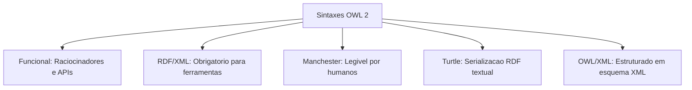
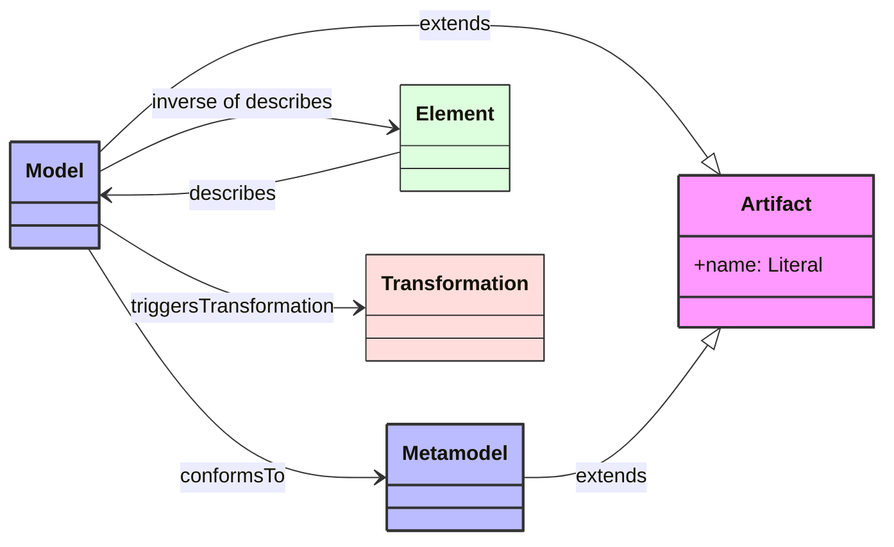
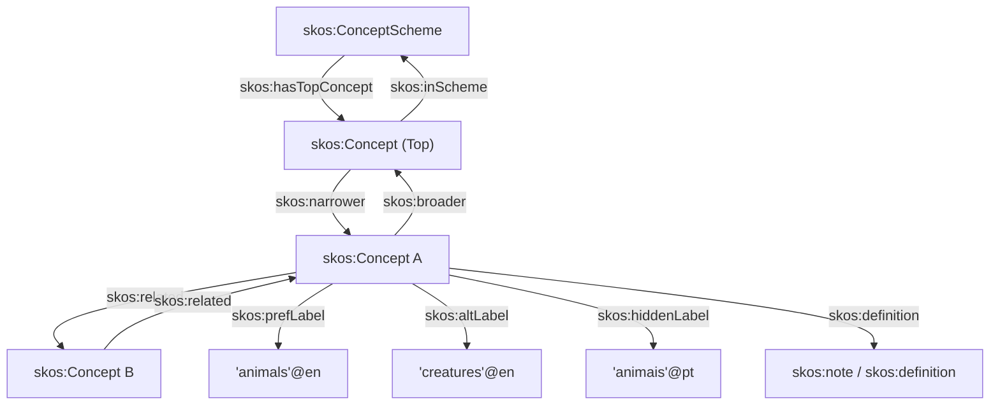

**ONTOLOGIA** 

# 1. conceitos 

definições [Wikipedia](https://pt.wikipedia.org/wiki/Ontologia)
- Na Filosofia
	- Estudo do Ser: Analisa o que é comum a tudo o que existe, seja um objeto físico ou uma ideia abstrata.
	- Parte da Metafísica: Funciona como a base da metafísica ao buscar a essência das coisas para além de suas aparências.
	- Categorias da Realidade: Tenta classificar os tipos fundamentais de entes no mundo e como se relacionam.
- Na Informática e Tecnologia
	- Organização de Dados: É a forma de descrever conceitos, propriedades e relações em um sistema digital.
	- Compartilhamento de Saber: Permite que programas de computador leiam e entendam um mesmo conjunto de informações de forma organizada

## 1.1. Knowledge Organization Systems 
- **PIPELINE** (top-down)
	- **folksonomy**, unstructured free-text tags 
	- **controlled vocabulary**, pre-defined vocabulary for consistency 
	- **metadata standards**
	- **taxonomy**, adds a parent-child hierarchy 
	- **thesaurus**, adds associative relationship + **lematização**  
	- **ontology**, adds formal logics, axioms and rules 
	- **knowledge graph**

- **CONCEPTS**
	- **Controlled Vocabulary**. Foundation of semantic. Knowledge systems. Reconciles synonyms. Clarifies terms 
	- **Metadata Standards**. Schema-based control. Structural. descriptive. Administrative elements
	- **Taxonomy** is a hierarchical classification or categorization system in wich all the terms belong to a single hierarchical structure and have parent/child or broader/narrower relationships to other terms. Taxonomies allow for classification according to a predetermined system. Structures the controlled vocabulary to form a hierarchy, parent-child relations
	- **Thesaurus** is a reference tool that groups words by their meanings, providing lists of synonyms (words with similar meanings) and often antonyms (words with opposite meanings). The word comes from the Greek term for a "treasure" or "storehouse". Reconciles synonyms, extending the taxonomy beyond parent-child relations. É um dicionario de sinonimos.
		- A thesaurus has at least three elements:
			- a list of terms
			- associative relationships between the terms
			- a set of rules on how to use the theasaurus
		- Main Types of Thesauri
			- **Linguistic Thesauri**: Books or digital tools (such as [Roget's Thesaurus](https://www.google.com/url?sa=i&source=web&rct=j&url=https://en.wikipedia.org/wiki/Roget%2527s_Thesaurus&ved=2ahUKEwi8wLjtiaqWAxUkrpUCHSwHNUAQy_kOegoIAggACAAIEBAD&opi=89978449&cd&psig=AOvVaw0qIlhiO2khkXGvxRx3wUBc&ust=1787139037954000) or online databases) used by writers to find alternative words, vary vocabulary, and avoid repetition.
			- **Information Retrieval Thesauri**: Controlled and structured vocabularies used in data science, libraries, and databases to index content and help systems find relevant documents using standardized terms.
		- **lematizar**, que significa agrupar flexões de uma palavra em sua forma canônica ou básica de dicionário (o lema).
	- **Ontology** structures information through the description of classes, properties, attributes and relationships. Ontologies form data models for knowledge graphs, ensuring consistency and understanding. Introduces logical reasoning; defines classes, relations, properties, and attributes.
		- Ontology breakdown 
			- conceptualization 
			- Specification 
			- formalization 
			- sharing 
	- **Knowledge Graph**. Includes all stages of the ontology pipeline and lends a visual representation of semantic relations

| data readiness                              | ontology pipeline                           |
| ------------------------------------------- | ------------------------------------------- |
| ![[01-conceitos_software_ontologia-02.jpg]] | ![[01-conceitos_software_ontologia-01.jpg]] |


# 2. modelagem, schemas
## 2.1. OWL - modelagem ontologica  
|[# OWL 2 Web Ontology Language Primer](https://www.w3.org/TR/2012/REC-owl2-primer-20121211/)|
|[# OWL 2 Web Ontology Language Quick Reference Guide](https://www.w3.org/TR/2012/REC-owl2-quick-reference-20121211/)|

### 2.1.1. O que e o OWL 2
Ontology Web Services ou serviços voltados à manipulação de Ontologias (OWL - Web Ontology Language). Esses componentes estruturam o conhecimento formal em redes semânticas ligadas.
Papel das Ontologias e OWS
- Padronização semântica: Definem classes, propriedades e restrições de domínio para padronizar o significado dos dados.
- Inferência lógica: Permitem deduzir novos fatos e relacionamentos que não estão explicitamente declarados na base de dados.
- Interoperabilidade: Facilitam a integração de fontes de dados heterogêneas por meio de vocabulários controlados como RDF e OWL.
Integração na Arquitetura
- Camada de abstração: Atuam acima do armazenamento físico de grafos para validar a integridade conceitual das consultas.
- Consultas federadas: Permitem resgatar informações distribuídas na Web Semântica utilizando padrões como SPARQL.

O OWL 2 Web Ontology Language e uma linguagem de ontologias para a Web Semantica com significado formalmente definido [3]. Ontologias escritas em OWL 2 sao estruturadas como documentos e servem para descrever de forma precisa porcoes do mundo real, chamadas de dominios de interesse [3, 13]. Elas auxiliam na comunicacao humana e garantem a consistencia do comportamento de softwares e agentes na web [13].

As ontologias em OWL 2 sao baseadas em computacao logica [7]. Esse carater declarativo faz com que ferramentas de raciocinio automatizado (raciocinadores) consigam computar consequencias logicas e inferir novos fatos implicitamente contidos na base [7, 15, 19].

### 2.1.2. Modelagem de Conhecimento e Noções Basicas
O OWL 2 representa o conhecimento por meio de tres elementos lógicos principais: axiomas, entidades e expressoes [17].

#### 2.1.2.1. Axiomas
Axiomas sao proposicoes logicas que a ontologia assume como verdadeiras [17, 18]. Diferente das entidades, os axiomas representam declaracoes com valor de verdade avaliavel [18]. A interacao desses axiomas determina as consequencias dedutivas que um raciocinador pode extrair [19, 20].

#### 2.1.2.2. Entidades
As entidades denotam os objetos e relacoes do dominio [17, 21]. Sao divididas em:
* Individuos: representam objetos ou elementos concretos do dominio [21].
* Classes: categorizam os individuos e funcionam essencialmente como conjuntos [21, 24].
* Propriedades: estabelecem relacoes, dividindo-se em propriedades de objeto (relacao entre individuos) e propriedades de dados (relacao de individuos com dados literais) [21].
* Propriedades de anotacao: utilizadas para registrar metadados sobre a ontologia ou sobre axiomas especificos (como comentarios ou autor), sem interferir no raciocinio logico principal [21, 113].

#### 2.1.2.3. Expressoes
As expressoes sao criadas combinando entidades por meio de construtores logicos [17, 22]. Elas criam novos conceitos a partir de componentes basicos, como a interseccao ou a uniao de classes preexistentes [22, 50].

### 2.1.3. Sintaxes e Serializações
O OWL 2 oferece diferentes syntaxes para variados contextos praticos de uso [11].



* Sintaxe de Estilo Funcional: Projetada para fins de especificacao e implementacao estrutural de APIs e raciocinadores [11].
* RDF/XML: A unica sintaxe de suporte obrigatorio para todos os sistemas em conformidade com o OWL 2, integrando-se diretamente ao formato basico da Web Semantica [11].
* Sintaxe de Manchester: Focada em facilitar a leitura e edicao por pessoas nao especialistas em logica formal, apresentando declaracoes implicitas [11, 128].
* Outros Formatos RDF: Inclui o formato Turtle, que possibilita representacoes compactas e legiveis em triplos RDF [12, 131].

### 2.1.4. Semanticas de Interpretacao
Existem duas semanticas principais para definir o significado de uma ontologia em OWL 2 [15, 131].

#### 2.1.4.1. Semantica Direta e OWL 2 DL
A Semantica Direta fornece significado ao OWL 2 no estilo da Logica de Descricao [131, 132]. Ela se aplica ao subconjunto computacional chamado OWL 2 DL [131]. Por ter restricoes sintaticas bem definidas, o OWL 2 DL e computacionalmente decidivel, possibilitando a criacao de raciocinadores capazes de resolver consultas de consistencia com garantia de término [133].

#### 2.1.4.2. Semantica Baseada em RDF e OWL 2 Full
A Semantica Baseada em RDF interpreta ontologias visualizando-as como grafos RDF, estendendo as nocoes semanticas do RDFS [131, 132]. Qualquer documento OWL 2 e valido sob o OWL 2 Full [131]. Ele oferece alta flexibilidade e expressividade de metamodelagem (incluindo o punning reflexivo irrestrito), porem e computacionalmente indecidivel [133, 134].

### 2.1.5. Perfis do OWL 2
Para cenarios que exigem alta performance e escalabilidade em detrimento de alguma expressividade logica, o OWL 2 define tres perfis (subconjuntos sintaticos) [137].

#### 2.1.5.1. Perfil OWL 2 EL
* Fundamento: Baseado na familia EL de lógicas de descricao, focado em restricoes existenciais [140, 142].
* Aplicabilidade: Projetado para grandes ontologias voltadas para terminologias medicas e cientificas, como o SNOMED-CT e NCI [140].
* Caracteristicas: Permite estruturacoes conceituais complexas e de grande porte, disallowing quantificadores universais ou inverso de propriedades [140, 141].

#### 2.1.5.2. Perfil OWL 2 QL
* Fundamento: Otimizado para permitir que as consultas lógicas sejam reescritas de forma automatizada em comandos SQL tradicionais [146, 148].
* Aplicabilidade: Usado para mapeamento de esquemas relacionais, integracao de dados corporativos e representacao de taxonomias do tipo UML [146].
* Caracteristicas: Nao oferece suporte a cadeias de propriedades, axiomas de igualdade de individuos ou quantificacao existencial apontando para expressoes complexas [147].

#### 2.1.5.3. Perfil OWL 2 RL
* Fundamento: Projetado para rodar em motores de inferencia baseados em linguagens de regras tradicionais de primeira ordem [152, 154].
* Aplicabilidade: Excelente para sistemas que ja utilizam RDF nativamente e desejam expandir dados por regras dinamicas [153].
* Caracteristicas: Restringe a sintaxe de modo a impedir declaracoes de ocorrencia de novos individuos anonimos em consequencia de outros [153, 154].

### 2.1.6. Tecnicas de Modelagem Pratica

#### 2.1.6.1. Relacionando Classes
* Hierarquias: Estabelecidas por axiomas de subclasse (SubClassOf) [27]. A relacao e reflexiva e transitiva [29].
* Equivalencia: Duas classes sao semanticamente equivalentes se compartilharem exatamente a mesma extensao de individuos (EquivalentClasses) [30].
* Disjuncao: Define exclusao mutua de pertinencia (DisjointClasses), indicando que duas classes nao contem nenhum elemento em comum [32].

#### 2.1.6.2. Uso Avancado de Propriedades
As propriedades podem receber caracteristicas logicas que determinam as deducoes estruturais calculadas pelos raciocinadores [21, 85]:
* Propriedade Simetrica: Se relaciona A com B, tambem relaciona B com A [88, 89].
* Propriedade Assimetrica: Relacionamento unidirecional estrito; se relaciona A com B, nunca relacionara B com A [89, 90].
* Propriedade Transitiva: Propaga a relacao por caminhos estruturados [97].
* Propriedade Funcional: Determina que cada individuo pode possuir no maximo um elemento relacionado por essa propriedade [94, 95].
* Cadeias de Propriedade: Permite definir relacoes indiretas a partir da combinacao sequencial de outras propriedades [98].

#### 2.1.6.3. Restrições Lógicas de Classe
O OWL 2 permite restringir propriedades para definir o escopo de associacao de uma classe [61]:
* Quantificacao Existencial (someValuesFrom): Exige que haja pelo menos uma conexao correspondente à classe descrita [62, 64].
* Quantificacao Universal (allValuesFrom): Garante que todas as conexoes daquela propriedade apontem para a classe indicada (se nao houver conexao, e considerada satisfeita) [64, 67].
* Restricoes de Cardinalidade: Permitem estabelecer limites minimos, maximos ou exatos para as conexoes de propriedades [74, 75, 77, 79].


## 2.2. OML - modelagem ontologica
Este exemplo prático utiliza a [Ontological Modeling Language (OML)](https://opencaesar.io/oml/), desenvolvida no ecossistema da openCAESAR, para modelar conceitos de engenharia de software baseada em modelos (MDE) integrados a um grafo de conhecimento. [1, 2] 
### 2.2.1. Exemplo de Código em OML

vocabulary <http://example.com> as swkg {

    // Conceitos Base (Classes)
    concept Artifact
    concept Model extends Artifact
    concept Metamodel extends Artifact
    concept Element
    concept Transformation

    // Relações (Object Properties)
    relation inverse of describes [
        from Element -> to Model
    ]
    
    relation conformsTo [
        from Model -> to Metamodel
    ]
    
    relation triggersTransformation [
        from Model -> to Transformation
    ]

    // Restrições e Restrições Axiomáticas
    scalar property name [
        domain Artifact
        range rdfs:Literal
        functional
    ]
}

### 2.2.2. Explicação da Estrutura

* Vocabulário (vocabulary): Define o namespace formal do domínio de MDE (software-kg).
* Conceitos (concept): Representam as entidades principais no grafo de conhecimento (como Model, Metamodel e Transformation).
* Relações (relation): Conectam os nós semanticamente, por exemplo, especificando que um Model conformsTo (conforma-se a) um Metamodel. [2, 3, 4, 5] 

Abaixo estão duas formas de visualizar esse modelo

### 2.2.3. Representação Gráfica do Código (OML Schema)
O código OML estruturado anteriormente gera o seguinte diagrama de classes e propriedades (similar a um perfil UML especializado):




* Retângulos Azuis/Rosa (Concepts): Tornam-se os nós (Nodes) ou classes do seu Grafo de Conhecimento.
* Setas (Relations): Tornam-se as arestas (Edges) rotuladas que conectam os conceitos.
* Herança (extends): Representada pelas setas vazadas (--|>), indicando que tudo que se aplica a Artifact (como a propriedade name) é herdado por Model e Metamodel.

### 2.2.4. Como renderizar isso automaticamente?
O ecossistema openCAESAR fornece ferramentas nativas para criar essas visualizações diretamente a partir do código textual:

* OML Graphical Viewer (Eclipse/VS Code): As IDEs suportadas pela iniciativa openCAESAR incluem plugins de mapeamento em tempo real. Conforme você digita o código OML, um diagrama baseado em [Sirius](https://www.eclipse.org/sirius/) ou JWT é atualizado visualmente.
* Conversão para Ontodia ou Cytoscape: Como o OML é facilmente compilado para OWL/RDF, você pode exportar o arquivo resultante e carregá-lo em ferramentas de visualização de grafos semânticos (como o Ontodia ou o plugin VOWL do Protégé) para navegar nos nós de forma interativa.

Se você estiver usando o VS Code ou Eclipse, posso te passar as instruções de configuração do repositório openCAESAR para habilitar a visualização integrada, ou prefere focar em popular esse grafo com instâncias reais de código de software?


### 2.2.5. Repositórios de Padronização e Comunidade (W3C e Padrões Globais)
Estes repositórios definem os conceitos genéricos fundamentais do que constitui um agente (identidade, metas, planos, ferramentas e delegação).

* [s-agent-comm / agent-ontology (GitHub)](https://github.com/s-agent-comm/agent-ontology): Este é o repositório central de ontologias do Semantic Agent Communication W3C Community Group (SAC-CG). Ele define semânticas executáveis para agentes de IA. Seus módulos cobrem a identidade do agente (vinculada a DIDs), delegação de tarefas, formação de contratos verificáveis entre múltiplos agentes e registro de obrigações.
* [ActiveInferenceInstitute / Active_Inference_Ontology (GitHub)](https://github.com/topics/ontology?l=html&o=desc&s=updated): Focado em sistemas autônomos baseados em Active Inference (Inferência Ativa) e no princípio da energia livre. É um modelo matemático-ontológico genérico para modelar como agentes percebem o ambiente, atualizam suas crenças internas e tomam ações deliberadas.

### 2.2.6. Repositórios de Frameworks de Código Aberto (Ontology-as-a-Control-Plane)
Projetos recentes utilizam ontologias como o "cérebro estruturado" ou barreira de proteção (firewall) para LLMs e ferramentas.

* [aws / context-ontology-accelerator (GitHub)](https://github.com/aws/context-ontology-accelerator): Projeto de código aberto da AWS que cria uma camada semântica unificada de contexto para IA. Ele permite mapear esquemas de dados complexos para uma ontologia formal e usa regras para que agentes descubram dinamicamente quais ferramentas e dados usar e validem se a ação pretendida segue as regras de negócio.
* [ZJU-REAL / HugAgentOS (GitHub)](https://github.com/ZJU-REAL/HugAgentOS): Um sistema operacional para agentes corporativos (AgentOS) onde a ontologia do domínio funciona como o plano de controle para o raciocínio, memória de longo prazo e decisões do agente.
* [cloudbadal007 / ontoguard-ai (GitHub)](https://github.com/cloudbadal007/ontologyops): Implementa o conceito de um "Ontology Firewall" para agentes. Ele traz exemplos genéricos de ontologias em OWL (como fluxos de e-commerce e finanças) onde o agente consulta a ontologia via protocolo MCP para verificar se tem permissão de executar uma ação (ex: "um agente só pode cancelar pedidos criados há menos de 24 horas") antes de chamar a API real.

### 2.2.7. Repositórios de Demonstração e Arquiteturas de Referência
Projetos acadêmicos ou práticos que mostram como acoplar bancos de grafos com agentes.

* [jmfloreszazo / demo_ontology_agents (GitHub)](https://github.com/jmfloreszazo/demo_ontology_agents): Uma implementação ponta a ponta que utiliza o Apache Fuseki para servir uma ontologia OWL e orquestrar agentes baseados em LLMs locais (como Llama 3) governados estritamente por regras ontológicas.

### 2.2.8. Principais Classes encontradas nesses Modelos Genéricos
Ao explorar esses repositórios, você notará que as ontologias genéricas para agentes reutilizam um vocabulário comum estruturado em torno desses conceitos:

```mermaid 
graph TD
    Agent[Concept: Agent] -->|hasIdentity| DID[Concept: VerifiableIdentity]
    Agent -->|hasGoal| Goal[Concept: Goal/Objective]
    Agent -->|executes| Plan[Concept: Plan/Workflow]
    Plan -->|composesOf| Action[Concept: Action/Step]
    Action -->|utilizes| Tool[Concept: Tool/API]
    Action -->|constrainedBy| Policy[Concept: Policy/Rule]
```



* Agent: A entidade computacional autônoma.
* Capability / Tool: O que o agente pode fazer (as ferramentas que ele pode invocar).
* Goal / Intent: O estado final que o agente está tentando alcançar.
* ExecutionTrace / Provenance: O histórico e as evidências de auditoria de que o agente tomou aquela decisão seguindo a ontologia.


## 2.3. SKOS - modelagem semantica, taxonomia
SKOS - Simple Knowledge Organization System
|[w3c oficial](https://www.w3.org/TR/skos-reference/)|

### 2.3.1. Conceito e Fundamentação

O SKOS (Simple Knowledge Organization System) é um vocabulário baseado em RDF projetado para representar sistemas de organização do conhecimento (KOS - Knowledge Organization Systems) semi-formais, como tesauros, taxonomias, esquemas de classificação e listas de cabeçalhos de assuntos [7]. Ele funciona como uma tecnologia de transição, conectando o formalismo lógico rigoroso de linguagens como o OWL com a estrutura informal de ferramentas de colaboração na Web [7].

Using SKOS, [concepts](https://www.w3.org/TR/skos-reference/#concepts) can be identified using URIs, [labeled](https://www.w3.org/TR/skos-reference/#labels) with lexical strings in one or more natural languages, assigned [notations](https://www.w3.org/TR/skos-reference/#notations) (lexical codes), [documented](https://www.w3.org/TR/skos-reference/#notes) with various types of note, [linked to other concepts](https://www.w3.org/TR/skos-reference/#semantic-relations) and organized into informal hierarchies and association networks, aggregated into [concept schemes](https://www.w3.org/TR/skos-reference/#schemes), grouped into labeled and/or ordered [collections](https://www.w3.org/TR/skos-reference/#collections), and [mapped](https://www.w3.org/TR/skos-reference/#mapping) to concepts in other schemes.

[Key Choices in the Design of SKOS](https://arxiv.org/abs/1302.1224)
[Demystifying SKOS for Practitioners: A Practical Guide to Controlled Vocabularies](https://moderndata101.substack.com/p/demystifying-skos-for-practitioners)

The SKOS data model is formally defined in this specification as an OWL Full ontology [OWL-SEMANTICS](https://www.w3.org/TR/skos-reference/#ref-OWL-SEMANTICS). SKOS data are expressed as RDF triples [RDF-CONCEPTS](https://www.w3.org/TR/skos-reference/#ref-RDF-CONCEPTS), and may be encoded using any concrete RDF syntax (such as RDF/XML [RDF-XML](https://www.w3.org/TR/skos-reference/#ref-RDF-XML) or Turtle [TURTLE](https://www.w3.org/TR/skos-reference/#ref-TURTLE)). For more on the relationships between SKOS, RDF and OWL, see the next sub-section below.

For an informative guide to using SKOS, see the [SKOS-PRIMER] ([w3c](https://www.w3.org/TR/skos-reference/#ref-SKOS-PRIMER), [[20 km_ssg/02_pdf_temp/260818 SKOS Simple Knowledge Organization System Primer|local]])

- general:  
	- schema.org: org, person, product
	- FOAF: people, organizations
	- Dublin core: documents, metadata 
	- SKOS: concepts, taxonomies 
- broad & domain 
	- wikidata: curated world entities 
	- DBpedia: extracted from Wikipedia 
	- FIBO: finance 
	- GoodRelations: e-commerce 


### 2.3.2. Elementos Essenciais (Essentials)

#### 2.3.2.1. Conceitos
A classe central do SKOS é a `skos:Concept`, que representa as unidades de pensamento — ideias, significados ou categorias abstratas de objetos e eventos, independentes dos termos literais utilizados para descrevê-los [13]. Cada conceito é identificado unicamente por um URI, sendo recomendada a adoção de URIs HTTP resolvíveis para facilitar o acesso e referência na Web Semântica [14, 15].

![[01-conceitos_software_ontologia-03.png|800]]

As the SKOS Reference puts it, “a SKOS concept can be viewed as an idea or notion; a unit of thought. However, what constitutes a unit of thought is subjective, and this definition is meant to be suggestive, rather than restrictive.”

#### 2.3.2.2. Rotulação Lexical (Labels)
O SKOS fornece propriedades especializadas para anexar strings em linguagem natural aos conceitos, sendo todas elas subpropriedades disjuntas de `rdfs:label` [16, 17]:
* `skos:prefLabel`: Define o rótulo léxico preferencial de um recurso (geralmente usado como o descritor principal em sistemas de indexação) [17]. Um conceito pode ter no máximo um rótulo preferencial por tag de idioma [19].
* `skos:altLabel`: Define rótulos alternativos, facilitando a representação de sinônimos, quase-sinônimos, abreviações ou acrônimos [20].
* `skos:hiddenLabel`: Representa termos legíveis que servem para indexação interna e busca textual por aplicações (como grafias incorretas comuns), mas que não devem ser exibidos visualmente ao usuário final [22].

#### 2.3.2.3. Relações Semânticas Intra-Vocabulário
As relações definem o significado dos conceitos por meio de sua inserção em uma rede estruturada. Existem duas categorias principais de relações semânticas [23, 24]:
* Hierárquicas: Estabelecidas pelas propriedades inversas `skos:broader` (tem conceito mais geral) e `skos:narrower` (tem conceito mais específico) [25, 26, 27]. Para evitar heranças problemáticas de transitividade em taxonomias reais ("hierarquias sujas"), o SKOS não define essas propriedades como transitivas por padrão [28].
* Associativas: Estabelecidas pela propriedade simétrica `skos:related`, que conecta conceitos de forma não hierárquica [24, 31, 32]. A propriedade não é transitiva, evitando propagações semânticas indesejadas [32]. Além disso, o fechamento transitivo de relações hierárquicas é estritamente disjunto das relações associativas [33].

#### 2.3.2.4. Notas Documentárias
Para fornecer definições informais e documentação legível por humanos, o SKOS define a propriedade geral `skos:note`, estendendo-a em categorias específicas que suportam tags de idioma [34, 38]:
* `skos:scopeNote`: Indica limites e restrições de uso de um conceito na prática de indexação [34].
* `skos:definition`: Fornece uma explicação completa do significado pretendido do conceito [35].
* `skos:example`: Ilustra o conceito através de exemplos concretos de uso [35].
* `skos:historyNote`: Documenta alterações históricas significativas no significado ou na forma de um conceito [36].
* `skos:editorialNote` e `skos:changeNote`: Auxiliam no gerenciamento interno, documentando revisões editoriais pendentes ou modificações finas realizadas no conceito [36, 37].

#### 2.3.2.5. Esquemas de Conceitos (Concept Schemes)
Vocabulários inteiros são agregados usando a classe `skos:ConceptScheme` [39]. Os conceitos individuais associam-se ao seu esquema correspondente via `skos:inScheme` [40]. Para fornecer pontos de entrada eficientes na navegação de grandes árvores de conceitos, utiliza-se a propriedade `skos:hasTopConcept` para apontar diretamente para os conceitos de topo (mais gerais) do esquema [41].

### 2.3.3. Grafo de Relações do SKOS



### 2.3.4. Rede de Vocabulários e Mapeamento Semântico

#### 2.3.4.1. Mapeamento entre Esquemas (Mapping)
Para conciliar e interligar diferentes vocabulários em uma rede distribuída e global, o SKOS fornece propriedades específicas de mapeamento semântico [44, 45, 46]:
* `skos:closeMatch`: Indica que dois conceitos de esquemas diferentes são suficientemente semelhantes para serem usados de forma intercambiável em certas aplicações [46, 48]. Esta propriedade não é transitiva, impedindo que a similaridade se propague indefinidamente através de redes de mapeamento [48].
* `skos:exactMatch`: Indica equivalência de significado estrita entre os conceitos [48]. É uma subpropriedade de `skos:closeMatch` e é definida como transitiva [48].
* Outros Mapeamentos: `skos:broadMatch`, `skos:narrowMatch` e `skos:relatedMatch` servem como paralelos diretos das propriedades semânticas internas do vocabulário, mas com o propósito de mapear fronteiras entre esquemas distintos [46, 51]. Elas são definidas como subpropriedades das relações correspondentes (ex: `skos:broadMatch` implica formalmente `skos:broader`) [51].

#### 2.3.4.2. Diferenciação Semântica: skos:exactMatch vs. owl:sameAs
O SKOS utiliza `skos:exactMatch` em vez de `owl:sameAs` para preservar a integridade dos dados dos esquemas individuais [49]. Quando duas entidades são unidas via `owl:sameAs`, elas passam a ser consideradas o mesmo recurso físico na Web Semântica, o que força a mesclagem de todas as suas propriedades em um único nó [49]. Isso geraria inconsistências lógicas graves no SKOS, como um único conceito adquirir múltiplos rótulos preferenciais (`skos:prefLabel`) na mesma língua [49, 50].

#### 2.3.4.3. Reutilização e Extensão de Conceitos
Diferentes editores podem estender esquemas existentes referenciando e incluindo conceitos de outros vocabulários via `skos:inScheme` [52, 54]. Um conceito pode pertencer a múltiplos esquemas simultaneamente [42]. Caso seja necessário importar um esquema inteiro, pode-se recorrer a `owl:imports`, embora isso force logicamente a inferência das instâncias de `skos:ConceptScheme` como classes de `owl:Ontology` (colocando o sistema no perfil semântico OWL Full) [56, 57].

### 2.3.5. Recursos Avançados do SKOS

#### 2.3.5.1. Coleções de Conceitos (Concept Collections)
Permitem agrupar conceitos sem a necessidade de criar relações semânticas formais (como rotular grupos em exibições sistemáticas ou facetas) [61, 62]:
* Labeled Collections (`skos:Collection`): Coleções rotuladas por meio de rótulos lexicais comuns, agrupando conceitos via propriedade `skos:member` [63].
* Ordered Collections (`skos:OrderedCollection`): Grupos que requerem uma ordenação sequencial explícita (alfabética, cronológica, etc.) [64]. Conectam-se a uma lista do tipo `rdf:List` por meio de `skos:memberList` [64].

As coleções são estruturalmente disjuntas dos conceitos, o que impede a sua inserção direta em redes hierárquicas normais [65].

#### 2.3.5.2. Relações entre Rótulos (SKOS-XL)
Como as propriedades lexicais comuns do SKOS aceitam apenas literais RDF como objeto direto, não é possível criar asserções ou metadados sobre os rótulos em si (como indicar relações de tradução ou acrônimos) [71]. O módulo de extensão opcional SKOS-XL resolve isso introduzindo a classe `skosxl:Label`, transformando os rótulos em recursos de primeira ordem [72]. Cada instância possui uma forma literal via `skosxl:literalForm` e pode se relacionar com outras através de `skosxl:labelRelation` [72, 73].

#### 2.3.5.3. Coordenação de Conceitos
Consiste na atividade de combinar múltiplos conceitos lógicos do vocabulário:
* Pré-coordenação: Combinação de termos realizada a priori por indexadores ou gerenciadores do KOS (ex: "Bicicletas--Manutenção") [76].
* Pós-coordenação: Combinação dinâmica efetuada no momento da recuperação de dados pelo usuário, o que pode ser modelado diretamente via consultas SPARQL [76, 77].

O vocabulário básico do SKOS não fornece mecanismos nativos específicos para a pré-coordenação, permitindo o surgimento orgânico de padrões e especializações baseados em extensões de classes ou OWL [78, 79].

#### 2.3.5.4. Hierarquias Transitivas
Para habilitar a expansão de consultas ou raciocínio transitivo formal em redes de conceitos, o SKOS define as superpropriedades transitivas `skos:broaderTransitive` e `skos:narrowerTransitive` [81]. Elas agem como a cobertura transitiva das relações diretas de parentesco, permitindo mapear ancestrais e descendentes indiretos através de raciocinadores sem poluir ou descaracterizar as propriedades diretas `skos:broader` e `skos:narrower` [81, 83].

#### 2.3.5.5. Notações
Para KOSs que utilizam representações estruturadas de códigos alfanuméricos independentes de linguagem natural (como a Classificação Decimal Universal), o SKOS fornece a propriedade `skos:notation` [85, 86]. Ela suporta o uso de literais tipados que definem esquemas sintáticos específicos de codificação [86].

### 2.3.6. Integração entre SKOS e OWL
A especificação define `skos:Concept` como uma classe de OWL (`owl:Class`), o que torna todas as instâncias de conceitos indivíduos lógicos de OWL [95, 96]. 
* OWL Full: Permite tratar os conceitos simultaneamente como indivíduos e classes (metamodelagem), simplificando a modelagem onde classes de objetos precisam herdar características específicas associadas a conceitos do vocabulário [97].
* OWL DL: Exige disjunção absoluta entre o conjunto de classes e indivíduos, o que impede o tratamento direto de um conceito SKOS como uma classe formal de OWL, necessitando de propriedades de anotação dedicadas para realizar essa ponte [97, 98].

## 2.4. SHACL - modelagem semantica
SHACL - Shapes Constraint Language
|[w3c](https://www.w3.org/TR/shacl/)|

## 2.5. RDF - modelagem de dados
An **RDF graph** is a data model made of triples—subject, predicate, and object—while **RDFS** (RDF Schema) adds a basic vocabulary and vocabulary rules to define classes, properties, and hierarchies for that data.
RDF Graph Structure
- Triples: Statements form a directed graph where nodes are subjects and objects, and edges are predicates.
- IRIs/URIs: Uniform resource identifiers name things uniquely so data can link across the web.
- Literals: Values like text strings, numbers, or dates sit at the object end of a triple.
RDFS (RDF Schema) Features
- Classes: Group resources into categories (like rdfs:Class).
- Hierarchies: Connect general and specific terms using rdfs:subClassOf and rdfs:subPropertyOf.
- Constraints: Guide how properties apply using rdfs:domain and rdfs:range.
- Inference: Rules let systems deduce new facts from existing data.

# 3. linguagens

Além do Turtle e do JSON-LD, o ecossistema da Web Semântica (W3C) oferece:

- RDF/XML: O formato original baseado em XML. É muito verboso e difícil de ler para humanos, mas amplamente suportado por sistemas legados.
- N-Triples: O formato mais simples possível. Cada linha contém exatamente um sujeito, um predicado e um objeto. É excelente para processar volumes gigantescos de dados (_Big Data_).
- Manchester Syntax: Uma linguagem criada especificamente para humanos lerem e escreverem restrições complexas de ontologias (OWL) de forma parecida com a lógica natural.

## 3.1. Tabela Resumo: Linguagem vs. Ferramenta Open Source

| Linguagem / Formato | Ferramenta Open Source Principal | Função da Ferramenta                                          |
| ------------------- | -------------------------------- | ------------------------------------------------------------- |
| Turtle (.ttl)       | Protégé                          | Editor visual e modelador de ontologias completo.             |
| JSON-LD (.jsonld)   | Apache Jena (ou Jena Eyeball)    | Framework Java para processar e consultar dados semânticos.   |
| RDF/XML (.rdf)      | TopBraid Composer (FE)           | Modelagem e conversão de formatos (versão Free Edition).      |
| N-Triples (.nt)     | GraphDB (Free)                   | Banco de dados gráfico (Triplestore) de alta performance.     |
| Manchester Syntax   | HermiT / Pellet                  | Raciocinadores (Reasoners) para validar lógica e inferências. |
| SKOS / OWL (Geral)  | VocBench                         | Sistema web open source específico para gerenciar taxonomias. |

# 4. comparação [OWL, OML, SKOS, RDF]

## 4.1. OWL (Web Ontology Language)

*   **Propósito e Uso**: É a **camada de raciocínio** construída sobre o RDF. Se o RDF é a base de dados, a OWL é a ferramenta para criar esquemas (ontologias) complexos e permitir que um computador faça **inferências** sobre eles. Ideal para cenários que exigem lógica formal, como validação de modelos (Tbox) ou descoberta de novos conhecimentos.
*   **Popularidade e Ferramentas**: Também é um padrão W3C e muito popular em projetos acadêmicos e de semântica pesada. Ferramentas como o editor de ontologias **Protégé** (open-source) são amplamente utilizadas, e muitos triplestores como o GraphDB e Jena suportam raciocínio OWL.
*   **Interoperabilidade**: Muito alta, mas mais complexa que o RDF puro. Os arquivos geralmente são serializados em formatos RDF (como RDF/XML ou Turtle). A interoperabilidade exige que todos os sistemas entendam a semântica formal definida pela OWL.
*   **Curva de Aprendizado**: **Alta**. A lógica de descrição e os diferentes níveis de expressividade (OWL Lite, DL, Full) tornam a OWL uma das tecnologias semânticas mais complexas de se dominar.

## 4.2. OML (Ontology Modeling Language / Ontology Manipulation Language)

*   **Propósito e Uso**: A sigla OML pode se referir a dois padrões distintos, e saber a diferença é crucial.
    1.  **Ontology Modeling Language (JPL)**: Uma linguagem de modelagem mais recente, focada em engenharia de sistemas e usada por organizações como a NASA (JPL) para criar ontologias com precisão e evitar ambiguidades . Se encaixa como uma **camada de modelagem** rigorosa.
    2.  **Ontology Manipulation Language**: Uma linguagem de domínio específico (DSL) para escrever **scripts que manipulam ontologias**, como uma ferramenta para automatizar tarefas sobre elas . É uma **camada de automação ou script**.
*   **Popularidade e Ferramentas**: É consideravelmente menos popular que os padrões W3C. É uma tecnologia de nicho, com uso mais restrito a projetos específicos, como o trabalho da NASA . As ferramentas são geralmente as disponibilizadas por seus criadores (ex: *OML Workbench* da JPL).
*   **Interoperabilidade**: Mais limitada, pois não é um padrão W3C. A interoperabilidade depende de ferramentas que consigam importar/exportar para formatos como RDF/XML, funcionando mais como uma camada de abstração sobre os padrões.
*   **Curva de Aprendizado**: **Moderada a Alta**. Se você está aprendendo sobre a OML da JPL, a curva vem da necessidade de modelagem exata e de um formalismo matemático. Se for a DSL de script, a curva é a de aprender uma nova linguagem para um propósito muito específico.


## 4.3. SKOS (Simple Knowledge Organization System)

*   **Propósito e Uso**: É um **vocabulário OWL/RDF** feito especificamente para representar sistemas de organização do conhecimento, como **tesauros, taxonomias e vocabulários controlados**. É a escolha certa se você quer criar uma "camada de conceitos" que se organizam em hierarquias ("broader/narrower") ou relações associativas ("related"). Excelente para indexação de conteúdo, criação de catálogos e navegação facetada.
*   **Popularidade e Ferramentas**: É muito popular em bibliotecas digitais, museus e projetos de dados culturais. Por ser um vocabulário RDF, pode ser utilizado com as mesmas ferramentas do RDF/OWL, como o Protégé e o Apache Jena.
*   **Interoperabilidade**: Totalmente interoperável por ser um vocabulário RDF. Seus conceitos são publicados como URIs. O formato de arquivo é o mesmo do RDF (ex: RDF/XML, Turtle).
*   **Curva de Aprendizado**: **Moderada**. É mais simples que a OWL, pois foca em relações de estruturação de conceitos, sem a complexidade da lógica formal. Se você já conhece RDF, aprender SKOS é rápido.

## 4.4. RDF (Resource Description Framework)

*   **Propósito e Uso**: É o padrão fundamental para a web semântica. Funciona como uma **camada de dados**, servindo para descrever recursos (qualquer coisa identificável) em formato de triplas (sujeito-predicado-objeto). É o "nervo" para publicar e compartilhar dados na web. Em softwares, é usado para integração de dados, catálogos de dados e bases de conhecimento (knowledge graphs). Pode ser armazenado em bancos chamados **triplestores**.
*   **Popularidade e Ferramentas**: É um padrão W3C, extremamente popular. A ferramenta open-source mais conhecida é o **Apache Jena**, um framework Java para construção de aplicações com dados RDF.
*   **Interoperabilidade**: Altíssima. Por ser um padrão da web, a interoperabilidade é seu objetivo principal. O formato de arquivo mais comum é o **RDF/XML**, mas também suporta JSON-LD, Turtle, N-Triples, etc.
*   **Curva de Aprendizado**: **Moderada a Alta**. A ideia de triplas é simples, mas a aplicação prática (como usar URIs, namespaces, e consultas com SPARQL) exige um entendimento conceitual que pode ser desafiador para iniciantes.

## 4.5. Tabela Resumo Comparativa

| Critério                         | RDF                                         | OWL                                            | SKOS                                              | OML                                                   |
| :------------------------------- | :------------------------------------------ | :--------------------------------------------- | :------------------------------------------------ | :---------------------------------------------------- |
| **Tipo de Uso / Camada**         | **Camada de Dados** (descrição de recursos) | **Camada de Raciocínio** (lógica e inferência) | **Camada de Vocabulário** (tesauros e taxonomias) | **Camada de Modelagem/Manipulação**                   |
| **Popularidade / Ferramenta**    | Muito Alta / **Apache Jena**                | Alta / **Protégé**                             | Média-Alta / Ferramentas RDF                      | Baixa / Ferramentas de nicho                          |
| **Interoperabilidade / Arquivo** | Altíssima / **RDF/XML**, Turtle, JSON-LD    | Alta / Serializa em RDF                        | Alta / Serializa em RDF                           | Média / Arquivos proprietários ou intercâmbio com RDF |
| **Curva de Aprendizado**         | Moderada a Alta                             | Alta                                           | Moderada                                          | Moderada a Alta                                       |


## 4.6. Qual escolher para seu projeto?

Com base na sua jornada, a recomendação é:

1.  **Para sua Base de Conhecimento (Knowledge Base)**, a combinação **RDF + SKOS** é a mais poderosa e alinhada com seu objetivo. Você usa RDF para descrever todos os seus "conceitos" (Agente, StorageSystem, etc.) e SKOS para organizá-los em uma **Rede de Assuntos** (TopicNetwork), definindo relações como `skos:broader` e `skos:narrower` para sua hierarquia.

2.  **Evite OWL e OML por enquanto.** A complexidade da OWL não é necessária para uma primeira versão, e a OML é um nicho. Começar com RDF e SKOS te dá uma base sólida, interoperável e com ferramentas maduras, como o Apache Jena. Essa abordagem permite que sua base de conhecimento cresça organicamente, e você pode introduzir conceitos mais complexos de OWL no futuro, se precisar.

# 5. ontology development framework
## 5.1. pipeline 

### 5.1.1. controlled vocabulary, pre-defined vocabulary for consistency 


- repositorio
	- definição 
	- tipo URI: [local file system,  local server, cloud storage (onedrive, gdrive), cloud server, cloud host, github] 
	- tipo conteudo: [documentos, dados, codigos, hibrido]
	- persistência: [sistema, permanente, projeto, temporario] 
	- repository version
- dominio
	- definição 
	- tipo dominio: [conhecimento conceitual, conhecimento aplicado, regras sobre kb concepts, regras sobre codificação, regras sobre agent pipelines, system models]
- ontologia independente do tipo de dominio 
- ontologia especifica por tipo de dominio 
- dominio, disciplina GERAL
	- informações, assuntos, topic network 
		- conceitos, definições, exemplos 
		- aplicação, operação, processamento (lifecycle processes)
			- regras 
			- modelos 
			- prompts 
		- sistemas 
			- MBCG
				- spec current
				- spec next 
			- next target
				- spec next 
	- dados 
- dominio, disciplina MBSE
	- ontologia 
	- informações, assuntos, topic network 
		- conceitos, definições, exemplos 
		- aplicação, operação, processamento (lifecycle processes)
			- regras 
			- modelos 
			- prompts 
		- sistemas 
			- 
			- next target
				- spec next 
					- Requisitos de Negócio
					- Requisitos Funcionais
					- Arquitetura
					- UML
					- Decisões
					- Restrições
					- Rastreabilidade
					- Especificações de Geração
	- dados 

#### 5.1.1.1. mapa de dominios
- tipo dominio: conhecimento conceitual 
	- Basic concepts (km)
- tipo dominio: conhecimento aplicado 
	- aplicação, operação, processamento (lifecycle processes), regras, modelos 
	- ontologias, taxonomias 
	- MBSE
		- Convenções de Modelagem
- tipo dominio: regras sobre kb concepts 
	- Convenções de Modelagem
	- Políticas, Workflows, Templates
- tipo dominio: regras sobre codificação 
	- Convenções de Modelagem
	- Convenções de Geração
	- Regras de Validação
- tipo dominio: regras sobre agent pipelines 
	- Agents (proficiência) - saber [porque, quando, como] fazer [pesquisa, entendimento, análise, okf-mindmap, edição,  revisão]
	- skills, regras, modelos, prompts 
- tipo dominio: system models  
	- MBCG
		- spec current
		- spec next 
			- Requisitos
			- Arquitetura
			- UML
			- Componentes
			- Interfaces
			- Algoritmos
			- Motor de Geração
			- Motor de Conhecimento
			- Harness de Agentes


#### 5.1.1.2. modelo SKOS

##### 5.1.1.2.1. Template Unificado (Modelo Mestre)

| Nome da Coluna                   | Descrição Técnica (Mapeamento JSON-LD)                          | Exemplo de Preenchimento                  |
| -------------------------------- | --------------------------------------------------------------- | ----------------------------------------- |
| ID do Conceito                   | O identificador único local do termo/classe.                    | `TAX_030`                                 |
| Prefixo / Namespace              | Onde o termo reside (geralmente mapeado no `@context`).         | `ex:`                                     |
| Tipo Semântico                   | Se o termo comporta-se como Conceito, Classe ou ambos.          | `["skos:Concept", "owl:Class"]`           |
| Termo Preferido (prefLabel)      | Nome oficial do conceito/classe.                                | `Cachorro`                                |
| Idioma                           | Código ISO do idioma da string.                                 | `pt`                                      |
| Sinônimos (altLabel)             | Termos alternativos separados por vírgula (vira Array no JSON). | `Cão, Canino`                             |
| Definição (definition)           | Significado exato para humanos e sistemas.                      | `Mamífero doméstico da família canídeos.` |
| Termo Pai (broader / subClassOf) | ID do conceito mais amplo ou classe pai.                        | `TAX_020`                                 |
| Propriedade Associada            | Propriedade OWL vinculada a esta classe (se houver).            | `ex:temDono`                              |
| Tipo de Propriedade              | Tipo da relação OWL (`ObjectProperty` ou `DatatypeProperty`).   | `owl:ObjectProperty`                      |
| Domínio (Domain)                 | Quem possui a propriedade (geralmente o próprio ID).            | `TAX_030`                                 |
| Contradomínio (Range)            | O tipo de dado ou classe que responde à propriedade.            | `ex:Pessoa`                               |
| Restrição / Cardinalidade        | Regra lógica de negócio aplicada à propriedade.                 | `owl:maxCardinality 1`                    |

##### 5.1.1.2.2. Como esse Template se transforma em um único código JSON-LD?

Ao preencher a linha do `Cachorro` usando esse template unificado, o seu documento JSON-LD final mescla SKOS e OWL nativamente:

```json
{
  "@context": {
    "skos": "http://w3.org",
    "owl": "http://w3.org",
    "rdfs": "http://w3.org",
    "xsd": "http://w3.org",
    "ex": "http://exemplo.org",
    "id": "@id",
    "type": "@type",
    "prefLabel": { "@id": "skos:prefLabel", "@language": "pt" },
    "altLabel": { "@id": "skos:altLabel", "@language": "pt" },
    "definition": { "@id": "skos:definition", "@language": "pt" },
    "broader": { "@id": "skos:broader", "@type": "@id" },
    "subClassOf": { "@id": "rdfs:subClassOf", "@type": "@id" }
  },
  "@graph": [
    {
      "id": "ex:TAX_030",
      "type": ["skos:Concept", "owl:Class"],
      "prefLabel": "Cachorro",
      "altLabel": ["Cão", "Canino"],
      "definition": "Mamífero doméstico da família dos canídeos.",
      "broader": "ex:TAX_020",
      "subClassOf": "ex:TAX_020",
      "rdfs:subClassOf": {
        "@type": "owl:Restriction",
        "owl:onProperty": "ex:temDono",
        "owl:maxCardinality": 1
      }
    },
    {
      "id": "ex:temDono",
      "type": "owl:ObjectProperty",
      "rdfs:domain": "ex:TAX_030",
      "rdfs:range": "ex:Pessoa"
    }
  ]
}
```


### 5.1.2. metadata standards
### 5.1.3. taxonomy, adds a parent-child hierarchy 
### 5.1.4. thesaurus, adds associative relationship 
### 5.1.5. ontology, adds formal logics, axioms and rules 
#### 5.1.5.1. Modelagem de Conhecimento e Noções Basicas
O OWL 2 representa o conhecimento por meio de tres elementos lógicos principais: axiomas, entidades e expressoes [17].

##### 5.1.5.1.1. Axiomas
Axiomas sao proposicoes logicas que a ontologia assume como verdadeiras [17, 18]. Diferente das entidades, os axiomas representam declaracoes com valor de verdade avaliavel [18]. A interacao desses axiomas determina as consequencias dedutivas que um raciocinador pode extrair [19, 20].

##### 5.1.5.1.2. Entidades
As entidades denotam os objetos e relacoes do dominio [17, 21]. Sao divididas em:
* Individuos: representam objetos ou elementos concretos do dominio [21].
* Classes: categorizam os individuos e funcionam essencialmente como conjuntos [21, 24].
* Propriedades: estabelecem relacoes, dividindo-se em propriedades de objeto (relacao entre individuos) e propriedades de dados (relacao de individuos com dados literais) [21].
* Propriedades de anotacao: utilizadas para registrar metadados sobre a ontologia ou sobre axiomas especificos (como comentarios ou autor), sem interferir no raciocinio logico principal [21, 113].

##### 5.1.5.1.3. Expressoes
As expressoes sao criadas combinando entidades por meio de construtores logicos [17, 22]. Elas criam novos conceitos a partir de componentes basicos, como a interseccao ou a uniao de classes preexistentes [22, 50].

#### 5.1.5.2. Sintaxes e Serializações
O OWL 2 oferece diferentes syntaxes para variados contextos praticos de uso [11].


* Sintaxe de Estilo Funcional: Projetada para fins de especificacao e implementacao estrutural de APIs e raciocinadores [11].
* RDF/XML: A unica sintaxe de suporte obrigatorio para todos os sistemas em conformidade com o OWL 2, integrando-se diretamente ao formato basico da Web Semantica [11].
* Sintaxe de Manchester: Focada em facilitar a leitura e edicao por pessoas nao especialistas em logica formal, apresentando declaracoes implicitas [11, 128].
* Outros Formatos RDF: Inclui o formato Turtle, que possibilita representacoes compactas e legiveis em triplos RDF [12, 131].

#### 5.1.5.3. Semanticas de Interpretacao
Existem duas semanticas principais para definir o significado de uma ontologia em OWL 2 [15, 131].

##### 5.1.5.3.1. Semantica Direta e OWL 2 DL
A Semantica Direta fornece significado ao OWL 2 no estilo da Logica de Descricao [131, 132]. Ela se aplica ao subconjunto computacional chamado OWL 2 DL [131]. Por ter restricoes sintaticas bem definidas, o OWL 2 DL e computacionalmente decidivel, possibilitando a criacao de raciocinadores capazes de resolver consultas de consistencia com garantia de término [133].

##### 5.1.5.3.2. Semantica Baseada em RDF e OWL 2 Full
A Semantica Baseada em RDF interpreta ontologias visualizando-as como grafos RDF, estendendo as nocoes semanticas do RDFS [131, 132]. Qualquer documento OWL 2 e valido sob o OWL 2 Full [131]. Ele oferece alta flexibilidade e expressividade de metamodelagem (incluindo o punning reflexivo irrestrito), porem e computacionalmente indecidivel [133, 134].

#### 5.1.5.4. Perfis do OWL 2
Para cenarios que exigem alta performance e escalabilidade em detrimento de alguma expressividade logica, o OWL 2 define tres perfis (subconjuntos sintaticos) [137].

##### 5.1.5.4.1. Perfil OWL 2 EL
* Fundamento: Baseado na familia EL de lógicas de descricao, focado em restricoes existenciais [140, 142].
* Aplicabilidade: Projetado para grandes ontologias voltadas para terminologias medicas e cientificas, como o SNOMED-CT e NCI [140].
* Caracteristicas: Permite estruturacoes conceituais complexas e de grande porte, disallowing quantificadores universais ou inverso de propriedades [140, 141].

##### 5.1.5.4.2. Perfil OWL 2 QL
* Fundamento: Otimizado para permitir que as consultas lógicas sejam reescritas de forma automatizada em comandos SQL tradicionais [146, 148].
* Aplicabilidade: Usado para mapeamento de esquemas relacionais, integracao de dados corporativos e representacao de taxonomias do tipo UML [146].
* Caracteristicas: Nao oferece suporte a cadeias de propriedades, axiomas de igualdade de individuos ou quantificacao existencial apontando para expressoes complexas [147].

##### 5.1.5.4.3. Perfil OWL 2 RL
* Fundamento: Projetado para rodar em motores de inferencia baseados em linguagens de regras tradicionais de primeira ordem [152, 154].
* Aplicabilidade: Excelente para sistemas que ja utilizam RDF nativamente e desejam expandir dados por regras dinamicas [153].
* Caracteristicas: Restringe a sintaxe de modo a impedir declaracoes de ocorrencia de novos individuos anonimos em consequencia de outros [153, 154].

#### 5.1.5.5. Tecnicas de Modelagem Pratica

##### 5.1.5.5.1. Relacionando Classes
* Hierarquias: Estabelecidas por axiomas de subclasse (SubClassOf) [27]. A relacao e reflexiva e transitiva [29].
* Equivalencia: Duas classes sao semanticamente equivalentes se compartilharem exatamente a mesma extensao de individuos (EquivalentClasses) [30].
* Disjuncao: Define exclusao mutua de pertinencia (DisjointClasses), indicando que duas classes nao contem nenhum elemento em comum [32].

##### 5.1.5.5.2. Uso Avancado de Propriedades
As propriedades podem receber caracteristicas logicas que determinam as deducoes estruturais calculadas pelos raciocinadores [21, 85]:
* Propriedade Simetrica: Se relaciona A com B, tambem relaciona B com A [88, 89].
* Propriedade Assimetrica: Relacionamento unidirecional estrito; se relaciona A com B, nunca relacionara B com A [89, 90].
* Propriedade Transitiva: Propaga a relacao por caminhos estruturados [97].
* Propriedade Funcional: Determina que cada individuo pode possuir no maximo um elemento relacionado por essa propriedade [94, 95].
* Cadeias de Propriedade: Permite definir relacoes indiretas a partir da combinacao sequencial de outras propriedades [98].

##### 5.1.5.5.3. Restrições Lógicas de Classe
O OWL 2 permite restringir propriedades para definir o escopo de associacao de uma classe [61]:
* Quantificacao Existencial (someValuesFrom): Exige que haja pelo menos uma conexao correspondente à classe descrita [62, 64].
* Quantificacao Universal (allValuesFrom): Garante que todas as conexoes daquela propriedade apontem para a classe indicada (se nao houver conexao, e considerada satisfeita) [64, 67].
* Restricoes de Cardinalidade: Permitem estabelecer limites minimos, maximos ou exatos para as conexoes de propriedades [74, 75, 77, 79].


## 5.2. sources, platforms, tools

[tools: chrome > conceitos > ontology](file:///C:/Users/muril/OneDrive/01%20mycloud/00%20idMu/00%20indice%20links/50.04.01.06.20.10%20km%20info%20automacao%20-%20Atalho.vbs)

## 5.3. data ontology

Core components
- classes 
- properties 
- relationships 
- axioms 

[Ontology-to-tools compilation for executable semantic constraint enforcement in LLM agents](https://arxiv.org/abs/2602.03439)

**System intelligence** is a collection of local loops, organized by evolving graphs, constrained by shared ontologies, and grounded by external evidences.


# 6. casos de uso 
[[260819-modelo_repositorios|modelo para repositorios]]
[[01-conceitos_software_se_mbse#2. SysML - Systems Modeling Language|MBSE SysML]]

[YT - ontology kernel](https://youtu.be/bnpNJmCwGlo?is=xqA77DBWRHbTox-V)
[toward effective and reliable llm agents via dynamic ontology](https://arxiv.org/html/2608.22974v1)
- the main idea is to make LLM build three connected objects
	- schema describing which kinds of things and relations exist
	- knowledge graph containing the actual domain facts 
	- set of typed functions defining how the may reason over those facts 
- A **"downstream-task-driven"** ontology compilation:   
	- task requirements -> verified schema -> schema-guided KG ->  typed executable functions -> task feedback -> repairs   
	- One particular nuance: "dynamic ontology" does not mean that the ontology keeps changing during deployment. It is dynamically constructed and refined during the training/construction phase, then frozen for test-time inference.   


