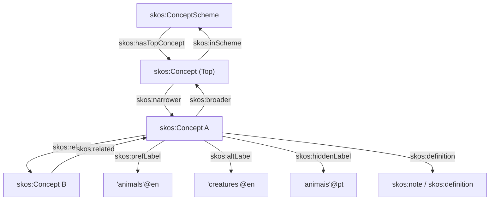
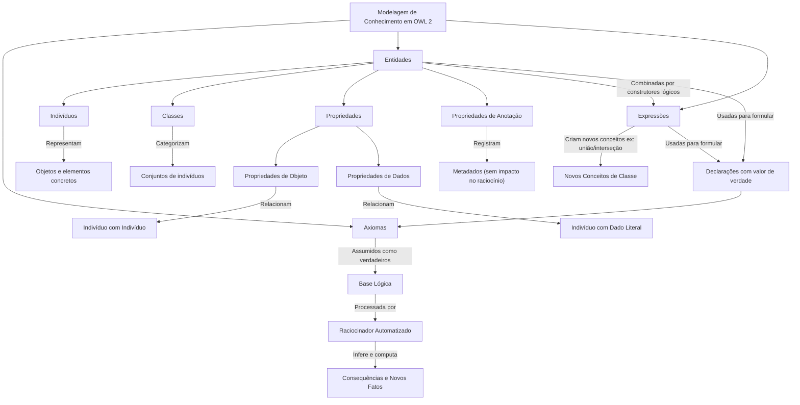
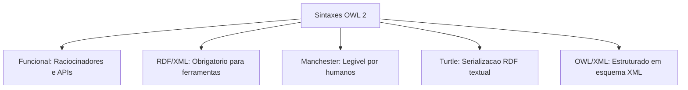
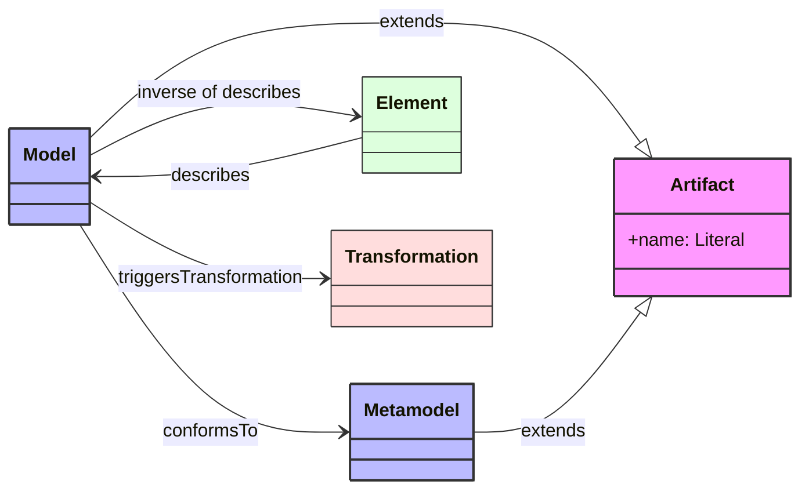
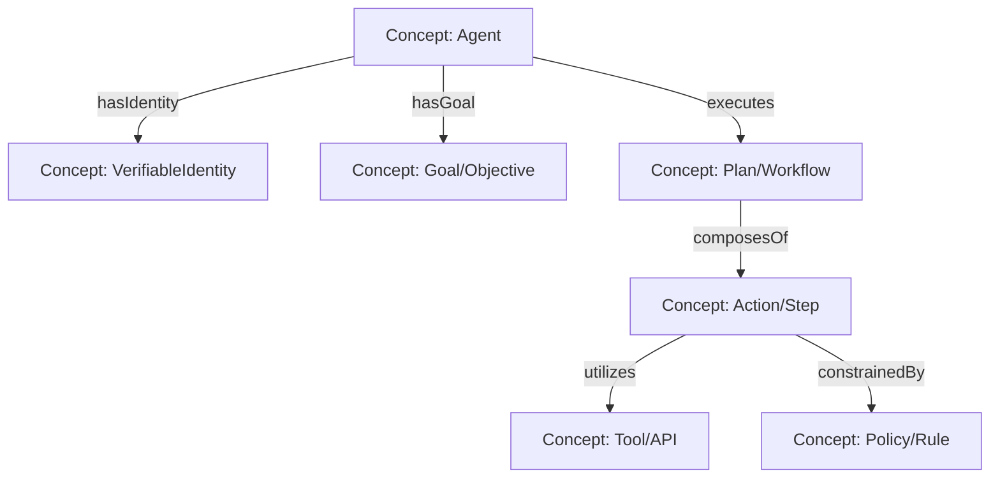

**ONTOLOGIA** 

# 1. resumo de conceitos 

definições [Wikipedia](https://pt.wikipedia.org/wiki/Ontologia)
- Na Filosofia
	- Estudo do Ser: Analisa o que é comum a tudo o que existe, seja um objeto físico ou uma ideia abstrata.
	- Parte da Metafísica: Funciona como a base da metafísica ao buscar a essência das coisas para além de suas aparências.
	- Categorias da Realidade: Tenta classificar os tipos fundamentais de entes no mundo e como se relacionam.
- Na Informática e Tecnologia
	- Organização de Dados: É a forma de descrever conceitos, propriedades e relações em um sistema digital.
	- Compartilhamento de Saber: Permite que programas de computador leiam e entendam um mesmo conjunto de informações de forma organizada

## 1.1. Knowledge Organization Systems 
- **PIPELINE** (top-down)
	- **folksonomy**, unstructured free-text tags 
	- **controlled vocabulary**, pre-defined vocabulary for consistency 
	- **metadata standards**
	- **taxonomy**, adds a parent-child hierarchy 
	- **thesaurus**, adds associative relationship + **lematização**  
	- **ontology**, adds formal logics, axioms and rules 
	- **knowledge graph**

- **CONCEPTS**
	- **Controlled Vocabulary**. Foundation of semantic. Knowledge systems. Reconciles synonyms. Clarifies terms 
	- **Metadata Standards**. Schema-based control. Structural. descriptive. Administrative elements
	- **Taxonomy** is a hierarchical classification or categorization system in wich all the terms belong to a single hierarchical structure and have parent/child or broader/narrower relationships to other terms. Taxonomies allow for classification according to a predetermined system. Structures the controlled vocabulary to form a hierarchy, parent-child relations
	- **Thesaurus** is a reference tool that groups words by their meanings, providing lists of synonyms (words with similar meanings) and often antonyms (words with opposite meanings). The word comes from the Greek term for a "treasure" or "storehouse". Reconciles synonyms, extending the taxonomy beyond parent-child relations. É um dicionario de sinonimos.
		- A thesaurus has at least three elements:
			- a list of terms
			- associative relationships between the terms
			- a set of rules on how to use the theasaurus
		- Main Types of Thesauri
			- **Linguistic Thesauri**: Books or digital tools (such as [Roget's Thesaurus](https://www.google.com/url?sa=i&source=web&rct=j&url=https://en.wikipedia.org/wiki/Roget%2527s_Thesaurus&ved=2ahUKEwi8wLjtiaqWAxUkrpUCHSwHNUAQy_kOegoIAggACAAIEBAD&opi=89978449&cd&psig=AOvVaw0qIlhiO2khkXGvxRx3wUBc&ust=1787139037954000) or online databases) used by writers to find alternative words, vary vocabulary, and avoid repetition.
			- **Information Retrieval Thesauri**: Controlled and structured vocabularies used in data science, libraries, and databases to index content and help systems find relevant documents using standardized terms.
		- **lematizar**, que significa agrupar flexões de uma palavra em sua forma canônica ou básica de dicionário (o lema).
	- **Ontology** structures information through the description of classes, properties, attributes and relationships. Ontologies form data models for knowledge graphs, ensuring consistency and understanding. Introduces logical reasoning; defines classes, relations, properties, and attributes.
		- Ontology breakdown 
			- conceptualization 
			- Specification 
			- formalization 
			- sharing 
	- **Knowledge Graph**. Includes all stages of the ontology pipeline and lends a visual representation of semantic relations

| data readiness                              | ontology pipeline                           |
| ------------------------------------------- | ------------------------------------------- |
| ![[01-conceitos_software_ontologia-02.jpg]] | ![[01-conceitos_software_ontologia-01.jpg]] |


# 2. linguagens modelo 
## 2.1. RDF - modelagem de dados
An **RDF graph** is a data model made of triples—subject, predicate, and object—while **RDFS** (RDF Schema) adds a basic vocabulary and vocabulary rules to define classes, properties, and hierarchies for that data.
RDF Graph Structure
- Triples: Statements form a directed graph where nodes are subjects and objects, and edges are predicates.
- IRIs/URIs: Uniform resource identifiers name things uniquely so data can link across the web.
- Literals: Values like text strings, numbers, or dates sit at the object end of a triple.
RDFS (RDF Schema) Features
- Classes: Group resources into categories (like rdfs:Class).
- Hierarchies: Connect general and specific terms using rdfs:subClassOf and rdfs:subPropertyOf.
- Constraints: Guide how properties apply using rdfs:domain and rdfs:range.
- Inference: Rules let systems deduce new facts from existing data.

## 2.2. SKOS - modelagem semantica, taxonomia
SKOS - Simple Knowledge Organization System
|[w3c oficial](https://www.w3.org/TR/skos-reference/)|

### 2.2.1. Conceito e Fundamentação

O SKOS (Simple Knowledge Organization System) é um vocabulário baseado em RDF projetado para representar sistemas de organização do conhecimento (KOS - Knowledge Organization Systems) semi-formais, como tesauros, taxonomias, esquemas de classificação e listas de cabeçalhos de assuntos [7]. Ele funciona como uma tecnologia de transição, conectando o formalismo lógico rigoroso de linguagens como o OWL com a estrutura informal de ferramentas de colaboração na Web [7].

Using SKOS, [concepts](https://www.w3.org/TR/skos-reference/#concepts) can be identified using URIs, [labeled](https://www.w3.org/TR/skos-reference/#labels) with lexical strings in one or more natural languages, assigned [notations](https://www.w3.org/TR/skos-reference/#notations) (lexical codes), [documented](https://www.w3.org/TR/skos-reference/#notes) with various types of note, [linked to other concepts](https://www.w3.org/TR/skos-reference/#semantic-relations) and organized into informal hierarchies and association networks, aggregated into [concept schemes](https://www.w3.org/TR/skos-reference/#schemes), grouped into labeled and/or ordered [collections](https://www.w3.org/TR/skos-reference/#collections), and [mapped](https://www.w3.org/TR/skos-reference/#mapping) to concepts in other schemes.

[Key Choices in the Design of SKOS](https://arxiv.org/abs/1302.1224)
[Demystifying SKOS for Practitioners: A Practical Guide to Controlled Vocabularies](https://moderndata101.substack.com/p/demystifying-skos-for-practitioners)

The SKOS data model is formally defined in this specification as an OWL Full ontology [OWL-SEMANTICS](https://www.w3.org/TR/skos-reference/#ref-OWL-SEMANTICS). SKOS data are expressed as RDF triples [RDF-CONCEPTS](https://www.w3.org/TR/skos-reference/#ref-RDF-CONCEPTS), and may be encoded using any concrete RDF syntax (such as RDF/XML [RDF-XML](https://www.w3.org/TR/skos-reference/#ref-RDF-XML) or Turtle [TURTLE](https://www.w3.org/TR/skos-reference/#ref-TURTLE)). For more on the relationships between SKOS, RDF and OWL, see the next sub-section below.

For an informative guide to using SKOS, see the [SKOS-PRIMER] ([w3c](https://www.w3.org/TR/skos-reference/#ref-SKOS-PRIMER), [[20 km_ssg/02_pdf_temp/260818 SKOS Simple Knowledge Organization System Primer|local]])

- general:  
	- schema.org: org, person, product
	- FOAF: people, organizations
	- Dublin core: documents, metadata 
	- SKOS: concepts, taxonomies 
- broad & domain 
	- wikidata: curated world entities 
	- DBpedia: extracted from Wikipedia 
	- FIBO: finance 
	- GoodRelations: e-commerce 


### 2.2.2. Elementos Essenciais (Essentials)

#### 2.2.2.1. Conceitos
A classe central do SKOS é a `skos:Concept`, que representa as unidades de pensamento — ideias, significados ou categorias abstratas de objetos e eventos, independentes dos termos literais utilizados para descrevê-los [13]. Cada conceito é identificado unicamente por um URI, sendo recomendada a adoção de URIs HTTP resolvíveis para facilitar o acesso e referência na Web Semântica [14, 15].

![[01-conceitos_software_ontologia-03.png|800]]

As the SKOS Reference puts it, “a SKOS concept can be viewed as an idea or notion; a unit of thought. However, what constitutes a unit of thought is subjective, and this definition is meant to be suggestive, rather than restrictive.”

#### 2.2.2.2. Rotulação Lexical (Labels)
O SKOS fornece propriedades especializadas para anexar strings em linguagem natural aos conceitos, sendo todas elas subpropriedades disjuntas de `rdfs:label` [16, 17]:
* `skos:prefLabel`: Define o rótulo léxico preferencial de um recurso (geralmente usado como o descritor principal em sistemas de indexação) [17]. Um conceito pode ter no máximo um rótulo preferencial por tag de idioma [19].
* `skos:altLabel`: Define rótulos alternativos, facilitando a representação de sinônimos, quase-sinônimos, abreviações ou acrônimos [20].
* `skos:hiddenLabel`: Representa termos legíveis que servem para indexação interna e busca textual por aplicações (como grafias incorretas comuns), mas que não devem ser exibidos visualmente ao usuário final [22].

#### 2.2.2.3. Relações Semânticas Intra-Vocabulário
As relações definem o significado dos conceitos por meio de sua inserção em uma rede estruturada. Existem duas categorias principais de relações semânticas [23, 24]:
* Hierárquicas: Estabelecidas pelas propriedades inversas `skos:broader` (tem conceito mais geral) e `skos:narrower` (tem conceito mais específico) [25, 26, 27]. Para evitar heranças problemáticas de transitividade em taxonomias reais ("hierarquias sujas"), o SKOS não define essas propriedades como transitivas por padrão [28].
* Associativas: Estabelecidas pela propriedade simétrica `skos:related`, que conecta conceitos de forma não hierárquica [24, 31, 32]. A propriedade não é transitiva, evitando propagações semânticas indesejadas [32]. Além disso, o fechamento transitivo de relações hierárquicas é estritamente disjunto das relações associativas [33].

#### 2.2.2.4. Notas Documentárias
Para fornecer definições informais e documentação legível por humanos, o SKOS define a propriedade geral `skos:note`, estendendo-a em categorias específicas que suportam tags de idioma [34, 38]:
* `skos:scopeNote`: Indica limites e restrições de uso de um conceito na prática de indexação [34].
* `skos:definition`: Fornece uma explicação completa do significado pretendido do conceito [35].
* `skos:example`: Ilustra o conceito através de exemplos concretos de uso [35].
* `skos:historyNote`: Documenta alterações históricas significativas no significado ou na forma de um conceito [36].
* `skos:editorialNote` e `skos:changeNote`: Auxiliam no gerenciamento interno, documentando revisões editoriais pendentes ou modificações finas realizadas no conceito [36, 37].

#### 2.2.2.5. Esquemas de Conceitos (Concept Schemes)
Vocabulários inteiros são agregados usando a classe `skos:ConceptScheme` [39]. Os conceitos individuais associam-se ao seu esquema correspondente via `skos:inScheme` [40]. Para fornecer pontos de entrada eficientes na navegação de grandes árvores de conceitos, utiliza-se a propriedade `skos:hasTopConcept` para apontar diretamente para os conceitos de topo (mais gerais) do esquema [41].

### 2.2.3. Grafo de Relações do SKOS



### 2.2.4. Rede de Vocabulários e Mapeamento Semântico

#### 2.2.4.1. Mapeamento entre Esquemas (Mapping)
Para conciliar e interligar diferentes vocabulários em uma rede distribuída e global, o SKOS fornece propriedades específicas de mapeamento semântico [44, 45, 46]:
* `skos:closeMatch`: Indica que dois conceitos de esquemas diferentes são suficientemente semelhantes para serem usados de forma intercambiável em certas aplicações [46, 48]. Esta propriedade não é transitiva, impedindo que a similaridade se propague indefinidamente através de redes de mapeamento [48].
* `skos:exactMatch`: Indica equivalência de significado estrita entre os conceitos [48]. É uma subpropriedade de `skos:closeMatch` e é definida como transitiva [48].
* Outros Mapeamentos: `skos:broadMatch`, `skos:narrowMatch` e `skos:relatedMatch` servem como paralelos diretos das propriedades semânticas internas do vocabulário, mas com o propósito de mapear fronteiras entre esquemas distintos [46, 51]. Elas são definidas como subpropriedades das relações correspondentes (ex: `skos:broadMatch` implica formalmente `skos:broader`) [51].

#### 2.2.4.2. Diferenciação Semântica: skos:exactMatch vs. owl:sameAs
O SKOS utiliza `skos:exactMatch` em vez de `owl:sameAs` para preservar a integridade dos dados dos esquemas individuais [49]. Quando duas entidades são unidas via `owl:sameAs`, elas passam a ser consideradas o mesmo recurso físico na Web Semântica, o que força a mesclagem de todas as suas propriedades em um único nó [49]. Isso geraria inconsistências lógicas graves no SKOS, como um único conceito adquirir múltiplos rótulos preferenciais (`skos:prefLabel`) na mesma língua [49, 50].

#### 2.2.4.3. Reutilização e Extensão de Conceitos
Diferentes editores podem estender esquemas existentes referenciando e incluindo conceitos de outros vocabulários via `skos:inScheme` [52, 54]. Um conceito pode pertencer a múltiplos esquemas simultaneamente [42]. Caso seja necessário importar um esquema inteiro, pode-se recorrer a `owl:imports`, embora isso force logicamente a inferência das instâncias de `skos:ConceptScheme` como classes de `owl:Ontology` (colocando o sistema no perfil semântico OWL Full) [56, 57].

### 2.2.5. Recursos Avançados do SKOS

#### 2.2.5.1. Coleções de Conceitos (Concept Collections)
Permitem agrupar conceitos sem a necessidade de criar relações semânticas formais (como rotular grupos em exibições sistemáticas ou facetas) [61, 62]:
* Labeled Collections (`skos:Collection`): Coleções rotuladas por meio de rótulos lexicais comuns, agrupando conceitos via propriedade `skos:member` [63].
* Ordered Collections (`skos:OrderedCollection`): Grupos que requerem uma ordenação sequencial explícita (alfabética, cronológica, etc.) [64]. Conectam-se a uma lista do tipo `rdf:List` por meio de `skos:memberList` [64].

As coleções são estruturalmente disjuntas dos conceitos, o que impede a sua inserção direta em redes hierárquicas normais [65].

#### 2.2.5.2. Relações entre Rótulos (SKOS-XL)
Como as propriedades lexicais comuns do SKOS aceitam apenas literais RDF como objeto direto, não é possível criar asserções ou metadados sobre os rótulos em si (como indicar relações de tradução ou acrônimos) [71]. O módulo de extensão opcional SKOS-XL resolve isso introduzindo a classe `skosxl:Label`, transformando os rótulos em recursos de primeira ordem [72]. Cada instância possui uma forma literal via `skosxl:literalForm` e pode se relacionar com outras através de `skosxl:labelRelation` [72, 73].

#### 2.2.5.3. Coordenação de Conceitos
Consiste na atividade de combinar múltiplos conceitos lógicos do vocabulário:
* Pré-coordenação: Combinação de termos realizada a priori por indexadores ou gerenciadores do KOS (ex: "Bicicletas--Manutenção") [76].
* Pós-coordenação: Combinação dinâmica efetuada no momento da recuperação de dados pelo usuário, o que pode ser modelado diretamente via consultas SPARQL [76, 77].

O vocabulário básico do SKOS não fornece mecanismos nativos específicos para a pré-coordenação, permitindo o surgimento orgânico de padrões e especializações baseados em extensões de classes ou OWL [78, 79].

#### 2.2.5.4. Hierarquias Transitivas
Para habilitar a expansão de consultas ou raciocínio transitivo formal em redes de conceitos, o SKOS define as superpropriedades transitivas `skos:broaderTransitive` e `skos:narrowerTransitive` [81]. Elas agem como a cobertura transitiva das relações diretas de parentesco, permitindo mapear ancestrais e descendentes indiretos através de raciocinadores sem poluir ou descaracterizar as propriedades diretas `skos:broader` e `skos:narrower` [81, 83].

#### 2.2.5.5. Notações
Para KOSs que utilizam representações estruturadas de códigos alfanuméricos independentes de linguagem natural (como a Classificação Decimal Universal), o SKOS fornece a propriedade `skos:notation` [85, 86]. Ela suporta o uso de literais tipados que definem esquemas sintáticos específicos de codificação [86].

### 2.2.6. Integração entre SKOS e OWL
A especificação define `skos:Concept` como uma classe de OWL (`owl:Class`), o que torna todas as instâncias de conceitos indivíduos lógicos de OWL [95, 96]. 
* OWL Full: Permite tratar os conceitos simultaneamente como indivíduos e classes (metamodelagem), simplificando a modelagem onde classes de objetos precisam herdar características específicas associadas a conceitos do vocabulário [97].
* OWL DL: Exige disjunção absoluta entre o conjunto de classes e indivíduos, o que impede o tratamento direto de um conceito SKOS como uma classe formal de OWL, necessitando de propriedades de anotação dedicadas para realizar essa ponte [97, 98].

## 2.3. SHACL - modelagem semantica
SHACL - Shapes Constraint Language
|[w3c](https://www.w3.org/TR/shacl/)|

## 2.4. OWL - modelagem ontologica  
|[OWL 2 Web Ontology Language Overview](https://www.w3.org/TR/owl2-overview/)|
|[OWL 2 Web Ontology Language Primer](https://www.w3.org/TR/2012/REC-owl2-primer-20121211/)|
|[OWL 2 Web Ontology Language Quick Reference Guide](https://www.w3.org/TR/2012/REC-owl2-quick-reference-20121211/)|

### 2.4.1. O que e o OWL 2
Ontology Web Services ou serviços voltados à manipulação de Ontologias (OWL - Web Ontology Language). Esses componentes estruturam o conhecimento formal em redes semânticas ligadas.
Papel das Ontologias e OWS
- Padronização semântica: Definem classes, propriedades e restrições de domínio para padronizar o significado dos dados.
- Inferência lógica: Permitem deduzir novos fatos e relacionamentos que não estão explicitamente declarados na base de dados.
- Interoperabilidade: Facilitam a integração de fontes de dados heterogêneas por meio de vocabulários controlados como RDF e OWL.
Integração na Arquitetura
- Camada de abstração: Atuam acima do armazenamento físico de grafos para validar a integridade conceitual das consultas.
- Consultas federadas: Permitem resgatar informações distribuídas na Web Semântica utilizando padrões como SPARQL.

O OWL 2 Web Ontology Language e uma linguagem de ontologias para a Web Semantica com significado formalmente definido [3]. Ontologias escritas em OWL 2 sao estruturadas como documentos e servem para descrever de forma precisa porcoes do mundo real, chamadas de dominios de interesse [3, 13]. Elas auxiliam na comunicacao humana e garantem a consistencia do comportamento de softwares e agentes na web [13].

As ontologias em OWL 2 sao baseadas em computacao logica [7]. Esse carater declarativo faz com que ferramentas de raciocinio automatizado (raciocinadores) consigam computar consequencias logicas e inferir novos fatos implicitamente contidos na base [7, 15, 19].

![[01-conceitos_software_ontologia-04.png]]

### 2.4.2. Modelagem de Conhecimento e Noções Basicas
O OWL 2 representa o conhecimento por meio de tres elementos lógicos principais: axiomas, entidades e expressoes [17].

#### 2.4.2.1. Entidades
As entidades denotam os objetos e relacoes do dominio [17, 21]. Sao divididas em:
* Individuos: representam objetos ou elementos concretos do dominio [21].
* Classes: categorizam os individuos e funcionam essencialmente como conjuntos [21, 24].
* Propriedades: estabelecem relacoes, dividindo-se em propriedades de objeto (relacao entre individuos) e propriedades de dados (relacao de individuos com dados literais) [21].
* Propriedades de anotacao: utilizadas para registrar metadados sobre a ontologia ou sobre axiomas especificos (como comentarios ou autor), sem interferir no raciocinio logico principal [21, 113].

##### 2.4.2.1.1. Indivíduos e Recursos

| Título Genérico | OWL | RDFS | SKOS | Comumente Aplicado em |
| --- | --- | --- | --- | --- |
| Instâncias de Commits e Revisões | `owl:NamedIndividual` (ex: `commit_a1b2c3d`) | `rdfs:Resource` / `rdf:Description` (ex: `http://git.org/commit/a1b2c3d`) | `skos:Concept` (conceito representando o evento do commit) | Rastreabilidade de versionamento e auditoria de código-fonte |
| Servidores e Nós de Infraestrutura | `owl:NamedIndividual` (ex: `node_aws_prod_01`) | `rdfs:Resource` (ex: `http://infra.org/node/01`) | `skos:Concept` (nó de inventário de infraestrutura) | Gerenciamento de configuração, DevOps e mapas de topologia |
| Desenvolvedores e Atores | `owl:NamedIndividual` (ex: `user_alice_dev`) | `rdfs:Resource` / `foaf:Person` (ex: `http://team.org/user/alice`) | `skos:Concept` (conceito do ator/papel do especialista) | Atribuição de responsabilidade, revisão de código e gestão de times |
| Artefatos Compilados e Builds | `owl:NamedIndividual` (ex: `build_1042_jar`) | `rdfs:Resource` (ex: `http://ci.org/build/1042`) | `skos:Concept` (item no catálogo de produtos gerados) | Gestão de release, esteiras de CI/CD e repositórios de binários |
| Pacotes e Bibliotecas Externas | `owl:NamedIndividual` (ex: `npm_express_4_18`) | `rdfs:Resource` (ex: `http://registry.org/npm/express`) | `skos:Concept` (termo de biblioteca em catálogo) | Análise de dependências de software e gestão de licenças |
| Registros de Tarefas e Bugs | `owl:NamedIndividual` (ex: `issue_bug_1420`) | `rdfs:Resource` (ex: `http://tracker.org/issue/1420`) | `skos:Concept` (item de trabalho no vocabulário) | Gestão de chamados, rastreamento de defeitos e listas de backlog |

##### 2.4.2.1.2. Classes e Categorias

| Título Genérico                   | OWL                                              | RDFS                                      | SKOS                                                             | Comumente Aplicado em                                                 |
| --------------------------------- | ------------------------------------------------ | ----------------------------------------- | ---------------------------------------------------------------- | --------------------------------------------------------------------- |
| Componentes e Módulos             | `owl:Class` (ex: `swo:SoftwareComponent`)        | `rdfs:Class` (ex: `seon:SoftwareModule`)  | `skos:ConceptScheme` / `skos:Concept` (categoria no vocabulário) | Arquitetura de software e catalogação de componentes reutilizáveis    |
| Requisitos e Histórias de Usuário | `owl:Class` (ex: `seon:FunctionalRequirement`)   | `rdfs:Class` (ex: `req:UserStory`)        | `skos:Concept` (conceito taxonômico de requisito)                | Engenharia de requisitos e rastreabilidade de escopo                  |
| Tipos de Defeito e Erros          | `owl:Class` (ex: `seon:BugReport`)               | `rdfs:Class` (ex: `tracker:Defect`)       | `skos:Concept` (categoria de falha no KOS)                       | Análise de qualidade de software e classificação de incidentes        |
| Ambientes de Execução             | `owl:Class` (ex: `devops:DeploymentEnvironment`) | `rdfs:Class` (ex: `infra:Environment`)    | `skos:Concept` (classificação de ambiente)                       | Automação de deploy e gerenciamento de infraestrutura como código     |
| Serviços e Endpoints REST         | `owl:Class` (ex: `arch:Microservice`)            | `rdfs:Class` (ex: `api:RESTEndpoint`)     | `skos:Concept` (termo de serviço em catálogo)                    | Governança de APIs, service mesh e arquiteturas orientadas a serviços |
| Tipos de Teste de Software        | `owl:Class` (ex: `seon:UnitTest`)                | `rdfs:Class` (ex: `test:IntegrationTest`) | `skos:Concept` (categoria de teste)                              | Estratégia de garantia de qualidade e automação de testes             |

##### 2.4.2.1.3. Propriedades de Objeto

| Título Genérico | OWL | RDFS | SKOS | Comumente Aplicado em |
| --- | --- | --- | --- | --- |
| Relação de Dependência de Código | `owl:ObjectProperty` (ex: `dependsOnLibrary`) | `rdf:Property` (ex: `importsModule`) | `skos:related` / `skos:semanticRelation` | Análise de impacto de mudanças e compilação de projetos |
| Rastreabilidade de Requisitos | `owl:ObjectProperty` (ex: `implementsRequirement`) | `rdf:Property` (ex: `satisfiesReq`) | `skos:relatedMatch` / `skos:broadMatch` | Matriz de rastreabilidade entre código e requisitos de negócio |
| Deploy em Infraestrutura | `owl:ObjectProperty` (ex: `deployedToEnvironment`) | `rdf:Property` (ex: `runsOnHost`) | `skos:related` | Orquestração de contêiners e controle de topologia de implantação |
| Autoria e Revisão de Código | `owl:ObjectProperty` (ex: `authoredBy`) | `rdf:Property` (ex: `reviewedBy`) | `skos:related` | Governança de repositórios e auditoria de commits |
| Composição Arquitetural | `owl:ObjectProperty` (ex: `containsSubmodule`) | `rdf:Property` (ex: `hasPart`) | `skos:narrower` / `skos:broader` | Decomposição de sistemas e modelagem de diagramas UML |
| Associação de Release e Branch | `owl:ObjectProperty` (ex: `mergedIntoBranch`) | `rdf:Property` (ex: `partOfRelease`) | `skos:related` | Gerenciamento de fluxo de trabalho Git (GitFlow) e entregas |

##### 2.4.2.1.4. Propriedades de Dados e Atributos

| Título Genérico | OWL | RDFS | SKOS | Comumente Aplicado em |
| --- | --- | --- | --- | --- |
| Métricas de Qualidade e Complexidade | `owl:DatatypeProperty` (ex: `cyclomaticComplexity` `xsd:integer`) | `rdf:Property` com `rdfs:range rdfs:Literal` | `skos:notation` / literais em propriedades personalizadas | Auditoria de código, análise estática e dívida técnica |
| Identificadores Únicos e Hashes | `owl:DatatypeProperty` (ex: `commitHash` `xsd:string`) | `rdf:Property` (ex: `buildNumber`) | `skos:notation` (ex: código alfanumérico UDC/notação) | Integridade de artefatos e identificação de commits em VCS |
| Marcas Temporais e Cronologia | `owl:DatatypeProperty` (ex: `executionTimeMs` `xsd:decimal`) | `rdf:Property` (ex: `createdAtTimestamp`) | Literais associados a notas de histórico (`skos:historyNote`) | Monitoramento de performance e SLA de pipelines |
| Indicadores de Status e Severidade | `owl:DatatypeProperty` (ex: `vulnerabilityCVSS` `xsd:float`) | `rdf:Property` (ex: `buildStatus`) | `skos:prefLabel` / `skos:notation` de gravidade | Gestão de vulnerabilidades (DevSecOps) e triagem de bugs |
| Mensagens e Logs de Execução | `owl:DatatypeProperty` (ex: `commitMessage` `xsd:string`) | `rdf:Property` (ex: `logOutputText`) | `skos:definition` / `skos:scopeNote` | Diagnóstico de falhas, registros de auditoria e changelogs |
| Parâmetros de Configuração | `owl:DatatypeProperty` (ex: `allocatedMemoryMB` `xsd:integer`) | `rdf:Property` (ex: `portNumber`) | `skos:notation` sintática de parâmetro | Provisionamento de ambientes e parametrização de microsserviços |

##### 2.4.2.1.5. Propriedades de Anotação

| Título Genérico | OWL | RDFS | SKOS | Comumente Aplicado em |
| --- | --- | --- | --- | --- |
| Nomes Legíveis e Títulos | `owl:AnnotationProperty` (ex: `rdfs:label`) | `rdfs:label` | `skos:prefLabel` (rótulo preferencial por idioma) | Interface de usuário em ferramentas de modelagem e catálogos |
| Descrições Técnicas e Documentação | `owl:AnnotationProperty` (ex: `rdfs:comment`) | `rdfs:comment` | `skos:definition` / `skos:scopeNote` | Documentação de APIs, dicionário de dados e glossários |
| Depreciação e Versionamento de API | `owl:AnnotationProperty` (ex: `owl:deprecated` `xsd:boolean`) | `rdfs:seeAlso` | `skos:changeNote` / `skos:historyNote` | Mapeamento de ciclo de vida de software e APIs legadas |
| Notas Editoriais e Pendências | `owl:AnnotationProperty` (ex: `rdfs:comment`) | `rdfs:comment` | `skos:editorialNote` | Gestão interna de ontologias de engenharia e notas de revisão |
| Referência a Especificações Externas | `owl:AnnotationProperty` (ex: `rdfs:isDefinedBy`) | `rdfs:isDefinedBy` / `rdfs:seeAlso` | `skos:exactMatch` / notas documentárias | Vinculação com documentação OpenAPI/Swagger ou RFCs |
| Sinônimos e Termos Alternativos | `owl:AnnotationProperty` (ex: `rdfs:label`) | `rdfs:label` | `skos:altLabel` / `skos:hiddenLabel` | Mecanismos de busca técnica e tolerância a erros de digitação |

#### 2.4.2.2. Expressões
As expressoes sao criadas combinando entidades por meio de construtores logicos [17, 22]. Elas criam novos conceitos a partir de componentes basicos, como a interseccao ou a uniao de classes preexistentes [22, 50].

##### 2.4.2.2.1. Conjunção e Interseção

| Título Genérico | OWL | RDFS | SKOS | Comumente Aplicado em |
| --- | --- | --- | --- | --- |
| Microserviço Crítico de Segurança | `owl:intersectionOf` (`Microservice AND SecurityCritical`) | Herança múltipla via `rdfs:subClassOf` em ambas | Pós-coordenação de conceitos `skos:Concept` | Classificação automatizada para auditoria estrita de DevSecOps |
| Defeito de Alta Prioridade Aberto | `owl:intersectionOf` (`BugReport AND OpenStatus AND HighPriority`) | Múltiplas superclasses implícitas | Combinação de coleções de conceitos | Filtragem dinâmica de backlog em ferramentas de gestão de tarefas |
| Teste de Integração Automatizado | `owl:intersectionOf` (`TestCase AND IntegrationTest AND AutomatedTest`) | Superclasses concorrentes em RDFS | Agrupamento pós-coordenado de termos | Seleção automatizada de suítes de teste na esteira de CI/CD |
| Desenvolvedor e Revisor Principal | `owl:intersectionOf` (`Developer AND RepoMaintainer AND CodeReviewer`) | Declarações múltiplas de classe | Associação de múltiplos conceitos ao ator | Validação de regras de aprovação de Pull Requests |
| Componente Depreciado Vulnerável | `owl:intersectionOf` (`SoftwareComponent AND DeprecatedModule AND VulnerableArtifact`) | Atribuição simultânea de tipos | Combinação de rótulos em catálogos | Alertas automáticos de substituição de dependências de software |

##### 2.4.2.2.2. Disjunção e União

| Título Genérico | OWL | RDFS | SKOS | Comumente Aplicado em |
| --- | --- | --- | --- | --- |
| Artefato Compilável Genérico | `owl:unionOf` (`SourceFile OR BinaryPackage OR ContainerImage`) | Sem suporte nativo direto a união | `skos:Collection` (agrupamento de conceitos) | Regras de empacotamento e artefatos elegíveis para deploy |
| Ator de Execução de Pipeline | `owl:unionOf` (`HumanDeveloper OR BotAccount OR CIProcess`) | Sem suporte nativo a união lógica | `skos:Collection` de atores de sistema | Controle de acesso unificado e auditoria de ações no repositório |
| Evento de Gatilho de CI | `owl:unionOf` (`CodePushEvent OR PullRequestEvent OR ScheduledTrigger`) | Sem suporte nativo | `skos:Collection` de eventos de gatilho | Mapeamento de webhooks e gatilhos de automação de testes |
| Ambiente de Não-Produção | `owl:unionOf` (`DevelopmentEnv OR StagingEnv OR TestingEnv`) | Sem suporte nativo | `skos:Collection` de ambientes secundários | Políticas de permissão e limpeza de recursos de infraestrutura |
| Item de Trabalho do Backlog | `owl:unionOf` (`BugReport OR FeatureRequest OR RefactoringTask`) | Sem suporte nativo | `skos:Collection` de tipos de tarefas | Unificação de visualizações em quadros Kanban/Scrum |

##### 2.4.2.2.3. Negação e Complemento

| Título Genérico | OWL | RDFS | SKOS | Comumente Aplicado em |
| --- | --- | --- | --- | --- |
| Teste Manual (Não Automatizado) | `owl:complementOf` (`TestCase AND NOT AutomatedTest`) | Sem suporte a complemento | Sem suporte a negação | Identificação de gargalos de testes manuais que exigem ação humana |
| Commit Não Implantado | `owl:complementOf` (`Commit AND NOT DeployedCommit`) | Sem suporte a complemento | Sem suporte a negação | Cálculo de pendências de implantação (Deployment Lead Time) |
| Componente Sem Vulnerabilidades | `owl:complementOf` (`SoftwareModule AND NOT VulnerableComponent`) | Sem suporte a complemento | Sem suporte a negação | Certificação de segurança para liberação em ambiente de produção |
| Repositório Privado (Não Público) | `owl:complementOf` (`Repository AND NOT PublicRepository`) | Sem suporte a complemento | Sem suporte a negação | Imposição de restrições de visibilidade e vazamento de código |
| Código Não Coberto por Testes | `owl:complementOf` (`SourceCodeModule AND NOT TestedModule`) | Sem suporte a complemento | Sem suporte a negação | Geração de relatórios de cobertura de código (Code Coverage) |

##### 2.4.2.2.4. Restrição Existencial

| Título Genérico | OWL | RDFS | SKOS | Comumente Aplicado em |
| --- | --- | --- | --- | --- |
| Componente com Dependência Vulnerável | `owl:someValuesFrom` (`SoftwareModule AND dependsOn SOME VulnerableLibrary`) | Sem restrição de escopo local (apenas `rdfs:range` global) | Conexões diretas entre instâncias de conceitos | Detecção automática de riscos de segurança em árvores de dependências |
| Release com Correção de Segurança | `owl:someValuesFrom` (`Release AND containsCommit SOME SecurityFixCommit`) | Sem suporte a restrições de classe anônimas | Estrutura de relacionamentos conceituais | Marcação de releases de emergência (Hotfix/Security Patch) |
| Pull Request Aprovação Pendente | `owl:someValuesFrom` (`PullRequest AND hasApproval SOME CodeReviewer`) | Sem suporte local | Sem suporte formal | Validação de portão de qualidade (Quality Gate) em Pull Requests |
| Serviço com Endpoint REST Exposto | `owl:someValuesFrom` (`Service AND exposesEndpoint SOME RESTEndpoint`) | Sem suporte local | Sem suporte formal | Catalogação e descoberta automática de APIs em malhas de serviços |
| Build com Imagem de Contêiner | `owl:someValuesFrom` (`BuildJob AND producesArtifact SOME ContainerImage`) | Sem suporte local | Sem suporte formal | Rastreamento de linhagem de artefatos (Artifact Lineage) em CI/CD |

##### 2.4.2.2.5. Restrição Universal

| Título Genérico | OWL | RDFS | SKOS | Comumente Aplicado em |
| --- | --- | --- | --- | --- |
| Release Totalmente Homologada | `owl:allValuesFrom` (`SecureRelease AND hasComponent ONLY TestedComponent`) | `rdfs:range` (restrição global para a propriedade) | Sem suporte a quantificação universal | Garantia de conformidade regulatória e validação estrita de releases |
| Pipeline de Execução Segura | `owl:allValuesFrom` (`StrictPipeline AND runsJob ONLY CertifiedContainerJob`) | Restrição global via `rdfs:range` | Sem suporte | Imposição de execução de pipelines exclusivamente em nós homologados |
| Módulo Isolado de Comunicação | `owl:allValuesFrom` (`IsolatedModule AND communicatesWith ONLY InternalService`) | Restrição global via `rdfs:range` | Sem suporte | Arquiteturas de Zero-Trust e isolamento de redes de microsserviços |
| Repositório com Contribuição Assinada | `owl:allValuesFrom` (`OpenRepo AND hasContributor ONLY SignedCLAContributor`) | Restrição global via `rdfs:range` | Sem suporte | Conformidade de propriedade intelectual e licenças open-source |

##### 2.4.2.2.6. Restrição de Cardinalidade

| Título Genérico | OWL | RDFS | SKOS | Comumente Aplicado em |
| --- | --- | --- | --- | --- |
| Pull Request com Dupla Reversão | `owl:qualifiedCardinality` / `owl:cardinality` (`PullRequest AND hasReview EXACTLY 2`) | Sem suporte a cardinalidade | Convenção estrutural (ex: único `prefLabel` por idioma) | Verificação de política de Code Review obrigatória por dois pares |
| Banco de Dados com Nó Primário Único | `owl:maxCardinality` (`DatabaseCluster AND hasPrimaryNode MAX 1`) | Sem suporte a cardinalidade | Convenção semântica | Validação de arquiteturas de alta disponibilidade e evita Split-Brain |
| Componente HA com Réplicas Mínimas | `owl:minCardinality` (`HAComponent AND hasReplica MIN 3`) | Sem suporte a cardinalidade | Convenção semântica | Dimensionamento de infraestrutura e tolerância a falhas em Kubernetes |
| Limite de Métodos em Classe Limpa | `owl:maxCardinality` (`ClassModule AND hasMethod MAX 50`) | Sem suporte a cardinalidade | Sem suporte | Análise de refatoração de código (evitar instâncias de God Class) |

##### 2.4.2.2.7. Enumeração de Indivíduos

| Título Genérico | OWL | RDFS | SKOS | Comumente Aplicado em |
| --- | --- | --- | --- | --- |
| Ambientes Oficiais Homologados | `owl:oneOf` (`{env_dev, env_staging, env_prod}`) | Sem suporte nativo a enumeração fechada | `skos:OrderedCollection` com `skos:memberList` | Restrição de destinos válidos para scripts de implantação |
| Mantenedores do Core da Aplicação | `owl:oneOf` (`{dev_alice, dev_bob, dev_charlie}`) | Sem suporte nativo | `skos:Collection` de membros chave | Permissões de escrita direta no branch principal do repositório |
| Repositórios Oficiais do ecossistema | `owl:oneOf` (`{repo_core, repo_api, repo_ui}`) | Sem suporte nativo | `skos:Collection` de repositórios | Escopo de varredura automatizada de ferramentas de SAST/DAST |
| Suíte de Testes de Regressão Crítica | `owl:oneOf` (`{test_auth, test_payment, test_billing}`) | Sem suporte nativo | `skos:OrderedCollection` de testes | Validação de sanidade do sistema antes do deploy em produção |

#### 2.4.2.3. Axiomas
Axiomas sao proposicoes logicas que a ontologia assume como verdadeiras [17, 18]. Diferente das entidades, os axiomas representam declaracoes com valor de verdade avaliavel [18]. A interacao desses axiomas determina as consequencias dedutivas que um raciocinador pode extrair [19, 20].

##### 2.4.2.3.1. Hierarquia e Subsumção de Classes

| Título Genérico                | OWL                                                                  | RDFS              | SKOS                             | Comumente Aplicado em                                           |
| ------------------------------ | -------------------------------------------------------------------- | ----------------- | -------------------------------- | --------------------------------------------------------------- |
| Classificação de Artefatos     | `owl:subClassOf` (`SourceCode subClassOf Artifact`)                  | `rdfs:subClassOf` | `skos:broader` / `skos:narrower` | Organização de elementos do ciclo de vida de desenvolvimento    |
| Taxonomia de Falhas e Defeitos | `owl:subClassOf` (`SecurityVulnerability subClassOf SoftwareDefect`) | `rdfs:subClassOf` | `skos:broader` / `skos:narrower` | Categorização e priorização de chamados de manutenção           |
| Tipologia de Itens de Trabalho | `owl:subClassOf` (`BugReport subClassOf WorkItem`)                   | `rdfs:subClassOf` | `skos:broader` / `skos:narrower` | Estruturação de ferramentas de gerenciamento de projetos agile  |
| Especialização de Testes       | `owl:subClassOf` (`UnitTest subClassOf TestCase`)                    | `rdfs:subClassOf` | `skos:broader` / `skos:narrower` | Organização de planos e planos de testes automatizados          |
| Arquitetura de Serviços        | `owl:subClassOf` (`Microservice subClassOf DistributedService`)      | `rdfs:subClassOf` | `skos:broader` / `skos:narrower` | Mapeamento de padrões arquiteturais em ecossistemas de software |

##### 2.4.2.3.2. Equivalência de Classes e Mapeamentos

| Título Genérico | OWL | RDFS | SKOS | Comumente Aplicado em |
| --- | --- | --- | --- | --- |
| Definição Formal de Módulo Vulnerável | `owl:equivalentClass` (`VulnerableModule EquivalentTo Module AND (dependsOn SOME VulnerableLibrary)`) | Declarações recíprocas `rdfs:subClassOf` | `skos:exactMatch` | Inferência automatizada de componentes afetados por CVEs |
| Alinhamento de Vocabulários SEON/SWO | `owl:equivalentClass` (`seon:SoftwareComponent EquivalentTo swo:SoftwareComponent`) | `rdfs:subClassOf` mútuo | `skos:exactMatch` / `skos:closeMatch` | Interoperabilidade entre ontologias distintas de engenharia de software |
| Critério de Release Pronta | `owl:equivalentClass` (`ProductionReadyRelease EquivalentTo Release AND (hasStatus VALUE "PassedAllTests")`) | Declarações recíprocas `rdfs:subClassOf` | `skos:exactMatch` | Automação de portões de qualidade para liberação de software |
| Mapeamento de Ferramentas de Issue | `owl:equivalentClass` (`jira:Issue EquivalentTo github:Issue`) | Declarações recíprocas `rdfs:subClassOf` | `skos:exactMatch` | Integração heterogênea entre sistemas de acompanhamento de tarefas |

##### 2.4.2.3.3. Disjunção de Classes

| Título Genérico | OWL | RDFS | SKOS | Comumente Aplicado em |
| --- | --- | --- | --- | --- |
| Isolamento de Ambientes | `owl:disjointWith` (`DevelopmentEnv DisjointWith ProductionEnv`) | Sem suporte a disjunção | Disjunção implícita por modelo | Validação de consistência lógica (impedir servidor em dois ambientes) |
| Níveis de Visibilidade do Código | `owl:disjointWith` (`PublicRepo DisjointWith PrivateRepo`) | Sem suporte a disjunção | Disjunção implícita | Prevenção de exposição acidental de código confidencial |
| Níveis Extremos de Severidade | `owl:disjointWith` (`CriticalSeverity DisjointWith LowSeverity`) | Sem suporte a disjunção | Disjunção implícita | Garantia de categorização unívoca em triagem de incidentes |
| Modos de Comunicação de Tarefas | `owl:disjointWith` (`SynchronousTask DisjointWith AsynchronousTask`) | Sem suporte a disjunção | Disjunção implícita | Modelagem precisa de concorrência e arquitetura de mensageria |

##### 2.4.2.3.4. Domínio e Alcance de Propriedades

| Título Genérico | OWL | RDFS | SKOS | Comumente Aplicado em |
| --- | --- | --- | --- | --- |
| Associação de Correção de Bug | `rdfs:domain Commit`, `rdfs:range BugReport` | `rdfs:domain`, `rdfs:range` | `rdfs:domain skos:Concept`, `rdfs:range skos:Concept` | Validação de referências em mensagens de commit Git |
| Vínculo de Deploy de Pacotes | `rdfs:domain SoftwarePackage`, `rdfs:range Environment` | `rdfs:domain`, `rdfs:range` | `rdfs:domain skos:Concept`, `rdfs:range skos:Concept` | Verificação de conformidade em scripts de implantação |
| Métrica Numérica de Código | `rdfs:domain CodeFunction`, `rdfs:range xsd:integer` | `rdfs:domain`, `rdfs:range` | `rdfs:domain skos:Concept`, `rdfs:range xsd:integer` | Verificação do tipo de dados retornado em ferramentas de análise estática |
| Conexão de Conceitos SKOS | `rdfs:domain skos:Concept`, `rdfs:range skos:Concept` | `rdfs:domain`, `rdfs:range` | `rdfs:domain skos:Concept`, `rdfs:range skos:Concept` | Garantia de integridade do modelo conceitual SKOS |

##### 2.4.2.3.5. Identidade e Equivalência de Indivíduos

| Título Genérico | OWL | RDFS | SKOS | Comumente Aplicado em |
| --- | --- | --- | --- | --- |
| Aliasing de Usuários em Plataformas | `owl:sameAs` (`user_alice_github sameAs user_alice_ldap`) | Sem suporte nativo | `skos:exactMatch` (evita fusão indesejada de rótulos) | Unificação de métricas de contribuição em ferramentas distintas |
| Redirecionamento de Repositório | `owl:sameAs` (`repo_old_name sameAs repo_new_name`) | Sem suporte nativo | `skos:exactMatch` | Manutenção de links em migrações de infraestrutura de código |
| Mapeamento de Conceitos de Vocabulários | `owl:sameAs` (fundição total de propriedades) | Sem suporte nativo | `skos:exactMatch` (preferido em SKOS para preservar descritores) | Integração de taxonomias técnicas de fornecedores diferentes |
| Aliasing de Nós de Infraestrutura | `owl:sameAs` (`server_ip_10_0_0_1 sameAs server_hostname_prod1`) | Sem suporte nativo | `skos:exactMatch` | Mapeamento de ativos de rede em inventários dinâmicos de nuvem |

##### 2.4.2.3.6. Diferenciação de Indivíduos

| Título Genérico | OWL | RDFS | SKOS | Comumente Aplicado em |
| --- | --- | --- | --- | --- |
| Distinção de Ambientes de Destino | `owl:differentFrom` (`env_staging differentFrom env_production`) | Sem suporte nativo | Sem suporte nativo | Prevenção de execução acidental de comandos de teste em produção |
| Separação de Branches do Git | `owl:differentFrom` (`branch_main differentFrom branch_feature`) | Sem suporte nativo | Sem suporte nativo | Garantia de integridade em fluxos de mesclagem (merge) de código |
| Distinção de Versões de Release | `owl:differentFrom` (`release_v1_0_0 differentFrom release_v2_0_0`) | Sem suporte nativo | Sem suporte nativo | Rastreamento estrito de incompatibilidades e atualizações breaking |
| Unicidade de Instâncias de Cluster | `owl:AllDifferent` (`AllDifferent(node_1, node_2, node_3)`) | Sem suporte nativo | Sem suporte nativo | Garantia de identidade única para membros de um cluster distribuído |

##### 2.4.2.3.7. Características Lógicas de Propriedades

| Título Genérico | OWL | RDFS | SKOS | Comumente Aplicado em |
| --- | --- | --- | --- | --- |
| Dependência Transitiva de Módulos | `owl:TransitiveProperty` (`dependsOn`) | Sem suporte nativo | `skos:broaderTransitive` / `skos:narrowerTransitive` | Cálculo da árvore completa de dependências diretas e indiretas |
| Comunicação Bidirecional de Serviços | `owl:SymmetricProperty` (`communicatesWith`) | Sem suporte nativo | `skos:related` | Mapeamento de conexões de rede em arquiteturas distribuídas |
| Linhagem Unidirecional de Commits | `owl:AsymmetricProperty` (`childCommitOf`) | Sem suporte nativo | Sem suporte nativo | Prevenção de ciclos inválidos em grafos direcionados acíclicos (DAG) de commits |
| Atribuição Unívoca de Mantenedor | `owl:FunctionalProperty` (`hasPrimaryMaintainer`) | Sem suporte nativo | Convenção estrutural | Garantia de um único responsável primário por projeto de software |
| Relação Inversa de Componente/Requisito | `owl:inverseOf` (`implementsRequirement inverseOf requiredByComponent`) | Sem suporte nativo | `skos:broader` inverseOf `skos:narrower` | Navegação bidirecional em relatórios de cobertura de requisitos |

#### 2.4.2.4. Inter-relações entre os conceitos

- **Entidades (Objetos do Domínio)**: Denotam os elementos básicos do domínio. Dividem-se em **Indivíduos** (elementos concretos), **Classes** (conjuntos de indivíduos) e **Propriedades**, que podem conectar indivíduos entre si (propriedades de objeto) ou indivíduos a literais (propriedades de dados). As **Propriedades de Anotação** servem para incluir metadados sem afetar a lógica inferencial.
- **Expressões (Construção de Conceitos)**: São formadas pela combinação de entidades através de construtores lógicos (como interseção ou união de classes), permitindo descrever novos conceitos complexos a partir dos elementos existentes.
- **Axiomas (Proposições Lógicas)**: São as declarações e proposições que a ontologia assume como verdadeiras. Eles utilizam tanto as entidades quanto as expressões para formar afirmações com valor de verdade avaliável.
- **Raciocinador Automatizado**: A interação de todos os axiomas declarados forma a base para que ferramentas de raciocínio lógico extraiam e inferem novas consequências dedutivas que estavam implícitas na ontologia.

O diagrama a seguir ilustra esses conceitos centrais, suas subdivisões e a forma como eles se inter-relacionam para permitir o raciocínio automatizado:




![[01-conceitos_software_ontologia-05.png]]

### 2.4.3. Sintaxes e Serializações
O OWL 2 oferece diferentes syntaxes para variados contextos praticos de uso [11].



* Sintaxe de Estilo Funcional: Projetada para fins de especificacao e implementacao estrutural de APIs e raciocinadores [11].
* RDF/XML: A unica sintaxe de suporte obrigatorio para todos os sistemas em conformidade com o OWL 2, integrando-se diretamente ao formato basico da Web Semantica [11].
* Sintaxe de Manchester: Focada em facilitar a leitura e edicao por pessoas nao especialistas em logica formal, apresentando declaracoes implicitas [11, 128].
* Outros Formatos RDF: Inclui o formato Turtle, que possibilita representacoes compactas e legiveis em triplos RDF [12, 131].

### 2.4.4. Semanticas de Interpretacao
Existem duas semanticas principais para definir o significado de uma ontologia em OWL 2 [15, 131].

#### 2.4.4.1. Semantica Direta e OWL 2 DL
A Semantica Direta fornece significado ao OWL 2 no estilo da Logica de Descricao [131, 132]. Ela se aplica ao subconjunto computacional chamado OWL 2 DL [131]. Por ter restricoes sintaticas bem definidas, o OWL 2 DL e computacionalmente decidivel, possibilitando a criacao de raciocinadores capazes de resolver consultas de consistencia com garantia de término [133].

#### 2.4.4.2. Semantica Baseada em RDF e OWL 2 Full
A Semantica Baseada em RDF interpreta ontologias visualizando-as como grafos RDF, estendendo as nocoes semanticas do RDFS [131, 132]. Qualquer documento OWL 2 e valido sob o OWL 2 Full [131]. Ele oferece alta flexibilidade e expressividade de metamodelagem (incluindo o punning reflexivo irrestrito), porem e computacionalmente indecidivel [133, 134].

### 2.4.5. Perfis do OWL 2
Para cenarios que exigem alta performance e escalabilidade em detrimento de alguma expressividade logica, o OWL 2 define tres perfis (subconjuntos sintaticos) [137].

#### 2.4.5.1. Perfil OWL 2 EL
* Fundamento: Baseado na familia EL de lógicas de descricao, focado em restricoes existenciais [140, 142].
* Aplicabilidade: Projetado para grandes ontologias voltadas para terminologias medicas e cientificas, como o SNOMED-CT e NCI [140].
* Caracteristicas: Permite estruturacoes conceituais complexas e de grande porte, disallowing quantificadores universais ou inverso de propriedades [140, 141].

#### 2.4.5.2. Perfil OWL 2 QL
* Fundamento: Otimizado para permitir que as consultas lógicas sejam reescritas de forma automatizada em comandos SQL tradicionais [146, 148].
* Aplicabilidade: Usado para mapeamento de esquemas relacionais, integracao de dados corporativos e representacao de taxonomias do tipo UML [146].
* Caracteristicas: Nao oferece suporte a cadeias de propriedades, axiomas de igualdade de individuos ou quantificacao existencial apontando para expressoes complexas [147].

#### 2.4.5.3. Perfil OWL 2 RL
* Fundamento: Projetado para rodar em motores de inferencia baseados em linguagens de regras tradicionais de primeira ordem [152, 154].
* Aplicabilidade: Excelente para sistemas que ja utilizam RDF nativamente e desejam expandir dados por regras dinamicas [153].
* Caracteristicas: Restringe a sintaxe de modo a impedir declaracoes de ocorrencia de novos individuos anonimos em consequencia de outros [153, 154].

### 2.4.6. Tecnicas de Modelagem Pratica

#### 2.4.6.1. Relacionando Classes
* Hierarquias: Estabelecidas por axiomas de subclasse (SubClassOf) [27]. A relacao e reflexiva e transitiva [29].
* Equivalencia: Duas classes sao semanticamente equivalentes se compartilharem exatamente a mesma extensao de individuos (EquivalentClasses) [30].
* Disjuncao: Define exclusao mutua de pertinencia (DisjointClasses), indicando que duas classes nao contem nenhum elemento em comum [32].

#### 2.4.6.2. Uso Avancado de Propriedades
As propriedades podem receber caracteristicas logicas que determinam as deducoes estruturais calculadas pelos raciocinadores [21, 85]:
* Propriedade Simetrica: Se relaciona A com B, tambem relaciona B com A [88, 89].
* Propriedade Assimetrica: Relacionamento unidirecional estrito; se relaciona A com B, nunca relacionara B com A [89, 90].
* Propriedade Transitiva: Propaga a relacao por caminhos estruturados [97].
* Propriedade Funcional: Determina que cada individuo pode possuir no maximo um elemento relacionado por essa propriedade [94, 95].
* Cadeias de Propriedade: Permite definir relacoes indiretas a partir da combinacao sequencial de outras propriedades [98].

#### 2.4.6.3. Restrições Lógicas de Classe
O OWL 2 permite restringir propriedades para definir o escopo de associacao de uma classe [61]:
* Quantificacao Existencial (someValuesFrom): Exige que haja pelo menos uma conexao correspondente à classe descrita [62, 64].
* Quantificacao Universal (allValuesFrom): Garante que todas as conexoes daquela propriedade apontem para a classe indicada (se nao houver conexao, e considerada satisfeita) [64, 67].
* Restricoes de Cardinalidade: Permitem estabelecer limites minimos, maximos ou exatos para as conexoes de propriedades [74, 75, 77, 79].


## 2.5. OML - modelagem ontologica
Este exemplo prático utiliza a [Ontological Modeling Language (OML)](https://opencaesar.io/oml/), desenvolvida no ecossistema da openCAESAR, para modelar conceitos de engenharia de software baseada em modelos (MDE) integrados a um grafo de conhecimento. [1, 2] 
### 2.5.1. Exemplo de Código em OML

vocabulary <http://example.com> as swkg {

    // Conceitos Base (Classes)
    concept Artifact
    concept Model extends Artifact
    concept Metamodel extends Artifact
    concept Element
    concept Transformation

    // Relações (Object Properties)
    relation inverse of describes [
        from Element -> to Model
    ]
    
    relation conformsTo [
        from Model -> to Metamodel
    ]
    
    relation triggersTransformation [
        from Model -> to Transformation
    ]

    // Restrições e Restrições Axiomáticas
    scalar property name [
        domain Artifact
        range rdfs:Literal
        functional
    ]
}

### 2.5.2. Explicação da Estrutura

* Vocabulário (vocabulary): Define o namespace formal do domínio de MDE (software-kg).
* Conceitos (concept): Representam as entidades principais no grafo de conhecimento (como Model, Metamodel e Transformation).
* Relações (relation): Conectam os nós semanticamente, por exemplo, especificando que um Model conformsTo (conforma-se a) um Metamodel. [2, 3, 4, 5] 

Abaixo estão duas formas de visualizar esse modelo

### 2.5.3. Representação Gráfica do Código (OML Schema)
O código OML estruturado anteriormente gera o seguinte diagrama de classes e propriedades (similar a um perfil UML especializado):




* Retângulos Azuis/Rosa (Concepts): Tornam-se os nós (Nodes) ou classes do seu Grafo de Conhecimento.
* Setas (Relations): Tornam-se as arestas (Edges) rotuladas que conectam os conceitos.
* Herança (extends): Representada pelas setas vazadas (--|>), indicando que tudo que se aplica a Artifact (como a propriedade name) é herdado por Model e Metamodel.

### 2.5.4. Como renderizar isso automaticamente?
O ecossistema openCAESAR fornece ferramentas nativas para criar essas visualizações diretamente a partir do código textual:

* OML Graphical Viewer (Eclipse/VS Code): As IDEs suportadas pela iniciativa openCAESAR incluem plugins de mapeamento em tempo real. Conforme você digita o código OML, um diagrama baseado em [Sirius](https://www.eclipse.org/sirius/) ou JWT é atualizado visualmente.
* Conversão para Ontodia ou Cytoscape: Como o OML é facilmente compilado para OWL/RDF, você pode exportar o arquivo resultante e carregá-lo em ferramentas de visualização de grafos semânticos (como o Ontodia ou o plugin VOWL do Protégé) para navegar nos nós de forma interativa.

Se você estiver usando o VS Code ou Eclipse, posso te passar as instruções de configuração do repositório openCAESAR para habilitar a visualização integrada, ou prefere focar em popular esse grafo com instâncias reais de código de software?


### 2.5.5. Repositórios de Padronização e Comunidade (W3C e Padrões Globais)
Estes repositórios definem os conceitos genéricos fundamentais do que constitui um agente (identidade, metas, planos, ferramentas e delegação).

* [s-agent-comm / agent-ontology (GitHub)](https://github.com/s-agent-comm/agent-ontology): Este é o repositório central de ontologias do Semantic Agent Communication W3C Community Group (SAC-CG). Ele define semânticas executáveis para agentes de IA. Seus módulos cobrem a identidade do agente (vinculada a DIDs), delegação de tarefas, formação de contratos verificáveis entre múltiplos agentes e registro de obrigações.
* [ActiveInferenceInstitute / Active_Inference_Ontology (GitHub)](https://github.com/topics/ontology?l=html&o=desc&s=updated): Focado em sistemas autônomos baseados em Active Inference (Inferência Ativa) e no princípio da energia livre. É um modelo matemático-ontológico genérico para modelar como agentes percebem o ambiente, atualizam suas crenças internas e tomam ações deliberadas.

### 2.5.6. Repositórios de Frameworks de Código Aberto (Ontology-as-a-Control-Plane)
Projetos recentes utilizam ontologias como o "cérebro estruturado" ou barreira de proteção (firewall) para LLMs e ferramentas.

* [aws / context-ontology-accelerator (GitHub)](https://github.com/aws/context-ontology-accelerator): Projeto de código aberto da AWS que cria uma camada semântica unificada de contexto para IA. Ele permite mapear esquemas de dados complexos para uma ontologia formal e usa regras para que agentes descubram dinamicamente quais ferramentas e dados usar e validem se a ação pretendida segue as regras de negócio.
* [ZJU-REAL / HugAgentOS (GitHub)](https://github.com/ZJU-REAL/HugAgentOS): Um sistema operacional para agentes corporativos (AgentOS) onde a ontologia do domínio funciona como o plano de controle para o raciocínio, memória de longo prazo e decisões do agente.
* [cloudbadal007 / ontoguard-ai (GitHub)](https://github.com/cloudbadal007/ontologyops): Implementa o conceito de um "Ontology Firewall" para agentes. Ele traz exemplos genéricos de ontologias em OWL (como fluxos de e-commerce e finanças) onde o agente consulta a ontologia via protocolo MCP para verificar se tem permissão de executar uma ação (ex: "um agente só pode cancelar pedidos criados há menos de 24 horas") antes de chamar a API real.

### 2.5.7. Repositórios de Demonstração e Arquiteturas de Referência
Projetos acadêmicos ou práticos que mostram como acoplar bancos de grafos com agentes.

* [jmfloreszazo / demo_ontology_agents (GitHub)](https://github.com/jmfloreszazo/demo_ontology_agents): Uma implementação ponta a ponta que utiliza o Apache Fuseki para servir uma ontologia OWL e orquestrar agentes baseados em LLMs locais (como Llama 3) governados estritamente por regras ontológicas.

### 2.5.8. Principais Classes encontradas nesses Modelos Genéricos
Ao explorar esses repositórios, você notará que as ontologias genéricas para agentes reutilizam um vocabulário comum estruturado em torno desses conceitos:



* Agent: A entidade computacional autônoma.
* Capability / Tool: O que o agente pode fazer (as ferramentas que ele pode invocar).
* Goal / Intent: O estado final que o agente está tentando alcançar.
* ExecutionTrace / Provenance: O histórico e as evidências de auditoria de que o agente tomou aquela decisão seguindo a ontologia.


# 3. configuração ponderada entre modelos
## 3.1. resumo comparativo entre modelos [RDF, SKOS, OWL, OML]
### 3.1.1. Tabelas Resumo 

| Critério                         | RDF                                         | OWL                                            | SKOS                                              | OML                                                   |
| :------------------------------- | :------------------------------------------ | :--------------------------------------------- | :------------------------------------------------ | :---------------------------------------------------- |
| **Tipo de Uso / Camada**         | **Camada de Dados** (descrição de recursos) | **Camada de Raciocínio** (lógica e inferência) | **Camada de Vocabulário** (tesauros e taxonomias) | **Camada de Modelagem/Manipulação**                   |
| **Popularidade / Ferramenta**    | Muito Alta / **Apache Jena**                | Alta / **Protégé**                             | Média-Alta / Ferramentas RDF                      | Baixa / Ferramentas de nicho                          |
| **Interoperabilidade / Arquivo** | Altíssima / **RDF/XML**, Turtle, JSON-LD    | Alta / Serializa em RDF                        | Alta / Serializa em RDF                           | Média / Arquivos proprietários ou intercâmbio com RDF |
| **Curva de Aprendizado**         | Moderada a Alta                             | Alta                                           | Moderada                                          | Moderada a Alta                                       |

#### 3.1.1.1. Linguagem vs. Ferramenta Open Source

Além do Turtle e do JSON-LD, o ecossistema da Web Semântica (W3C) oferece:

- RDF/XML: O formato original baseado em XML. É muito verboso e difícil de ler para humanos, mas amplamente suportado por sistemas legados.
- N-Triples: O formato mais simples possível. Cada linha contém exatamente um sujeito, um predicado e um objeto. É excelente para processar volumes gigantescos de dados (_Big Data_).
- Manchester Syntax: Uma linguagem criada especificamente para humanos lerem e escreverem restrições complexas de ontologias (OWL) de forma parecida com a lógica natural.

| Linguagem / Formato | Ferramenta Open Source Principal | Função da Ferramenta                                          |
| ------------------- | -------------------------------- | ------------------------------------------------------------- |
| Turtle (.ttl)       | Protégé                          | Editor visual e modelador de ontologias completo.             |
| JSON-LD (.jsonld)   | Apache Jena (ou Jena Eyeball)    | Framework Java para processar e consultar dados semânticos.   |
| RDF/XML (.rdf)      | TopBraid Composer (FE)           | Modelagem e conversão de formatos (versão Free Edition).      |
| N-Triples (.nt)     | GraphDB (Free)                   | Banco de dados gráfico (Triplestore) de alta performance.     |
| Manchester Syntax   | HermiT / Pellet                  | Raciocinadores (Reasoners) para validar lógica e inferências. |
| SKOS / OWL (Geral)  | VocBench                         | Sistema web open source específico para gerenciar taxonomias. |

#### 3.1.1.2. Qual linguagem escolher para seu projeto?

Com base na sua jornada, a recomendação é:

1.  **Para sua Base de Conhecimento (Knowledge Base)**, a combinação **RDF + SKOS** é a mais poderosa e alinhada com seu objetivo. Você usa RDF para descrever todos os seus "conceitos" (Agente, StorageSystem, etc.) e SKOS para organizá-los em uma **Rede de Assuntos** (TopicNetwork), definindo relações como `skos:broader` e `skos:narrower` para sua hierarquia.

2.  **Evite OWL e OML por enquanto.** A complexidade da OWL não é necessária para uma primeira versão, e a OML é um nicho. Começar com RDF e SKOS te dá uma base sólida, interoperável e com ferramentas maduras, como o Apache Jena. Essa abordagem permite que sua base de conhecimento cresça organicamente, e você pode introduzir conceitos mais complexos de OWL no futuro, se precisar.

### 3.1.2. resumo comparativo por linguagem 

#### 3.1.2.1. RDF (Resource Description Framework)

*   **Propósito e Uso**: É o padrão fundamental para a web semântica. Funciona como uma **camada de dados**, servindo para descrever recursos (qualquer coisa identificável) em formato de triplas (sujeito-predicado-objeto). É o "nervo" para publicar e compartilhar dados na web. Em softwares, é usado para integração de dados, catálogos de dados e bases de conhecimento (knowledge graphs). Pode ser armazenado em bancos chamados **triplestores**.
*   **Popularidade e Ferramentas**: É um padrão W3C, extremamente popular. A ferramenta open-source mais conhecida é o **Apache Jena**, um framework Java para construção de aplicações com dados RDF.
*   **Interoperabilidade**: Altíssima. Por ser um padrão da web, a interoperabilidade é seu objetivo principal. O formato de arquivo mais comum é o **RDF/XML**, mas também suporta JSON-LD, Turtle, N-Triples, etc.
*   **Curva de Aprendizado**: **Moderada a Alta**. A ideia de triplas é simples, mas a aplicação prática (como usar URIs, namespaces, e consultas com SPARQL) exige um entendimento conceitual que pode ser desafiador para iniciantes.

#### 3.1.2.2. SKOS (Simple Knowledge Organization System)

*   **Propósito e Uso**: É um **vocabulário OWL/RDF** feito especificamente para representar sistemas de organização do conhecimento, como **tesauros, taxonomias e vocabulários controlados**. É a escolha certa se você quer criar uma "camada de conceitos" que se organizam em hierarquias ("broader/narrower") ou relações associativas ("related"). Excelente para indexação de conteúdo, criação de catálogos e navegação facetada.
*   **Popularidade e Ferramentas**: É muito popular em bibliotecas digitais, museus e projetos de dados culturais. Por ser um vocabulário RDF, pode ser utilizado com as mesmas ferramentas do RDF/OWL, como o Protégé e o Apache Jena.
*   **Interoperabilidade**: Totalmente interoperável por ser um vocabulário RDF. Seus conceitos são publicados como URIs. O formato de arquivo é o mesmo do RDF (ex: RDF/XML, Turtle).
*   **Curva de Aprendizado**: **Moderada**. É mais simples que a OWL, pois foca em relações de estruturação de conceitos, sem a complexidade da lógica formal. Se você já conhece RDF, aprender SKOS é rápido.

#### 3.1.2.3. OWL (Web Ontology Language)

*   **Propósito e Uso**: É a **camada de raciocínio** construída sobre o RDF. Se o RDF é a base de dados, a OWL é a ferramenta para criar esquemas (ontologias) complexos e permitir que um computador faça **inferências** sobre eles. Ideal para cenários que exigem lógica formal, como validação de modelos (Tbox) ou descoberta de novos conhecimentos.
*   **Popularidade e Ferramentas**: Também é um padrão W3C e muito popular em projetos acadêmicos e de semântica pesada. Ferramentas como o editor de ontologias **Protégé** (open-source) são amplamente utilizadas, e muitos triplestores como o GraphDB e Jena suportam raciocínio OWL.
*   **Interoperabilidade**: Muito alta, mas mais complexa que o RDF puro. Os arquivos geralmente são serializados em formatos RDF (como RDF/XML ou Turtle). A interoperabilidade exige que todos os sistemas entendam a semântica formal definida pela OWL.
*   **Curva de Aprendizado**: **Alta**. A lógica de descrição e os diferentes níveis de expressividade (OWL Lite, DL, Full) tornam a OWL uma das tecnologias semânticas mais complexas de se dominar.

#### 3.1.2.4. OML (Ontology Modeling Language / Ontology Manipulation Language)

*   **Propósito e Uso**: A sigla OML pode se referir a dois padrões distintos, e saber a diferença é crucial.
    1.  **Ontology Modeling Language (JPL)**: Uma linguagem de modelagem mais recente, focada em engenharia de sistemas e usada por organizações como a NASA (JPL) para criar ontologias com precisão e evitar ambiguidades . Se encaixa como uma **camada de modelagem** rigorosa.
    2.  **Ontology Manipulation Language**: Uma linguagem de domínio específico (DSL) para escrever **scripts que manipulam ontologias**, como uma ferramenta para automatizar tarefas sobre elas . É uma **camada de automação ou script**.
*   **Popularidade e Ferramentas**: É consideravelmente menos popular que os padrões W3C. É uma tecnologia de nicho, com uso mais restrito a projetos específicos, como o trabalho da NASA . As ferramentas são geralmente as disponibilizadas por seus criadores (ex: *OML Workbench* da JPL).
*   **Interoperabilidade**: Mais limitada, pois não é um padrão W3C. A interoperabilidade depende de ferramentas que consigam importar/exportar para formatos como RDF/XML, funcionando mais como uma camada de abstração sobre os padrões.
*   **Curva de Aprendizado**: **Moderada a Alta**. Se você está aprendendo sobre a OML da JPL, a curva vem da necessidade de modelagem exata e de um formalismo matemático. Se for a DSL de script, a curva é a de aprender uma nova linguagem para um propósito muito específico.


## 3.2. ponderação entre modelos

### 3.2.1. camadas de arquitetura

| camada arquitetural   | linguagem principal | abrangencia de responsabilidade                                  | restrição |
| --------------------- | ------------------- | ---------------------------------------------------------------- | --------- |
| camada de dados       | RDF                 | descrição de recursos, triplas como modelo de dados basico geral |           |
| camada de vocabulario | SKOS                | tesauros e taxonomias                                            |           |
| camada de raciocinio  | OWL                 | lógica e inferência                                              |           |

### 3.2.2. equalização estrutural entre modelos 

A relação entre os elementos de grafos RDF e os conceitos básicos de modelagem do OWL 2 é estruturada da seguinte forma:

| Elemento do Grafo     | Posição na Tripla RDF              | Conceito no OWL 2                                                                               | Exemplo em Sintaxe RDF/Turtle                                                             |
| :-------------------- | :--------------------------------- | :---------------------------------------------------------------------------------------------- | :---------------------------------------------------------------------------------------- |
| **Nós (_Nodes_)**     | **Sujeito** e **Objeto**           | **Entidades** (Indivíduos, Classes Nomeadas) e **Expressões** (Representadas por _Blank Nodes_) | `:Mary` (Indivíduo)`:Person` (Classe)`_:x` (Nó anônimo de uma `owl:Restriction`)          |
| **Arestas (_Edges_)** | **Predicado**                      | **Propriedades do Domínio** e **Vocabulário de Conectores Lógicos**                             | `:hasWife` (Propriedade de Objeto)`rdf:type` (Instanciação)`rdfs:subClassOf` (Hierarquia) |
| **Tripla Completa**   | **(Sujeito + Predicado + Objeto)** | **Axiomas** (Proposições lógicas formais que asserem fatos ou regras)                           | `:Mary rdf:type :Woman .``:Woman rdfs:subClassOf :Person .`                               |

## 3.3. elemento estrutural: predicado 

### 3.3.1. Regras para Criação de Predicados Personalizados

A criação de predicados personalizados (propriedades de domínio) em ontologias OWL 2 e grafos RDF segue regras estruturais e lógicas bem definidas pelas especificações normativas do W3C. Um predicado personalizado representa um tipo de relação ou atributo específico do domínio de interesse.

#### 3.3.1.1. Tipagem e Declaração Estrita (OWL 2 DL)
* **Atribuição de Categoria**: Cada predicado personalizado deve ser declarado explicitamente como uma das três categorias de propriedade existentes:
  * `owl:ObjectProperty`: Relaciona um indivíduo a outro indivíduo.
  * `owl:DatatypeProperty`: Relaciona um indivíduo a um valor literal tipado (ex: string, integer, boolean).
  * `owl:AnnotationProperty`: Relaciona uma entidade ou recurso a metadados sem interferir no raciocínio inferencial.
* **Restrição de Disjunção de Tipagem**: Em OWL 2 DL, as categorias de propriedades são estritamente disjuntas. Uma mesma IRI de propriedade não pode ser declarada simultaneamente como propriedade de objeto, de dados ou de anotação.
* **Sintaxe de Declaração**: A criação do predicado inicia-se definindo sua IRI e seu tipo por meio do predicado `rdf:type`. Exemplo:
  `:meuPredicado rdf:type owl:ObjectProperty .`

#### 3.3.1.2. Definição de Domínio e Alcance
* **Domínio (`rdfs:domain`)**: Restringe o tipo de entidade que atua como *sujeito* da tripla.
* **Alcance (`rdfs:range`)**: Restringe o tipo de entidade ou valor que atua como *objeto* da tripla.
* **Semântica Inferencial**: Em OWL e RDFS, declarações de `rdfs:domain` e `rdfs:range` não funcionam como restrições de validação sintática (checagem de erros), mas sim como regras de inferência. Se `:x :meuPredicado :y .` for afirmado, o raciocinador inferirá automaticamente que `:x` pertence ao classe definida no domínio e `:y` pertence à classe/datatype definida no alcance.

#### 3.3.1.3. Atribuição de Caracteres Lógicos
* Para propriedades de objeto personalizadas, podem ser atribuídas características lógicas declarando o predicado como instância de classes funcionais (`owl:FunctionalProperty`), transitivas (`owl:TransitiveProperty`), simétricas (`owl:SymmetricProperty`), etc.
* Propriedades de dados personalizadas podem apenas ser declaradas como funcionais (`owl:FunctionalProperty`).

#### 3.3.1.4. Metamodelagem e Punning
* Em OWL 2 DL, é permitido reutilizar a mesma IRI de uma propriedade para nomear um indivíduo ou classe (punning), mas nunca para mesclar tipos de propriedades diferentes entre si (objeto vs dados vs anotação).

### 3.3.2. Relation Type Mapping do Termboard 

O aplicativo Termboard adota tipos agrupadores para os predicados, ou "relations"  na terminologia do Termboard. A tabela abaixo equaliza todos os **78 predicados normativos** do OWL 2, RDF e RDFS contra os **7 Tipos de Relação (*Relation Types*) oficiais do Termboard**, conforme definidos no manual da ferramenta:

1. **Generalization**: Hierarquia entre conceitos gerais e específicos (ex: `subClassOf`, `subPropertyOf`). Utilizado para visões de hierarquia e herança.
2. **Composition**: Posse forte (*strong ownership*); a parte não existe sem o todo (ex: membros de construtores estruturais de expressões).
3. **Aggregation**: Posse fraca (*weak ownership*); a parte pode existir de forma independente (ex: membros de coleções, chaves, importações).
4. **Attributive**: Conecta uma entidade às suas propriedades, atributos literais, qualificadores ou anotações.
5. **Interaction**: Ações, processos ou conexões diretas de objeto entre indivíduos/entidades.
6. **Dependency**: Uma entidade depende ou requer outra (ex: restrições de quantificação, cadeias de propriedades, inversos).
7. **Other**: Identidade, equivalência, disjunção, características de propriedades e metanotificações.


### 3.3.3. Predicados de Declaração e Tipagem de Propriedades Personalizadas

| Predicado (RDF/OWL)      | Vocabulário / Sintaxe Funcional | Termboard Relation Type | Função Lógica / Semântica                                             | Exemplo de Uso (Sintaxe Turtle)                            |
| ------------------------ | ------------------------------- | ----------------------- | --------------------------------------------------------------------- | ---------------------------------------------------------- |
| `rdf:type`               | `RDF`                           | **Other**               | Declara a categoria primária do predicado (Objeto, Dados ou Anotação) | `:escreveuCode rdf:type owl:ObjectProperty .`              |
| `owl:ObjectProperty`     | `owl:Class`                     | **Interaction**         | Classe do vocabulário que define propriedades de objeto               | `:dependeDe rdf:type owl:ObjectProperty .`                 |
| `owl:DatatypeProperty`   | `owl:Class`                     | **Attributive**         | Classe do vocabulário que define propriedades de dados                | `:complexidadeCiclomática rdf:type owl:DatatypeProperty .` |
| `owl:AnnotationProperty` | `owl:Class`                     | **Attributive**         | Classe do vocabulário que define propriedades de anotação             | `:autorNota rdf:type owl:AnnotationProperty .`             |

### 3.3.4. Predicados de Instanciação, Classificação e Hierarquia

| Predicado (RDF/OWL) | Vocabulário / Sintaxe Funcional | Termboard Relation Type | Função Lógica / Semântica | Exemplo de Uso (Sintaxe Turtle) |
| --- | --- | --- | --- | --- |
| `rdf:type` | `RDF` | **Other** | Asserta que um indivíduo/recurso é instância de uma determinada classe | `:commit_102 rdf:type :GitCommit .` |
| `rdfs:subClassOf` | `RDFS` | **Generalization** | Estabelece hierarquia entre classes (subsumção de conjuntos). É reflexiva e transitiva | `:BugReport rdfs:subClassOf :Issue .` |
| `rdfs:subPropertyOf` | `RDFS` | **Generalization** | Estabelece hierarquia entre propriedades (subsumção de relações) | `:hasBugReport rdfs:subPropertyOf :hasIssue .` |
| `rdfs:domain` | `RDFS` | **Generalization** | Define o domínio de uma propriedade (tipo do sujeito) | `:commitHash rdfs:domain :GitCommit .` |
| `rdfs:range` | `RDFS` | **Generalization** | Define o alcance de uma propriedade (tipo do objeto/literal) | `:commitHash rdfs:range xsd:string .` |
| `rdfs:member` | `RDFS` | **Aggregation** | Asserta a inclusão de um elemento em um contêiner ou coleção RDFS | `:minhaColeção rdfs:member :itemA .` |

### 3.3.5. Predicados de Igualdade, Identidade e Disjunção

| Predicado (RDF/OWL) | Vocabulário / Sintaxe Funcional | Termboard Relation Type | Função Lógica / Semântica | Exemplo de Uso (Sintaxe Turtle) |
| --- | --- | --- | --- | --- |
| `owl:equivalentClass` | `OWL (EquivalentClass)` | **Other** | Declara que duas classes contêm exatamente o mesmo conjunto de indivíduos | `:BugReport owl:equivalentClass :DefectReport .` |
| `owl:equivalentProperty` | `OWL (EquivalentProperty)` | **Other** | Declara que duas propriedades compartilham exatamente a mesma extensão de pares | `:authoredBy owl:equivalentProperty :createdBy .` |
| `owl:disjointWith` | `OWL (DisjointWith)` | **Other** | Asserta que duas classes são disjuntas (interseção vazia) | `:PublicRepo owl:disjointWith :PrivateRepo .` |
| `owl:propertyDisjointWith` | `OWL (PropertyDisjointWith)` | **Other** | Asserta que duas propriedades não compartilham nenhum par de conexões | `:hasSon owl:propertyDisjointWith :hasDaughter .` |
| `owl:sameAs` | `OWL (SameAs)` | **Other** | Funde dois nomes de indivíduos, indicando que se referem ao mesmo recurso real | `:user_alice owl:sameAs :alice_github .` |
| `owl:differentFrom` | `OWL (DifferentFrom)` | **Other** | Declara que dois indivíduos são obrigatoriamente distintos | `:env_dev owl:differentFrom :env_prod .` |
| `owl:members` | `OWL (Members)` | **Composition** | Associa uma lista de membros a estruturas n-árias de disjunção ou distinção | `_:x rdf:type owl:AllDisjointClasses ; owl:members ( :A :B :C ) .` |
| `owl:distinctMembers` | `OWL (DistinctMembers)` | **Composition** | Sintaxe legada equivalente a `owl:members` para `owl:AllDifferent` | `_:x rdf:type owl:AllDifferent ; owl:distinctMembers ( :a :b ) .` |
| `owl:disjointUnionOf` | `OWL (DisjointUnionOf)` | **Generalization** | Declara que uma classe é a união disjunta de uma lista de subclasses | `:Task owl:disjointUnionOf ( :Bug :Feature :Refactor ) .` |

### 3.3.6. Predicados Construtores de Expressões e Restrições de Classe

| Predicado (RDF/OWL) | Vocabulário / Sintaxe Funcional | Termboard Relation Type | Função Lógica / Semântica | Exemplo de Uso (Sintaxe Turtle) |
| --- | --- | --- | --- | --- |
| `owl:onProperty` | `OWL (OnProperty)` | **Attributive** | Identifica a propriedade sobre a qual uma restrição de classe é aplicada | `_:x rdf:type owl:Restriction ; owl:onProperty :dependsOn .` |
| `owl:onProperties` | `OWL (OnProperties)` | **Attributive** | Identifica uma lista de propriedades para restrições n-árias de dados | `_:x owl:onProperties ( :p1 :p2 ) ; owl:someValuesFrom :DR .` |
| `owl:someValuesFrom` | `OWL (SomeValuesFrom)` | **Dependency** | Quantificação existencial: exige ao menos uma conexão com a classe/datatype | `_:x owl:someValuesFrom :VulnerableLib .` |
| `owl:allValuesFrom` | `OWL (AllValuesFrom)` | **Dependency** | Quantificação universal: exige que todas as conexões sejam com a classe/datatype | `_:x owl:allValuesFrom :TestedComponent .` |
| `owl:hasValue` | `OWL (HasValue)` | **Attributive** | Restringe a classe a indivíduos conectados a um indivíduo ou literal específico | `_:x owl:hasValue :env_production .` |
| `owl:hasSelf` | `OWL (HasSelf)` | **Attributive** | Restringe a classe a indivíduos conectados reflexivamente a si mesmos | `_:x owl:onProperty :loves ; owl:hasSelf "true"^^xsd:boolean .` |
| `owl:cardinality` | `OWL (Cardinality)` | **Attributive** | Exige número exato não qualificado de conexões de uma propriedade | `_:x owl:cardinality "1"^^xsd:nonNegativeInteger .` |
| `owl:minCardinality` | `OWL (MinCardinality)` | **Attributive** | Exige número mínimo não qualificado de conexões | `_:x owl:minCardinality "2"^^xsd:nonNegativeInteger .` |
| `owl:maxCardinality` | `OWL (MaxCardinality)` | **Attributive** | Exige número máximo não qualificado de conexões | `_:x owl:maxCardinality "5"^^xsd:nonNegativeInteger .` |
| `owl:qualifiedCardinality` | `OWL (QualifiedCardinality)` | **Attributive** | Exige número exato qualificado de conexões com uma determinada classe/range | `_:x owl:qualifiedCardinality "2"^^xsd:nonNegativeInteger ; owl:onClass :Reviewer .` |
| `owl:minQualifiedCardinality` | `OWL (MinQualifiedCardinality)` | **Attributive** | Exige número mínimo qualificado de conexões | `_:x owl:minQualifiedCardinality "1"^^xsd:nonNegativeInteger ; owl:onClass :Admin .` |
| `owl:maxQualifiedCardinality` | `OWL (MaxQualifiedCardinality)` | **Attributive** | Exige número máximo qualificado de conexões | `_:x owl:maxQualifiedCardinality "4"^^xsd:nonNegativeInteger ; owl:onClass :Member .` |
| `owl:onClass` | `OWL (OnClass)` | **Attributive** | Especifica a classe qualificadora para restrições de cardinalidade de objeto | `_:x owl:onClass :Developer .` |
| `owl:onDataRange` | `OWL (OnDataRange)` | **Attributive** | Especifica o datatype/range qualificador para restrições de cardinalidade de dados | `_:x owl:onDataRange xsd:integer .` |
| `owl:intersectionOf` | `OWL (IntersectionOf)` | **Composition** | Conector booleano AND: interseção lógica de uma lista de classes/datatypes | `_:x owl:intersectionOf ( :Microservice :Critical ) .` |
| `owl:unionOf` | `OWL (UnionOf)` | **Composition** | Conector booleano OR: união lógica de uma lista de classes/datatypes | `_:x owl:unionOf ( :DevEnv :StagingEnv :ProdEnv ) .` |
| `owl:complementOf` | `OWL (ComplementOf)` | **Dependency** | Conector booleano NOT: complemento/negação de uma classe | `_:x owl:complementOf :PublicRepo .` |
| `owl:oneOf` | `OWL (OneOf)` | **Composition** | Define uma classe fechada por enumeração explícita de indivíduos ou literais | `_:x owl:oneOf ( :env_dev :env_prod ) .` |

### 3.3.7. Predicados Construtores de Tipos de Dados e Restrições de Faceta

| Predicado (RDF/OWL) | Vocabulário / Sintaxe Funcional | Termboard Relation Type | Função Lógica / Semântica | Exemplo de Uso (Sintaxe Turtle) |
| --- | --- | --- | --- | --- |
| `owl:onDatatype` | `OWL (OnDatatype)` | **Composition** | Identifica o datatype base a ser restrito por facetas | `_:x rdf:type rdfs:Datatype ; owl:onDatatype xsd:integer .` |
| `owl:withRestrictions` | `OWL (WithRestrictions)` | **Composition** | Aponta para uma lista de nós contendo facetas e valores de restrição | `_:x owl:withRestrictions ( _:f1 _:f2 ) .` |
| `owl:datatypeComplementOf` | `OWL (DatatypeComplementOf)` | **Dependency** | Negação no espaço de valores literais de um datatype | `_:x owl:datatypeComplementOf :minorAge .` |
| `xsd:minInclusive` | `XSD Facet` | **Attributive** | Faceta: valor mínimo permitido (inclusivo) | `_:f1 xsd:minInclusive "0"^^xsd:integer .` |
| `xsd:maxInclusive` | `XSD Facet` | **Attributive** | Faceta: valor máximo permitido (inclusivo) | `_:f2 xsd:maxInclusive "150"^^xsd:integer .` |
| `xsd:minExclusive` | `XSD Facet` | **Attributive** | Faceta: valor mínimo permitido (exclusivo) | `_:f1 xsd:minExclusive "12"^^xsd:integer .` |
| `xsd:maxExclusive` | `XSD Facet` | **Attributive** | Faceta: valor máximo permitido (exclusivo) | `_:f2 xsd:maxExclusive "20"^^xsd:integer .` |
| `xsd:length` | `XSD Facet` | **Attributive** | Faceta: comprimento exato de string ou dados binários | `_:f1 xsd:length "8"^^xsd:integer .` |
| `xsd:minLength` | `XSD Facet` | **Attributive** | Faceta: comprimento mínimo de string | `_:f1 xsd:minLength "3"^^xsd:integer .` |
| `xsd:maxLength` | `XSD Facet` | **Attributive** | Faceta: comprimento máximo de string | `_:f2 xsd:maxLength "64"^^xsd:integer .` |
| `xsd:pattern` | `XSD Facet` | **Attributive** | Faceta: restrição por expressão regular | `_:f1 xsd:pattern "[0-9]{3}-[0-9]{4}" .` |
| `rdf:langRange` | `RDF` | **Attributive** | Faceta: filtro de tags de idioma em `rdf:PlainLiteral` | `_:f1 rdf:langRange "pt-*" .` |

### 3.3.8. Predicados de Características Lógicas e Cadeias de Propriedades

| Predicado (RDF/OWL) | Vocabulário / Sintaxe Funcional | Termboard Relation Type | Função Lógica / Semântica | Exemplo de Uso (Sintaxe Turtle) |
| --- | --- | --- | --- | --- |
| `owl:inverseOf` | `OWL (InverseOf)` | **Dependency** | Declara que duas propriedades são inversas uma da outra | `:hasParent owl:inverseOf :hasChild .` |
| `owl:propertyChainAxiom` | `OWL (PropertyChainAxiom)` | **Dependency** | Define uma regra de composição em cadeia (composição de propriedades) | `:hasGrandparent owl:propertyChainAxiom ( :hasParent :hasParent ) .` |
| `owl:hasKey` | `OWL (HasKey)` | **Aggregation** | Define um conjunto de propriedades que atua como chave única local para uma classe | `:Person owl:hasKey ( :hasSSN ) .` |

### 3.3.9. Predicados para Anotações, Reificação e Assertivas Negativas

| Predicado (RDF/OWL) | Vocabulário / Sintaxe Funcional | Termboard Relation Type | Função Lógica / Semântica | Exemplo de Uso (Sintaxe Turtle) |
| --- | --- | --- | --- | --- |
| `rdfs:label` | `RDFS` | **Attributive** | Rótulo legível por humanos para uma entidade | `:Person rdfs:label "Pessoa"@pt .` |
| `rdfs:comment` | `RDFS` | **Attributive** | Comentário descritivo ou documentação | `:Person rdfs:comment "Representa seres humanos."@pt .` |
| `rdfs:seeAlso` | `RDFS` | **Attributive** | Aponta para um recurso externo com informações adicionais | `:Person rdfs:seeAlso <http://schema.org/Person> .` |
| `rdfs:isDefinedBy` | `RDFS` | **Attributive** | Aponta para o documento ou ontologia que define a entidade | `:Person rdfs:isDefinedBy <http://meudominio.org/ontologia> .` |
| `owl:versionInfo` | `OWL (VersionInfo)` | **Attributive** | Informação descritiva da versão da ontologia ou recurso | `:Pessoa owl:versionInfo "v2.1.0" .` |
| `owl:deprecated` | `OWL (Deprecated)` | **Attributive** | Indica se uma classe, propriedade ou recurso está obsoleto | `:ClasseAntiga owl:deprecated "true"^^xsd:boolean .` |
| `owl:backwardCompatibleWith` | `OWL (BackwardCompatibleWith)` | **Other** | Aponta para versão anterior compatível de uma ontologia | `<http://.../v2> owl:backwardCompatibleWith <http://.../v1> .` |
| `owl:incompatibleWith` | `OWL (IncompatibleWith)` | **Other** | Aponta para versão anterior incompatível de uma ontologia | `<http://.../v2> owl:incompatibleWith <http://.../v1> .` |
| `owl:priorVersion` | `OWL (PriorVersion)` | **Other** | Aponta para a versão imediatamente anterior de uma ontologia | `<http://.../v2> owl:priorVersion <http://.../v1> .` |
| `owl:annotatedSource` | `OWL (AnnotatedSource)` | **Attributive** | Reificação de axioma: indica o sujeito do axioma anotado | `_:x owl:annotatedSource :Man .` |
| `owl:annotatedProperty` | `OWL (AnnotatedProperty)` | **Attributive** | Reificação de axioma: indica o predicado do axioma anotado | `_:x owl:annotatedProperty rdfs:subClassOf .` |
| `owl:annotatedTarget` | `OWL (AnnotatedTarget)` | **Attributive** | Reificação de axioma: indica o objeto do axioma anotado | `_:x owl:annotatedTarget :Person .` |
| `owl:sourceIndividual` | `OWL (SourceIndividual)` | **Interaction** | Assertiva negativa: indica o indivíduo sujeito da negação | `_:x owl:sourceIndividual :Jack .` |
| `owl:assertionProperty` | `OWL (AssertionProperty)` | **Interaction** | Assertiva negativa: indica a propriedade negada | `_:x owl:assertionProperty :hasAge .` |
| `owl:targetIndividual` | `OWL (TargetIndividual)` | **Interaction** | Assertiva negativa: indica o indivíduo objeto negado | `_:x owl:targetIndividual :Mary .` |
| `owl:targetValue` | `OWL (TargetValue)` | **Attributive** | Assertiva negativa: indica o valor literal negado | `_:x owl:targetValue "53"^^xsd:integer .` |

### 3.3.10. Predicados de Gestão de Ontologias e Estrutura de Documentos

| Predicado (RDF/OWL) | Vocabulário / Sintaxe Funcional | Termboard Relation Type | Função Lógica / Semântica | Exemplo de Uso (Sintaxe Turtle) |
| --- | --- | --- | --- | --- |
| `owl:imports` | `OWL (Imports)` | **Aggregation** | Importa integralmente o conteúdo e axiomas de outra ontologia | `<http://.../families> owl:imports <http://.../families.owl> .` |
| `owl:versionIRI` | `OWL (VersionIRI)` | **Other** | Associa uma IRI de versão específica a um cabeçalho de ontologia | `<http://.../families> owl:versionIRI <http://.../families/2.0> .` |

### 3.3.11. Predicados Universais, Limites Lógicos e Vocabulário Descontinuado

| Predicado (RDF/OWL) | Vocabulário / Sintaxe Funcional | Termboard Relation Type | Função Lógica / Semântica | Exemplo de Uso (Sintaxe Turtle) |
| --- | --- | --- | --- | --- |
| `owl:topObjectProperty` | `OWL (TopObjectProperty)` | **Interaction** | Propriedade de objeto universal: conecta todos os pares de indivíduos no universo | `:p rdfs:subPropertyOf owl:topObjectProperty .` |
| `owl:bottomObjectProperty` | `OWL (BottomObjectProperty)` | **Interaction** | Propriedade de objeto vazia: não relaciona nenhum par de indivíduos | `owl:bottomObjectProperty rdfs:domain owl:Thing .` |
| `owl:topDataProperty` | `OWL (TopDataProperty)` | **Attributive** | Propriedade de dados universal: conecta todo indivíduo a todos os literais | `owl:topDataProperty rdfs:range rdfs:Literal .` |
| `owl:bottomDataProperty` | `OWL (BottomDataProperty)` | **Attributive** | Propriedade de dados vazia: não relaciona nenhum indivíduo a literais | `owl:bottomDataProperty rdfs:domain owl:Thing .` |
| `owl:DataRange` | `OWL (DataRange)` | **Other** | Termo descontinuado no OWL 2 (substituído normativamente por `rdfs:Datatype`) | `owl:DataRange rdfs:subClassOf rdfs:Datatype .` |
| `owl:OntologyProperty` | `OWL (OntologyProperty)` | **Other** | Classe legada para propriedades que relacionam cabeçalhos de ontologias | `:myOntProp rdf:type owl:OntologyProperty .` |
| `owl:DeprecatedClass` | `OWL (DeprecatedClass)` | **Other** | Classe legada para marcar classes obsoletas | `:OldClass rdf:type owl:DeprecatedClass .` |
| `owl:DeprecatedProperty` | `OWL (DeprecatedProperty)` | **Other** | Classe legada para marcar propriedades obsoletas | `:oldProp rdf:type owl:DeprecatedProperty .` |

# 4. ontology development framework
## 4.1. pipeline |[web](https://www.ontologypipeline.com/)|

### 4.1.1. controlled vocabulary, pre-defined vocabulary for consistency 


- repositorio
	- definição 
	- tipo URI: [local file system,  local server, cloud storage (onedrive, gdrive), cloud server, cloud host, github] 
	- tipo conteudo: [documentos, dados, codigos, hibrido]
	- persistência: [sistema, permanente, projeto, temporario] 
	- repository version
- dominio
	- definição 
	- tipo dominio: [conhecimento conceitual, conhecimento aplicado, regras sobre kb concepts, regras sobre codificação, regras sobre agent pipelines, system models]
- ontologia independente do tipo de dominio 
- ontologia especifica por tipo de dominio 
- dominio, disciplina GERAL
	- informações, assuntos, topic network 
		- conceitos, definições, exemplos 
		- aplicação, operação, processamento (lifecycle processes)
			- regras 
			- modelos 
			- prompts 
		- sistemas 
			- MBCG
				- spec current
				- spec next 
			- next target
				- spec next 
	- dados 
- dominio, disciplina MBSE
	- ontologia 
	- informações, assuntos, topic network 
		- conceitos, definições, exemplos 
		- aplicação, operação, processamento (lifecycle processes)
			- regras 
			- modelos 
			- prompts 
		- sistemas 
			- 
			- next target
				- spec next 
					- Requisitos de Negócio
					- Requisitos Funcionais
					- Arquitetura
					- UML
					- Decisões
					- Restrições
					- Rastreabilidade
					- Especificações de Geração
	- dados 

#### 4.1.1.1. mapa de dominios
- tipo dominio: conhecimento conceitual 
	- Basic concepts (km)
- tipo dominio: conhecimento aplicado 
	- aplicação, operação, processamento (lifecycle processes), regras, modelos 
	- ontologias, taxonomias 
	- MBSE
		- Convenções de Modelagem
- tipo dominio: regras sobre kb concepts 
	- Convenções de Modelagem
	- Políticas, Workflows, Templates
- tipo dominio: regras sobre codificação 
	- Convenções de Modelagem
	- Convenções de Geração
	- Regras de Validação
- tipo dominio: regras sobre agent pipelines 
	- Agents (proficiência) - saber [porque, quando, como] fazer [pesquisa, entendimento, análise, okf-mindmap, edição,  revisão]
	- skills, regras, modelos, prompts 
- tipo dominio: system models  
	- MBCG
		- spec current
		- spec next 
			- Requisitos
			- Arquitetura
			- UML
			- Componentes
			- Interfaces
			- Algoritmos
			- Motor de Geração
			- Motor de Conhecimento
			- Harness de Agentes


#### 4.1.1.2. modelo SKOS

##### 4.1.1.2.1. Template Unificado (Modelo Mestre)

| Nome da Coluna                   | Descrição Técnica (Mapeamento JSON-LD)                          | Exemplo de Preenchimento                  |
| -------------------------------- | --------------------------------------------------------------- | ----------------------------------------- |
| ID do Conceito                   | O identificador único local do termo/classe.                    | `TAX_030`                                 |
| Prefixo / Namespace              | Onde o termo reside (geralmente mapeado no `@context`).         | `ex:`                                     |
| Tipo Semântico                   | Se o termo comporta-se como Conceito, Classe ou ambos.          | `["skos:Concept", "owl:Class"]`           |
| Termo Preferido (prefLabel)      | Nome oficial do conceito/classe.                                | `Cachorro`                                |
| Idioma                           | Código ISO do idioma da string.                                 | `pt`                                      |
| Sinônimos (altLabel)             | Termos alternativos separados por vírgula (vira Array no JSON). | `Cão, Canino`                             |
| Definição (definition)           | Significado exato para humanos e sistemas.                      | `Mamífero doméstico da família canídeos.` |
| Termo Pai (broader / subClassOf) | ID do conceito mais amplo ou classe pai.                        | `TAX_020`                                 |
| Propriedade Associada            | Propriedade OWL vinculada a esta classe (se houver).            | `ex:temDono`                              |
| Tipo de Propriedade              | Tipo da relação OWL (`ObjectProperty` ou `DatatypeProperty`).   | `owl:ObjectProperty`                      |
| Domínio (Domain)                 | Quem possui a propriedade (geralmente o próprio ID).            | `TAX_030`                                 |
| Contradomínio (Range)            | O tipo de dado ou classe que responde à propriedade.            | `ex:Pessoa`                               |
| Restrição / Cardinalidade        | Regra lógica de negócio aplicada à propriedade.                 | `owl:maxCardinality 1`                    |

##### 4.1.1.2.2. Como esse Template se transforma em um único código JSON-LD?

Ao preencher a linha do `Cachorro` usando esse template unificado, o seu documento JSON-LD final mescla SKOS e OWL nativamente:

```json
{
  "@context": {
    "skos": "http://w3.org",
    "owl": "http://w3.org",
    "rdfs": "http://w3.org",
    "xsd": "http://w3.org",
    "ex": "http://exemplo.org",
    "id": "@id",
    "type": "@type",
    "prefLabel": { "@id": "skos:prefLabel", "@language": "pt" },
    "altLabel": { "@id": "skos:altLabel", "@language": "pt" },
    "definition": { "@id": "skos:definition", "@language": "pt" },
    "broader": { "@id": "skos:broader", "@type": "@id" },
    "subClassOf": { "@id": "rdfs:subClassOf", "@type": "@id" }
  },
  "@graph": [
    {
      "id": "ex:TAX_030",
      "type": ["skos:Concept", "owl:Class"],
      "prefLabel": "Cachorro",
      "altLabel": ["Cão", "Canino"],
      "definition": "Mamífero doméstico da família dos canídeos.",
      "broader": "ex:TAX_020",
      "subClassOf": "ex:TAX_020",
      "rdfs:subClassOf": {
        "@type": "owl:Restriction",
        "owl:onProperty": "ex:temDono",
        "owl:maxCardinality": 1
      }
    },
    {
      "id": "ex:temDono",
      "type": "owl:ObjectProperty",
      "rdfs:domain": "ex:TAX_030",
      "rdfs:range": "ex:Pessoa"
    }
  ]
}
```


### 4.1.2. metadata standards
### 4.1.3. taxonomy, adds a parent-child hierarchy 
### 4.1.4. thesaurus, adds associative relationship 
### 4.1.5. ontology, adds formal logics, axioms and rules 
#### 4.1.5.1. Modelagem de Conhecimento e Noções Basicas
O OWL 2 representa o conhecimento por meio de tres elementos lógicos principais: axiomas, entidades e expressoes [17].

##### 4.1.5.1.1. Axiomas
Axiomas sao proposicoes logicas que a ontologia assume como verdadeiras [17, 18]. Diferente das entidades, os axiomas representam declaracoes com valor de verdade avaliavel [18]. A interacao desses axiomas determina as consequencias dedutivas que um raciocinador pode extrair [19, 20].

##### 4.1.5.1.2. Entidades
As entidades denotam os objetos e relacoes do dominio [17, 21]. Sao divididas em:
* Individuos: representam objetos ou elementos concretos do dominio [21].
* Classes: categorizam os individuos e funcionam essencialmente como conjuntos [21, 24].
* Propriedades: estabelecem relacoes, dividindo-se em propriedades de objeto (relacao entre individuos) e propriedades de dados (relacao de individuos com dados literais) [21].
* Propriedades de anotacao: utilizadas para registrar metadados sobre a ontologia ou sobre axiomas especificos (como comentarios ou autor), sem interferir no raciocinio logico principal [21, 113].

##### 4.1.5.1.3. Expressoes
As expressoes sao criadas combinando entidades por meio de construtores logicos [17, 22]. Elas criam novos conceitos a partir de componentes basicos, como a interseccao ou a uniao de classes preexistentes [22, 50].

#### 4.1.5.2. Sintaxes e Serializações
O OWL 2 oferece diferentes syntaxes para variados contextos praticos de uso [11].


* Sintaxe de Estilo Funcional: Projetada para fins de especificacao e implementacao estrutural de APIs e raciocinadores [11].
* RDF/XML: A unica sintaxe de suporte obrigatorio para todos os sistemas em conformidade com o OWL 2, integrando-se diretamente ao formato basico da Web Semantica [11].
* Sintaxe de Manchester: Focada em facilitar a leitura e edicao por pessoas nao especialistas em logica formal, apresentando declaracoes implicitas [11, 128].
* Outros Formatos RDF: Inclui o formato Turtle, que possibilita representacoes compactas e legiveis em triplos RDF [12, 131].

#### 4.1.5.3. Semanticas de Interpretacao
Existem duas semanticas principais para definir o significado de uma ontologia em OWL 2 [15, 131].

##### 4.1.5.3.1. Semantica Direta e OWL 2 DL
A Semantica Direta fornece significado ao OWL 2 no estilo da Logica de Descricao [131, 132]. Ela se aplica ao subconjunto computacional chamado OWL 2 DL [131]. Por ter restricoes sintaticas bem definidas, o OWL 2 DL e computacionalmente decidivel, possibilitando a criacao de raciocinadores capazes de resolver consultas de consistencia com garantia de término [133].

##### 4.1.5.3.2. Semantica Baseada em RDF e OWL 2 Full
A Semantica Baseada em RDF interpreta ontologias visualizando-as como grafos RDF, estendendo as nocoes semanticas do RDFS [131, 132]. Qualquer documento OWL 2 e valido sob o OWL 2 Full [131]. Ele oferece alta flexibilidade e expressividade de metamodelagem (incluindo o punning reflexivo irrestrito), porem e computacionalmente indecidivel [133, 134].

#### 4.1.5.4. Perfis do OWL 2
Para cenarios que exigem alta performance e escalabilidade em detrimento de alguma expressividade logica, o OWL 2 define tres perfis (subconjuntos sintaticos) [137].

##### 4.1.5.4.1. Perfil OWL 2 EL
* Fundamento: Baseado na familia EL de lógicas de descricao, focado em restricoes existenciais [140, 142].
* Aplicabilidade: Projetado para grandes ontologias voltadas para terminologias medicas e cientificas, como o SNOMED-CT e NCI [140].
* Caracteristicas: Permite estruturacoes conceituais complexas e de grande porte, disallowing quantificadores universais ou inverso de propriedades [140, 141].

##### 4.1.5.4.2. Perfil OWL 2 QL
* Fundamento: Otimizado para permitir que as consultas lógicas sejam reescritas de forma automatizada em comandos SQL tradicionais [146, 148].
* Aplicabilidade: Usado para mapeamento de esquemas relacionais, integracao de dados corporativos e representacao de taxonomias do tipo UML [146].
* Caracteristicas: Nao oferece suporte a cadeias de propriedades, axiomas de igualdade de individuos ou quantificacao existencial apontando para expressoes complexas [147].

##### 4.1.5.4.3. Perfil OWL 2 RL
* Fundamento: Projetado para rodar em motores de inferencia baseados em linguagens de regras tradicionais de primeira ordem [152, 154].
* Aplicabilidade: Excelente para sistemas que ja utilizam RDF nativamente e desejam expandir dados por regras dinamicas [153].
* Caracteristicas: Restringe a sintaxe de modo a impedir declaracoes de ocorrencia de novos individuos anonimos em consequencia de outros [153, 154].

#### 4.1.5.5. Tecnicas de Modelagem Pratica

##### 4.1.5.5.1. Relacionando Classes
* Hierarquias: Estabelecidas por axiomas de subclasse (SubClassOf) [27]. A relacao e reflexiva e transitiva [29].
* Equivalencia: Duas classes sao semanticamente equivalentes se compartilharem exatamente a mesma extensao de individuos (EquivalentClasses) [30].
* Disjuncao: Define exclusao mutua de pertinencia (DisjointClasses), indicando que duas classes nao contem nenhum elemento em comum [32].

##### 4.1.5.5.2. Uso Avancado de Propriedades
As propriedades podem receber caracteristicas logicas que determinam as deducoes estruturais calculadas pelos raciocinadores [21, 85]:
* Propriedade Simetrica: Se relaciona A com B, tambem relaciona B com A [88, 89].
* Propriedade Assimetrica: Relacionamento unidirecional estrito; se relaciona A com B, nunca relacionara B com A [89, 90].
* Propriedade Transitiva: Propaga a relacao por caminhos estruturados [97].
* Propriedade Funcional: Determina que cada individuo pode possuir no maximo um elemento relacionado por essa propriedade [94, 95].
* Cadeias de Propriedade: Permite definir relacoes indiretas a partir da combinacao sequencial de outras propriedades [98].

##### 4.1.5.5.3. Restrições Lógicas de Classe
O OWL 2 permite restringir propriedades para definir o escopo de associacao de uma classe [61]:
* Quantificacao Existencial (someValuesFrom): Exige que haja pelo menos uma conexao correspondente à classe descrita [62, 64].
* Quantificacao Universal (allValuesFrom): Garante que todas as conexoes daquela propriedade apontem para a classe indicada (se nao houver conexao, e considerada satisfeita) [64, 67].
* Restricoes de Cardinalidade: Permitem estabelecer limites minimos, maximos ou exatos para as conexoes de propriedades [74, 75, 77, 79].


## 4.2. pipeline highlights (para integração ao texto principal)

### 4.2.1. user
ontology pipeline
contexto: temos sessoes em andamento, sobre construção de modelos semanticos e ontologia

quero seguir o pipeline recomendado em https://www.ontologypipeline.com/, operacionalizado pelo webapp https://termboard.com/manual/

no momento preciso esclarecer alguns pontos conceituais/estruturais sobre os modelos semanticos/ontologicos
1. um modelo [semantico, ontologico] precisa partir de um conceito central unico, tal qual um mapa mental, ou permite diversos conceitos de primeiro nivel sem nenhum relacionamento entre si?
2. que relacionamento é recomendavel entre os conceitos de primeio nivel e dominios de conhecimento?
2.1. qual a pratica recomendada, considerando uma premissa de boa conformidade com [dicionarios, modelos] ontologicos publicos e disponiveis na web?

### 4.2.2. agent

#### 4.2.2.1. Conceito Central Único vs. Múltiplos Conceitos de Primeiro Nível

**Resposta curta:** Um modelo semântico **não exige** um único conceito central como um mapa mental. Pode ter múltiplos conceitos de primeiro nível **sem relação direta entre si**, desde que estejam unidos por um **escopo de domínio comum**.

**Detalhamento:**

O workflow do Termboard (Step 5 do Semantic Data Model Workshop) produz exatamente isso: *"a canvas with 10-20 core concepts representing key business entities, events, or attributes."* Esses conceitos não precisam estar todos conectados diretamente entre si no início.

Porém, há uma distinção importante entre os **componentes** do modelo:

| Componente                 | Estrutura                                                                                              | Exemplo                                                        |
| -------------------------- | ------------------------------------------------------------------------------------------------------ | -------------------------------------------------------------- |
| **Modelo Semântico (SDM)** | Múltiplos conceitos de 1º nível, conectados por relações semânticas (não necessariamente hierárquicas) | `Cliente` — `Pedido` — `Produto` (sem relação is-a entre eles) |
| **Taxonomia**              | Hierarquia com **um único root** (conceito raiz), usando relações `is-a`/`Generalization`              | `Veículo` → `Carro` → `Sedan`                                  |

A **taxonomia** (passo 6 do workshop) sim recomenda uma estrutura com raiz única — mas isso é um *componente* do modelo, não o modelo inteiro.

**Recomendação prática:** Comece com os conceitos de negócio extraídos do domínio (Step 5), depois construa taxonomias parciais para cada ramo conceitual relevante, e finalmente conecte tudo com relações semânticas (Step 8).


#### 4.2.2.2. Relacionamento entre Conceitos de Primeiro Nível e Domínios de Conhecimento

O Ontology Pipeline define uma **camada de domínio** que engloba os conceitos:

- **Controlled Vocabulary** → define os termos do domínio
- **Taxonomy** → estrutura hierárquica dentro do domínio
- **Thesaurus** → reconcilia sinônimos e termos relacionados
- **Ontology** → adiciona lógica e regras ao domínio

A relação recomendada é:

```
Domínio de Conhecimento
├── Conceitos de 1º nível (entidades/entidades de negócio)
│   ├── Conceitos filhos (subtipos via is-a)
│   └── Propriedades (atributos)
├── Relações semânticas (entre conceitos do mesmo domínio)
└── Regras de inferência (regras do domínio)
```

**Conceitos de primeiro nível são parte constituinte de um domínio**, não entidades soltas. O domínio fornece o **escopo** e o **contexto** que dão significado aos conceitos.


#### 4.2.2.3. Prática Recomendada para Conformidade com Ontologias Públicas

O Termboard documenta explicitamente ontologias públicas que podem ser importadas e usadas como base:

| Ontologia | Domínio | Formato |
|---|---|---|
| **Schema.org** | Geral (Web) | JSON-LD, RDFa |
| **FIBO** | Financeiro | OWL |
| **Dublin Core** | Metadados | RDF |
| **FOAF** | Redes Sociais | RDF |
| **SKOS** | Thesauri/Taxonomias | RDF |

**Prática recomendada (conforme documentação do Termboard):**

1. **Importe ontologias públicas existentes** (`File > Import > OWL`) — não reinvente a roda
2. **Mapeie seus termos** para termos já definidos em ontologias públicas usando o **Mapping Studio** do Termboard
3. **Siga o padrão SKOS** para taxonomias e thesauri (formato padrão para interoperabilidade web)
4. **Use `rdfs:subClassOf`** para hierarquias (é o que o Termboard exporta automaticamente como Generalization)
5. **Prefira conceitos já definidos** em ontologias públicas quando disponíveis — por exemplo, se modelando uma empresa, use `schema:Organization` em vez de criar um termo próprio

**Fluxo prático no Termboard:**
```
1. Importar ontologia pública relevante (ex: Schema.org)
2. Identificar conceitos mapeáveis
3. Criar seus conceitos de domínio
4. Usar Mapping Studio para conectar seus conceitos aos da ontologia pública
5. Estender com conceitos específicos do seu negócio
```


#### 4.2.2.4. Resumo Prático para seu Pipeline

Para operacionalizar no Termboard:

1. **Defina o escopo do domínio** (Step 1 do workshop)
2. **Extraia conceitos centrais** do domínio (Step 5) — podem ser múltiplos, sem relação direta entre si
3. **Construa taxonomias** para cada ramo (Step 6) — aqui sim, raiz única por taxonomia
4. **Importe ontologia pública** relacionada ao domínio (ex: Schema.org, FIBO)
5. **Mapeie** seus conceitos para a ontologia pública (Mapping Studio)
6. **Defina relações semânticas** entre conceitos (Step 8)
7. **Exporte** em OWL/SKOS para interoperabilidade

Deseja que eu busque mais detalhes sobre algum componente específico, ou que elabore o plano de implementação no Termboard?

### 4.2.3. user
suas respostas não agregaram muito conhecimento além do que já estava disponivel nos endereços que adicionei no contexto, preciso de algo mais, **com base em boas praticas disponiveis na web**

vou tentar perguntar de outra forma, aproveitando suas respostas
1. sobre Um modelo semântico não exigir um único conceito central
1.1. sua resposta foi clara e diz que pelas regras normativas "Pode ter múltiplos conceitos de primeiro nível sem relação direta entre si, desde que estejam unidos por um escopo de domínio comum.", mas tenho duvidas
1.1.1. se essa é uma boa pratica
1.1.2. se, com base nas boas praticas, seria recomendavel definir relacionamentos, mesmo que fracos, entre os múltiplos conceitos de primeiro nível
1.1.3. se sim, com base nas boas praticas, que tipos de relacionamentos seriam recomendaveis em um dominio voltado para repositorios de artefatos digitais
1.1.4. onde no [OWL/RDF model, termboard] deve ser definido o "escopo de domínio comum"
2. sobre o workflow do Termboard
2.1. voce citou até step 8, mas eu só identifiquei (https://termboard.com/manual/termstorm/workshop-stages.html) até step 4, onde posso consultar os demais steps?
3. sobre a Conformidade com Ontologias Públicas
3.1. indo um além do obvio [import, mapping, SKOS/RDFS models]
3.2. como identificar na nova ontologia os conceitos originados de importação ou os especificos adicionados?
3.3. ao adicionar novos conceitos especificos, naturalmente está sendo definido um sub-dominio de conhecimento, é possivel definir essa relação [dominio, sub-dominio] de forma explicita? 
3.4. se sim, como fazer?

### 4.2.4. agent

#### 4.2.4.1. É boa prática ter múltiplos conceitos de primeiro nível sem relação?

**Sim, é prática aceita — MAS com ressalvas importantes.**

A referência W3C (Achieving Semantic Interoperability Using RDF and OWL) estabelece que o objetivo é **reduzir ambiguidade expressando mais significado**. Conceitos de primeiro nível sem *nenhum* relação entre si violam parcialmente esse princípio, pois criam "ilhas semânticas" difíceis de integrar.

A prática recomendada (metaphacts Semantic Modeling Guidelines, W3C SKOS) é:

- Ter múltiplos conceitos de 1º nível é **aceitável** quando eles representam **entidades de negócio distintas** (ex: `Cliente`, `Produto`, `Pedido`)
- Porém, **mesmo sem relação `is-a`**, eles devem ter **pelo menos relações associativas** que os conectem ao domínio

A abordagem top-down do metaphacts recomenda: *"Start big, by designing high-level domain concepts, then working your way down to specialized sub-ontologies for specific subdomains."* Mas sempre com o modelo respondendo a **competency questions** — perguntas que o modelo deve ser capaz de responder.


#### 4.2.4.2. Deve-se definir relacionamentos fracos entre conceitos de primeiro nível?

**Sim, é fortemente recomendado.** O W3C SKOS define exatamente isso com `skos:related`:

> *"skos:related enables the representation of associative (non-hierarchical) links, such as the relationship between one type of event and a class of entities which typically participate in it."*

**Tipos de relacionamentos recomendados** (conforme W3C SKOS e metaphacts):

| Tipo de Relação | Construção OWL/SKOS | Quando usar |
|---|---|---|
| **Associativa** | `skos:related` | Conexão semântica onde nenhum é mais geral que o outro |
| **Mapeamento** | `skos:closeMatch`, `skos:exactMatch` | Quando conceitos de esquemas diferentes são equivalentes |
| **Parte-todo** | `skos:broader` (não-hierárquico) | Relação de composição sem ser `is-a` |
| **Dependência** | `owl:ObjectProperty` customizado | Quando um conceito depende do outro para existir |


#### 4.2.4.3. Tipos de relacionamentos para repositórios de artefatos digitais

Para seu domínio específico, com base em ontologias públicas (DCAT, ADMS, Dublin Core, Helmholtz Digitisation Ontology):

| Relação | Fonte | Exemplo |
|---|---|---|
| `dcterms:isPartOf` | Dublin Core | Artefato → Coleção |
| `dcterms:hasPart` | Dublin Core | Coleção → Artefato |
| `dcterms:references` / `dcterms:isReferencedBy` | Dublin Core | Artefato A ↔ Artefato B |
| `dcterms:isVersionOf` / `dcterms:hasVersion` | Dublin Core | Versão derivada ↔ Original |
| `dcterms:conformsTo` | Dublin Core | Artefato → Esquema/Metadado |
| `dcterms:source` | Dublin Core | Artefato → Fonte de origem |
| `adms:relatedAsset` | ADMS | Ativo semântico → Ativo semântico |
| `dcat:theme` | DCAT | Artefato → Categoria/Classificação |
| `pav:importedFrom` | PAV | Artefato → Fonte de importação |
| `pav:authoredBy` | PAV | Artefato → Agente/Autor |
| `foaf:primaryTopic` | FOAF | Documento → Tópico principal |

**Padrão recomendado para repositórios:** Use Dublin Core como vocabulário base (é o mais interoperável para artefatos digitais), e estenda com ADMS/PAV quando precisar de proveniência e versionamento.


#### 4.2.4.4. Onde definir o "escopo de domínio comum" no OWL/RDF/Termboard?

##### 4.2.4.4.1. No SKOS (recomendado para controlled vocabularies):

```turtle
:MeuDominio rdf:type skos:ConceptScheme ;
    dct:title "Repositório de Artefatos Digitais" ;
    skos:hasTopConcept :Artefato ;
    skos:hasTopConcept :Colecao ;
    skos:hasTopConcept :Repositorio .

:Artefato rdf:type skos:Concept ;
    skos:topConceptOf :MeuDominio .
```

**`skos:ConceptScheme`** é o mecanismo padrão W3C para definir o escopo de domínio. Ele:
- Agrupa conceitos em um esquema coeso
- Permite que conceitos participem de múltiplos esquemas (`skos:inScheme`)
- Define pontos de entrada via `skos:hasTopConcept`

##### 4.2.4.4.2. No OWL:

```turtle
:MeuDominioOntology rdf:type owl:Ontology ;
    owl:imports <http://purl.org/dc/terms/> ;
    owl:imports <http://www.w3.org/2004/02/skos/core#> ;
    rdfs:label "Ontologia de Repositório de Artefatos Digitais"@pt .
```

Aqui o domínio é definido pela própria ontologia (`owl:Ontology`) e seus imports.

##### 4.2.4.4.3. No Termboard:

O Termboard não tem um campo explícito "ConceptScheme". A prática é:
1. Usar **Extra Fields** para criar um campo "ConceptScheme" ou "Domain"
2. Atribuir o valor do domíio a cada termo via esse campo
3. Usar o **Domain Profiles** para segmentar visualmente


#### 4.2.4.5. Onde estão os steps 5-10 do Termboard?

Você está confundindo dois recursos diferentes:

| Ferramenta | Steps | Propósito |
|---|---|---|
| **TermStorm** | 4 stages (Collect → Discuss → Vote → Copy) | Ferramenta de workshop colaborativo para **coletar conceitos** |
| **Semantic Data Model Guide** | 10 steps | Guia completo de modelagem semântica |

Os 10 steps estão em: https://termboard.com/manual/howto/semantic-model.html

| Step | Nome | Descrição |
|---|---|---|
| 1 | Domain Scope | Definir limites do domínio |
| 2 | Workshop Preparation | Preparar materiais |
| 3 | Kick-off & Context | Introdução e contexto |
| 4 | Usecases Identification | Identificar casos de uso de dados |
| 5 | Concept Extraction | Extrair conceitos centrais |
| 6 | Hierarchy Building | Construir hierarquias `is-a` |
| 7 | Concept Definitions | Definir descrições |
| 8 | Relation Identification | Identificar relações semânticas |
| 9 | Review & Validation | Revisão e validação |
| 10 | Documentation & Iteration | Documentação e iteração |

O TermStorm (4 stages) é apenas a **ferramenta** para executar o Step 5 (Concept Extraction) de forma colaborativa. Depois, você exporta para o Termboard e continua com os steps 6-10.


#### 4.2.4.6. Conformidade com Ontologias Públicas (além do óbvio)

##### 4.2.4.6.1. Como identificar conceitos importados vs. específicos?

**No OWL/RDF, a distinção é feita via namespace:**

```turtle
### Conceito importado (de ontologia pública)
:Pet rdf:type owl:Class ;
    rdfs:label "Pet"@en .
### O namespace indica: Pet pertence à sua ontologia

### Conceito de Schema.org (reusado)
schema:Person rdf:type owl:Class .
### O prefixo "schema:" indica que vem de schema.org

### Conceito específico do seu domínio
:ArtefatoDigital rdf:type owl:Class ;
    rdfs:label "Artefato Digital"@pt .
### O namespace indica: é seu conceito
```

**Prática recomendada (TDCC Ontology Publishing Guide):**

> *"Every term you use from your own namespace should also be defined there. Don't just use a term; define it."*

Use `owl:imports` no cabeçalho da ontologia para declarar formalmente quais ontologias foram importadas. A ferramenta `askwol` pode verificar se os termos externos realmente existem nas ontologias declaradas.

**No Termboard:** Use o **Mapping Studio** para criar mapeamentos explícitos entre seus conceitos e os da ontologia pública. Isso gera `owl:equivalentClass` ou `skos:closeMatch`.

##### 4.2.4.6.2. É possível definir a relação domínio/sub-domínio explicitamente?

**Sim, de várias formas:**

**Opção A — SKOS (mais simples e recomendada para vocabulários):**

```turtle
:RepositorioDeArtefatos rdf:type skos:ConceptScheme ;
    dct:title "Repositório de Artefatos Digitais" .

:MetadadosParaArtefatos rdf:type skos:ConceptScheme ;
    dct:title "Metadados para Artefatos" ;
    skos:hasTopConcept :MetadataSchema .

### Um conceito pode pertencer a múltiplos esquemas
:MetadataSchema rdf:type skos:Concept ;
    skos:inScheme :RepositorioDeArtefatos ;
    skos:inScheme :MetadadosParaArtefatos .
```

**Opção B — OWL (mais formal):**

```turtle
:MetadadosSubdominio rdf:type owl:Ontology ;
    owl:imports <http://meudominio/ontologia-repositorio> ;
    rdfs:label "Sub-domínio de Metadados" .
```

**Opção C — Hierarquia de classes (ontologia de upper-level):**

```turtle
:SubdominioMetadados rdf:type owl:Class ;
    rdfs:subClassOf :DominioRepositorio .
```

##### 4.2.4.6.3. Como fazer na prática?

1. **Defina um `skos:ConceptScheme` para cada sub-domínio**
2. **Atribua conceitos a esquemas** via `skos:inScheme`
3. **Use `skos:hasTopConcept`** para marcar os pontos de entrada de cada sub-domínio
4. **Se precisar de hierarquia entre esquemas**, use `owl:imports` no OWL ou documente a relação em anotações
5. **No Termboard:** crie um Extra Field "ConceptScheme" e atribua valores a cada termo; depois filtre por esquema

**Exemplo concreto para seu caso:**

```
ConceptScheme: Repositório de Artefatos Digitais
├── Top Concepts: Artefato, Repositório, Coleção
├── Sub-domínio: Metadados
│   └── Conceitos: Schema, Campo, Qualificador
├── Sub-domínio: Proveniência
│   └── Conceitos: Autor, Origem, Versão
└── Sub-domínio: Acesso
    └── Conceitos: Permissão, Licença, Visibilidade
```

#### 4.2.4.7. fontes 

**Referências consultadas:**
- W3C SKOS Reference: https://www.w3.org/TR/skos-reference/
- W3C Semantic Interoperability: https://www.w3.org/2001/sw/BestPractices/OEP/SemInt/
- metaphacts Semantic Modeling Guidelines: https://blog.metaphacts.com/semantic-knowledge-modeling-best-practices
- Dublin Core Terms: https://www.dublincore.org/specifications/dublin-core/dcmi-terms/
- TDCC OWL Publishing Guide: https://lod-4tu.tudelft.nl/askwol/guide
- Helmholtz Digitisation Ontology: https://materials-data-science-and-informatics.github.io/Helmholtz-Digitisation-Ontology-Documentation/index-en.html
- PAV Ontology: https://pmc.ncbi.nlm.nih.gov/articles/PMC4177195/


## 4.3. sources, platforms, tools

[tools: chrome > conceitos > ontology](file:///C:/Users/muril/OneDrive/01%20mycloud/00%20idMu/00%20indice%20links/50.04.01.06.20.10%20km%20info%20automacao%20-%20Atalho.vbs)

## 4.4. data ontology

Core components
- classes 
- properties 
- relationships 
- axioms 

[Ontology-to-tools compilation for executable semantic constraint enforcement in LLM agents](https://arxiv.org/abs/2602.03439)

**System intelligence** is a collection of local loops, organized by evolving graphs, constrained by shared ontologies, and grounded by external evidences.


# 5. casos de uso 
[[260916-modelos_semanticos|modelo para repositorios]]
[[01-conceitos_software_se_mbse#2. SysML - Systems Modeling Language|MBSE SysML]]

[YT - ontology kernel](https://youtu.be/bnpNJmCwGlo?is=xqA77DBWRHbTox-V)
[toward effective and reliable llm agents via dynamic ontology](https://arxiv.org/html/2608.22974v1)
- the main idea is to make LLM build three connected objects
	- schema describing which kinds of things and relations exist
	- knowledge graph containing the actual domain facts 
	- set of typed functions defining how the may reason over those facts 
- A **"downstream-task-driven"** ontology compilation:   
	- task requirements -> verified schema -> schema-guided KG ->  typed executable functions -> task feedback -> repairs   
	- One particular nuance: "dynamic ontology" does not mean that the ontology keeps changing during deployment. It is dynamically constructed and refined during the training/construction phase, then frozen for test-time inference.   


