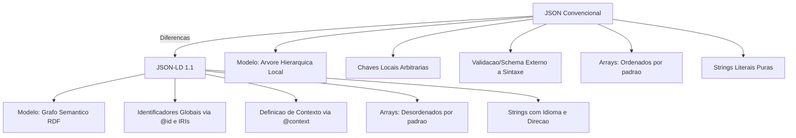

# 1. conceitos gerais

| conceito        | definição | valores |     |
| --------------- | --------- | ------- | --- |
| dominio         |           |         |     |
| repositorio     |           |         |     |
| artefato        |           |         |     |
| arquitetura     |           |         |     |
| modelo          |           |         |     |
| system          |           |         |     |
| bloco funcional |           |         |     |

- **conceito**: repositorio 
	- **definição**: 
- **conceito**: arquitetura de repositorio 
	- **definição**: pasta agrupadora, por assuntos, por tipos de artefatos, por camada do acervo 
	- **camadas/zonas do acervo**: 
		- frequência de consulta [do, system, km, mem]
		- agrupamento de assuntos 
	- **componentes**: folder 
		- **finalidade**:  [do, system, km, mem] 
		- **componentes**: artefato 
- **conceito**: dominio 
	- **definição**: área de conhecimento, assunto, ~~camada/zona cognitiva~~, abrangência ~~de aplicação~~ 
		- abrangência no projeto [acima, ...]
	- **valores**: 
		- conceitos 
			- **definição**: 
			- **valores**:
				- software engineering 
					- ontologia 
					- mbse 
		- conceitos aplicados 
		- regras [kb, software, agents, system models]
- modelo 
- projeto 
- system 
- bloco functional 

# 2. arquitetura modelo dos repositorios 
- repos [repo_type, repo_URI, root, folder_type, rel_folder_path, file_name] 
- repo_type [local/web, public/private, direct/api] 
- artifact type [doc, data, code, midia] 
- artifact purpose [business,  system] 
- ciclo de vida [permanente, temporário, por projeto] 
- destino após desativação 
- `systems^root` ~~scripts^root~~ 
	- `main^system_name` 
	- `dev^proj_name`  
		- system_name_version ⟶ `main^system_name`
			- src 
			- data
			- .docs 
				- spec_version (current) 
		- docs ⟷ `obsidian^systems^dev^proj_name^docs`
			- sessions 
				- session data 
			- gsd-planning 
			- `spec^system_name` 
				- spec_version (current copy) 
				- spec_version (next) 
				- spec_version (updated) ⟶ `main^system_name^docs` 
			- kb ⟶ `obsidian^km^systems_kb`
				- domain- [conceitos, conceitos aplicados, regras sobre kb, regras sobre software, regras sobre agents, regras sobre system models] version 
			- agents_version ⟶ `obsidian^km^systems_agents`
				- agents data
- pkm 
- obsidian
	- `systems^dev^proj_name^docs` 
	- `km^systems_kb`
	- `km^systems_agents`
- repo name = URI 
- [required] README.md
- frontmatter 
	- OKF-title = repository-description 
	- (+) frontmatter especifico conforme title 
- body 

# 3. ontologia para repositorios 
|[[01-conceitos_software_ontologia|conceitos ontologia]]|
|[[01-conceitos_software_ontologia#5.1. pipeline|ontology pipeline]]|

## 3.1. Template Unificado (Modelo Mestre)

| Nome da Coluna                   | Descrição Técnica (Mapeamento JSON-LD)                          | Exemplo de Preenchimento                  |
| -------------------------------- | --------------------------------------------------------------- | ----------------------------------------- |
| ID do Conceito                   | O identificador único local do termo/classe.                    | `TAX_030`                                 |
| Prefixo / Namespace              | Onde o termo reside (geralmente mapeado no `@context`).         | `ex:`                                     |
| Tipo Semântico                   | Se o termo comporta-se como Conceito, Classe ou ambos.          | `["skos:Concept", "owl:Class"]`           |
| Termo Preferido (prefLabel)      | Nome oficial do conceito/classe.                                | `Cachorro`                                |
| Idioma                           | Código ISO do idioma da string.                                 | `pt`                                      |
| Sinônimos (altLabel)             | Termos alternativos separados por vírgula (vira Array no JSON). | `Cão, Canino`                             |
| Definição (definition)           | Significado exato para humanos e sistemas.                      | `Mamífero doméstico da família canídeos.` |
| Termo Pai (broader / subClassOf) | ID do conceito mais amplo ou classe pai.                        | `TAX_020`                                 |
| Propriedade Associada            | Propriedade OWL vinculada a esta classe (se houver).            | `ex:temDono`                              |
| Tipo de Propriedade              | Tipo da relação OWL (`ObjectProperty` ou `DatatypeProperty`).   | `owl:ObjectProperty`                      |
| Domínio (Domain)                 | Quem possui a propriedade (geralmente o próprio ID).            | `TAX_030`                                 |
| Contradomínio (Range)            | O tipo de dado ou classe que responde à propriedade.            | `ex:Pessoa`                               |
| Restrição / Cardinalidade        | Regra lógica de negócio aplicada à propriedade.                 | `owl:maxCardinality 1`                    |

## 3.2. vocabulario


| ID do Conceito | Prefixo / Namespace | Tipo Semântico | ==prefLabel== | Idioma | altLabel | definition | subClassOf | Propriedade Associada | Tipo de Propriedade | Domain | Range | Cardinalidade |
| -------------- | ------------------- | -------------- | ------------- | ------ | -------- | ---------- | ---------- | --------------------- | ------------------- | ------ | ----- | ------------- |
|                |                     |                |               |        |          |            |            |                       |                     |        |       |               |


- repositorio
	- identificação [tipo, URI] 
- pasta 
	- dominio 
	- identificação [path]
- arquivo 
	- path, tipo
	- metadados 

## 3.3. taxonomia para repositorios 

- identificação
- proveniencia
- relacionamento
- persistência [documentos, seções/endereços/labels, relacionamentos, dados]
- versionamento + historico [decisão, alternativas consideradas, justificativa, consequência, elementos afetados]
- validação
- classification scheme 
- subject heading 

### 3.3.1. conforme o objetivo da análise 

#### 3.3.1.1. Taxonomia por Escopo e Tipo de Conteúdo
Classifica o repositório pelo tipo de artefato ou nível de abstração que ele gerencia:
- **Repositório de Código-Fonte (VCS)**: Armazena o código bruto, histórico de commits e ramificações (branches). Exemplos: repositórios Git/GitHub e GitLab.
- **Repositório de Artefatos / Binários (Package Registry)**: Armazena pacotes compilados prontos para distribuição ou deploy. Exemplos: npm (JavaScript), Maven (Java), PyPI (Python) e Docker registries (como o Docker Hub).
- **Repositório de Modelos e Conhecimento**: Armazena documentação, diagramas de arquitetura, requisitos e ontologias do projeto.

#### 3.3.1.2. Taxonomia por Arquitetura de Distribuição
Define como os dados do repositório são armazenados e sincronizados entre os desenvolvedores:
- **Centralizado (CVCS)**: Existe apenas uma cópia mestre do repositório em um servidor central. Os desenvolvedores fazem o checkout de arquivos isolados. Exemplos: Subversion (SVN), Perforce.
- **Distribuído (DVCS)**: Cada desenvolvedor possui um clone completo do repositório em sua máquina local, incluindo todo o histórico de alterações. Exemplos: Git, Mercurial.

#### 3.3.1.3. Facetas de Classificação (Mineração de Repositórios de Software - MSR)
Em pesquisas acadêmicas e análises de ecossistemas (como o mapeamento automatizado de repositórios), adota-se uma taxonomia baseada em facetas:

| Faceta                           | Conceito / Atributos Classificados                                                                                                                        |
| -------------------------------- | --------------------------------------------------------------------------------------------------------------------------------------------------------- |
| **Domínio da Aplicação**         | Identifica a finalidade do software armazenado (ex: utilitários, frameworks, ferramentas de desenvolvimento, aplicações de pesquisa).                     |
| **Atividade de Desenvolvimento** | Categoriza o repositório pelo seu status de manutenção (ex: ativo, inativo/arquivado, incubação, espelho/mirror).                                         |
| **Modelo de Licenciamento**      | Classifica de acordo com as permissões legais do repositório (ex: Open Source - MIT, GPL, Apache; Propriatário; InnerSource).                             |
| **Estilo Arquitetural**          | Agrupa os repositórios pelo formato do código (ex: Monorepo — múltiplas aplicações em um único repositório; Polyrepo — um repositório por microsserviço). |

#### 3.3.1.4. Abordagens de Classificação Automatizada
Para lidar com a escala de milhões de repositórios públicos, a engenharia de software moderna utiliza técnicas automatizadas para derivar taxonomias e tags dinâmicas:
- **Topic Modeling (LDA)**: Agrupamento baseado nas palavras-chave encontradas nos arquivos README.md ou descrições dos projetos.
- **Taxonomia baseada em Tags**: Uso de estruturas hierárquicas extraídas de plataformas comunitárias como o Stack Overflow ou metadados de pacotes (como CodeMeta) para taguear automaticamente os repositórios


### 3.3.2. conforme a camada de abstração 
considerada (arquitetura de código, controle de versão, distribuição de pacotes ou ecossistema de dados).

#### 3.3.2.1. Visão de Controle de Versão e Estrutura de Código (VCS / SCM)

Refere-se à forma como o código-fonte e o histórico do projeto são organizados no sistema de controle de versão (como Git).
- **Monorepo (Monolithic Repository):** Um único repositório contém o código-fonte de múltiplos projetos, serviços ou bibliotecas interdependentes. Facilita o refatoramento atômico e o compartilhamento de código.
- **Polyrepo / Multirepo:** Cada serviço, aplicação ou biblioteca possui seu próprio repositório isolado. Promove forte autonomia entre equipes e deploys independentes.
- **Meta-repository (Monorepo Virtual):** Uso de ferramentas (como Git Submodules ou Google repo) para agrupar múltiplos repositórios distintos em um repositório central unificado.

#### 3.3.2.2. Visão do Padrão de Projeto de Software (Design Patterns & DDD)

Refere-se à camada de persistência e acesso a dados dentro da arquitetura do software (ex.: Clean Architecture, DDD).
- **Repository Pattern (Martin Fowler / DDD):** Uma abstração que simula uma coleção em memória para gerenciar entidades de domínio, isolando a regra de negócio da lógica de banco de dados (SQL, NoSQL, ORM).
    - **Read/Write Repository (CQRS):** Separação clara entre repositórios focados em consulta (_Query_) e repositórios focados em mutação (_Command_).
    - **Generic Repository:** Implementação com métodos reutilizáveis de CRUD para qualquer entidade.

#### 3.3.2.3. Visão do Estilo Arquitetural de Sistemas (Architectural Styles)

A classificação abaixo destaca como componentes do sistema interagem com uma fonte centralizada de dados mantida na memória ou em disco.

![[260819-modelo_repositorios-01.webp]]

- **Blackboard Architecture:** Vários subsistemas especializados (especialistas) trabalham de forma independente e assíncrona sobre um repositório comum (_blackboard_) para resolver um problema complexo gradualmente.
- **Database-Centric / Data-Driven Architecture:** A aplicação é construída em torno de um repositório central de dados permanente, acessado por múltiplos componentes independentes.

#### 3.3.2.4. Visão de Ecossistema e Gestão de Artefatos

Classificação dos repositórios utilizados no ciclo de integração e implantação (CI/CD):
- **Source Code Repository:** GitHub, GitLab, Bitbucket.
- **Artifact / Binary Repository:** Nexus, JFrog Artifactory, Docker Hub. Armazenam artefatos compilados, imagens de contêineres e pacotes prontos para execução.
- **Package Repository:** npm, PyPI, Pub.dev, NuGet. Repositórios públicos ou privados voltados à distribuição de dependências e bibliotecas reutilizáveis.
- **MSR (Mining Software Repositories):** Área da engenharia de software voltada para análise estatística e extração de dados sobre o histórico de comits, _pull requests_ e problemas (_issues_).


# 4. modelo para repositorios de documentos `kb` tipo OKF
- onde é encontrado: repositorios com tipo conteudo [documentos] e tipo dominio: [conhecimento conceitual, conhecimento aplicado, regras sobre kb concepts, regras sobre codificação, regras sobre agent pipelines, system models]
## 4.1. modelo geral
-  frontmatter 
	- [required] OKF 
		- **type** = tipo de dominio
		- **title** = lista de strings de outros repositorios relacionados, com ou sem hierarquia, sendo a última string da lista o título do concept propriamente dito
		- **description**: A single sentence summarizing the concept. Used by `index.md` generators, search snippets, and previews.
		- **resource**: A URI that uniquely identifies the underlying asset the concept describes. Absent for concepts that describe abstract ideas rather than physical resources.
		- **tags**: A YAML list of short strings for cross-cutting categorization.
	- [optional] especifico, conforme o titulo 
		- para título padronizado "**repository-description**"
			- valor inferido do `resource`
				- tipo URI: [local file system,  local server, cloud storage (onedrive, gdrive), cloud server, cloud host, github] 
				- persistência: [sistema, permanente, projeto, temporario] 
			- valor conforme regras: 
				- tipo conteudo: [documentos, dados, codigos, hibrido]
				- repository version
- body 
	- headings 
	- links externos 
	- links internos obsidian 
	- taxonomia relacionamentos/ edges 

## 4.2. modelo especifico para INDEX.md
### 4.2.1. modelo especifico para INDEX.md na pasta raiz `docs^kb`
## 4.3. modelo especifico para README.md
### 4.3.1. modelo especifico para README.md na pasta raiz `docs^kb`

# 5. demais modelos
## 5.1. modelo para repositorios de documentos `agents`
## 5.2. modelo para repositorios de documentos `spec`
## 5.3. modelo para repositorios de documentos `gsd-planning`
## 5.4. modelo para repositorios de documentos `sessions`
## 5.5. modelo para repositorios de dados
### 5.5.1. KG - Knowledge Graph
[[01-conceitos_software_se#7. Knowledge Graph|conceitos KG]]

## 5.6. modelo para repositorios de codigos

# 6. Análise de Formatos de Documentos para Agentes de IA

## 6.1. Introdução e Contexto (A Interseção entre OWS e Agentes de IA)
A construção de um **Sistema de Gestão de Conhecimento (KMS)** para agentes de IA de codificação (como *coding assistants*, *autonomous dev agents*) exige a transição de dados não estruturados para representações semânticas. É aqui que os **OWS (Web Ontology Systems / Sistemas de Ontologia Web)** e os **Knowledge Graphs (Grafos de Conhecimento)** entram em cena.

Agentes de IA "leem" documentos de duas formas distintas:
1. **Leitura Estocástica (LLM/Attention):** O modelo processa o texto como tokens, inferindo significado baseado em padrões (usado em Markdown).
2. **Leitura Determinística (Parser/AST):** O agente usa ferramentas para extrair dados exatos de estruturas rígidas (usado em JSON, XML).

Para modelar um KMS robusto, precisamos entender como os formatos de serialização (`.md`, `.xml`, `.json`, `.yaml`, `.toml`) se comportam sob a ótica da IA e como eles podem ser mapeados para ontologias (padrões OWS como RDF, OWL, JSON-LD).


## 6.2. Análise dos Formatos sob os Critérios Definidos

### 6.2.1. Markdown (`.md`)
O Markdown é a linguagem franca da documentação e do *prompt engineering*.
*   **1. Facilidade/Aptidão para leitura:** **Excepcional**. LLMs são massivamente treinados em Markdown. A IA compreende intuitivamente a hierarquia (headers), listas e blocos de código.
*   **2. Acuracidade/Precisão:** **Baixa a Média**. A leitura é semântica, não estrutural. A IA pode "alucinar" a relação entre dois tópicos se o texto for ambíguo. Não há garantia de integridade de dados.
*   **3. Características de sintaxe:** Baseada em texto puro com marcações leves (`#`, `*`, ```). A falta de fechamento rígido (como tags) torna a tokenização muito eficiente (baixo custo de contexto).
*   **4. Recursos para Knowledge Graphs (OWS):** **Fraco nativamente, mas excelente para metadados**. Não suporta grafos nativamente, mas é o melhor formato para embutir grafos visuais (via *Mermaid.js*) ou criar "Wikilinks" (`[[Entidade]]`) que agentes podem usar para indexar conexões conceituais.

### 6.2.2. YAML (`.yaml`)
Muito comum em configuração (Kubernetes, CI/CD) e documentação estruturada (OpenAPI/Swagger).
*   **1. Facilidade/Aptidão para leitura:** **Alta**. Mais legível para humanos e IAs do que JSON, pois remove a "poluição" visual de chaves e aspas.
*   **2. Acuracidade/Precisão:** **Média/Alta**. A precisão é alta, mas a **sensibilidade a espaços em branco (indentação)** é uma armadilha. Um erro de indentação gerado pela IA quebra o parser, causando falhas silenciosas ou erros de compilação no agente.
*   **3. Características de sintaxe:** Baseada em indentação e hífens. Permite anotações e referências (âncoras), o que economiza tokens.
*   **4. Recursos para Knowledge Graphs (OWS):** **Muito Bom**. YAML é frequentemente usado como uma sintaxe alternativa para RDF (RDF/YAML). É ideal para definir *schemas* de ontologias (classes e propriedades) de forma hierárquica.

ver tambem [YAML-LD specifications](https://w3c.github.io/yaml-ld/), [YAML-LD github](https://github.com/w3c/yaml-ld/)

### 6.2.3. TOML (`.toml`)
Formato de configuração focado em ser minimalista e mapear diretamente para dicionários/hash maps.
*   **1. Facilidade/Aptidão para leitura:** **Média/Alta**. Muito limpo, mas a IA o lê mais como um arquivo de configuração de estado do que como um documento de conhecimento.
*   **2. Acuracidade/Precisão:** **Alta**. Estrutura rígida, tipagem forte (datas, inteiros, strings).
*   **3. Características de sintaxe:** Baseado em seções `[secao]` e pares `chave = valor`. Não lida bem com hierarquias profundas ou listas complexas de objetos.
*   **4. Recursos para Knowledge Graphs (OWS):** **Fraco**. A falta de suporte nativo a hierarquias profundas e aninhamentos complexos o torna inadequado para modelagem de grafos de conhecimento ou ontologias.

### 6.2.4. XML (`.xml`)
O formato clássico de documentos estruturados e base de sistemas OWS tradicionais.
*   **1. Facilidade/Aptidão para leitura:** **Média**. IAs entendem XML perfeitamente, mas a leitura é "cansativa" em termos de janela de contexto devido à verbosidade das tags de fechamento.
*   **2. Acuracidade/Precisão:** **Extrema**. Com validação via XSD (XML Schema Definition), a precisão é absoluta. A IA sabe exatamente o que é um atributo e o que é um nó.
*   **3. Características de sintaxe:** Tags aninhadas. Extremamente rígido. Gera um *overhead* de tokens muito alto (ex: `<relation>...</relation>` gasta muitos tokens apenas para dizer "relação").
*   **4. Recursos para Knowledge Graphs (OWS):** **O Padrão Ouro (RDF/XML, OWL/XML)**. A Web Semântica (OWS) foi construída sobre XML. É o melhor formato para definir ontologias complexas, restrições de classes e inferências lógicas.

### 6.2.5. JSON (`.json`)
O formato nativo da web e das APIs, base fundamental para a serialização de ontologias modernas.
*   **1. Facilidade/Aptidão para leitura:** **Alta**. Agentes de IA possuem *function calling* e *tool use* nativos baseados em JSON. A IA lê JSON como uma árvore lógica de objetos.
*   **2. Acuracidade/Precisão:** **Muito Alta**. A sintaxe é determinística. Um parser de JSON não falha se o schema for respeitado. A IA não "inventa" chaves ou tipos de dados.
*   **3. Características de sintaxe:** Uso intensivo de aspas, chaves e colchetes. **Ponto negativo:** É verboso e consome muitos tokens (ruído sintático), o que pode saturar a janela de contexto do agente.
*   **4. Recursos para Knowledge Graphs (OWS):** **Excelente**. O **JSON-LD** é o padrão W3C para vincular dados na web como grafos. Pares de chave-valor mapeiam perfeitamente para triplas RDF (Sujeito-Predicado-Objeto).
### 6.2.6. JSON-LD (diferencas para JSON)

#### 6.2.6.1. Conceito e Proposito
O JSON convencional e projetado prioritariamente como um formato leve de intercambio de dados e mensagens entre sistemas, focado na simplicidade e na facilidade de leitura humana [1, 22]. No entanto, ao integrar dados provenientes de fontes distintas, chaves identicas em documentos JSON diferentes podem entrar em conflito e gerar ambiguidades de interpretacao [22]. Alem disso, o JSON tradicional carece de suporte nativo para hiperlinks ou identificadores globais, dificultando a interconexao de recursos distribuídos na Web [22].

O JSON-LD (JSON-based Linked Data) foi desenvolvido como um formato semantico totalmente compatível com o JSON convencional [1, 3]. Ele funciona como uma extensao que permite que sistemas e interpretadores JSON ja existentes compreendam dados estructurados como Linked Data (Dados Conectados) com o minimo de alteracoes, oferecendo um caminho suave de atualizacao de infraestrutura [1, 3, 9].

#### 6.2.6.2. Modelo de Dados e Topologia
O JSON tradicional organiza os dados em uma estrutura de arvore hierarquica puramente local, composta por elementos sintaticos especificos: objetos (mapas relacionando chaves a valores), arrays (colecoes ordenadas), strings, numeros, valores booleanos e nulos [12, 40].

O JSON-LD estende essa base sintatica de forma a representar o ==modelo de dados RDF== (Resource Description Framework), que descreve grafos direcionados rotulados [12, 213, 214]:
* Nos do Grafo: Sao recursos (que podem ser identificados globalmente por IRIs ou de forma local por identificadores de nos em branco/blank nodes) ou valores literais [10, 11, 214].
* Arestas Direcionadas: Sao as conexoes ou propriedades do grafo, sempre representadas por chaves que se expandem para IRIs globais [10, 214].
* Grafos Nomeados e Default Graph: Permite empacotar multiplos grafos (rotulados com um nome/IRI especifico) juntamente com um grafo padrao desprovido de nome em um único documento ou conjunto de dados [165, 214].

#### 6.2.6.3. padrão IRI
Com base na especificação da [RFC 3987](https://www.rfc-editor.org/info/rfc3987/), o funcionamento estrutural dos **IRIs (Internationalized Resource Identifiers)**, juntamente com as regras normativas e exemplos práticos para converter URIs legados em IRIs, está detalhado a seguir:

##### 6.2.6.3.1. A Sintaxe Geral do IRI

- **Extensão de Caracteres**: A sintaxe do IRI estende diretamente a definição de URI estabelecida na RFC 3986, expandindo a classe de caracteres **não reservados (unreserved)** para incluir os caracteres do **UCS (Universal Character Set)** acima de `U+007F`.
- **Uso de Delimitadores**: Caracteres fora do repertório US-ASCII pertencem à categoria `iunreserved` e **não são reservados**. Portanto, eles **não podem** ser adotados para fins sintáticos de delimitação de componentes em novos esquemas (por exemplo, o caractere `U+00A2` não pode delimitar componentes).
- **Estrutura de Componentes**: O formato aceita esquemas idênticos aos de URIs, mas introduz equivalentes internacionalizados para as subpartes (como `iauthority`, `iuserinfo`, `ihost`, `ireg-name`, `ipath`, `iquery` e `ifragment`).


##### 6.2.6.3.2. Regras de Conversão de URIs Legados para IRIs

A conversão de um URI convencional para um IRI visa remover as codificações percentuais (_percent-encodings_) sempre que possível, transformando-as nos caracteres nativos legíveis. O processo normativo exige a execução estrita dos seguintes passos:

1. **Representação**: Representar o URI original como uma sequência de octetos em US-ASCII.
2. **Decodificação de Percent-Encoding**: Converter todas as sequências `%HH` (onde HH são dois dígitos hexadecimais) para os seus respectivos octetos, **exceto** aquelas correspondentes ao próprio caractere `%`, a caracteres na categoria de reservados (`reserved`) ou a caracteres US-ASCII que não são permitidos em URIs.
3. **Validação de UTF-8**: Analisar os octetos resultantes do passo 2. Qualquer octeto ou sequência de octetos que **não represente** uma sequência de codificação UTF-8 estritamente válida deve ser **re-percent-encodada**.
4. **Filtro de Caracteres Proibidos**: Analisar os caracteres gerados em UTF-8. Se algum caractere resultante for inadequado para exibição direta em um IRI (como caracteres de controle bidirecional invisíveis ou caracteres excluídos por segurança), ele deve ser **re-percent-encodado**.
5. **Interpretação**: Interpretar a sequência de octetos final resultante como uma string de caracteres codificada em **UTF-8**.

**Regra de Ouro**: As conversões de URIs para IRIs **nunca devem utilizar qualquer outra codificação de caracteres que não seja o UTF-8** nos passos 3 e 4. Mesmo que o contexto permita deduzir que o URI original usava outra codificação (como ISO-8859-1), a conversão direta para caracteres é proibida para evitar que o IRI resultante seja mapeado de volta para um URI diferente do original.


##### 6.2.6.3.3. Exemplos Práticos de Conversão (URI \(\rightarrow\) IRI)

###### 6.2.6.3.3.1. Exemplo 1: Conversão Bem-Sucedida de Caractere Internacional

- **URI Original**: `http://www.example.org/D%C3%BCrst`
- **Processamento**: A sequência `%C3%BC` é convertida para os octetos `<c3><bc>`. Como essa sequência é um UTF-8 válido e seguro, ela é mantida e interpretada como o caractere `U+00FC` (letra minúscula `ü` com trema).
- **IRI Resultante**: `http://www.example.org/Dürst` (representado em XML como `http://www.example.org/D&#xFC;rst`).

###### 6.2.6.3.3.2. Exemplo 2: Bloqueio de Codificação Não-UTF-8

- **URI Original**: `http://www.example.org/D%FCrst`
- **Processamento**: O termo `%FC` é convertido para o octeto `<fc>`. Embora o octeto `<fc>` represente a letra `ü` na codificação legada ISO-8859-1, ele **não é** um padrão UTF-8 válido. Por segurança e para evitar incompatibilidades futuras de mapeamento, o octeto é re-percent-encodado de volta ao formato original.
- **IRI Resultante**: `http://www.example.org/D%FCrst` (permanece inalterado).

###### 6.2.6.3.3.3. Exemplo 3: Tratamento de Caractere de Controle Proibido e Domínio Punycode

- **URI Original**: `http://xn--99zt52a.example.org/%e2%80%ae`
- **Processamento**: A sequência `%e2%80%ae` representa o caractere de controle de texto bidirecional `U+202E` (_Right-to-Left Override_). Por regras de segurança que proíbem o uso direto desse caractere em IRIs, ele é re-percent-encodado (preferencialmente em letras maiúsculas). O domínio em Punycode `xn--99zt52a` pode opcionalmente ser convertido para caracteres normativos por sistemas com conhecimento de esquema.
- **IRI Resultante**: `http://納豆.example.org/%E2%80%AE` (onde `xn--99zt52a` é convertido para os caracteres japoneses de "Natto": `U+7D0D` e `U+8C46`).


##### 6.2.6.3.4. Mapeamento Inverso (IRI \(\rightarrow\) URI)

Para que os sistemas legados de recuperação de dados funcionem, os IRIs são mapeados de volta para URIs aplicando a operação inversa:

1. Os caracteres lógicos do IRI são representados e normalizados em formato **NFC** (Normalization Form C), a menos que já estejam em uma codificação baseada em Unicode.
2. Cada caractere estendido (`ucschar` ou `iprivate`) é convertido em octetos usando **UTF-8**.
3. Cada octeto resultante é codificado usando o padrão de escape percentual **`%HH`** (usando preferencialmente letras maiúsculas para reduzir a variabilidade).

Se o esquema utilizar nomes de domínio, o componente `ireg-name` pode ser opcionalmente convertido usando a operação **ToASCII** (IDNA), substituindo rótulos internacionalizados por sequências compatíveis iniciadas com `xn--` para maximizar a interoperabilidade.


#### 6.2.6.4. Sintaxe e Restricoes de Chaves
Enquanto o JSON convencional e muito flexivel quanto a duplicidade de chaves (variando o comportamento conforme a biblioteca ou linguagem que o processa), o JSON-LD aplica regras gramaticais estritas:
* Unicidade Absoluta: Em contraste com o JSON comum, as chaves em objetos JSON-LD devem ser estritamente unicas [219].
* Sensibilidade a Letras: Todas as chaves, palavras-chave e valores em JSON-LD sao estritamente sensiveis a maiusculas e minúsculas [20].
* ==Chaves sem Significado Semantico==: Qualquer chave JSON que nao possa ser mapeada para uma IRI valida através do contexto ativo, ou que nao seja uma palavra-chave reservada, e ==completamente desconsiderada no processamento semantico do grafo==, embora permaneca intacta na sintaxe do arquivo [36, 216].

#### 6.2.6.5. Palavras-Chave Reservadas
O JSON-LD introduz um conjunto de ==chaves sintaticas especiais== denominadas keywords, obrigatoriamente precedidas pelo caractere `@` [13, 221]. O JSON tradicional nao possui chaves reservadas com esta notacao ou significado especial. As principais keywords que diferenciam o processamento do JSON-LD sao:
* `@context`: Define os termos locais e atalhos utilizados no documento, mapeando-os para IRIs de vocabularios compartilhados [13, 26, 27].
* `@id`: Define de forma exclusiva o identificador global (IRI ou blank node) do no que esta sendo descrito [14, 38].
* `@type`: Define a classificacao semantica de um no ou o tipo de dado de um valor literal [15, 96, 99].
* `@value`: Especifica o dado bruto associado a um determinado literal do grafo [14].
* `@language` e `@direction`: Permitem a internacionalizacao de strings, associando tags de idioma (BCP47) e direcao de leitura ("ltr" ou "rtl") [14, 15, 112, 115].
* `@container`, `@list` e `@set`: Controlam como colecoes de dados devem ser estruturadas e interpretadas [15, 16, 121, 126].
* `@nest`: Agrupa chaves relacionadas sob um objeto intermediario por conveniencia de APIs comuns, instruindo o processador semantico a ignorar esse aninhamento e ler as chaves como propriedades diretas do no [17, 129, 130].
* `@json`: Declara que o valor de uma propriedade e um literal JSON puro, contendo dados que nao devem ser interpretados como grafos ou triplas semanticas [19, 101, 102].

##### 6.2.6.5.1. lista completa

Com base na especificação **JSON-LD 1.1**, a lista completa de **palavras-chave reservadas** (tokens de sintaxe que iniciam com `@`) encontradas na fonte para complementar a sua síntese é detalhada a seguir:

###### 6.2.6.5.1.1. Palavras-Chave de Uso Geral e Contexto
*   **`@base`**: Define o **IRI base** para a resolução de referências de IRI relativo no documento [1, 2].
*   **`@container`**: Define o **tipo de contêiner padrão** para um termo, permitindo organizar valores como `@list`, `@set`, `@language`, `@index`, `@id`, `@graph` ou `@type` [3, 4].
*   **`@context`**: Define o **contexto local** que mapeia nomes curtos (termos) para IRIs e define regras de processamento [5, 6].
*   **`@direction`**: Define a **direção base** para strings ou strings marcadas por idioma (ex: "ltr" ou "rtl") [5, 7, 8].
*   **`@graph`**: Utilizado para expressar um **grafo ou conjunto de grafos nomeados** [6, 9, 10].
*   **`@id`**: Identifica exclusivamente um nó no grafo por meio de um **IRI ou identificador de nó em branco** [11, 12].
*   **`@import`**: Permite carregar e mesclar uma **definição de contexto externa** dentro de outro contexto [13-15].
*   **`@included`**: Define um bloco para incluir **objetos de nó secundários** que podem ser referenciados pelo nó principal [13, 16, 17].
*   **`@index`**: Especifica uma chave usada para **indexar informações** semanticamente neutras em um mapa de índices [1, 18, 19].
*   **`@json`**: Indica que o valor associado deve ser tratado estritamente como um **literal JSON** e não interpretado como JSON-LD [17, 20, 21].
*   **`@language`**: Especifica a **tag de idioma** (conforme BCP47) para uma string ou define o idioma padrão do contexto [11, 19, 22].
*   **`@list`**: Expressa um **conjunto ordenado** de dados (equivalente a uma lista RDF) [1, 8, 23].
*   **`@nest`**: Agrupa propriedades relacionadas em um objeto intermediário que é **semanticamente transparente** para o grafo [9, 24, 25].
*   **`@none`**: Atua como uma **chave de índice especial** para representar a ausência de um valor (ex: em mapas de idioma ou de tipo) [9, 25, 26].
*   **`@prefix`**: Determina se um termo pode ser utilizado como prefixo para construir um **IRI compacto** [9, 27, 28].
*   **`@propagate`**: Controla se as definições de um contexto se **propagam para objetos de nó** subsequentes ou se expiram ao entrar em um novo nó [20, 28, 29].
*   **`@protected`**: Impede que definições de termos em um contexto sejam **substituídas ou removidas** por contextos subsequentes [13, 28, 30].
*   **`@reverse`**: Utilizado para declarar **propriedades inversas** (apontando do objeto para o sujeito) [1, 28, 31].
*   **`@set`**: Expressa um **conjunto não ordenado** e garante que o valor seja sempre representado como um array [1, 32, 33].
*   **`@type`**: Define o **tipo de um nó** (classe) ou o **tipo de dado** de um valor literal [3, 15, 34].
*   **`@value`**: Especifica o **valor bruto** de um objeto de valor (como uma string ou número) no grafo [11, 35].
*   **`@version`**: Define o **modo de processamento** do JSON-LD (ex: 1.1) para habilitar novos recursos [35-37].
*   **`@vocab`**: Estabelece um **prefixo de vocabulário comum** para expandir propriedades e tipos que não possuem mapeamento explícito [9, 17, 38].

###### 6.2.6.5.1.2. Palavras-Chave Específicas de Framing (Enquadramento)
Estas palavras-chave são utilizadas em **objetos de enquadramento** para moldar a saída dos dados [39]:
*   **`@default`**: Fornece um valor padrão caso a propriedade esteja ausente [39].
*   **`@embed`**: Controla como os objetos são incorporados (valores: `@always`, `@once`, `@never`) [39].
*   **`@explicit`**: Determina se apenas as propriedades explicitamente presentes no quadro devem ser incluídas [39].
*   **`@omitDefault`**: Instrui o processador a omitir propriedades que usam valores padrão [39].
*   **`@requireAll`**: Indica que todas as propriedades especificadas no quadro devem estar presentes para que um nó seja selecionado [39].
*   **`@null`**: Usado em padrões de enquadramento para representar valores nulos [39].

**Nota importante**: Todas as chaves, palavras-chave e valores em JSON-LD são **sensíveis a maiúsculas e minúsculas** [13].

#### 6.2.6.6. Comportamento de Arrays e Ordenacao
A nocao de ordenacao de dados e interpretada de formas diametralmente opostas entre os dois formatos:
* Ordenacao Inerente no JSON: No JSON convencional, arrays sao sempre estruturas ordenadas por definicao [118].
* Desordenacao no Grafo JSON-LD: Como os grafos semanticos nao possuem ordem nativa para as ligacoes entre seus nos, os arrays comuns em JSON-LD nao transmitem nenhuma ordenacao por padrao [49, 118].
* Listas Ordenadas Semanticas: Para manter a ordenacao estrita de colecoes no JSON-LD, e obrigatorio utilizar a keyword `@list` ou definir `@container: @list` no contexto [121, 122, 231].
* Forca de Representacao com @set: A definicao `@container: @set` instrui o processador a sempre serializar determinados termos locais na forma de arrays sintaticos (mesmo se contiverem um único elemento), normalizando o processamento por parte de softwares clientes [126, 231].

#### 6.2.6.7. Tratamento de Valores Nulos
O comportamento ao encontrar o token `null` difere drasticamente:
* Significado no JSON: No JSON comum, `null` representa a existencia de uma propriedade cujo valor e nulo ou ausente [40].
* Eliminacao Semantica: No JSON-LD, a presenca de um valor `null` instrui o processador semantico a descartar e remover inteiramente a propriedade ou entrada correspondente do grafo resultante durante a expansao do documento [104, 216].
* Preservacao em Literais: O token `null` so e preservado formalmente na arvore de dados quando a propriedade associada e estritamente tipada com `@type: @json`, caso em que o bloco e considerado um literal estruturado opaco [104].

#### 6.2.6.8. Mapeamento Contextual Transparente
O grande diferencial do JSON-LD e a capacidade de desacoplar os dados brutos de sua interpretacao semantica por meio do `@context` [25].
* O Contexto Semantico: O `@context` permite mapear termos simples (como "name") para URIs robustas (como "http://schema.org/name"), fornecendo desambiguacao sem forcar o desenvolvedor a escrever codigos verbosos [23, 24, 26].
* Coercao Semantica: Strings simples no JSON-LD podem ser coagidas automaticamente pelo contexto para assumirem comportamentos semanticos avancados, como interpretacao direta de tipos de dados ou conversao automatica de chaves para identificadores de recursos (`@id`) [37, 105].
* Integracao com JSON Legado: Sistemas podem passar a consumir documentos JSON comuns ja publicados como se fossem JSON-LD. Isso e alcancado sem editar o arquivo de dados original, simplesmente enviando o cabecalho HTTP Link Header (`rel="http://www.w3.org/ns/json-ld#context"`, `type="application/ld+json"`) apontando para um arquivo de contexto externo [9, 31, 202, 203].

#### 6.2.6.9. Diagrama de Diferencas Sintaticas e Semanticas


## 6.3. Modelagem da Arquitetura para o KMS de Agentes de IA

Para um Sistema de Gestão de Conhecimento voltado para agentes de codificação, **nenhum formato deve ser usado isoladamente**. A arquitetura ideal deve adotar uma abordagem em camadas, inspirada nos princípios de OWS (Separação entre *Schema/Ontologia*, *Dados/Grafo* e *Apresentação/Contexto*).

### 6.3.1. Camada 1: A Ontologia e o Grafo (O "Cérebro" Semântico)
*   **Formato Principal:** **JSON-LD** ou **YAML**.
*   **Função:** Definir as regras do ecossistema de software. Ex: O que é um `Microservico`, como ele se `ComunicaCom` um `BancoDeDados`.
*   **Por que:** Permite que o agente de IA faça *inferência*. Se o agente sabe que `ServicoA` depende de `ServicoB` (via JSON-LD), ele pode deduzir que um *deploy* de A exige validação em B.

### 6.3.2. Camada 2: O Contexto e a Documentação (A "Memória" Narrativa)
*   **Formato Principal:** **Markdown (`.md`)**.
*   **Função:** Manter o *RAG* (Retrieval-Augmented Generation). Decisões de arquitetura (ADRs), comentários de código, e manuais de uso.
*   **Por que:** A IA raciocina melhor em linguagem natural. O Markdown permite que o agente leia a *intenção* por trás do código, não apenas a estrutura.

### 6.3.3. Camada 3: O Estado e a Configuração (A "Execução")
*   **Formato Principal:** **TOML** ou **YAML**.
*   **Função:** Configuração de ambientes, *pipelines* de CI/CD, e metadados de pacotes.
*   **Por que:** Precisão determinística para que o agente de IA possa gerar ou modificar arquivos de infraestrutura sem quebrar a sintaxe.

## 6.4. Tabela Comparativa

| Formato              | 1. Facilidade de Leitura (IA)            | 2. Acuracidade / Precisão                           | 3. Características de Sintaxe (Impacto na IA)                   | 4. Recursos para Knowledge Graphs / OWS                                           | Uso Ideal no KMS para Agentes                                   |
| :------------------- | :--------------------------------------- | :-------------------------------------------------- | :-------------------------------------------------------------- | :-------------------------------------------------------------------------------- | :-------------------------------------------------------------- |
| **Markdown (`.md`)** | 🟢 **Excepcional** (Nativo para LLMs)    | 🔴 **Baixa** (Sujeito a alucinações e ambiguidades) | Leve, tokenização eficiente. Falta de rigidez estrutural.       | 🟡 **Fraco** (Usado apenas para grafos visuais via Mermaid ou links conceituais). | Documentação, ADRs, Prompts de contexto, Comentários.           |
| **JSON (`.json`)**   | 🟢 **Alta** (Nativo para *Tool Use*)     | 🟢 **Muito Alta** (Parsing determinístico)          | Verboso. Alto consumo de tokens devido a aspas e chaves.        | 🟢 **Excelente** (Base do **JSON-LD** e grafos aninhados).                        | Respostas de API, Extração de dados, Definição de nós do Grafo. |
| **YAML (`.yaml`)**   | 🟢 **Alta** (Limpo e hierárquico)        | 🟡 **Média/Alta** (Risco de falha por indentação)   | Sensível a espaços em branco. Excelente para anotações.         | 🟢 **Muito Bom** (Serialização RDF, definição de *Schemas*).                      | Definição de Ontologias, Configuração de Agentes, OpenAPI.      |
| **XML (`.xml`)**     | 🟡 **Média** (Entendível, mas verboso)   | 🟢 **Extrema** (Validação via XSD)                  | Altamente verboso. "Ruído" de tags satura a janela de contexto. | 🟢 **O Padrão** (RDF/XML, OWL - Base da Web Semântica).                           | Intercâmbio de Ontologias complexas, Sistemas Legados.          |
| **TOML (`.toml`)**   | 🟡 **Média** (Foco em config, não texto) | 🟢 **Alta** (Tipagem forte e rígida)                | Minimalista, plano. Ruim para hierarquias profundas.            | 🔴 **Fraco** (Inadequado para modelagem de triplas/grafos).                       | Metadados de pacotes, Configuração de ambiente do Agente.       |


## 6.5. Conclusão e Recomendação Arquitetural

Para modelar um **Sistema de Gestão de Conhecimento (KMS)** que alimente agentes de IA de codificação com base em princípios de **OWS (Ontologias)**:

1.  **Não use XML para o dia a dia do agente:** Embora seja o padrão histórico de OWS (RDF/XML), o custo de tokens e a verbosidade atrapalham a janela de contexto dos LLMs atuais.
2.  **Adote JSON-LD como espinha dorsal do Grafo:** Use JSON (especificamente com anotações `@context` do JSON-LD) para mapear a arquitetura do software (ex: mapear repositórios, dependências, APIs). Isso transforma o código em um Grafo de Conhecimento consultável.
3.  **Use YAML para a "Cola" Semântica:** Utilize YAML para definir os *schemas* das ontologias (as regras do que pode ser conectado ao que) devido à sua legibilidade e suporte a hierarquias.
4.  **Mantenha Markdown como a "Interface Humano-IA":** O agente deve usar Markdown para explicar suas descobertas no grafo, gerar documentação e raciocinar passo-a-passo (Chain-of-Thought).

A combinação **JSON-LD (Grafo/Dados) + YAML (Schema/Regras) + Markdown (Contexto/Raciocínio)** formará a arquitetura mais resiliente, precisa e econômica em termos de tokens para agentes de IA de software.


