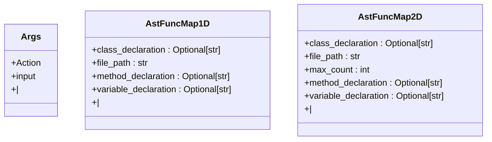
```mermaid
classDiagram
  class Args {
    +Action
    +input
    +|
  }

  class AstFuncMap1D {
    +class_declaration : Optional[str]
    +file_path : str
    +method_declaration : Optional[str]
    +variable_declaration : Optional[str]
    +|
  }

  class AstFuncMap2D {
    +class_declaration : Optional[str]
    +file_path : str
    +max_count : int
    +method_declaration : Optional[str]
    +variable_declaration : Optional[str]
    +|
}
```

aaaaa

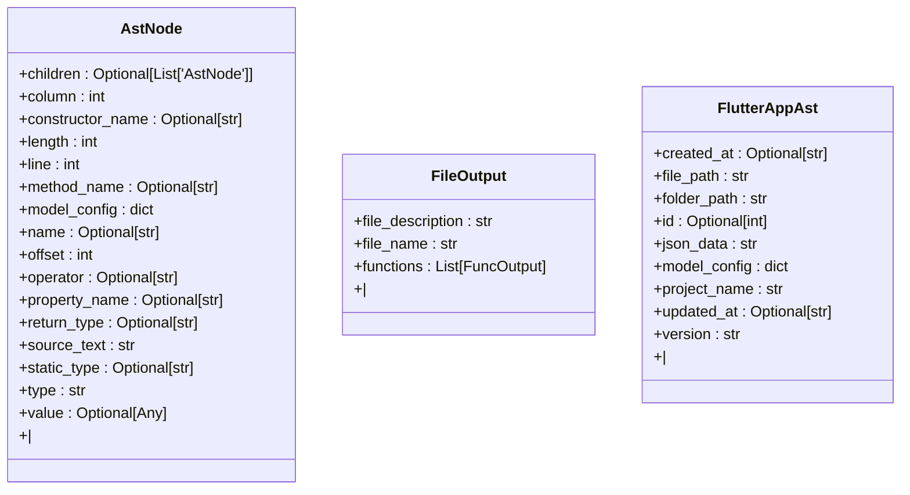
```mermaid
classDiagram

  class AstNode {
    +children : Optional[List['AstNode']]
    +column : int
    +constructor_name : Optional[str]
    +length : int
    +line : int
    +method_name : Optional[str]
    +model_config : dict
    +name : Optional[str]
    +offset : int
    +operator : Optional[str]
    +property_name : Optional[str]
    +return_type : Optional[str]
    +source_text : str
    +static_type : Optional[str]
    +type : str
    +value : Optional[Any]
    +|
  }

  class FileOutput {
    +file_description : str
    +file_name : str
    +functions : List[FuncOutput]
    +|
  }

  class FlutterAppAst {
    +created_at : Optional[str]
    +file_path : str
    +folder_path : str
    +id : Optional[int]
    +json_data : str
    +model_config : dict
    +project_name : str
    +updated_at : Optional[str]
    +version : str
    +|
  }
```

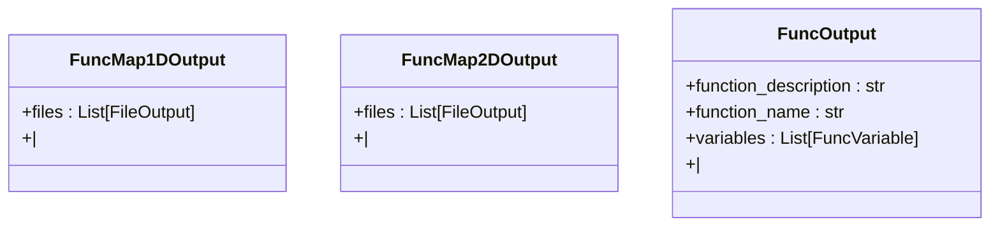
```mermaid
classDiagram
  class FuncMap1DOutput {
    +files : List[FileOutput]
    +|
  }

  class FuncMap2DOutput {
    +files : List[FileOutput]
    +|
  }

  class FuncOutput {
    +function_description : str
    +function_name : str
    +variables : List[FuncVariable]
    +|
  }

```

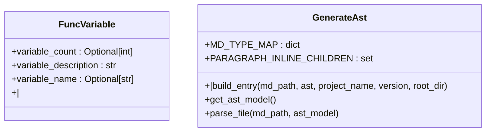
```mermaid
classDiagram
  class FuncVariable {
    +variable_count : Optional[int]
    +variable_description : str
    +variable_name : Optional[str]
    +|
  }


  class GenerateAst {
    +MD_TYPE_MAP : dict
    +PARAGRAPH_INLINE_CHILDREN : set
    +|build_entry(md_path, ast, project_name, version, root_dir)
    +get_ast_model()
    +parse_file(md_path, ast_model)
  }


```

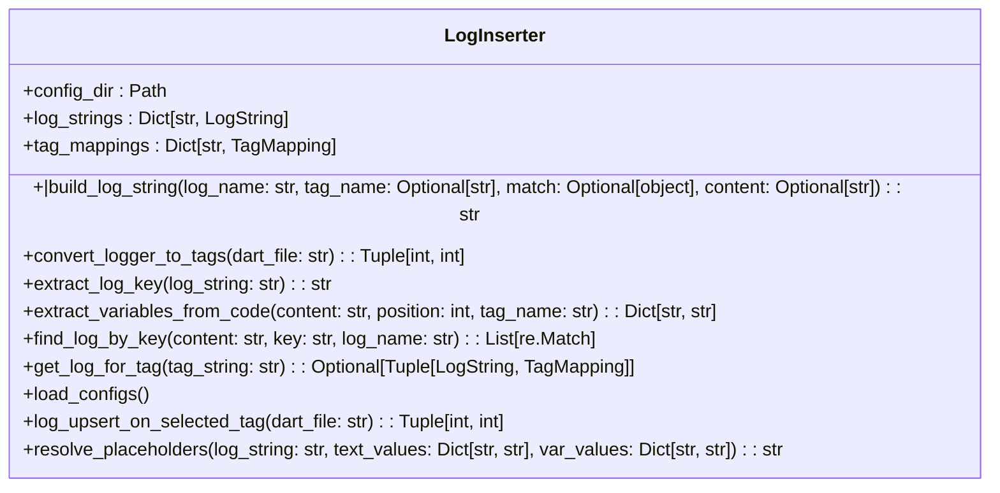
```mermaid
classDiagram
  class LogInserter {
    +config_dir : Path
    +log_strings : Dict[str, LogString]
    +tag_mappings : Dict[str, TagMapping]
    +|build_log_string(log_name: str, tag_name: Optional[str], match: Optional[object], content: Optional[str]): str
    +convert_logger_to_tags(dart_file: str): Tuple[int, int]
    +extract_log_key(log_string: str): str
    +extract_variables_from_code(content: str, position: int, tag_name: str): Dict[str, str]
    +find_log_by_key(content: str, key: str, log_name: str): List[re.Match]
    +get_log_for_tag(tag_string: str): Optional[Tuple[LogString, TagMapping]]
    +load_configs()
    +log_upsert_on_selected_tag(dart_file: str): Tuple[int, int]
    +resolve_placeholders(log_string: str, text_values: Dict[str, str], var_values: Dict[str, str]): str
  }
```

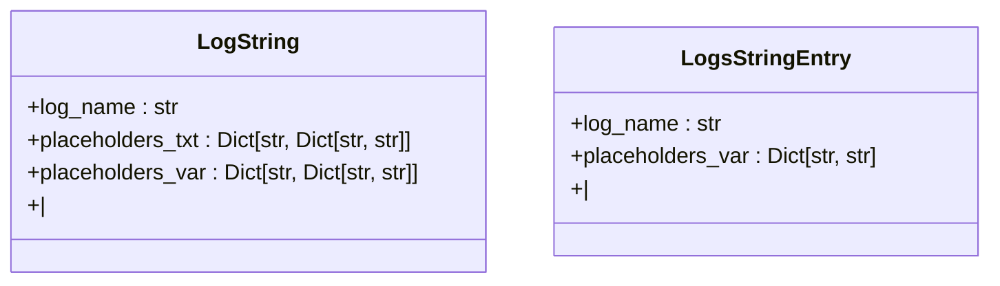
```mermaid
classDiagram

  class LogString {
    +log_name : str
    +placeholders_txt : Dict[str, Dict[str, str]]
    +placeholders_var : Dict[str, Dict[str, str]]
    +|
  }

  class LogsStringEntry {
    +log_name : str
    +placeholders_var : Dict[str, str]
    +|
  }
```

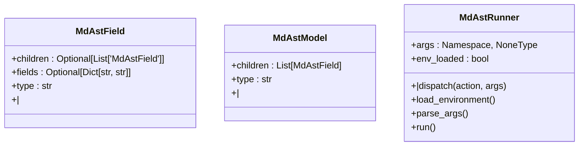
```mermaid
classDiagram
  class MdAstField {
    +children : Optional[List['MdAstField']]
    +fields : Optional[Dict[str, str]]
    +type : str
    +|
  }

  class MdAstModel {
    +children : List[MdAstField]
    +type : str
    +|
  }

  class MdAstRunner {
    +args : Namespace, NoneType
    +env_loaded : bool
    +|dispatch(action, args)
    +load_environment()
    +parse_args()
    +run()
  }

```

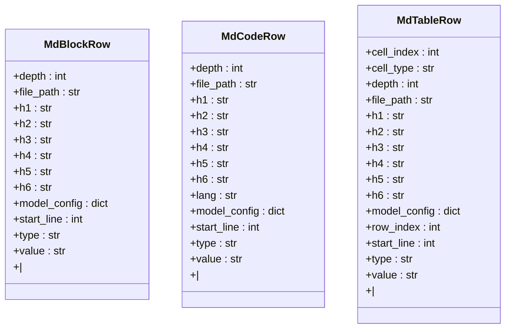
```mermaid
classDiagram
  class MdBlockRow {
    +depth : int
    +file_path : str
    +h1 : str
    +h2 : str
    +h3 : str
    +h4 : str
    +h5 : str
    +h6 : str
    +model_config : dict
    +start_line : int
    +type : str
    +value : str
    +|
  }

  class MdCodeRow {
    +depth : int
    +file_path : str
    +h1 : str
    +h2 : str
    +h3 : str
    +h4 : str
    +h5 : str
    +h6 : str
    +lang : str
    +model_config : dict
    +start_line : int
    +type : str
    +value : str
    +|
  }

  class MdTableRow {
    +cell_index : int
    +cell_type : str
    +depth : int
    +file_path : str
    +h1 : str
    +h2 : str
    +h3 : str
    +h4 : str
    +h5 : str
    +h6 : str
    +model_config : dict
    +row_index : int
    +start_line : int
    +type : str
    +value : str
    +|
  }

```

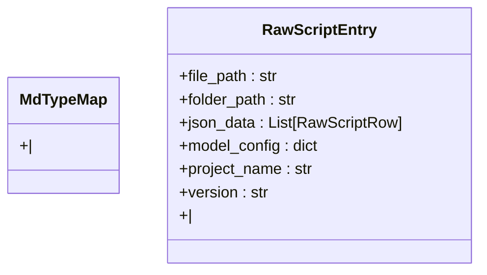
```mermaid
classDiagram
  class MdTypeMap {
    +|
  }

  class RawScriptEntry {
    +file_path : str
    +folder_path : str
    +json_data : List[RawScriptRow]
    +model_config : dict
    +project_name : str
    +version : str
    +|
  }

```

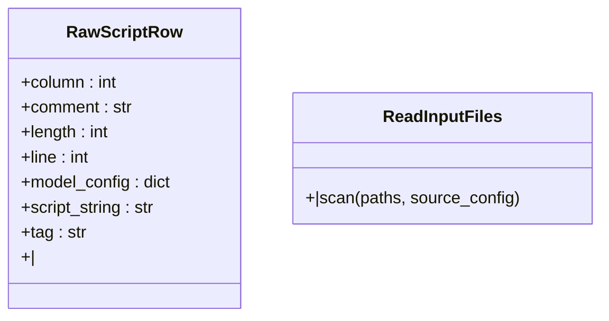
```mermaid
classDiagram
  class RawScriptRow {
    +column : int
    +comment : str
    +length : int
    +line : int
    +model_config : dict
    +script_string : str
    +tag : str
    +|
  }

  class ReadInputFiles {
    +|scan(paths, source_config)
  }
```

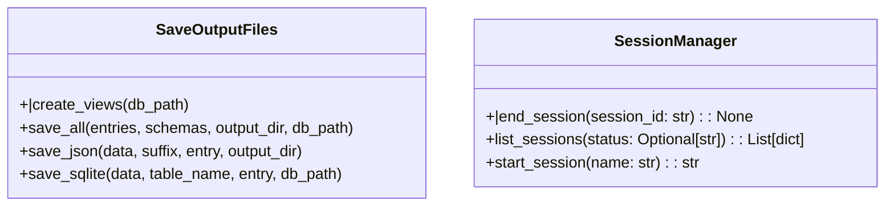
```mermaid
classDiagram
  class SaveOutputFiles {
    +|create_views(db_path)
    +save_all(entries, schemas, output_dir, db_path)
    +save_json(data, suffix, entry, output_dir)
    +save_sqlite(data, table_name, entry, db_path)
  }

  class SessionManager {
    +|end_session(session_id: str): None
    +list_sessions(status: Optional[str]): List[dict]
    +start_session(name: str): str
  }

```

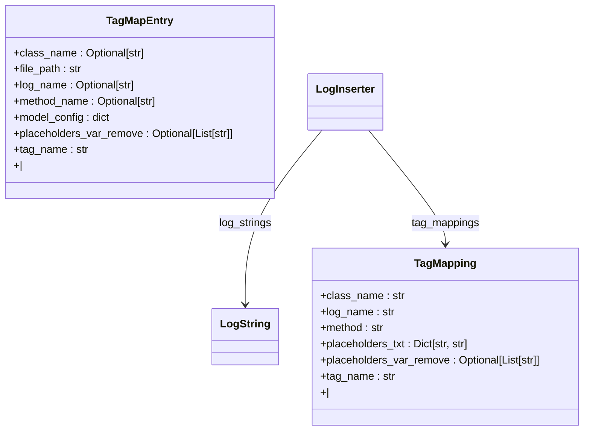
```mermaid
classDiagram
  class TagMapEntry {
    +class_name : Optional[str]
    +file_path : str
    +log_name : Optional[str]
    +method_name : Optional[str]
    +model_config : dict
    +placeholders_var_remove : Optional[List[str]]
    +tag_name : str
    +|
  }

  class TagMapping {
    +class_name : str
    +log_name : str
    +method : str
    +placeholders_txt : Dict[str, str]
    +placeholders_var_remove : Optional[List[str]]
    +tag_name : str
    +|
  }

  LogInserter --> LogString : log_strings

  LogInserter --> TagMapping : tag_mappings
```