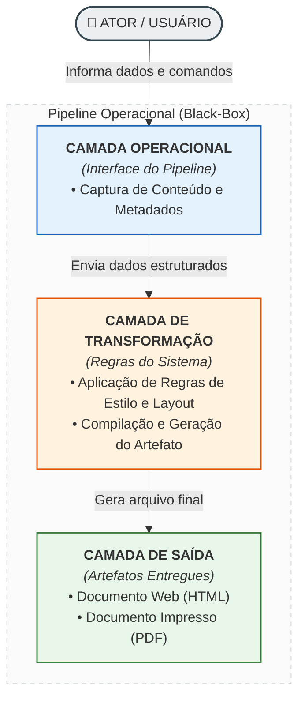
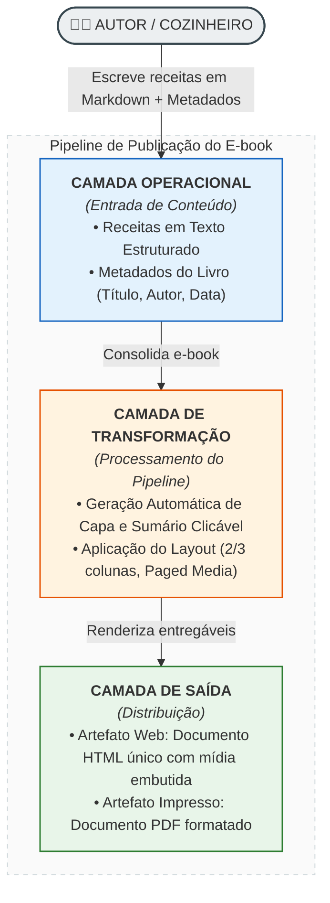

# 1. pipeline preliminar para "pdf build"

Perfeito. Aqui está um projeto **completo, funcional e sem uma linha de LaTeX**: Markdown → Pandoc → HTML+CSS → PDF (WeasyPrint). Colunas, capa, sumário clicável e numeração de página — tudo controlado por um único arquivo CSS.

## 1.1. Estrutura de pastas

```text
minhas-receitas/
│   ebook.css            ← layout do PDF (colunas, capa, sumário)
│   build.ps1            ← script que gera tudo
│
├── receitas/
│   ├── 01-bolo-de-cenoura.md
│   └── 02-pudim-de-leite.md
│
├── imagens/             ← fotos (opcional, etapa 5)
│
└── dist/                ← saída gerada (ebook.pdf, ebook.html)
```

A ordem dos arquivos no PDF segue a numeração dos nomes (`01-`, `02-`...).

---

## 1.2. Instalação (Windows)

```powershell
winget install JohnMacFarlane.Pandoc
pip install weasyprint
```

Teste:

```powershell
pandoc --version
weasyprint --version
```

> Se `weasyprint` não for encontrado, use `python -m weasyprint` no lugar. As versões atuais instalam limpo no Windows, sem GTK.

---

## 1.3. `ebook.css` — o "template" inteiro mora aqui

É este arquivo que substitui o LaTeX. Compare com o Word: `column-count: 2` é literalmente "2 colunas".

```css
/* ================= PÁGINA ================= */
@page {
  size: A4;
  margin: 16mm 14mm 18mm 14mm;

  /* número da página no rodapé */
  @bottom-center {
    content: counter(page);
    font-size: 8pt;
    color: #999;
  }
}

/* sem número na capa */
@page:first {
  @bottom-center { content: none; }
}

/* ================= TIPOGRAFIA ================= */
body {
  font-family: Georgia, "Times New Roman", serif;
  font-size: 10pt;
  line-height: 1.45;
  color: #2b2b2b;
}

/* ================= CAPA =================
   (o Pandoc gera este bloco sozinho a partir
   dos metadados title/subtitle/author/date) */
#title-block-header {
  page-break-after: always;
  text-align: center;
  margin-top: 7cm;
}
#title-block-header .title    { font-size: 32pt; margin: 0 0 6mm 0; color: #8a4b1f; }
#title-block-header .subtitle { font-size: 14pt; color: #c96f2c; margin: 0 0 30mm 0; }
#title-block-header .author   { font-size: 12pt; }
#title-block-header .date     { font-size: 10pt; color: #777; }

/* ================= SUMÁRIO ================= */
nav#TOC {
  page-break-after: always;
}
nav#TOC > h1 {
  font-size: 16pt;
  border-bottom: 2px solid #c96f2c;
  padding-bottom: 2mm;
}
nav#TOC ul { list-style: none; padding-left: 0; }
nav#TOC li { margin: 2.5mm 0; font-size: 11pt; }
nav#TOC a  { color: #2b2b2b; text-decoration: none; }

/* ================= RECEITAS ================= */
.receita {
  page-break-before: always;   /* cada receita em página nova */
}
h1 {
  font-size: 18pt;
  color: #8a4b1f;
  border-bottom: 2px solid #c96f2c;
  padding-bottom: 2mm;
  margin-top: 0;
}
h2 {
  font-size: 12pt;
  color: #c96f2c;
  text-transform: uppercase;
  letter-spacing: 1px;
  margin-top: 6mm;
}

/* faixa de informações (rendimento, tempo...) */
.info {
  background: #faf3ea;
  border-left: 4px solid #c96f2c;
  padding: 3mm 4mm;
  margin: 4mm 0;
  font-size: 9.5pt;
}

/* ============ COLUNAS (o "modo Word") ============ */
.ingredientes {
  column-count: 2;          /* ← duas colunas paralelas */
  column-gap: 8mm;
  column-rule: 0.5pt solid #ddd;   /* linha divisória opcional */
}
.dicas {
  column-count: 3;          /* ← três colunas */
  column-gap: 6mm;
}

/* impede que "Massa" / "Cobertura" sejam cortados entre colunas */
.grupo { break-inside: avoid; margin-bottom: 3mm; }

.ingredientes ul, .dicas ul { margin: 1mm 0; padding-left: 5mm; }

/* imagens e links */
.receita img { width: 100%; margin: 3mm 0; }
a { color: #8a4b1f; text-decoration: none; }
```

---

## 1.4. `receitas/01-bolo-de-cenoura.md`

Repare nos blocos `:::` — são eles que recebem as classes CSS. As cercas de 5, 4 e 3 `:` servem para aninhar blocos (a maior envolve as menores).

	```markdown
	::::: {.receita}
	
	# Bolo de cenoura
	
	::: {.info}
	**Rendimento:** 10 fatias · **Preparo:** 20 min · **Forno:** 40 min · **Dificuldade:** fácil
	:::
	
	## Ingredientes
	
	:::: {.ingredientes}
	
	::: {.grupo}
	**Massa**
	
	- 3 cenouras médias picadas
	- 4 ovos
	- 1 xícara (chá) de óleo
	- 2 xícaras (chá) de açúcar
	- 2 xícaras (chá) de farinha de trigo
	- 1 colher (sopa) de fermento em pó
	:::
	
	::: {.grupo}
	**Cobertura**
	
	- 3 colheres (sopa) de chocolate em pó
	- 1 colher (sopa) de manteiga
	- 4 colheres (sopa) de leite
	- 3 colheres (sopa) de açúcar
	:::
	
	::::
	
	## Modo de preparo
	
	1. Preaqueça o forno a 180 °C e unte uma forma com furo central.
	2. Bata no liquidificador as cenouras, os ovos e o óleo.
	3. Em uma tigela, misture o açúcar e a farinha; junte o conteúdo do liquidificador.
	4. Acrescente o fermento e misture delicadamente.
	5. Asse por cerca de 40 minutos (faça o teste do palito).
	6. Para a cobertura, leve tudo ao fogo baixo até engrossar e espalhe sobre o bolo.
	
	## Dicas
	
	::: {.dicas}
	
	- Não abra o forno antes de 30 minutos.
	- Se a massa ficar pesada, junte ½ xícara de leite.
	- Use cenoura crua, picada e sem casca.
	
	:::
	
	:::::
	```

---

## 1.5. `receitas/02-pudim-de-leite.md`

	```markdown
	::::: {.receita}
	
	# Pudim de leite condensado
	
	::: {.info}
	**Rendimento:** 8 porções · **Preparo:** 15 min · **Forno:** 1 h 30 min · **Dificuldade:** média
	:::
	
	## Ingredientes
	
	:::: {.ingredientes}
	
	::: {.grupo}
	**Calda**
	
	- 1 xícara (chá) de açúcar
	- ½ xícara (chá) de água quente
	:::
	
	::: {.grupo}
	**Pudim**
	
	- 1 lata de leite condensado
	- 2 latas de leite (use a lata como medida)
	- 3 ovos
	:::
	
	::::
	
	## Modo de preparo
	
	1. Derreta o açúcar até virar caramelo dourado; junte a água quente com cuidado e forre a forma.
	2. Bata no liquidificador o leite condensado, o leite e os ovos.
	3. Despeje na forma caramelizada.
	4. Asse em banho-maria a 180 °C por cerca de 1 h 30 min.
	5. Deixe esfriar, leve à geladeira por 4 horas e desenforme.
	
	## Dicas
	
	::: {.dicas}
	
	- Banho-maria com água quente acelera o cozimento.
	- Para desenformar fácil, passe uma faca fina na borda.
	- Se quiser furinhos maiores, asse em temperatura um pouco mais alta.
	
	:::
	
	:::::
	```


## 1.6. `build.ps1` — gera o ebook com um comando

```powershell
# build.ps1 — gera dist/ebook.html e dist/ebook.pdf
# Uso (na pasta do projeto):
#   powershell -ExecutionPolicy Bypass -File .\build.ps1

$ErrorActionPreference = "Stop"

New-Item -ItemType Directory -Force -Path dist | Out-Null

# pega as receitas em ordem alfabética (por isso os prefixos 01-, 02-...)
$receitas = (Get-ChildItem .\receitas\*.md | Sort-Object Name).FullName

# Etapa 1: Markdown -> HTML (capa + sumário + receitas, tudo embutido)
pandoc @receitas `
  --standalone `
  --toc --toc-depth 1 `
  --metadata toc-title="Sumário" `
  --metadata title="Minhas Receitas" `
  --metadata subtitle="As melhores receitas da família" `
  --metadata author="Seu Nome" `
  --metadata date="Agosto de 2026" `
  --css=ebook.css `
  --embed-resources `
  -o dist\ebook.html

# Etapa 2: HTML + CSS -> PDF
weasyprint dist\ebook.html dist\ebook.pdf

Write-Host "Pronto! dist\ebook.pdf gerado." -ForegroundColor Green
```

Execute na pasta do projeto:

```powershell
powershell -ExecutionPolicy Bypass -File .\build.ps1
```

---

## 1.7. O que você vai obter

- **Página 1**: capa (título, subtítulo, autor, data) — gerada pelos `--metadata`;
- **Página 2**: sumário com **links clicáveis** para cada receita;
- **Página 3 em diante**: uma receita por página, ingredientes em **2 colunas**, dicas em **3 colunas**, texto corrido em 1 coluna;
- **Rodapé**: número da página.

E o `dist/ebook.html` de bônus: um arquivo único (CSS e imagens embutidos) que você pode abrir no navegador para revisar sem gerar o PDF.

---

## 1.8. Teste rápido sem o script (uma linha)

Para experimentar com qualquer receita avulsa:

```powershell
pandoc receitas\01-bolo-de-cenoura.md -o teste.pdf --pdf-engine=weasyprint --css=ebook.css --toc --metadata title="Teste"
```

---

## 1.9. Adicionando fotos (etapa seguinte)

Coloque a imagem em `imagens/` e referencie no Markdown:

```markdown

```

O `--embed-resources` do `build.ps1` já embute a imagem no HTML (como data URI), então o WeasyPrint a encontra sem problemas de caminho relativo. O CSS `​.receita img { width: 100%; }` cuida do dimensionamento.

---

## 1.10. Reaproveitando no blog

É a grande vantagem desse caminho — o mesmo Markdown gera o HTML do blog, só com outro CSS:

```powershell
pandoc receitas\01-bolo-de-cenoura.md -s --css=blog.css --metadata title="Bolo de cenoura" -o site\bolo-de-cenoura.html
```

No `blog.css` você pode manter as colunas (`.ingredientes { column-count: 2; }`) ou deixar tudo em 1 coluna para leitura no celular. **A mesma classe CSS funciona nos dois lugares.**

---

## 1.11. Solução de problemas

| Problema | Solução |
|---|---|
| `weasyprint: comando não encontrado` | Use `python -m weasyprint dist\ebook.html dist\ebook.pdf` |
| Fonte apareceu diferente | O WeasyPrint usa fontes do sistema; cite fontes instaladas no Windows (`Georgia`, `Segoe UI`, `Arial`...) |
| Acentos estranhos | Salve os `.md` como **UTF-8** (padrão do VS Code) |
| Grupo de ingredientes cortado entre colunas | Ele já está protegido por `break-inside: avoid` no `.grupo`; para listas muito longas, reduza `column-gap` ou use 1 coluna |
| Quero colunas só numa parte | Basta envolver só aquela parte com `::: {.ingredientes}` — fora do bloco, o texto volta a 1 coluna |

---

## 1.12. Resumo do que substituiu o quê

| No seu teste LaTeX | Neste projeto |
|---|---|
| `\documentclass`, `\begin{document}` | não existe — o Pandoc monta tudo |
| `\usepackage{multicol}` + `\begin{multicols}{2}` | `.ingredientes { column-count: 2; }` |
| `\title`, `\author`, `\maketitle` | `--metadata title=... author=...` |
| pacotes `babel`, `fontenc`, `inputenc` | não precisa — HTML/CSS é UTF-8 nativo |

Para adicionar uma receita nova, o fluxo inteiro é: criar `receitas/03-nome.md` copiando o modelo → rodar `build.ps1`. Se quiser, o próximo passo é criar o formulário Streamlit que escreve esses `.md` automaticamente — a estrutura já está pronta para isso.
  
# 2. Template Revisado (ConOps / Visão Operacional MBSE)

Para adequar o template à **Visão Operacional do MBSE**, o foco do modelo foi ajustado para atuar como um **ConOps em nível de Black-Box (Caixa-Preta)**. Ele captura a intenção do ator, as entradas/saídas do pipeline e os estados do sistema, abstendo-se totalmente de mencionar ferramentas ou tecnologias específicas (como Pandoc, WeasyPrint, PowerShell ou CSS), que pertencem à arquitetura de solução.

ConOps: [Nome da Funcionalidade / Operação do Sistema]

## 2.1. Contexto Operacional (Black-Box)
* **Ator Principal:** [Quem opera ou consome o sistema]
* **Objetivo:** [Valor final gerado pela execução do pipeline]
* **Gatilho Inicial:** [Evento/Ação que inicia o processo]
* **Pré-condição:** [Estado necessário do ambiente/dados antes do disparo]
* **Pós-condição (Sucesso):** [Estado final do sistema após execução concluída]

---

## 2.2. Pipeline do Usuário / Fluxo Operacional

| Passo  | Fase da Jornada       | Ação / Entrada do Usuário           | Evento / Transformação no Sistema | Saída Esperada (Entregável do Passo) |
| :----: | :-------------------- | :---------------------------------- | :-------------------------------- | :----------------------------------- |
| **01** | Coleta & Estruturação | Fornece dados textuais com marcação | Estrutura o conteúdo bruto        | Coleção de itens validados           |
| **02** | Formatação            | Seleciona estilo e regras           | Aplica regras visuais ao conteúdo | Documento intermediário compilado    |
| **03** | Publicação            | Solicita geração do artefato final  | Renderiza documento final         | Arquivo distribuível gerado          |

---

## 2.3. Matriz de Amarrações Operacionais (Sem Tecnologia/Classes)





## 2.4. Requisitos de Regra e Exceções do Pipeline
* **[RN-01] Ordenação:** Itens devem ser ordenados sequencialmente conforme padrão definido pelo usuário.
* **[RN-02] Isolamento Visual:** Cada item principal do pipeline deve iniciar em uma nova página na saída impressa.
* **[EX-01] Falha de Insumo:** Se um recurso necessário (ex: imagem) não estiver acessível, o pipeline deve interromper a geração e notificar a pendência.

# 3. Template Preenchido com os Dados do Exemplo

ConOps: Publicação Automática de Livro de Receitas (HTML e PDF)

## 3.1. Contexto Operacional (Black-Box)
* **Ator Principal:** Autor / Cozinheiro
* **Objetivo:** Transformar receitas escritas em texto puro em um e-book publicado (HTML/PDF) formatado profissionalmente (com capa, sumário navegável, colunas e numeração).
* **Gatilho Inicial:** Execução do comando de compilação da coletânea.
* **Pré-condição:** Arquivos de receitas organizados sequencialmente em texto estruturado e estilos definidos.
* **Pós-condição (Sucesso):** Artefatos `e-book em HTML` e `e-book em PDF` gerados no diretório de distribuição sem erros.

## 3.2. Pipeline do Usuário / Fluxo Operacional

| Passo  | Fase da Jornada | Ação / Entrada do Usuário                                                          | Evento / Transformação no Sistema                                              | Saída Esperada (Entregável do Passo)    |
| :----: | :-------------- | :--------------------------------------------------------------------------------- | :----------------------------------------------------------------------------- | :-------------------------------------- |
| **01** | Redação         | Cadastra receitas usando marcação de blocos (ingredientes, modo de preparo, dicas) | Armazena e valida o arquivo de texto bruto no repositório                      | Arquivo `.md` estruturado e ordenado    |
| **02** | Parametrização  | Define metadados (título, autor, data) e regras de layout (colunas, paginação)     | Consolida as configurações de exibição global do livro                         | Regras de estilo aplicadas ao documento |
| **03** | Agrupamento     | Solicita a compilação do e-book                                                    | Junta os arquivos sequencialmente, gera a capa e cria o sumário automático     | Documento HTML completo e integrado     |
| **04** | Renderização    | Dispara a conversão de formato                                                     | Converte o documento estruturado em layout impresso mantendo quebras de página | Arquivo PDF final para distribuição     |

## 3.3. Matriz de Amarrações Operacionais (Sem Tecnologia/Classes)



## 3.4. Requisitos de Regra e Exceções do Pipeline
* **[RN-01] Ordenação do Sumário:** A ordem das receitas no e-book e no sumário deve respeitar rigorosamente o prefixo numérico dos arquivos de entrada (ex: `01-`, `02-`).
* **[RN-02] Diagramação de Receita:** Cada receita deve iniciar obrigatoriamente no topo de uma nova página na versão impressa.
* **[RN-03] Distribuição de Colunas:** Listas de ingredientes devem ser exibidas em 2 colunas paralelas; blocos de dicas devem ser organizados em 3 colunas.
* **[RN-04] Proteção de Quebra:** Grupos de ingredientes (ex: "Massa", "Cobertura") não podem ser divididos entre colunas diferentes.
* **[EX-01] Mídia Não Encontrada:** Se uma imagem referenciada na receita não puder ser localizada no repositório, o pipeline interrompe a build e exibe um erro de compilação.

# 4. conceitos

## 4.1. Contexto Operacional (Black-Box)

### 4.1.1. Conceitos MBSE Envolvidos

- **Abstração e Limite do Sistema (_System Boundary_):** Tratamento do sistema como uma "Caixa-Preta" (_Black-Box_), onde apenas as interações com o ambiente externo (Atores) são visíveis, ocultando os detalhes de implementação interna.
- **Concept of Operations (ConOps):** Definição das condições operacionais, intenção de uso, gatilhos, pré e pós-condições sem comprometer a arquitetura lógica ou física.

### 4.1.2. Referências Normativas e Padrões

- **[OMG SysML v1.7](https://www.omg.org/spec/SysML/1.7/PDF) (Capítulo 8 - Internal Block Diagrams / Black-Box view):** Define a modelagem do sistema como um bloco de mais alto nível (_System Under Test / System Under Development_), expondo apenas portas de interação com os atores externos.
- **ISO/IEC/IEEE 15288:2015 (Systems and software engineering — System life cycle processes):** Especifica os processos de definição das necessidades e requisitos dos _stakeholders_ (seção 6.4.2 - _Operational Concept_).
- **INCOSE Systems Engineering Handbook (4ª/5ª ed.):** Guia de elaboração do documento ConOps e ciclo de vida de requisitos operacionais.

## 4.2. Pipeline do Usuário / Fluxo Operacional

### 4.2.1. Conceitos MBSE Envolvidos

- **Análise Operacional de Atividades (_Functional Flow / Operational Activity_):** Mapeamento do encadeamento temporal e lógico dos passos do usuário sem especificar quem/o que realiza a execução internamente.
- **Atividades Black-Box (_Black-Box Activity Diagram_):** Representação do fluxo de dados e controle onde os nós (_Actions_) representam transformações do ponto de vista do domínio do problema.

### 4.2.2. Referências Normativas e Padrões

- **OMG SysML v1.7 (Capítulo 11 - Activity Diagrams):** Utilização de `Activity`, `Action`, e nós de controle/fluxo (`ControlFlow`, `ObjectFlow`) para estruturação temporal de processos operacionais.
- **OMG Unified Architecture Framework (UAF) / DoDAF:** Equivalente à visão **Operational Viewpoint (OV-1 / NOV-2 - Operational Node Connectivity)**, focada nos cenários e trocas operacionais entre atores e o sistema.

## 4.3. Matriz de Amarrações Operacionais (Sem Tecnologia/Classes)

### 4.3.1. Conceitos MBSE Envolvidos

- **Decomposição Funcional e Camadas (_Functional Layering / Abstraction Layers_):** Organização das responsabilidades operacionais em camadas (Interface, Transformação e Saída) sem associação com arquitetura de software (ex: MVC, Microserviços).
- **Alocação de Responsabilidade Operacional (_Operational Allocation_):** Estabelecimento das dependências e do fluxo de informações (_Data/Control Flows_) entre as camadas lógicas operacionais.

### 4.3.2. Referências Normativas e Padrões

- **OMG SysML v1.7 (Capítulo 7 - Block Definition Diagrams & Structuring):** Definição da hierarquia lógica do sistema e decomposição do bloco do sistema em subsistemas funcionais abstratos.
- **OMG SysML v1.7 (Capítulo 15 - Allocation):** Conceito da relação `«allocate»`, usada para rastrear como capacidades/atividades de alto nível se conectam com as camadas lógicas de processamento antes de atingirem componentes físicos.

## 4.4. Requisitos de Regra e Exceções do Pipeline

### 4.4.1. Conceitos MBSE Envolvidos

- **Modelagem e Rastreabilidade de Requisitos (_Requirements Engineering in MBSE_):** Captura textual e formalizada de restrições operacionais (`RN-01..04`) e cenários de exceção (`EX-01`).
- **Derivação e Rastreabilidade (_Traceability & Satisfy Relationships_):** Estabelecimento do vínculo entre as regras de negócio declaradas e os passos do pipeline operacional.

### 4.4.2. Referências Normativas e Padrões

- **OMG SysML v1.7 (Capítulo 16 - Requirements):** Uso do construto `Requirement` e estereótipos associados (`«functionalRequirement»`, `«nonFunctionalRequirement»`, `«satisfy»`, `«deriveReqt»`).
- **ISO/IEC/IEEE 29148:2018 (Systems and software engineering — Life cycle processes — Requirements engineering):** Padrão internacional para especificação e estruturação de requisitos de sistemas e regras de validação.

## 4.5. Resumo das Referências Utilizadas

1. **OMG SysML Specification (v1.7 / v2.0):** [https://www.omg.org/spec/SysML/](https://www.google.com/search?q=https://www.omg.org/spec/SysML/)
2. **OMG UAF (Unified Architecture Framework):** [https://www.omg.org/spec/UAF/](https://www.omg.org/spec/UAF/)
3. **ISO/IEC/IEEE 15288 & 29148:** Padrões internacionais de Engenharia de Sistemas e Engenharia de Requisitos.
4. **INCOSE Systems Engineering Handbook:** Guia prático da International Council on Systems Engineering.

[OMG SysML v1.7](https://www.omg.org/spec/SysML/1.7/PDF)
[INCOSE Systems Engineering Handbook](https://1drv.ms/b/c/68092d0c5dd50638/IQC_r9Ip7VRkSLdXBQcgMckpAQ5LmqkdGJG9_9BpRyBPV5w)
[ISO/IEC/IEEE 15288: A Guide to the Systems Engineering Lifecycle](https://www.jamasoftware.com/blog/the-complete-guide-to-iso-iec-ieee-152882015-systems-and-software-engineering/)

# 5. perguntas 

## 5.1. Contexto Operacional (Black-Box)
Faça um resumo de cada uma das definições existentes na documentação de referencia:
- OMG SysML v1.7 (Capítulo 8 - Internal Block Diagrams / Black-Box view)
- ISO/IEC/IEEE 15288:2015 (seção 6.4.2 - _Operational Concept_).
- INCOSE Systems Engineering Handbook: sobre ConOps

Em nosso exemplo aplicamos o conceito para uma funcionalidade especifica. Como ficaria para um sistema maior de gerenciamento de processos de marketing em midias e comerciais (venda de produtos digitais)? Manteriamos os mesmos campos do template?

Vou chamar esse sistema maior de "crm-cdd" daqui em diante, para citar nas proximas perguntas.

## 5.2. Pipeline do Usuário / Fluxo Operacional
Em nosso exemplo aplicamos o conceito para uma funcionalidade especifica. Para o crm-cdd precisariamos de um mapa mental de todas as funcionalidades do sistema, antes de poder detalhar cada pipeline, ou mesmo diagramas de caso de uso ou outros. Existe algum modelo normalizado para isso? Acho que um mapa mental com numeração aninhada resolveria para referenciar os pipelines. O que acha?

Senti falta de uma referencia para cada funcionalidade do pipeline.
## 5.3. Matriz de Amarrações Operacionais (Sem Tecnologia/Classes)
Esse é um diagrama de definição de blocos? Senão, temos um diagrama normalizado para isso?
Acho que: 
- seria necessario referenciar o pipeline
- ficaria bom no formato de tabelas, com uma coluna por camada

## 5.4. Requisitos de Regra e Exceções do Pipeline
Acho que deveria referenciar tambem cada funcionalidade do pipeline.


# 6. respostas

## 6.1. Contexto Operacional (Black-Box)

### 6.1.1. Resumo das Definições das Referências

1. **OMG SysML v1.7 (Capítulo 8 - Black-Box View / IBD):**
    
      
    - **Conceito:** A visão _Black-Box_ trata o bloco do sistema como um elemento opaco. Ela esconde a estrutura interna (peças, partes, subsistemas) e expõe exclusivamente sua **fronteira** (_System Boundary_).
        
          
        
    - **Aplicação:** As interações com o ambiente externo ocorrem por meio de **Portas** (_Ports_) e **Fluxos de Itens** (_Item Flows_). Mostra apenas _o que entra_, _o que sai_ e _quem (Atores)_ interage nas fronteiras.
2. **ISO/IEC/IEEE 15288:2015 (Seção 6.4.2 - Business or Mission Analysis & Stakeholder Needs and Requirements Definition):**
    
      
    - **Conceito:** Define o **Operational Concept (OpsCon / ConOps)** como a declaração formal do objetivo de negócio, serviços prestados, ambiente operacional e expectativas dos _stakeholders_.
        
          
        
    - **Aplicação:** Estabelece a transição entre o problema de negócio (_por que o sistema deve existir_) e as restrições de alto nível sob as quais o sistema operará, sem ditar como o sistema será construído.
3. **INCOSE Systems Engineering Handbook (sobre ConOps):**
    
      
    - **Conceito:** Descreve o "Dia a Dia" do sistema em operação (_User Operational Scenarios_).
        
          
        
    - **Aplicação:** O ConOps segundo o INCOSE responde a: _Quem são os atores? Qual é o contexto de missão? Quais são as pré e pós-condições operacionais globais? Quais são os critérios de sucesso da operação?_
        
          
        


### 6.1.2. Aplicação ao `crm-cdd` (Sistema Maior) e o Template

Para o **`crm-cdd`** (Gerenciamento de Processos de Marketing em Mídias e Venda de Produtos Digitais), os campos do template do ConOps **permanecem os mesmos**, mas o **escopo da abstração muda de nível (Zoom Out)**:

  

- **Em vez de detalhar uma função:** O ConOps do `crm-cdd` abordará a **missão global do sistema** (ex: atração de leads, automação de funis, gestão de campanhas e conversão de vendas).
    
      
    
- **Estrutura mantida:**
    
      
    

Markdown

```
# ConOps: Sistema crm-cdd (Visão Global de Sistema)

## 1. Contexto Operacional (Black-Box System Level)
* **Atores Principais:** Gestor de Tráfego, Estrategista de Conteúdo, Lead/Cliente Final, Copywriter.
* **Objetivo Global:** Automatizar e orquestrar a jornada de atração, engajamento e conversão de produtos digitais em múltiplas mídias.
* **Gatilhos Iniciais do Sistema:** Lançamento de campanha, captura de lead por formulário, evento de webhook de gateway de pagamento.
* **Pré-condições do Ecossistema:** Canais de mídia conectados (APIs externas), produtos digitais e ofertas cadastradas.
* **Pós-condição (Sucesso da Missão):** Leads qualificados, vendas liquidadas e métricas de ROI de campanhas consolidadas.
```

## 6.2. Pipeline do Usuário / Fluxo Operacional

### 6.2.1. Precisamos de um Mapa Mental das Funcionalidades antes dos Pipelines?

**Sim, perfeitamente correto.** No MBSE/SysML, a recomendação é estruturar a **Decomposição Funcional** (_Functional Breakdown Structure - FBS_) ou Árvore de Capacidades/Atividades antes de especificar os fluxos detalhados.

### 6.2.2. Existe Modelo Normalizado?

Na OMG e na Engenharia de Sistemas, isso equivale ao:
1. **SysML Use Case Hierarchy / Package Diagram:** Organização de Casos de Uso por módulos/domínios.
2. **UAF / DoDAF (Capability Taxonomy):** Hierarquia de capacidades do sistema.
3. **Árvore de Decomposição Funcional (FBS):** Estrutura hierárquica e numerada.

### 6.2.3. O Mapa Mental Numerado Funciona?

**Sim, é uma excelente prática.** A numeração hierárquica/aninhada (ex: `1.0`, `1.1`, `1.1.1`) cria um **IDs de Rastreabilidade** (_Traceability IDs_), permitindo referenciar exatamente cada funcionalidade nos pipelines e nos requisitos.

  

### 6.2.4. Exemplo de Estrutura Aninhada para o `crm-cdd`:

Plaintext

```
1.0 Gestão de Campanhas e Mídias [Módulo]
  1.1 Criar Anúncio/Post [Funcionalidade]
  1.2 Agendar Publicação [Funcionalidade]
  1.3 Monitorar Métricas de Mídia [Funcionalidade]

2.0 Gestão de Leads e Funis (CDD) [Módulo]
  2.1 Capturar Lead (Landing Page/Webhook) [Funcionalidade]
  2.2 Pontuar Lead (Lead Scoring) [Funcionalidade]
  2.3 Disparar Sequência de E-mails/WhatsApp [Funcionalidade]

3.0 Vendas e Checkout [Módulo]
  3.1 Processar Transação Financeira [Funcionalidade]
```

### 6.2.5. Inclusão da Referência da Funcionalidade no Pipeline

Incorporando sua sugestão no template, cada passo do pipeline passa a referenciar explicitamente a funcionalidade do mapa mental (ID):

  

|**Passo**|**Ref. Funcionalidade**|**Fase da Jornada**|**Ação do Usuário**|**Evento / Transformação**|**Saída Esperada**|
|---|---|---|---|---|---|
|**01**|`[FN-2.1]`|Captura|Preenche formulário na Landing Page|Recebe payload e valida e-mail|Lead registrado|
|**02**|`[FN-2.2]`|Qualificação|Interage com e-mail enviado|Incrementa pontuação do lead|Score do Lead atualizado|

## 6.3. Matriz de Amarrações Operacionais (Sem Tecnologia/Classes)

### 6.3.1. É um Diagrama de Definição de Blocos (BDD)?

A Matriz de Amarrações Operacionais em formato visual/conceitual aproxima-se de uma junção de:

1. **Internal Block Diagram (IBD) / Allocation Matrix:** Mostra os fluxos de informação passando entre subsistemas/camadas.
2. **Tabular Allocation View:** A OMG/SysML prevê matrizes de alocação (_Allocation Tables_) para mapear atividades para blocos lógicos ou para mapear funções entre camadas.

### 6.3.2. Reformulação da Matriz no Formato Tabela por Camadas (Sua Sugestão)

Formatá-la em tabela com **referência ao pipeline** e **uma coluna por camada** deixa a rastreabilidade direta e clara:

  

### 6.3.3. Exemplo de Matriz Tabular Operacional do `crm-cdd`:

|**Ref. Pipeline**|**Ref. Funcionalidade**|**Camada Operacional (Entrada / Interface)**|**Camada de Transformação (Regras de Negócio / Processamento)**|**Camada de Saída (Persistência / Notificação / Entrega)**|
|---|---|---|---|---|
|**Passo 01**|`[FN-2.1]`|Captura dados do formulário de opt-in|Valida duplicação de lead e calcula score inicial|Registra novo lead no repositório de contatos|
|**Passo 02**|`[FN-2.3]`|Recebe confirmação de abertura de e-mail|Aplica regra de automação de fluxo de nutrição|Agenda próximo envio no canal do usuário|
|**Passo 03**|`[FN-3.1]`|Recebe webhook de checkout aprovado|Transfere status do cliente e libera licença|Emite comprovante e envia acesso ao produto|

## 6.4. Requisitos de Regra e Exceções do Pipeline

### 6.4.1. Referenciando cada Funcionalidade do Pipeline nos Requisitos

Na especificação formal do SysML (`Requirements Diagram` / `ISO 29148`), cada requisito deve ter uma relação explícita de rastreabilidade (estereótipos `«trace»` ou `«satisfy»`) apontando para a funcionalidade correspondente.

  

### 6.4.2. Ajuste no Template de Requisitos para o `crm-cdd`:

Markdown

```
## 4. Requisitos de Regra e Exceções do Pipeline

### Regras de Negócio (RN)
* **[RN-01] [Ref: FN-2.1]:** O e-mail do lead deve ser validado via sintaxe e verificação de domínio antes do cadastro.
* **[RN-02] [Ref: FN-2.2]:** A pontuação de lead (*Lead Scoring*) deve ser recalculada a cada ação de clique em links monitorados.
* **[RN-03] [Ref: FN-3.1]:** A liberação de acesso ao produto digital deve ocorrer em no máximo 30 segundos após a confirmação do webhook de pagamento.

### Tratameno de Exceções (EX)
* **[EX-01] [Ref: FN-2.1] Lead Duplicado:** Caso o e-mail já exista na base, o sistema deve fundir (*merge*) os dados e atualizar o histórico de interações sem criar um novo registro.
* **[EX-02] [Ref: FN-3.1] Falha no Webhook:** Se o gateway de pagamento não responder em 3 tentativas, o pipeline deve mover a transação para a fila de reconciliação manual e alertar o administrador.
```

## 6.5. Resumo dos Incrementos Propostos ao Template

1. **Visão Global (ConOps):** Permanece opaca (_Black-Box_), aplicando-se tanto ao sistema como um todo (`crm-cdd`) quanto a pipelines individuais.
2. **Mapa Mental de Funcionalidades (FBS):** Adição de uma etapa preliminar de indexação hierárquica (ex: `1.0`, `1.1`, `2.1`).
3. **Rastreabilidade Fina:** Todos os Passos do Pipeline, Matrizes e Requisitos passam a citar a funcionalidade (`[FN-X.Y]`).
4. **Matriz Operacional em Tabela:** Estruturada em colunas por camada (Entrada, Transformação, Saída), facilitando a transição futura para arquiteturas de software.
