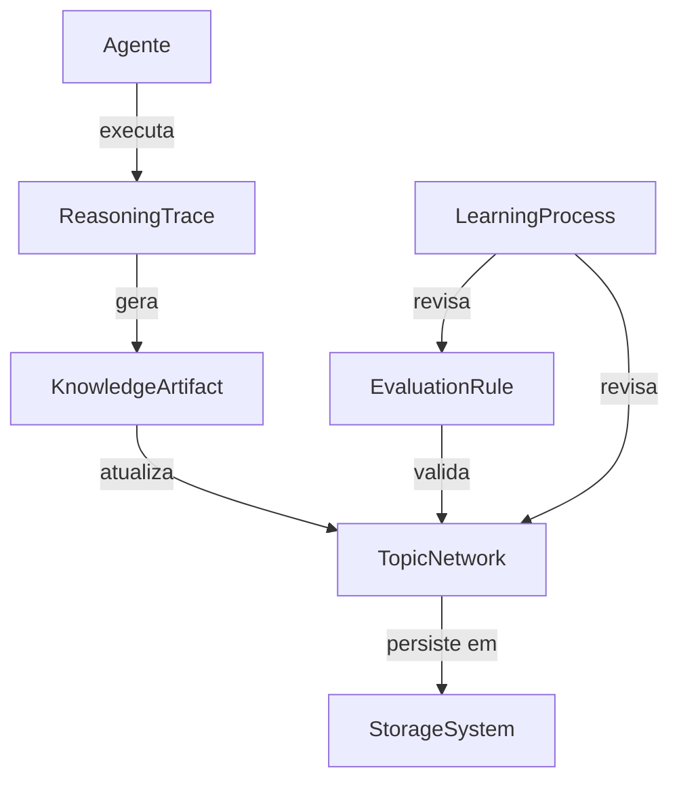

# 1. pesquisa 01
quero criar modelo ontológico para uma knowledge base que será usada para desenvolvimento de software, mas nessa primeira versão ainda não quero entrar em aspectos específicos do domínio, quero algo mais genérico, que possa ser usado em outros domínios não sei se consegui explicar corretamente o que preciso pesquisar

Ler 12 páginas da web

O que você está procurando existe, sim! O termo técnico para isso é **"Upper Ontology"** (Ontologia Superior) ou **"Foundational Ontology"** (Ontologia Fundamental) [6](https://dev.nemo.inf.ufes.br/seon/SEON.html) [9](http://oopsla.org/2000/postconf/strom.pdf#1#1).

Ela define conceitos **universais** (como "Coisa", "Processo", "Agente", "Relação") que servem de base para construir ontologias de domínios específicos depois [6](https://dev.nemo.inf.ufes.br/seon/SEON.html) [9](http://oopsla.org/2000/postconf/strom.pdf#1#1).

Encontrei exemplos práticos que se encaixam perfeitamente no que você descreveu:

## 1.1. 🧱 Exemplos Práticos para sua Base

- **BRO (Basic Reusable Ontology)**: Foi feita com uma **abordagem de engenharia de software** exatamente como você quer [1](https://github.com/mdebellis/Basic_Reusable_Ontology). É modular, começa com metadados leves (Dublin Core, SKOS) e adiciona camadas para agentes, organizações e atividades (usando PROV-O para proveniência) [1](https://github.com/mdebellis/Basic_Reusable_Ontology).
- **UFO (Unified Foundational Ontology)**: Usada como alicerce da **SEON**, uma rede de ontologias para Engenharia de Software [6](https://dev.nemo.inf.ufes.br/seon/SEON.html) [12](https://nemo.inf.ufes.br/en/projetos/seon/). Ela fornece as distinções básicas para construir ontologias de domínio consistentes (ex: distinguir "objetos" de "eventos") [6](https://dev.nemo.inf.ufes.br/seon/SEON.html).
- **CYC Upper Ontology**: Uma "teoria de tudo" genérica que já foi usada como base para modelos de dados em projetos grandes [9](http://oopsla.org/2000/postconf/strom.pdf#1#1).

## 1.2. 💡 Dica para Começar

Recomendo começar com a **BRO**. Ela é a que melhor reflete a sua intenção de ser prática e focada em software, sem a complexidade filosófica de outras ontologias superiores [1](https://github.com/mdebellis/Basic_Reusable_Ontology).

Ela é dividida em camadas:

1. **Basic BRO**: Para metadados básicos.
2. **Big BRO**: Adiciona classes reutilizáveis como `Pessoa`, `Organização` e `Atividade` [1](https://github.com/mdebellis/Basic_Reusable_Ontology).

Isso te dá uma base estável e interoperável para crescer sem precisar reinventar a roda.

Espero que esses exemplos práticos ajudem a direcionar sua pesquisa! Se quiser explorar mais algum deles, é só me avisar.

12 páginas web Resultados da pesquisa[GitHub2026/07/211](https://github.com/mdebellis/Basic_Reusable_Ontology)

[GitHub - mdebellis/Basic\_Reusable\_Ontology: A collection of ontologies with entities from SKOS, Dublin Core, and Prov · GitHub

The \*\*Basic Reusable Ontology (BRO)\*\* is a small family of modular... Unlike many upper ontologies grounded in philosophical or psychological theories (e.g., BFO, DOLCE)... For more feature-rich upper ontologies, users may wish to consider: \* \*\*Gist (Semantic Arts)\*\* \* \*\*Basic Formal Ontology (BFO)\*\* \* \*\*Schema.org\*\*

](https://github.com/mdebellis/Basic_Reusable_Ontology)[

arXiv2026/05/162

Instructions for reporting errors

set-membership, part-whole, and structured correspondence.... 2.3.7) An important partnering subject area of SLE, also known for rich knowledge resources, is ‘programming language theory’ and ‘programming paradigms’ or more broadly ‘programming language concepts’.... for linking the rest of FSL to software engineering.... Pre-ontological related work (Sec. 2.2.2) suggests relationships related to, for example, ‘usage’ (uses) and ‘parthood’ (hasPart)...

](https://arxiv.org/html/2605.17374v1)[

genwiki.eva.mpg.de3

Three-ontology method: core ontology, upper domain ontology, and the top-level ontology integrating both.... the upper domain ontology GFO-Bio which provides domain-specific knowledge and restrictions; and the top-level ontology GFO, which interrelates the application core and the upper domain ontology.

](http://genwiki.eva.mpg.de/pmwiki.php/Main/Ust-IshimGenome?action=download&upname=oop.pdf#1#1)[

arXiv2026/05/164

Towards an Ontology for the Foundations of Software Languages

The emerging ontology \`Foundations of Software Languages' (FSL) organizes the foundations underlying software languages.... The primary objective of FSL is to serve as a knowledge resource in Computer Science education by connecting several subject areas in a principled manner. The first release of FSL (V1)... We leveraged GenAI to support ontology engineering (discovery, classification, linkage, completion...

](https://arxiv.org/abs/2605.17374?context=cs)[

GitHub2026/06/065

GitHub - ozekik/awesome-ontology: A curated list of ontology things · GitHub

OBO Foundry - A collection of 100+... which are designed to be interoperable and logically well-formed.... \* FIBO - An ontology for the financial industry, developed by the Enterprise Data Management Council (EDMC). \* GoodRelations - The Web vocabulary for e-commerce.... types based on Wikipedia. #### Culture \* CIDOC CRM (Conceptual Reference Model)... which describes the explicit and implicit concepts and relations relevant to the documentation of cultural heritage.... \* Geographical Entity Ontology - An ontology of geographical entities implemented in OWL 2 and based on Basic Formal Ontology (BFO).

](https://github.com/ozekik/awesome-ontology)[

Universidade Federal do Espírito Santo6

SEON: The Software Engineering Ontology Network

there is the Unified Foundational Ontology (UFO), which is developed based on a number of theories from Formal Ontology, Philosophical Logics... the foundational ontology offers the ontological distinctions for the core and domain layers, while the core layer offers the SE core knowledge for building the domain networked ontologies.

](https://dev.nemo.inf.ufes.br/seon/SEON.html)[

W3C2025/06/117

Model Once, Represent Everywhere: UDA (Unified Data Architecture) at Netflix

and is grounded in a metamodel we call Upper (short for "upper ontology") which may be of particular interest to this group. Upper is a self-referential, self-describing, and self-validating modeling language built on top of SHACL.

](https://lists.w3.org/Archives/Public/public-shacl/2025Jun/0025.html)[

Stratego/XT8

Ontologies as LLM-Engineered Software Engineering Artifacts: Lessons from the Foundations of Software Languages (LLM4SE 2026) - STAF 2026

Using the Foundations of Software Languages ontology as a running example... linkage, completion... The FSL ontology organizes concepts spanning programming languages, modeling languages, tools, formal foundations, methods, and their embedding into software engineering activities; its first release explicitly leveraged GenAI within an ontology-engineering workflow.

](https://conf.researchr.org/details/staf-2026/llm4se-2026-papers/9/Ontologies-as-LLM-Engineered-Software-Engineering-Artifacts-Lessons-from-the-Foundat)[

oopsla.org9

Building a Large-Scale Generic Object Model: Applying the CYC Upper... The CYC upper ontology is a large, publicly available "theory of everything." A production (rule-based) system can be used to effectively translate the CYC upper ontology into a Java object model.

](http://oopsla.org/2000/postconf/strom.pdf#1#1)[

GitHub2026/06/1310

GitHub - daddydrac/veritas: Ontological based research and development software engineering agent, that is math heavy. · GitHub

Veritas separates ontology TBox data from project ABox data... ontology ontology classes/properties/axioms urn... Fuseki stores semantic facts and links so Veritas can reason over evidence, formulas, invariants, risks, plans, code, validation, and build artifacts.... primitive ontology...

](https://github.com/daddydrac/veritas)[

Gartner2025/11/0911

Does anyone know of commercial or open-source solutions for building "Ontology Management Services" and "Knowledge Graph" services? We need capabilities that allow businesses to express their information structures as high-level ontologies (RDF, SKOS, OWL, SHACL) and link these concepts to metadata definitions and reference data/lookup tables managed within a compatible "Reference Data Management Service." The solution should also be expandable to connect with "Data Catalog Services," internal data marketplaces, or "MDM Services." This approach is based on NATO's Data-centric Reference Architecture (Level 2) DCRA "Data Discovery Services" section: https://nhqc3s.hq.nato.int/apps/DCRA\_Report/index.html?view=id-f8f9cde3f92a45aeb2ad622a898e396f

Does anyone know of commercial or open-source solutions for building "Ontology Management Services" and "Knowledge Graph" services? We need capabilities that allow businesses to express their information structures as high-level ontologies (RDF, SKOS, OWL... Native RDF stack with strong support for OWL, SKOS, SHACL.

](https://gcom.pdo.aws.gartner.com/peer-community/post/hello-anyone-have-ideas-commercial-even-free-open-source-solutions-to-build-up-ontology-management-services-knowledge-graph)[

Universidade Federal do Espírito Santo12

Nemo

Software Engineering (SE) is a wide domain... Briefly, in the background, we have UFO (Unified Foundational Ontology) to provide the general ground knowledge for classifying concepts and relations in the network. In the center, core ontologies are used to represent the general domain knowledge, being the basis for the subdomain networked ontologies.

](https://nemo.inf.ufes.br/en/projetos/seon/)

# 2. pesquisa 02

## 2.1. Análise Geral

**Pontos fortes:**
- Você pensou em **metacognição** (regras de julgamento e aprendizado) — isso é raro e valioso
- A visão de "rede de assuntos" em vez de "árvore" é moderna e alinhada com grafos de conhecimento
- "Trilhas de raciocínio" captura bem o aspecto **processual** do conhecimento, não só o estático

**Pontos de atenção:**
- Os conceitos estão em **níveis de abstração diferentes** (alguns são entidades, outros são processos, outros são papéis)
- Falta uma **distinção clara** entre o que é **dado bruto**, o que é **conhecimento curado** e o que é **metadado**
- Não há menção a **agentes** (quem faz as ações) e **eventos** (quando algo ocorre)

---

## 2.2. Recomendações Estruturais

### 2.2.1. Separe em Camadas (inspirado na BRO)

Sua ontologia ficaria mais robusta assim:

| Camada | Conceitos | Exemplo no seu rascunho |
|--------|-----------|------------------------|
| **Metadados** | `Resource`, `Agent`, `Activity` | Faltante |
| **Domínio Genérico** | `Concept`, `Relation`, `Hierarchy`, `Network` | "rede de assuntos" |
| **Processual** | `Inquiry`, `Trace`, `Decision` | "trilhas de raciocínio", "regras" |
| **Metacognitiva** | `Critique`, `LearningSignal`, `ModelEvolution` | "aprendizado", "julgamento" |

---

### 2.2.2. Reformule cada conceito com uma definição formal

| Seu conceito | Definição sugerida | Tipo ontológico |
|--------------|-------------------|-----------------|
| **Memória** | `StorageSystem` — recurso que persiste dados estruturados ou não | `Resource` (endurant) |
| **Rede de assuntos** | `TopicNetwork` — grafo de conceitos inter-relacionados | `ConceptualStructure` (endurant) |
| **Trilhas de raciocínio** | `ReasoningTrace` — sequência de operações que gerou novos nós/arestas | `Process` (perdurant) |
| **Regras de julgamento** | `EvaluationRule` — critério para validar ou questionar conhecimento | `Specification` (endurant) |
| **Aprendizado** | `LearningProcess` — mecanismo que altera o próprio modelo | `MetaProcess` (perdurant) |

---

### 2.2.3. Relações essenciais que faltam

```
StorageSystem ---[stores]---> TopicNetwork
TopicNetwork ---[generates]---> ReasoningTrace
ReasoningTrace ---[triggers]---> EvaluationRule
EvaluationRule ---[validates]---> TopicNetwork (ciclo)
LearningProcess ---[revises]---> EvaluationRule + TopicNetwork
```

**Sugestão extra:** adicione `Agent` (humano ou sistema) como a entidade que **executa** as trilhas e **aplica** as regras. Sem agente, seu modelo fica "órfão" de ação.

---

### 2.2.4. Padronize os `type` para o OKF

No frontmatter dos seus bundles, você usaria:

```yaml
---
type: StorageSystem
name: "PostgreSQL - Produção"
description: "Banco relacional principal"
---
```

E crie um arquivo `concepts/type-definitions.md` com a hierarquia:

```
# Tipos Ontológicos

## Resource
- StorageSystem
  - Database
  - DocumentStore
  - Repository
- TopicNetwork
- EvaluationRule

## Process
- ReasoningTrace
- LearningProcess

## Agent
- HumanExpert
- AutomatedSystem
```

---

### 2.2.5. Três melhorias que eu faria agora

1. **Renomeie "Memória" para `StorageSystem`** — "memória" é antropomórfico e pode confundir (memória humana x banco de dados).

2. **Divida "Regras de julgamento" em duas**:
   - `ValidationRule`: regras formais (ex: "todo nó deve ter ao menos uma aresta")
   - `HeuristicRule`: regras subjetivas (ex: "prefira conceitos mais gerais")

3. **Crie um conceito `KnowledgeArtifact`** — para representar o **produto** de uma trilha de raciocínio (ex: um relatório, uma nova aresta proposta), separando o **processo** (a trilha) do **resultado** (o artefato).

---

## 2.3. Diagrama conceitual simplificado



---

## 2.4. Resumo das recomendações

| Ação | Prioridade | Motivo |
|------|------------|--------|
| Adicionar `Agent` | Alta | Sem agente, ações ficam sem sujeito |
| Separar processo de artefato | Alta | Distinção fundamental em ontologias |
| Criar camadas (metadados, domínio, metacognição) | Média | Organiza a evolução futura |
| Renomear "Memória" para `StorageSystem` | Baixa | Clareza terminológica |
| Documentar os `type` no OKF | Alta | Operacionalização imediata |

---

Se quiser, posso ajudar a transformar esse rascunho em um **arquivo YAML de exemplo** para seu OKF, com frontmatter e estrutura de pastas. É só pedir!


# 3. Arquitetura Ontológica para OKF Knowledge Bundle

## 3.1. Camada de Metadados (Foundation Layer)
- **`Resource`** — entidade base que pode ser descrita, referenciada e persistida
  - **`Agent`** — entidade que executa ações, toma decisões ou produz conhecimento
    - `HumanAgent` — pessoa física
    - `SystemAgent` — sistema automatizado (API, script, LLM)
  - **`Activity`** — ação ou processo que ocorre no tempo
    - `Inquiry` — atividade de investigação ou pesquisa
    - `LearningProcess` — atividade que revisa o próprio modelo
  - **`KnowledgeArtifact`** — produto tangível de uma atividade cognitiva
    - `Report` — relatório estruturado
    - `ProposedRelation` — nova aresta sugerida para a rede
    - `ProposedNode` — novo nó sugerido para a rede

## 3.2. Camada de Domínio Genérico (Domain Layer)
- **`StorageSystem`** — sistema de persistência de dados
  - `Database` — banco de dados estruturado
    - `RelationalDatabase` — SQL-based
    - `NoSQLDatabase` — document store, graph, etc.
  - `DocumentStore` — repositório de documentos não estruturados
  - `Repository` — sistema de controle de versão ou artefatos
  - `FileSystem` — sistema de arquivos convencional

- **`TopicNetwork`** — grafo de conceitos inter-relacionados
  - **`Node`** — conceito ou entidade no grafo
    - `CoreConcept` — conceito fundamental do domínio
    - `Instance` — ocorrência concreta de um conceito
    - `RelationType` — tipo de relação entre conceitos (ex: "é parte de", "causa")
  - **`Edge`** — relação entre dois nós
    - `HierarchicalEdge` — relação de hierarquia (pai-filho)
    - `AssociativeEdge` — relação não-hierárquica (associação, correlação)
    - `CausalEdge` — relação de causa e efeito
  - **`Subgraph`** — subconjunto da rede para um domínio ou propósito específico

## 3.3. Camada Processual (Process Layer)
- **`ReasoningTrace`** — sequência de operações que gerou novos nós ou arestas
  - `QueryTrace` — trace originado de uma consulta a um StorageSystem
  - `InferenceTrace` — trace originado de inferência lógica ou dedução
  - `SynthesisTrace` — trace originado de combinação de fontes múltiplas
  - `ValidationTrace` — trace originado de verificação de consistência
  - **Atributos da trilha:**
    - `timestamp` — quando ocorreu
    - `triggeredBy` — referência ao Agent que iniciou
    - `inputNodes` — nós de partida
    - `outputNodes` — nós gerados
    - `steps` — lista de operações intermediárias
    - `confidenceScore` — métrica de confiança no resultado

- **`KnowledgeArtifact`** (já listado em metadados) — é o **produto** da ReasoningTrace

## 3.4. Camada Avaliativa (Evaluation Layer)
- **`EvaluationRule`** — critério para validar, questionar ou criticar conhecimento
  - **`ValidationRule`** — regra formal e objetiva
    - `StructuralRule` — ex: "todo nó deve ter ao menos uma aresta"
    - `TypeRule` — ex: "uma Edge só pode conectar Nodes de tipos compatíveis"
    - `ConsistencyRule` — ex: "não pode haver ciclos em hierarquias"
  - **`HeuristicRule`** — regra subjetiva ou baseada em boas práticas
    - `SimplicityRule` — "prefira conceitos mais gerais a específicos"
    - `RelevanceRule` — "priorize nós com maior frequência de uso"
    - `AuthorityRule` — "prefira fontes com maior reputação"
  - **`MetaRule`** — regra que avalia outras regras
    - `RuleConflictRule` — "se duas regras conflitam, a de maior prioridade vence"

- **`Critique`** — avaliação concreta aplicada a um elemento da rede
  - `PositiveCritique` — validação ou confirmação
  - `NegativeCritique` — apontamento de problema ou inconsistência
  - `SuggestionCritique` — proposta de melhoria
  - **Atributos:**
    - `target` — nó, aresta ou subgrafo avaliado
    - `ruleApplied` — referência à EvaluationRule usada
    - `justification` — explicação textual
    - `severity` — nível de criticidade (baixo/médio/alto)

---

## 3.5. Camada Metacognitiva (Metacognitive Layer)
- **`LearningProcess`** — mecanismo que revisa ou melhora o próprio modelo
  - **`FeedbackLearning`** — aprendizado baseado em avaliações humanas ou automáticas
    - `HumanFeedbackLoop` — ajuste com base em revisão manual
    - `AutomatedFeedbackLoop` — ajuste com base em métricas (ex: precisão, cobertura)
  - **`PatternDiscovery`** — aprendizado que identifica novos padrões na rede
    - `Clustering` — agrupa nós semelhantes
    - `AnomalyDetection` — identifica nós ou arestas atípicas
  - **`OntologyEvolution`** — aprendizado que altera a própria estrutura ontológica
    - `TypeCreation` — sugere novos tipos de nós ou arestas
    - `TypeMerge` — unifica tipos redundantes
    - `RuleRefinement` — ajusta regras de validação com base em evidências
  - **Atributos do LearningProcess:**
    - `trigger` — o que iniciou o processo (ex: acúmulo de críticas, periodicidade)
    - `scope` — quais partes do modelo são afetadas
    - `resultingChanges` — mudanças efetivamente aplicadas

---

## 3.6. Camada de Relações (Relations Layer) — como tudo se conecta

- `StorageSystem` **stores** `TopicNetwork`
- `Agent` **executes** `Activity`
- `Activity` **includes** `ReasoningTrace`
- `ReasoningTrace` **generates** `KnowledgeArtifact`
- `KnowledgeArtifact` **updates** `TopicNetwork` (novos nós/arestas)
- `TopicNetwork` **triggers** `EvaluationRule` (quando consultada para validação)
- `EvaluationRule` **produces** `Critique`
- `Critique` **validates** `Node` | `Edge` | `Subgraph`
- `Critique` **feeds into** `LearningProcess`
- `LearningProcess` **revises** `EvaluationRule`
- `LearningProcess` **restructures** `TopicNetwork`
- `LearningProcess` **redefines** `StorageSystem` (ex: mudança de esquema)

---

## 3.7. Estrutura de Pastas Sugerida para OKF

```
knowledge-bundle/
├── index.md                           # ponto de entrada
├── concepts/
│   ├── type-definitions.md            # hierarquia completa de tipos
│   ├── agent/
│   │   ├── human-agent.md
│   │   └── system-agent.md
│   ├── storage/
│   │   ├── database.md
│   │   ├── document-store.md
│   │   └── repository.md
│   ├── network/
│   │   ├── node.md
│   │   ├── edge.md
│   │   └── subgraph.md
│   ├── reasoning/
│   │   ├── trace.md
│   │   └── artifact.md
│   ├── evaluation/
│   │   ├── rule.md
│   │   └── critique.md
│   └── learning/
│       └── process.md
├── relations/
│   ├── stores.md
│   ├── executes.md
│   ├── generates.md
│   ├── updates.md
│   ├── validates.md
│   └── revises.md
├── examples/
│   ├── example-trace.md
│   └── example-critique.md
└── README.md                           # guia de uso
```

---

## 3.8. Resumo dos Tipos OKF (frontmatter)

```yaml
 Tipos principais
type: StorageSystem | Agent | Activity | KnowledgeArtifact
type: TopicNetwork | Node | Edge | Subgraph
type: ReasoningTrace | Inquiry | LearningProcess
type: EvaluationRule | ValidationRule | HeuristicRule | MetaRule
type: Critique | PositiveCritique | NegativeCritique | SuggestionCritique
```

# 4. mapa unificado

- Camada de **Metadados** (Foundation Layer)
	- `Resource` — entidade base que pode ser descrita, referenciada e persistida
	  - `Agent` — entidade que executa ações, toma decisões ou produz conhecimento
	    - `HumanAgent` — pessoa física
	    - `SystemAgent` — sistema automatizado (API, script, LLM)
	  - `Activity` — ação ou processo que ocorre no tempo
	    - `Inquiry` — atividade de investigação ou pesquisa
	    - `LearningProcess` — atividade que revisa o próprio modelo
	  - `KnowledgeArtifact` — produto tangível de uma atividade cognitiva
	    - `Report` — relatório estruturado
	    - `ProposedRelation` — nova aresta sugerida para a rede
	    - `ProposedNode` — novo nó sugerido para a rede
- Camada de **Domínio Genérico** (Domain Layer)
	- `StorageSystem` — sistema de persistência de dados
	  - `Database` — banco de dados estruturado
	    - `RelationalDatabase` — SQL-based
	    - `NoSQLDatabase` — document store, graph, etc.
	  - `DocumentStore` — repositório de documentos não estruturados
	  - `Repository` — sistema de controle de versão ou artefatos
	  - `FileSystem` — sistema de arquivos convencional
	- `TopicNetwork` — grafo de conceitos inter-relacionados
	  - `Node` — conceito ou entidade no grafo
	    - `CoreConcept` — conceito fundamental do domínio
	    - `Instance` — ocorrência concreta de um conceito
	    - `RelationType` — tipo de relação entre conceitos (ex: "é parte de", "causa")
	  - `Edge` — relação entre dois nós
	    - `HierarchicalEdge` — relação de hierarquia (pai-filho)
	    - `AssociativeEdge` — relação não-hierárquica (associação, correlação)
	    - `CausalEdge` — relação de causa e efeito
	  - `Subgraph` — subconjunto da rede para um domínio ou propósito específico
- Camada **Processual** (Process Layer)
	- `ReasoningTrace` — sequência de operações que gerou novos nós ou arestas
	  - `QueryTrace` — trace originado de uma consulta a um StorageSystem
	  - `InferenceTrace` — trace originado de inferência lógica ou dedução
	  - `SynthesisTrace` — trace originado de combinação de fontes múltiplas
	  - `ValidationTrace` — trace originado de verificação de consistência
	  - Atributos da trilha:
	    - `timestamp` — quando ocorreu
	    - `triggeredBy` — referência ao Agent que iniciou
	    - `inputNodes` — nós de partida
	    - `outputNodes` — nós gerados
	    - `steps` — lista de operações intermediárias
	    - `confidenceScore` — métrica de confiança no resultado
	- `KnowledgeArtifact` (já listado em metadados) — é o produto da ReasoningTrace
- Camada **Avaliativa** (Evaluation Layer)
	- `EvaluationRule` — critério para validar, questionar ou criticar conhecimento
	  - `ValidationRule` — regra formal e objetiva
	    - `StructuralRule` — ex: "todo nó deve ter ao menos uma aresta"
	    - `TypeRule` — ex: "uma Edge só pode conectar Nodes de tipos compatíveis"
	    - `ConsistencyRule` — ex: "não pode haver ciclos em hierarquias"
	  - `HeuristicRule` — regra subjetiva ou baseada em boas práticas
	    - `SimplicityRule` — "prefira conceitos mais gerais a específicos"
	    - `RelevanceRule` — "priorize nós com maior frequência de uso"
	    - `AuthorityRule` — "prefira fontes com maior reputação"
	  - `MetaRule` — regra que avalia outras regras
	    - `RuleConflictRule` — "se duas regras conflitam, a de maior prioridade vence"
	- `Critique` — avaliação concreta aplicada a um elemento da rede
	  - `PositiveCritique` — validação ou confirmação
	  - `NegativeCritique` — apontamento de problema ou inconsistência
	  - `SuggestionCritique` — proposta de melhoria
	  - Atributos:
	    - `target` — nó, aresta ou subgrafo avaliado
	    - `ruleApplied` — referência à EvaluationRule usada
	    - `justification` — explicação textual
	    - `severity` — nível de criticidade (baixo/médio/alto)
- Camada **Metacognitiva** (Metacognitive Layer)
	- `LearningProcess` — mecanismo que revisa ou melhora o próprio modelo
	  - `FeedbackLearning` — aprendizado baseado em avaliações humanas ou automáticas
	    - `HumanFeedbackLoop` — ajuste com base em revisão manual
	    - `AutomatedFeedbackLoop` — ajuste com base em métricas (ex: precisão, cobertura)
	  - `PatternDiscovery` — aprendizado que identifica novos padrões na rede
	    - `Clustering` — agrupa nós semelhantes
	    - `AnomalyDetection` — identifica nós ou arestas atípicas
	  - `OntologyEvolution` — aprendizado que altera a própria estrutura ontológica
	    - `TypeCreation` — sugere novos tipos de nós ou arestas
	    - `TypeMerge` — unifica tipos redundantes
	    - `RuleRefinement` — ajusta regras de validação com base em evidências
	  - Atributos do LearningProcess:
	    - `trigger` — o que iniciou o processo (ex: acúmulo de críticas, periodicidade)
	    - `scope` — quais partes do modelo são afetadas
	    - `resultingChanges` — mudanças efetivamente aplicadas
- Camada de **Relações** (Relations Layer) — como tudo se conecta
	- `StorageSystem`  –– stores ––  `TopicNetwork`
	- `Agent`  –– executes ––  `Activity`
	- `Activity`  –– includes ––  `ReasoningTrace`
	- `ReasoningTrace`  –– generates ––  `KnowledgeArtifact`
	- `KnowledgeArtifact`  –– updates ––  `TopicNetwork` (novos nós/arestas)
	- `TopicNetwork`  –– triggers ––  `EvaluationRule` (quando consultada para validação)
	- `EvaluationRule`  –– produces ––  `Critique`
	- `Critique`  –– validates ––  `Node` | `Edge` | `Subgraph`
	- `Critique`  –– feeds into ––  `LearningProcess`
	- `LearningProcess`  –– revises ––  `EvaluationRule`
	- `LearningProcess`  –– restructures ––  `TopicNetwork`
	- `LearningProcess`  –– redefines ––  `StorageSystem` (ex: mudança de esquema)

# 5. frontmatter
- type
- title
- description
- resource
- tags
- source