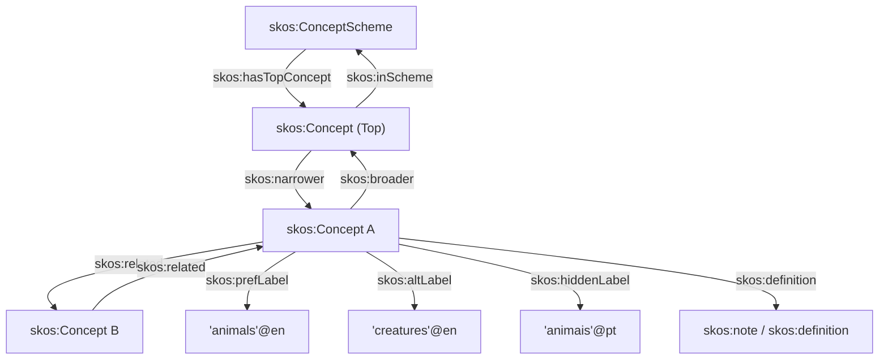

# 1. Simple Knowledge Organization System (SKOS)

## 1.1. Conceito e Fundamentação
O SKOS (Simple Knowledge Organization System) é um vocabulário baseado em RDF projetado para representar sistemas de organização do conhecimento (KOS - Knowledge Organization Systems) semi-formais, como tesauros, taxonomias, esquemas de classificação e listas de cabeçalhos de assuntos [7]. Ele funciona como uma tecnologia de transição, conectando o formalismo lógico rigoroso de linguagens como o OWL com a estrutura informal de ferramentas de colaboração na Web [7].

## 1.2. Elementos Essenciais (Essentials)

### 1.2.1. Conceitos
A classe central do SKOS é a `skos:Concept`, que representa as unidades de pensamento — ideias, significados ou categorias abstratas de objetos e eventos, independentes dos termos literais utilizados para descrevê-los [13]. Cada conceito é identificado unicamente por um URI, sendo recomendada a adoção de URIs HTTP resolvíveis para facilitar o acesso e referência na Web Semântica [14, 15].

### 1.2.2. Rotulação Lexical (Labels)
O SKOS fornece propriedades especializadas para anexar strings em linguagem natural aos conceitos, sendo todas elas subpropriedades disjuntas de `rdfs:label` [16, 17]:
* `skos:prefLabel`: Define o rótulo léxico preferencial de um recurso (geralmente usado como o descritor principal em sistemas de indexação) [17]. Um conceito pode ter no máximo um rótulo preferencial por tag de idioma [19].
* `skos:altLabel`: Define rótulos alternativos, facilitando a representação de sinônimos, quase-sinônimos, abreviações ou acrônimos [20].
* `skos:hiddenLabel`: Representa termos legíveis que servem para indexação interna e busca textual por aplicações (como grafias incorretas comuns), mas que não devem ser exibidos visualmente ao usuário final [22].

### 1.2.3. Relações Semânticas Intra-Vocabulário
As relações definem o significado dos conceitos por meio de sua inserção em uma rede estruturada. Existem duas categorias principais de relações semânticas [23, 24]:
* Hierárquicas: Estabelecidas pelas propriedades inversas `skos:broader` (tem conceito mais geral) e `skos:narrower` (tem conceito mais específico) [25, 26, 27]. Para evitar heranças problemáticas de transitividade em taxonomias reais ("hierarquias sujas"), o SKOS não define essas propriedades como transitivas por padrão [28].
* Associativas: Estabelecidas pela propriedade simétrica `skos:related`, que conecta conceitos de forma não hierárquica [24, 31, 32]. A propriedade não é transitiva, evitando propagações semânticas indesejadas [32]. Além disso, o fechamento transitivo de relações hierárquicas é estritamente disjunto das relações associativas [33].

### 1.2.4. Notas Documentárias
Para fornecer definições informais e documentação legível por humanos, o SKOS define a propriedade geral `skos:note`, estendendo-a em categorias específicas que suportam tags de idioma [34, 38]:
* `skos:scopeNote`: Indica limites e restrições de uso de um conceito na prática de indexação [34].
* `skos:definition`: Fornece uma explicação completa do significado pretendido do conceito [35].
* `skos:example`: Ilustra o conceito através de exemplos concretos de uso [35].
* `skos:historyNote`: Documenta alterações históricas significativas no significado ou na forma de um conceito [36].
* `skos:editorialNote` e `skos:changeNote`: Auxiliam no gerenciamento interno, documentando revisões editoriais pendentes ou modificações finas realizadas no conceito [36, 37].

### 1.2.5. Esquemas de Conceitos (Concept Schemes)
Vocabulários inteiros são agregados usando a classe `skos:ConceptScheme` [39]. Os conceitos individuais associam-se ao seu esquema correspondente via `skos:inScheme` [40]. Para fornecer pontos de entrada eficientes na navegação de grandes árvores de conceitos, utiliza-se a propriedade `skos:hasTopConcept` para apontar diretamente para os conceitos de topo (mais gerais) do esquema [41].

## 1.3. Grafo de Relações do SKOS



## 1.4. Rede de Vocabulários e Mapeamento Semântico

### 1.4.1. Mapeamento entre Esquemas (Mapping)
Para conciliar e interligar diferentes vocabulários em uma rede distribuída e global, o SKOS fornece propriedades específicas de mapeamento semântico [44, 45, 46]:
* `skos:closeMatch`: Indica que dois conceitos de esquemas diferentes são suficientemente semelhantes para serem usados de forma intercambiável em certas aplicações [46, 48]. Esta propriedade não é transitiva, impedindo que a similaridade se propague indefinidamente através de redes de mapeamento [48].
* `skos:exactMatch`: Indica equivalência de significado estrita entre os conceitos [48]. É uma subpropriedade de `skos:closeMatch` e é definida como transitiva [48].
* Outros Mapeamentos: `skos:broadMatch`, `skos:narrowMatch` e `skos:relatedMatch` servem como paralelos diretos das propriedades semânticas internas do vocabulário, mas com o propósito de mapear fronteiras entre esquemas distintos [46, 51]. Elas são definidas como subpropriedades das relações correspondentes (ex: `skos:broadMatch` implies formalmente `skos:broader`) [51].

### 1.4.2. Diferenciação Semântica: skos:exactMatch vs. owl:sameAs
O SKOS utiliza `skos:exactMatch` em vez de `owl:sameAs` para preservar a integridade dos dados dos esquemas individuais [49]. Quando duas entidades são unidas via `owl:sameAs`, elas passam a ser consideradas o mesmo recurso físico na Web Semântica, o que força a mesclagem de todas as suas propriedades em um único nó [49]. Isso geraria inconsistências lógicas graves no SKOS, como um único conceito adquirir múltiplos rótulos preferenciais (`skos:prefLabel`) na mesma língua [49, 50].

### 1.4.3. Reutilização e Extensão de Conceitos
Diferentes editores podem estender esquemas existentes referenciando e incluindo conceitos de outros vocabulários via `skos:inScheme` [52, 54]. Um conceito pode pertencer a múltiplos esquemas simultaneamente [42]. Caso seja necessário importar um esquema inteiro, pode-se recorrer a `owl:imports`, embora isso force logicamente a inferência das instâncias de `skos:ConceptScheme` as classes de `owl:Ontology` (colocando o sistema no perfil semântico OWL Full) [56, 57].

## 1.5. Recursos Avançados do SKOS

### 1.5.1. Coleções de Conceitos (Concept Collections)
Permitem agrupar conceitos sem a necessidade de criar relações semânticas formais (como rotular grupos em exibições sistemáticas ou facetas) [61, 62]:
* Labeled Collections (`skos:Collection`): Coleções rotuladas por meio de rótulos lexicais comuns, agrupando conceitos via propriedade `skos:member` [63].
* Ordered Collections (`skos:OrderedCollection`): Grupos que requerem uma ordenação sequencial explícita (alfabética, cronológica, etc.) [64]. Conectam-se a uma lista do tipo `rdf:List` por meio de `skos:memberList` [64].

As coleções são estruturalmente disjuntas dos conceitos, o que impede a sua inserção direta em redes hierárquicas normais [65].

### 1.5.2. Relações entre Rótulos (SKOS-XL)
Como as propriedades lexicais comuns do SKOS aceitam apenas literais RDF como objeto direto, não é possível criar asserções ou metadados sobre os rótulos em si (como indicar relações de tradução ou acrônimos) [71]. O módulo de extensão opcional SKOS-XL resolve isso introduzindo a classe `skosxl:Label`, transformando os rótulos em recursos de primeira ordem [72]. Cada instância possui uma forma literal via `skosxl:literalForm` e pode se relacionar com outras através de `skosxl:labelRelation` [72, 73].

### 1.5.3. Coordenação de Conceitos
Consiste na atividade de combinar múltiplos conceitos lógicos do vocabulário:
* Pré-coordenação: Combinação de termos realizada a priori por indexadores ou gerenciadores do KOS (ex: "Bicicletas--Manutenção") [76].
* Pós-coordenação: Combinação dinâmica efetuada no momento da recuperação de dados pelo usuário, o que pode ser modelado diretamente via consultas SPARQL [76, 77].

O vocabulário básico do SKOS não fornece mecanismos nativos específicos para a pré-coordenação, permitindo o surgimento orgânico de padrões e especializações baseados em extensões de classes ou OWL [78, 79].

### 1.5.4. Hierarquias Transitivas
Para habilitar a expansão de consultas ou raciocínio transitivo formal em redes de conceitos, o SKOS define as superpropriedades transitivas `skos:broaderTransitive` e `skos:narrowerTransitive` [81]. Elas agem como a cobertura transitiva das relações diretas de parentesco, permitindo mapear ancestrais e descendentes indiretos através de raciocinadores sem poluir ou descaracterizar as propriedades diretas `skos:broader` e `skos:narrower` [81, 83].

### 1.5.5. Notações
Para KOSs que utilizam representações estruturadas de códigos alfanuméricos independentes de linguagem natural (como a Classificação Decimal Universal), o SKOS fornece a propriedade `skos:notation` [85, 86]. Ela suporta o uso de literais tipados que definem esquemas sintáticos específicos de codificação [86].

## 1.6. Integration entre SKOS e OWL
A especificação define `skos:Concept` como uma classe de OWL (`owl:Class`), o que torna todas as instâncias de conceitos indivíduos lógicos de OWL [95, 96]. 
* OWL Full: Permite tratar os conceitos simultaneamente como indivíduos e classes (metamodelagem), simplificando a modelagem onde classes de objetos precisam herdar características específicas associadas a conceitos do vocabulário [97].
* OWL DL: Exige disjunção absoluta entre o conjunto de classes e indivíduos, o que impede o tratamento direto de um conceito SKOS como uma classe formal de OWL, necessitando de propriedades de anotação dedicadas para realizar essa ponte [97, 98].

# 2. linguagens

Sim, você pode perfeitamente usar ==JSON-LD== para descrever essa taxonomia. Ele é uma das opções mais populares hoje em dia, pois integra dados semânticos diretamente em APIs web modernas e estruturas baseadas em JSON.

## 2.1. O mesmo exemplo da taxonomia em JSON-LD

Veja como o conceito `Cachorro` (`TAX_030`) e sua hierarquia ficam representados em JSON-LD:

```json
{
  "@context": {
    "skos": "http://w3.org",
    "ex": "http://exemplo.org",
    "id": "@id",
    "type": "@type",
    "prefLabel": { "@id": "skos:prefLabel", "@language": "pt" },
    "altLabel": { "@id": "skos:altLabel", "@language": "pt" },
    "definition": { "@id": "skos:definition", "@language": "pt" },
    "broader": { "@id": "skos:broader", "@type": "@id" }
  },
  "@graph": [
    {
      "id": "ex:TAX_030",
      "type": "skos:Concept",
      "prefLabel": "Cachorro",
      "altLabel": ["Cão", "Canino"],
      "definition": "Mamífero doméstico da família dos canídeos.",
      "broader": "ex:TAX_020"
    }
  ]
}
```

---

## 2.2. Outras Opções de Linguagens

Além do Turtle e do JSON-LD, o ecossistema da Web Semântica (W3C) oferece:

- RDF/XML: O formato original baseado em XML. É muito verboso e difícil de ler para humanos, mas amplamente suportado por sistemas legados.
- N-Triples: O formato mais simples possível. Cada linha contém exatamente um sujeito, um predicado e um objeto. É excelente para processar volumes gigantescos de dados (_Big Data_).
- Manchester Syntax: Uma linguagem criada especificamente para humanos lerem e escreverem restrições complexas de ontologias (OWL) de forma parecida com a lógica natural.

## 2.3. Tabela Resumo: Linguagem vs. Ferramenta Open Source

| Linguagem / Formato | Ferramenta Open Source Principal | Função da Ferramenta                                          |
| ------------------- | -------------------------------- | ------------------------------------------------------------- |
| Turtle (.ttl)       | Protégé                          | Editor visual e modelador de ontologias completo.             |
| JSON-LD (.jsonld)   | Apache Jena (ou Jena Eyeball)    | Framework Java para processar e consultar dados semânticos.   |
| RDF/XML (.rdf)      | TopBraid Composer (FE)           | Modelagem e conversão de formatos (versão Free Edition).      |
| N-Triples (.nt)     | GraphDB (Free)                   | Banco de dados gráfico (Triplestore) de alta performance.     |
| Manchester Syntax   | HermiT / Pellet                  | Raciocinadores (Reasoners) para validar lógica e inferências. |
| SKOS / OWL (Geral)  | VocBench                         | Sistema web open source específico para gerenciar taxonomias. |

Deseja prosseguir no desenvolvimento? Se quiser, posso:

- Escrever o exemplo completo da taxonomia convertido inteiramente para JSON-LD.
- Mostrar como configurar a ferramenta VocBench ou o Protégé para carregar esse vocabulário.

Como gostaria de continuar?

==Não muda nada na estrutura lógica dos dados==, mas o template ganha três novas colunas técnicas para mapear o JSON-LD perfeitamente.

O JSON-LD precisa saber exatamente como transformar o texto da sua planilha em URIs e tipos de dados semânticos.

## 2.4. Template Adaptado para JSON-LD

Para que sua tabela seja facilmente convertida em JSON-LD (usando scripts Python ou ferramentas de importação), o ideal é incluir as colunas de Prefixo, Contexto Semântico e Idioma:

|ID do Conceito|Termo Preferido (prefLabel)|Idioma|Sinônimos (altLabel)|Definição (definition)|Termo Pai (broader)|Prefixo do ID|Tipo de Conceito (SKOS)|
|---|---|---|---|---|---|---|---|
|`TAX_010`|Animal|`pt`|Ser vivo, Espécie animal|Ser vivo pluricelular...|`TAX_001`|`ex:`|`skos:Concept`|
|`TAX_020`|Mamífero|`pt`|Animais mamíferos|Animal vertebrado que...|`TAX_010`|`ex:`|`skos:Concept`|
|`TAX_030`|Cachorro|`pt`|Cão, Canino|Mamífero doméstico...|`TAX_020`|`ex:`|`skos:Concept`|

---

## 2.5. O que muda na prática ao escolher JSON-LD?

1. Gestão de Contexto (`@context`): Você precisará definir um cabeçalho único para o seu documento que diz que `Termo Pai` aponta para `http://w3.org`.
2. Declaração explícita de strings: No template, a coluna Idioma passa a ser obrigatória para alimentar a propriedade `@language` do JSON-LD, evitando que o sistema confunda "Cão" em português com termos em outros idiomas.
3. Facilidade com Arrays: Na coluna de sinônimos, você pode continuar separando por vírgula (`Cão, Canino`), pois o JSON-LD transforma isso nativamente em uma lista de strings (`["Cão", "Canino"]`).

Se quiser avançar nessa abordagem, posso ajudar você com o próximo passo:

- Criar um script em Python que lê essa tabela (via CSV) e gera o arquivo `.jsonld` final automaticamente.
- Montar o bloco completo de `@context` customizado com os seus próprios prefixos de negócio.

Qual dessas opções seria mais útil para o seu fluxo de trabalho?

# 3. template

## 3.1. Templates
- template 01 (apenas SKOS)
	- **ID do Conceito:** Código único (ex: `TAX_001`).
	- **Termo Preferido (PrefLabel):** O nome oficial do conceito.
	- **Sinônimos (AltLabel):** Outras formas de chamar o mesmo termo.
	- **Definição:** O significado exato do termo.
	- **Termo Pai (Broader):** O conceito mais amplo acima dele.
	- ==**Termo Filho (Narrower):**== O conceito mais específico abaixo dele.
	- ==**Termo Relacionado (Related):**== Conceitos ligados de outra forma.
- template 02 (SKOS turtle + OWL)
	- ==ID da Classe==  
	- ==Nome da Classe== (OWL)  
	- Propriedade Associada
	- Tipo de Propriedade 
	- Domínio (Domain) 
	- Contradomínio (Range) 
	- Restrição / Cardinalidade 
- template 03 (SKOS json-LD)
	- ID do Conceito 
	- Termo Preferido (prefLabel) 
	- Idioma 
	- Sinônimos (altLabel)     
	- Definição (definition)   
	- Termo Pai (broader) 
	- Prefixo do ID 
	- ==Tipo de Conceito== (SKOS) 


## 3.2. Template Unificado (Modelo Mestre)

| Nome da Coluna                   | Descrição Técnica (Mapeamento JSON-LD)                          | Exemplo de Preenchimento                  |
| -------------------------------- | --------------------------------------------------------------- | ----------------------------------------- |
| ID do Conceito                   | O identificador único local do termo/classe.                    | `TAX_030`                                 |
| Prefixo / Namespace              | Onde o termo reside (geralmente mapeado no `@context`).         | `ex:`                                     |
| Tipo Semântico                   | Se o termo comporta-se como Conceito, Classe ou ambos.          | `["skos:Concept", "owl:Class"]`           |
| Termo Preferido (prefLabel)      | Nome oficial do conceito/classe.                                | `Cachorro`                                |
| Idioma                           | Código ISO do idioma da string.                                 | `pt`                                      |
| Sinônimos (altLabel)             | Termos alternativos separados por vírgula (vira Array no JSON). | `Cão, Canino`                             |
| Definição (definition)           | Significado exato para humanos e sistemas.                      | `Mamífero doméstico da família canídeos.` |
| Termo Pai (broader / subClassOf) | ID do conceito mais amplo ou classe pai.                        | `TAX_020`                                 |
| Propriedade Associada            | Propriedade OWL vinculada a esta classe (se houver).            | `ex:temDono`                              |
| Tipo de Propriedade              | Tipo da relação OWL (`ObjectProperty` ou `DatatypeProperty`).   | `owl:ObjectProperty`                      |
| Domínio (Domain)                 | Quem possui a propriedade (geralmente o próprio ID).            | `TAX_030`                                 |
| Contradomínio (Range)            | O tipo de dado ou classe que responde à propriedade.            | `ex:Pessoa`                               |
| Restrição / Cardinalidade        | Regra lógica de negócio aplicada à propriedade.                 | `owl:maxCardinality 1`                    |

## 3.3. Como esse Template se transforma em um único código JSON-LD?

Ao preencher a linha do `Cachorro` usando esse template unificado, o seu documento JSON-LD final mescla SKOS e OWL nativamente:

```json
{
  "@context": {
    "skos": "http://w3.org",
    "owl": "http://w3.org",
    "rdfs": "http://w3.org",
    "xsd": "http://w3.org",
    "ex": "http://exemplo.org",
    "id": "@id",
    "type": "@type",
    "prefLabel": { "@id": "skos:prefLabel", "@language": "pt" },
    "altLabel": { "@id": "skos:altLabel", "@language": "pt" },
    "definition": { "@id": "skos:definition", "@language": "pt" },
    "broader": { "@id": "skos:broader", "@type": "@id" },
    "subClassOf": { "@id": "rdfs:subClassOf", "@type": "@id" }
  },
  "@graph": [
    {
      "id": "ex:TAX_030",
      "type": ["skos:Concept", "owl:Class"],
      "prefLabel": "Cachorro",
      "altLabel": ["Cão", "Canino"],
      "definition": "Mamífero doméstico da família dos canídeos.",
      "broader": "ex:TAX_020",
      "subClassOf": "ex:TAX_020",
      "rdfs:subClassOf": {
        "@type": "owl:Restriction",
        "owl:onProperty": "ex:temDono",
        "owl:maxCardinality": 1
      }
    },
    {
      "id": "ex:temDono",
      "type": "owl:ObjectProperty",
      "rdfs:domain": "ex:TAX_030",
      "rdfs:range": "ex:Pessoa"
    }
  ]
}
```

## 3.4. O que mudou e por que ficou mais fácil?

- Unificação de Hierarquia: O campo "Termo Pai" alimenta tanto o `skos:broader` (para ferramentas de taxonomia) quanto o `rdfs:subClassOf` (para raciocinadores OWL).
- Flexibilidade no Tipo: A coluna "Tipo Semântico" permite que você decida linha por linha se aquele item é apenas um conceito de vocabulário ou se também atuará como uma classe lógica com restrições de propriedade.

## 3.5. explicações

Para entender como o JSON-LD funciona, pense nele como uma ponte: o `@context` define o dicionário de termos (as regras do jogo), enquanto o `@graph` contém os dados reais estruturados com base nessas regras.

Aqui está a explicação detalhada de cada seção do exemplo anterior:

### 3.5.1. A Seção `@context` (O Mapeador de Significado)

O JSON tradicional é apenas texto e números sem significado global. O `@context` transforma chaves comuns de JSON em links únicos globais (URIs) que qualquer computador no mundo pode entender.

```json
"@context": {
  "skos": "http://w3.org",
  "owl": "http://w3.org",
  "rdfs": "http://w3.org",
  "xsd": "http://w3.org",
  "ex": "http://exemplo.org",
```

- Atalhos (Prefixos): Em vez de escrever a URL inteira da especificação SKOS ou OWL toda vez, você cria um atalho (ex: `skos:` ou `ex:`).

```json
  "id": "@id",
  "type": "@type",
```

- Palavras-chave nativas: Mapeia a palavra amigável `id` para o termo técnico do JSON-LD `@id` (identificador único do nó) e `type` para `@type` (o tipo de dado/classe).

```json
  "prefLabel": { "@id": "skos:prefLabel", "@language": "pt" },
  "altLabel": { "@id": "skos:altLabel", "@language": "pt" },
  "definition": { "@id": "skos:definition", "@language": "pt" },
```

- Mapeamento de Propriedades de Texto: Aqui você avisa ao sistema que sempre que a chave `prefLabel` aparecer, ela equivale ao padrão mundial `skos:prefLabel`. O parâmetro `"@language": "pt"` diz que se não for especificado nenhum idioma no texto, o padrão será Português.

```json
  "broader": { "@id": "skos:broader", "@type": "@id" },
  "subClassOf": { "@id": "rdfs:subClassOf", "@type": "@id" }
}
```

- Mapeamento de Relacionamentos (Links): O parâmetro `"@type": "@id"` é crucial aqui. Ele avisa ao interpretador que o valor desse campo não é um texto comum, mas sim o ID de outro objeto dentro do sistema (criando o link da taxonomia).


### 3.5.2. A Seção `@graph` (A Rede de Conhecimento)

O `@graph` armazena uma lista de objetos interconectados. No nosso caso, ele descreve duas coisas: a classe/conceito `Cachorro` e a propriedade `temDono`.

### 3.5.3. Objeto 1: O Conceito e Classe `Cachorro`

```json
{
  "id": "ex:TAX_030",
  "type": ["skos:Concept", "owl:Class"],
  "prefLabel": "Cachorro",
  "altLabel": ["Cão", "Canino"],
  "definition": "Mamífero doméstico da família dos canídeos.",
  "broader": "ex:TAX_020",
  "subClassOf": "ex:TAX_020",
```

- Dualidade: O nó se identifica como `ex:TAX_030`. Graças ao array no `type`, ele é reconhecido simultaneamente como um termo taxonômico (`skos:Concept`) e uma classe lógica (`owl:Class`).
- Hierarquia Dupla: Ele aponta para o pai (`ex:TAX_020`) tanto na visão de taxonomia (`broader`) quanto na visão de ontologia (`subClassOf`).

```json
  "rdfs:subClassOf": {
    "@type": "owl:Restriction",
    "owl:onProperty": "ex:temDono",
    "owl:maxCardinality": 1
  }
}
```

- A Restrição OWL: Esta parte diz que a classe `Cachorro` sofre uma restrição lógica. A propriedade envolvida é `ex:temDono` e a regra de negócio determina a cardinalidade máxima de 1 (um cachorro pode ter no máximo um dono registrado).

### 3.5.4. Objeto 2: A Propriedade `temDono`

```json
{
  "id": "ex:temDono",
  "type": "owl:ObjectProperty",
  "rdfs:domain": "ex:TAX_030",
  "rdfs:range": "ex:Pessoa"
}
```

- A Relação: Este bloco define a propriedade que usamos na restrição acima.
- Tipo: Ela é uma `owl:ObjectProperty` (conecta dois objetos/recursos entre si, não um objeto a um texto/número).
- Domínio e Contradomínio: O `domain` estabelece que quem _tem_ o dono é o `Cachorro` (`TAX_030`). O `range` estabelece que o dono obrigatoriamente pertence à classe `Pessoa` (`ex:Pessoa`).


# 4. apache jena
## 4.1. Como Editar o Arquivo

O JSON-LD é um arquivo de texto comum. Você pode criá-lo e editá-lo em qualquer editor de código (como VS Code, Sublime Text ou Notepad++).

1. Crie um arquivo chamado `taxonomia.jsonld`.
2. Cole o conteúdo do código JSON-LD gerado na etapa anterior dentro dele.
3. Certifique-se de salvar o arquivo com a extensão `.jsonld` e codificação UTF-8.

---

## 4.2. Validando e Analisando com o Apache Jena CLI (Ferramenta `riot`)

O Apache Jena possui um utilitário de linha de comando extremamente poderoso chamado RIOT (RDF Input-Output Tool). Ele serve exatamente para ler, validar e transformar formatos da Web Semântica.

Se você baixou os binários do Apache Jena e configurou a variável de ambiente `JENA_HOME` no seu sistema, siga os passos abaixo:

## 4.3. Passo A: Comando de Validação Básica

Abra o seu terminal na pasta onde salvou o arquivo e execute:

```bash
riot --validate taxonomia.jsonld
```

- O que acontece: Se o arquivo estiver sintaticamente correto em relação à especificação JSON-LD e RDF, o comando não retornará erros. Se faltar alguma vírgula, aspas ou houver erro de digitação no `@context`, o Jena apontará a linha exata do erro.

## 4.4. Passo B: Comando de Transformação (Garantia de Validação)

Uma das melhores formas de validar se o Apache Jena compreendeu perfeitamente sua estrutura JSON-LD é pedir para ele transformá-la em Turtle. Execute:

```bash
riot --output=turtle taxonomia.jsonld
```

- O que acontece: O Jena processará o `@context` e o `@graph` do seu JSON-LD e imprimirá no terminal os triplos RDF convertidos para Turtle. Se ele conseguir gerar a saída sem avisos (_warnings_), seu JSON-LD está 100% válido.

---

## 4.5. Validando e Carregando via Código (Java API)

Se o seu objetivo é manipular esse arquivo via programação, você usará o subsistema `RDFDataMgr` do Jena para carregar o arquivo em um modelo de dados (`Model`) e verificar possíveis inconsistências de ontologia.

Aqui está o trecho de código padrão que você usaria em um projeto Java (Maven/Gradle):

```java
import org.apache.jena.rdf.model.Model;
import org.apache.jena.rdf.model.ModelFactory;
import org.apache.jena.riot.RDFDataMgr;
import org.apache.jena.riot.RiotException;

public class ValidadorOntologia {
    public static void main(String[] args) {
        String caminhoArquivo = "taxonomia.jsonld";
        
        // Cria um modelo RDF vazio
        Model model = ModelFactory.createDefaultModel();
        
        try {
            // O RDFDataMgr detecta automaticamente que é JSON-LD pela extensão ou conteúdo
            RDFDataMgr.read(model, caminhoArquivo);
            System.out.println("Sucesso: O JSON-LD foi parseado corretamente pelo Apache Jena!");
            
            // Imprime o número de declarações (triplos) carregados para conferência
            System.out.println("Total de triplos lidos: " + model.size());
            
        } catch (RiotException e) {
            System.err.println("Erro de Sintaxe no JSON-LD: " + e.getMessage());
        } catch (Exception e) {
            System.err.println("Erro ao ler o arquivo: " + e.getMessage());
        }
    }
}
```

---

## 4.6. Dica Bônus: Validação Lógica Mais Avançada

O carregamento simples no Jena valida apenas se o arquivo está bem formatado. Se você quiser que o Jena verifique se as restrições lógicas do OWL (como o domínio do `Cachorro` e o tipo do `Dono`) estão consistentes, você precisará usar um Reasoner (Raciocinador) acoplado ao modelo:

```java
import org.apache.jena.rdf.model.InfModel;
import org.apache.jena.reasoner.ValidityReport;
import java.util.Iterator;

// Após ler o 'model' conforme o código anterior:
InfModel infModel = ModelFactory.createRDFSModel(model); // Ou um modelo OWL mais complexo
ValidityReport relatorioValidade = infModel.validate();

if (relatorioValidade.isValid()) {
    System.out.println("A taxonomia/ontologia é logicamente válida!");
} else {
    System.out.println("Conflitos lógicos encontrados:");
    for (Iterator<ValidityReport.Report> i = relatorioValidade.getReports(); i.hasNext(); ) {
        System.out.println(" - " + i.next());
    }
}
```

Deseja avançar? Se quiser, eu posso:

- Ajudar a configurar as dependências do Maven para rodar esse código Java.
- Criar um script automatizado em Python alternativo (usando a biblioteca `rdflib`) caso você prefira não usar Java no terminal.

Como prefere prosseguir?

# 5. pipeline SKOS + JSON-LD

1. preencher template SKOS + OWL
2. converter para JSON-LD com python script
3. validar estrutura com [apache jena, python RDFLib]??
4. visualizar estrutura graficamente com [apache jena, protege, termboard.com]
5. ajustar estrutura

https://github.com/ozekik/awesome-ontology#domain-ontologies

