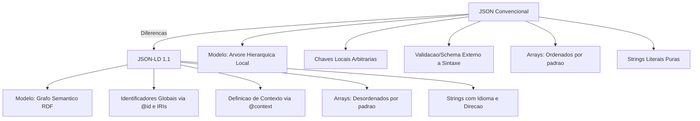

# 1. Sintese de Diferencas JSON-LD vs JSON

## 1.1. Conceito e Proposito
O JSON convencional e projetado prioritariamente como um formato leve de intercambio de dados e mensagens entre sistemas, focado na simplicidade e na facilidade de leitura humana [1, 22]. No entanto, ao integrar dados provenientes de fontes distintas, chaves identicas em documentos JSON diferentes podem entrar em conflito e gerar ambiguidades de interpretacao [22]. Alem disso, o JSON tradicional carece de suporte nativo para hiperlinks ou identificadores globais, dificultando a interconexao de recursos distribuídos na Web [22].

O JSON-LD (JSON-based Linked Data) foi desenvolvido como um formato semantico totalmente compatível com o JSON convencional [1, 3]. Ele funciona como uma extensao que permite que sistemas e interpretadores JSON ja existentes compreendam dados estructurados como Linked Data (Dados Conectados) com o minimo de alteracoes, oferecendo um caminho suave de atualizacao de infraestrutura [1, 3, 9].

## 1.2. Modelo de Dados e Topologia
O JSON tradicional organiza os dados em uma estrutura de arvore hierarquica puramente local, composta por elementos sintaticos especificos: objetos (mapas relacionando chaves a valores), arrays (colecoes ordenadas), strings, numeros, valores booleanos e nulos [12, 40].

O JSON-LD estende essa base sintatica de forma a representar o modelo de dados RDF (Resource Description Framework), que descreve grafos direcionados rotulados [12, 213, 214]:
* Nos do Grafo: Sao recursos (que podem ser identificados globalmente por IRIs ou de forma local por identificadores de nos em branco/blank nodes) ou valores literais [10, 11, 214].
* Arestas Direcionadas: Sao as conexoes ou propriedades do grafo, sempre representadas por chaves que se expandem para IRIs globais [10, 214].
* Grafos Nomeados e Default Graph: Permite empacotar multiplos grafos (rotulados com um nome/IRI especifico) juntamente com um grafo padrao desprovido de nome em um único documento ou conjunto de dados [165, 214].

## 1.3. Sintaxe e Restricoes de Chaves
Enquanto o JSON convencional e muito flexivel quanto a duplicidade de chaves (variando o comportamento conforme a biblioteca ou linguagem que o processa), o JSON-LD aplica regras gramaticais estritas:
* Unicidade Absoluta: Em contraste com o JSON comum, as chaves em objetos JSON-LD devem ser estritamente unicas [219].
* Sensibilidade a Letras: Todas as chaves, palavras-chave e valores em JSON-LD sao estritamente sensiveis a maiusculas e minúsculas [20].
* Chaves sem Significado Semantico: Qualquer chave JSON que nao possa ser mapeada para uma IRI valida através do contexto ativo, ou que nao seja uma palavra-chave reservada, e completamente desconsiderada no processamento semantico do grafo, embora permaneca intacta na sintaxe do arquivo [36, 216].

## 1.4. Palavras-Chave Reservadas
O JSON-LD introduz um conjunto de chaves sintaticas especiais denominadas keywords, obrigatoriamente precedidas pelo caractere `@` [13, 221]. O JSON tradicional nao possui chaves reservadas com esta notacao ou significado especial. As principais keywords que diferenciam o processamento do JSON-LD sao:
* `@context`: Define os termos locais e atalhos utilizados no documento, mapeando-os para IRIs de vocabularios compartilhados [13, 26, 27].
* `@id`: Define de forma exclusiva o identificador global (IRI ou blank node) do no que esta sendo descrito [14, 38].
* `@type`: Define a classificacao semantica de um no ou o tipo de dado de um valor literal [15, 96, 99].
* `@value`: Especifica o dado bruto associado a um determinado literal do grafo [14].
* `@language` e `@direction`: Permitem a internacionalizacao de strings, associando tags de idioma (BCP47) e direcao de leitura ("ltr" ou "rtl") [14, 15, 112, 115].
* `@container`, `@list` e `@set`: Controlam como colecoes de dados devem ser estruturadas e interpretadas [15, 16, 121, 126].
* `@nest`: Agrupa chaves relacionadas sob um objeto intermediario por conveniencia de APIs comuns, instruindo o processador semantico a ignorar esse aninhamento e ler as chaves como propriedades diretas do no [17, 129, 130].
* `@json`: Declara que o valor de uma propriedade e um literal JSON puro, contendo dados que nao devem ser interpretados como grafos ou triplas semanticas [19, 101, 102].

## 1.5. Comportamento de Arrays e Ordenacao
A nocao de ordenacao de dados e interpretada de formas diametralmente opostas entre os dois formatos:
* Ordenacao Inerente no JSON: No JSON convencional, arrays sao sempre estruturas ordenadas por definicao [118].
* Desordenacao no Grafo JSON-LD: Como os grafos semanticos nao possuem ordem nativa para as ligacoes entre seus nos, os arrays comuns em JSON-LD nao transmitem nenhuma ordenacao por padrao [49, 118].
* Listas Ordenadas Semanticas: Para manter a ordenacao estrita de colecoes no JSON-LD, e obrigatorio utilizar a keyword `@list` ou definir `@container: @list` no contexto [121, 122, 231].
* Forca de Representacao com @set: A definicao `@container: @set` instrui o processador a sempre serializar determinados termos locais na forma de arrays sintaticos (mesmo se contiverem um único elemento), normalizando o processamento por parte de softwares clientes [126, 231].

## 1.6. Tratamento de Valores Nulos
O comportamento ao encontrar o token `null` difere drasticamente:
* Significado no JSON: No JSON comum, `null` representa a existencia de uma propriedade cujo valor e nulo ou ausente [40].
* Eliminacao Semantica: No JSON-LD, a presenca de um valor `null` instrui o processador semantico a descartar e remover inteiramente a propriedade ou entrada correspondente do grafo resultante durante a expansao do documento [104, 216].
* Preservacao em Literais: O token `null` so e preservado formalmente na arvore de dados quando a propriedade associada e estritamente tipada com `@type: @json`, caso em que o bloco e considerado um literal estruturado opaco [104].

## 1.7. Mapeamento Contextual Transparente
O grande diferencial do JSON-LD e a capacidade de desacoplar os dados brutos de sua interpretacao semantica por meio do `@context` [25].
* O Contexto Semantico: O `@context` permite mapear termos simples (como "name") para URIs robustas (como "http://schema.org/name"), fornecendo desambiguacao sem forcar o desenvolvedor a escrever codigos verbosos [23, 24, 26].
* Coercao Semantica: Strings simples no JSON-LD podem ser coagidas automaticamente pelo contexto para assumirem comportamentos semanticos avancados, como interpretacao direta de tipos de dados ou conversao automatica de chaves para identificadores de recursos (`@id`) [37, 105].
* Integracao com JSON Legado: Sistemas podem passar a consumir documentos JSON comuns ja publicados como se fossem JSON-LD. Isso e alcancado sem editar o arquivo de dados original, simplesmente enviando o cabecalho HTTP Link Header (`rel="http://www.w3.org/ns/json-ld#context"`, `type="application/ld+json"`) apontando para um arquivo de contexto externo [9, 31, 202, 203].

## 1.8. Diagrama de Diferencas Sintaticas e Semanticas

# 2. IRI

Com base na especificação da **RFC 3987**, o funcionamento estrutural dos **IRIs (Internationalized Resource Identifiers)**, juntamente com as regras normativas e exemplos práticos para converter URIs legados em IRIs, está detalhado a seguir:

##### 2.1.1.1.1. A Sintaxe Geral do IRI

- **Extensão de Caracteres**: A sintaxe do IRI estende diretamente a definição de URI estabelecida na RFC 3986, expandindo a classe de caracteres **não reservados (unreserved)** para incluir os caracteres do **UCS (Universal Character Set)** acima de `U+007F`.
- **Uso de Delimitadores**: Caracteres fora do repertório US-ASCII pertencem à categoria `iunreserved` e **não são reservados**. Portanto, eles **não podem** ser adotados para fins sintáticos de delimitação de componentes em novos esquemas (por exemplo, o caractere `U+00A2` não pode delimitar componentes).
- **Estrutura de Componentes**: O formato aceita esquemas idênticos aos de URIs, mas introduz equivalentes internacionalizados para as subpartes (como `iauthority`, `iuserinfo`, `ihost`, `ireg-name`, `ipath`, `iquery` e `ifragment`).

##### 2.1.1.1.2. Regras de Conversão de URIs Legados para IRIs

A conversão de um URI convencional para um IRI visa remover as codificações percentuais (_percent-encodings_) sempre que possível, transformando-as nos caracteres nativos legíveis. O processo normativo exige a execução estrita dos seguintes passos:

1. **Representação**: Representar o URI original como uma sequência de octetos em US-ASCII.
2. **Decodificação de Percent-Encoding**: Converter todas as sequências `%HH` (onde HH são dois dígitos hexadecimais) para os seus respectivos octetos, **exceto** aquelas correspondentes ao próprio caractere `%`, a caracteres na categoria de reservados (`reserved`) ou a caracteres US-ASCII que não são permitidos em URIs.
3. **Validação de UTF-8**: Analisar os octetos resultantes do passo 2. Qualquer octeto ou sequência de octetos que **não represente** uma sequência de codificação UTF-8 estritamente válida deve ser **re-percent-encodada**.
4. **Filtro de Caracteres Proibidos**: Analisar os caracteres gerados em UTF-8. Se algum caractere resultante for inadequado para exibição direta em um IRI (como caracteres de controle bidirecional invisíveis ou caracteres excluídos por segurança), ele deve ser **re-percent-encodado**.
5. **Interpretação**: Interpretar a sequência de octetos final resultante como uma string de caracteres codificada em **UTF-8**.

**Regra de Ouro**: As conversões de URIs para IRIs **nunca devem utilizar qualquer outra codificação de caracteres que não seja o UTF-8** nos passos 3 e 4. Mesmo que o contexto permita deduzir que o URI original usava outra codificação (como ISO-8859-1), a conversão direta para caracteres é proibida para evitar que o IRI resultante seja mapeado de volta para um URI diferente do original.

##### 2.1.1.1.3. Exemplos Práticos de Conversão (URI \(\rightarrow\) IRI)

###### 2.1.1.1.3.1. Exemplo 1: Conversão Bem-Sucedida de Caractere Internacional

- **URI Original**: `http://www.example.org/D%C3%BCrst`
- **Processamento**: A sequência `%C3%BC` é convertida para os octetos `<c3><bc>`. Como essa sequência é um UTF-8 válido e seguro, ela é mantida e interpretada como o caractere `U+00FC` (letra minúscula `ü` com trema).
- **IRI Resultante**: `http://www.example.org/Dürst` (representado em XML como `http://www.example.org/D&#xFC;rst`).

###### 2.1.1.1.3.2. Exemplo 2: Bloqueio de Codificação Não-UTF-8

- **URI Original**: `http://www.example.org/D%FCrst`
- **Processamento**: O termo `%FC` é convertido para o octeto `<fc>`. Embora o octeto `<fc>` represente a letra `ü` na codificação legada ISO-8859-1, ele **não é** um padrão UTF-8 válido. Por segurança e para evitar incompatibilidades futuras de mapeamento, o octeto é re-percent-encodado de volta ao formato original.
- **IRI Resultante**: `http://www.example.org/D%FCrst` (permanece inalterado).

###### 2.1.1.1.3.3. Exemplo 3: Tratamento de Caractere de Controle Proibido e Domínio Punycode

- **URI Original**: `http://xn--99zt52a.example.org/%e2%80%ae`
- **Processamento**: A sequência `%e2%80%ae` representa o caractere de controle de texto bidirecional `U+202E` (_Right-to-Left Override_). Por regras de segurança que proíbem o uso direto desse caractere em IRIs, ele é re-percent-encodado (preferencialmente em letras maiúsculas). O domínio em Punycode `xn--99zt52a` pode opcionalmente ser convertido para caracteres normativos por sistemas com conhecimento de esquema.
- **IRI Resultante**: `http://納豆.example.org/%E2%80%AE` (onde `xn--99zt52a` é convertido para os caracteres japoneses de "Natto": `U+7D0D` e `U+8C46`).

##### 2.1.1.1.4. Mapeamento Inverso (IRI \(\rightarrow\) URI)

Para que os sistemas legados de recuperação de dados funcionem, os IRIs são mapeados de volta para URIs aplicando a operação inversa:

1. Os caracteres lógicos do IRI são representados e normalizados em formato **NFC** (Normalization Form C), a menos que já estejam em uma codificação baseada em Unicode.
2. Cada caractere estendido (`ucschar` ou `iprivate`) é convertido em octetos usando **UTF-8**.
3. Cada octeto resultante é codificado usando o padrão de escape percentual **`%HH`** (usando preferencialmente letras maiúsculas para reduzir a variabilidade).

Se o esquema utilizar nomes de domínio, o componente `ireg-name` pode ser opcionalmente convertido usando a operação **ToASCII** (IDNA), substituindo rótulos internacionalizados por sequências compatíveis iniciadas com `xn--` para maximizar a interoperabilidade.

💬 Agora que você compreende as regras de internacionalização de identificadores, deseja que eu crie um script em Python para automatizar a validação e conversão em lote de uma lista de URIs legados para IRIs baseados em UTF-8?
