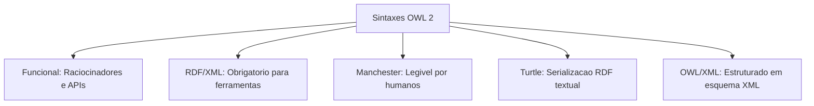

# 1. request
quero uma sintese unica das fontes, em arquivo markdown para eu baixar
- requisitos
	- maximo 5 paginas
	- formatação markdown
		- usar
			- headings, considerar como nós de um knowledge graph (mindmap)
		- usar moderadamente 
			- diagramas, mas caso necessario usar linguagem mermaid 
		- não usar
			- horizontal ruler `---` 
			- formatação adicional nos headings 

# 2. sintese OWL

## 2.1. O que e o OWL 2
O OWL 2 Web Ontology Language e uma linguagem de ontologias para a Web Semantica com significado formalmente definido [3]. Ontologias escritas em OWL 2 sao estruturadas como documentos e servem para descrever de forma precisa porcoes do mundo real, chamadas de dominios de interesse [3, 13]. Elas auxiliam na comunicacao humana e garantem a consistencia do comportamento de softwares e agentes na web [13].

As ontologias em OWL 2 sao baseadas em computacao logica [7]. Esse carater declarativo faz com que ferramentas de raciocinio automatizado (raciocinadores) consigam computar consequencias logicas e inferir novos fatos implicitamente contidos na base [7, 15, 19].

## 2.2. Modelagem de Conhecimento e Noções Basicas
O OWL 2 representa o conhecimento por meio de tres elementos lógicos principais: axiomas, entidades e expressoes [17].

### 2.2.1. Axiomas
Axiomas sao proposicoes logicas que a ontologia assume como verdadeiras [17, 18]. Diferente das entidades, os axiomas representam declaracoes com valor de verdade avaliavel [18]. A interacao desses axiomas determina as consequencias dedutivas que um raciocinador pode extrair [19, 20].

### 2.2.2. Entidades
As entidades denotam os objetos e relacoes do dominio [17, 21]. Sao divididas em:
* Individuos: representam objetos ou elementos concretos do dominio [21].
* Classes: categorizam os individuos e funcionam essencialmente como conjuntos [21, 24].
* Propriedades: estabelecem relacoes, dividindo-se em propriedades de objeto (relacao entre individuos) e propriedades de dados (relacao de individuos com dados literais) [21].
* Propriedades de anotacao: utilizadas para registrar metadados sobre a ontologia ou sobre axiomas especificos (como comentarios ou autor), sem interferir no raciocinio logico principal [21, 113].

### 2.2.3. Expressoes
As expressoes sao criadas combinando entidades por meio de construtores logicos [17, 22]. Elas criam novos conceitos a partir de componentes basicos, como a interseccao ou a uniao de classes preexistentes [22, 50].

## 2.3. Sintaxes e Serializações
O OWL 2 oferece diferentes syntaxes para variados contextos praticos de uso [11].

* Sintaxe de Estilo Funcional: Projetada para fins de especificacao e implementacao estrutural de APIs e raciocinadores [11].
* RDF/XML: A unica sintaxe de suporte obrigatorio para todos os sistemas em conformidade com o OWL 2, integrando-se diretamente ao formato basico da Web Semantica [11].
* Sintaxe de Manchester: Focada em facilitar a leitura e edicao por pessoas nao especialistas em logica formal, apresentando declaracoes implicitas [11, 128].
* Outros Formatos RDF: Inclui o formato Turtle, que possibilita representacoes compactas e legiveis em triplos RDF [12, 131].

## 2.4. Semanticas de Interpretacao
Existem duas semanticas principais para definir o significado de uma ontologia em OWL 2 [15, 131].

### 2.4.1. Semantica Direta e OWL 2 DL
A Semantica Direta fornece significado ao OWL 2 no estilo da Logica de Descricao [131, 132]. Ela se aplica ao subconjunto computacional chamado OWL 2 DL [131]. Por ter restricoes sintaticas bem definidas, o OWL 2 DL e computacionalmente decidivel, possibilitando a criacao de raciocinadores capazes de resolver consultas de consistencia com garantia de término [133].

### 2.4.2. Semantica Baseada em RDF e OWL 2 Full
A Semantica Baseada em RDF interpreta ontologias visualizando-as como grafos RDF, estendendo as nocoes semanticas do RDFS [131, 132]. Qualquer documento OWL 2 e valido sob o OWL 2 Full [131]. Ele oferece alta flexibilidade e expressividade de metamodelagem (incluindo o punning reflexivo irrestrito), porem e computacionalmente indecidivel [133, 134].

## 2.5. Perfis do OWL 2
Para cenarios que exigem alta performance e escalabilidade em detrimento de alguma expressividade logica, o OWL 2 define tres perfis (subconjuntos sintaticos) [137].

### 2.5.1. Perfil OWL 2 EL
* Fundamento: Baseado na familia EL de lógicas de descricao, focado em restricoes existenciais [140, 142].
* Aplicabilidade: Projetado para grandes ontologias voltadas para terminologias medicas e cientificas, como o SNOMED-CT e NCI [140].
* Caracteristicas: Permite estruturacoes conceituais complexas e de grande porte, disallowing quantificadores universais ou inverso de propriedades [140, 141].

### 2.5.2. Perfil OWL 2 QL
* Fundamento: Otimizado para permitir que as consultas lógicas sejam reescritas de forma automatizada em comandos SQL tradicionais [146, 148].
* Aplicabilidade: Usado para mapeamento de esquemas relacionais, integracao de dados corporativos e representacao de taxonomias do tipo UML [146].
* Caracteristicas: Nao oferece suporte a cadeias de propriedades, axiomas de igualdade de individuos ou quantificacao existencial apontando para expressoes complexas [147].

### 2.5.3. Perfil OWL 2 RL
* Fundamento: Projetado para rodar em motores de inferencia baseados em linguagens de regras tradicionais de primeira ordem [152, 154].
* Aplicabilidade: Excelente para sistemas que ja utilizam RDF nativamente e desejam expandir dados por regras dinamicas [153].
* Caracteristicas: Restringe a sintaxe de modo a impedir declaracoes de ocorrencia de novos individuos anonimos em consequencia de outros [153, 154].

## 2.6. Tecnicas de Modelagem Pratica

### 2.6.1. Relacionando Classes
* Hierarquias: Estabelecidas por axiomas de subclasse (SubClassOf) [27]. A relacao e reflexiva e transitiva [29].
* Equivalencia: Duas classes sao semanticamente equivalentes se compartilharem exatamente a mesma extensao de individuos (EquivalentClasses) [30].
* Disjuncao: Define exclusao mutua de pertinencia (DisjointClasses), indicando que duas classes nao contem nenhum elemento em comum [32].

### 2.6.2. Uso Avancado de Propriedades
As propriedades podem receber caracteristicas logicas que determinam as deducoes estruturais calculadas pelos raciocinadores [21, 85]:
* Propriedade Simetrica: Se relaciona A com B, tambem relaciona B com A [88, 89].
* Propriedade Assimetrica: Relacionamento unidirecional estrito; se relaciona A com B, nunca relacionara B com A [89, 90].
* Propriedade Transitiva: Propaga a relacao por caminhos estruturados [97].
* Propriedade Funcional: Determina que cada individuo pode possuir no maximo um elemento relacionado por essa propriedade [94, 95].
* Cadeias de Propriedade: Permite definir relacoes indiretas a partir da combinacao sequencial de outras propriedades [98].

### 2.6.3. Restrições Lógicas de Classe
O OWL 2 permite restringir propriedades para definir o escopo de associacao de uma classe [61]:
* Quantificacao Existencial (someValuesFrom): Exige que haja pelo menos uma conexao correspondente à classe descrita [62, 64].
* Quantificacao Universal (allValuesFrom): Garante que todas as conexoes daquela propriedade apontem para a classe indicada (se nao houver conexao, e considerada satisfeita) [64, 67].
* Restricoes de Cardinalidade: Permitem estabelecer limites minimos, maximos ou exatos para as conexoes de propriedades [74, 75, 77, 79].
