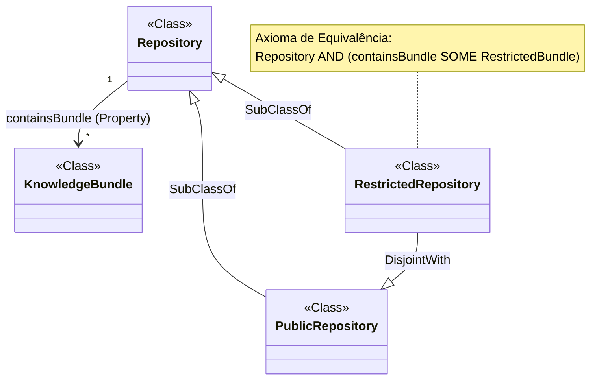
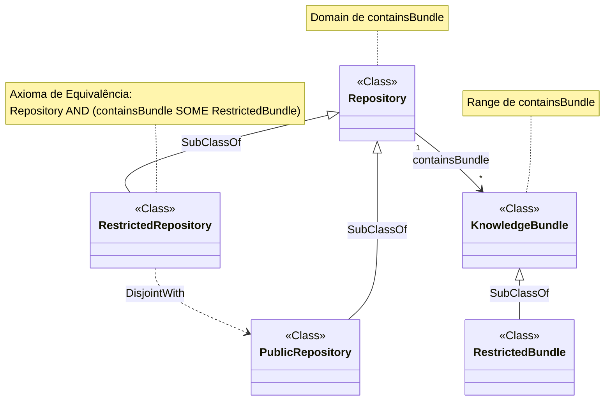
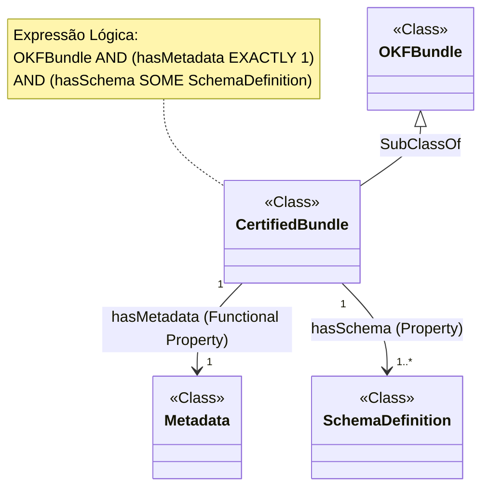

# 1. Requests

Crie pelo menos 2 exemplos de caso de uso de [entidades, axiomas, expressões] no conceito sobre repositorios no contexto de arquitetura de um knowledge bundle (conceito do Google OKF Open knowledge format). Cada exemplo deve ter também um diagrama de classes mermaid, que é usado na owl.

# 2. exemplos

Com base nos conceitos de **entidades, axiomas e expressões** definidos na fonte sobre o OWL 2, apresento dois exemplos de casos de uso aplicados ao gerenciamento de repositórios no contexto de uma arquitetura de **Knowledge Bundle** (Open Knowledge Format).

## 2.1. Exemplo 1: Classificação e Restrição de Acesso a Repositórios de Dados
Neste cenário, utilizamos OWL para garantir que repositórios que contenham bundles sensíveis sejam automaticamente classificados como "Repositórios Restritos", exigindo protocolos de segurança específicos.

*   **Entidades**: Definimos as classes `Repository`, `KnowledgeBundle` e `SecurityLevel` [1, 2]. Criamos a propriedade de objeto `containsBundle` para ligar um repositório aos seus pacotes de conhecimento [2, 3].
*   **Expressões**: Criamos uma expressão de classe anônima usando a **quantificação existencial (`someValuesFrom`)** para descrever qualquer repositório que contenha pelo menos um bundle com nível de segurança "Restrito" [4, 5].
*   **Axiomas**: Estabelecemos um axioma de **equivalência de classe (`EquivalentClasses`)** para que o raciocinador classifique automaticamente qualquer instância que atenda à expressão acima como um `RestrictedRepository` [6]. Também usamos um axioma de **disjunção (`DisjointClasses`)** entre `PublicRepository` e `RestrictedRepository` para evitar inconsistências [6].



## 2.2. Exemplo 1: explicações e revisao 
### 2.2.1. Resposta às Suas Dúvidas de Modelagem

#### 2.2.1.1. Inconsistência da classe `SecurityLevel`
A inclusão do termo `SecurityLevel` no texto anterior era desnecessária para a estrutura do diagrama. Para simplificar e manter a ontologia consistente, eliminamos essa classe [1]. Em seu lugar, modelamos a classe `RestrictedBundle` como uma subclasse especializada de `KnowledgeBundle` [2].

#### 2.2.1.2. Por que usar Subclasses (`RestrictedRepository` / `PublicRepository`) em vez de Propriedades?
* **Modelagem Tradicional vs. Ontológica**: Em modelagem de dados tradicional (ou orientação a objetos), o status "Restrito" costuma ser um atributo ou propriedade (ex: `status = "RESTRICTED"`). Em OWL 2, **Classes representam conjuntos de indivíduos** no domínio [1, 3]. `Repository` é o conjunto de todos os repositórios [3], enquanto `RestrictedRepository` e `PublicRepository` são subconjuntos específicos [2, 4].
* **Classificação por Raciocínio Dedutivo**: O objetivo de declarar `RestrictedRepository` como uma classe é permitir que o **raciocinador automatizado (reasoner)** infira e classifique os objetos automaticamente [5-7]. Em vez de um programador ter que definir manualmente o status do repositório, o raciocinador analisa os pacotes contidos e deduz a qual subclasse o repositório pertence [4, 8, 9].
* **Garantia de Incompatibilidade Lógica**: Ao definir `RestrictedRepository` e `PublicRepository` como subclasses explicitamente disjuntas (`DisjointClasses`), garantimos que um raciocinador aponte uma inconsistência caso um repositório seja classificado acidentalmente em ambas as categorias [10-12].

#### 2.2.1.3. Onde está a Expressão Anônima e a Consistência de `containsBundle`?
* **A Expressão de Classe Anônima**: Em OWL 2, os construtores lógicos como a quantificação existencial (`someValuesFrom` / `SOME`) e a interseção (`ObjectIntersectionOf` / `AND`) criam **expressões de classe sem nome próprio (anônimas)** [9, 13-15]. A expressão:
  \\[\text{containsBundle } \mathbf{SOME} \text{ RestrictedBundle}\\]
  descreve a classe anônima *"conjunto de todas as coisas que possuem ao menos um pacote restrito"* [9]. Ao combiná-la com a classe `Repository`, formamos a expressão anônima completa:
  \\[\text{Repository } \mathbf{AND} \text{ (containsBundle } \mathbf{SOME} \text{ RestrictedBundle)}\\] [9, 15].
* **Consistência da Propriedade `containsBundle`**: Para delimitar o uso correto da propriedade no grafo, adicionamos os axiomas formais de **Domínio** (`Domain`) e **Alcance** (`Range`) [16, 17]:
  * **Domain**: `Repository` (somente repositórios podem conter pacotes) [17].
  * **Range**: `KnowledgeBundle` (o objeto contido deve ser obrigatoriamente um pacote de conhecimento) [17].

---

### 2.2.2. Exemplo 1 (Revisado): Classificação Automática e Validação de Repositórios

#### 2.2.2.1. Entidades [1]
* **Classes**: `Repository`, `KnowledgeBundle`, `RestrictedBundle` (subclasse de `KnowledgeBundle`), `RestrictedRepository` e `PublicRepository` (subclasses de `Repository`) [1, 2].
* **Propriedades de Objeto**: `containsBundle` [1].

#### 2.2.2.2. Axiomas de Propriedade (Consistência)
* `ObjectPropertyDomain(containsBundle, Repository)` [17].
* `ObjectPropertyRange(containsBundle, KnowledgeBundle)` [17].

#### 2.2.2.3. Expressão de Classe Anônima
* `Repository AND (containsBundle SOME RestrictedBundle)` (Interseção entre a classe `Repository` e a restrição existencial anônima) [9, 15].

#### 2.2.2.4. Axiomas de Classe
* `EquivalentClasses(RestrictedRepository, Repository AND (containsBundle SOME RestrictedBundle))` (Define que qualquer repositório que atenda à expressão anônima é inferido como `RestrictedRepository`) [9, 15, 18].
* `DisjointClasses(RestrictedRepository, PublicRepository)` (Garante que nenhum repositório possa pertencer a ambas as categorias simultaneamente) [12].



```turtle 
@prefix : <http://example.org/okf/repository-classification#> .
@prefix owl: <http://www.w3.org/2002/07/owl#> .
@prefix rdf: <http://www.w3.org/1999/02/22-rdf-syntax-ns#> .
@prefix xml: <http://www.w3.org/2001/XMLSchema#> .
@prefix rdfs: <http://www.w3.org/2000/01/rdf-schema#> .

<http://example.org/okf/repository-classification> a owl:Ontology ;
    rdfs:comment "Ontologia para Classificacao Automatica de Repositorios no contexto de Knowledge Bundles (OKF)."@pt .

# Declaracao de Classes
	:Repository a owl:Class ;
	    rdfs:label "Repository"@en, "Repositório"@pt .
	
	:KnowledgeBundle a owl:Class ;
	    rdfs:label "Knowledge Bundle"@en, "Pacote de Conhecimento"@pt .
	
	:RestrictedBundle a owl:Class ;
	    rdfs:subClassOf :KnowledgeBundle ;
	    rdfs:label "Restricted Bundle"@en, "Pacote Restrito"@pt .
	
	:RestrictedRepository a owl:Class ;
	    rdfs:subClassOf :Repository ;
	    rdfs:label "Restricted Repository"@en, "Repositório Restrito"@pt .
	
	:PublicRepository a owl:Class ;
	    rdfs:subClassOf :Repository ;
	    rdfs:label "Public Repository"@en, "Repositório Público"@pt .
# Propriedade de Objeto e Restrições de Domínio/Alcance
	:containsBundle a owl:ObjectProperty ;
	    rdfs:domain :Repository ;
	    rdfs:range :KnowledgeBundle ;
	    rdfs:label "contains bundle"@en, "contém pacote"@pt .
# Axioma de Disjunção entre Subclasses de Repositório
	[] a owl:AllDisjointClasses ;
	    owl:members ( :RestrictedRepository :PublicRepository ) .
	
	# Axioma de Equivalência Lógica para Classificação Automática
	:RestrictedRepository owl:equivalentClass [
	    a owl:Class ;
	    owl:intersectionOf (
	        :Repository
	        [
	            a owl:Restriction ;
	            owl:onProperty :containsBundle ;
	            owl:someValuesFrom :RestrictedBundle
	        ]
	    )
	] .
```


## 2.3. Exemplo 2: Validação de Conformidade e Integridade de Bundles
Neste caso, o foco é garantir que um repositório de produção aceite apenas bundles que possuam metadados completos e esquemas de dados validados conforme o padrão OKF.

*   **Entidades**: Definimos as classes `OKFBundle`, `Metadata` e `SchemaDefinition` [2]. Usamos a propriedade funcional `hasMetadata` para garantir que cada bundle tenha uma única descrição de metadados associada [3].
*   **Expressões**: Utilizamos **restrições de cardinalidade** para definir que um `CertifiedBundle` deve ter exatamente um metadado e pelo menos um esquema de dados válido [5].
*   **Axiomas**: Utilizamos um axioma de **subclasse (`SubClassOf`)** para declarar que todo `CertifiedBundle` é obrigatoriamente um `OKFBundle` [6]. Através da inferência, o raciocinador pode identificar se um bundle em um repositório é "inválido" caso ele falhe em satisfazer as restrições de cardinalidade expressas [1, 7].



Estes exemplos demonstram como o caráter declarativo do OWL 2 permite que a arquitetura de um repositório não seja apenas um depósito de arquivos, mas uma base de conhecimento ativa onde o software pode inferir a natureza e a segurança dos dados armazenados [7].


```turtle
@prefix : <http://example.org/okf/bundle-validation#> .
@prefix owl: <http://www.w3.org/2002/07/owl#> .
@prefix rdf: <http://www.w3.org/1999/02/22-rdf-syntax-ns#> .
@prefix xml: <http://www.w3.org/2001/XMLSchema#> .
@prefix rdfs: <http://www.w3.org/2000/01/rdf-schema#> .
@prefix xsd: <http://www.w3.org/2001/XMLSchema#> .
<http://example.org/okf/bundle-validation> a owl:Ontology ;
    rdfs:comment "Ontologia para Validação de Conformidade e Integridade de Knowledge Bundles (OKF)."@pt .
# Declaracao de Classes
	:OKFBundle a owl:Class ;
	    rdfs:label "OKF Bundle"@en, "Pacote OKF"@pt .
	:CertifiedBundle a owl:Class ;
	    rdfs:subClassOf :OKFBundle ;
	    rdfs:label "Certified Bundle"@en, "Pacote Certificado"@pt .
	:Metadata a owl:Class ;
	    rdfs:label "Metadata"@en, "Metadados"@pt .
	:SchemaDefinition a owl:Class ;
	    rdfs:label "Schema Definition"@en, "Definição de Esquema"@pt .
# Propriedades de Objeto e Restrições de Domínio/Alcance
	:hasMetadata a owl:ObjectProperty, owl:FunctionalProperty ;
	    rdfs:domain :OKFBundle ;
	    rdfs:range :Metadata ;
	    rdfs:label "has metadata"@en, "possui metadados"@pt .
	:hasSchema a owl:ObjectProperty ;
	    rdfs:domain :OKFBundle ;
	    rdfs:range :SchemaDefinition ;
	    rdfs:label "has schema"@en, "possui esquema"@pt .
# Axioma de Equivalência Lógica para Validação do CertifiedBundle
	:CertifiedBundle owl:equivalentClass [
	    a owl:Class ;
	    owl:intersectionOf (
	        :OKFBundle
	        [
	            a owl:Restriction ;
	            owl:onProperty :hasMetadata ;
	            owl:qualifiedCardinality "1"^^xsd:nonNegativeInteger ;
	            owl:onClass :Metadata
	        ]
	        [
	            a owl:Restriction ;
	            owl:onProperty :hasSchema ;
	            owl:someValuesFrom :SchemaDefinition
	        ]
	    )
	] .
```

# 3. Comparativo de Representação: Entidades, Expressões e Axiomas

## 3.1. Entidades

Entidades são os elementos básicos e identificáveis do domínio do conhecimento. Elas representam os objetos concretos, os agrupamentos conceituais e os tipos de relações ou atributos existentes na base de conhecimento.

### 3.1.1. Indivíduos e Recursos
Representam elementos ou objetos concretos e específicos do domínio.
* OWL: `owl:NamedIndividual` (indivíduos nomeados com URIs únicos).
* RDFS: `rdfs:Resource` / `rdf:Description` (qualquer recurso identificado por um URI).
* SKOS: `skos:Concept` (o conceito atua como a unidade central individual de pensamento).

### 3.1.2. Classes e Categorias
Representam conjuntos, coleções de indivíduos ou tipos de entidades que compartilham características comuns.
* OWL: `owl:Class` (interpretada como um conjunto formal de indivíduos sujeitos ao raciocínio lógico).
* RDFS: `rdfs:Class` (definida pela relação de pertinência `rdf:type`).
* SKOS: `skos:ConceptScheme` / `skos:Concept` (esquemas de conceitos que agrupam ideias; instâncias de conceitos também podem ser categorizadas via `owl:Class` no perfil OWL Full).

### 3.1.3. Propriedades de Objeto
Representam relações diretas que conectam uma entidade (indivíduo) a outra entidade.
* OWL: `owl:ObjectProperty` (relaciona um indivíduo a outro indivíduo).
* RDFS: `rdf:Property` / `rdfs:Property` (propriedades genéricas sem distinção rigorosa entre objeto e dado).
* SKOS: `skos:semanticRelation` (superpropriedade de conexões conceituais, especializada em `skos:broader`, `skos:narrower` e `skos:related`).

### 3.1.4. Propriedades de Dados e Atributos
Representam atributos que conectam uma entidade a valores literais (strings, números, datas).
* OWL: `owl:DatatypeProperty` (relaciona um indivíduo a um valor literal tipado por XML Schema).
* RDFS: `rdf:Property` (utilizada conjuntamente com `rdfs:range rdfs:Literal`).
* SKOS: `skos:notation` (usada para associar códigos alfanuméricos) ou uso de literais diretos em propriedades lexicais.

### 3.1.5. Propriedades de Anotação
Representam metadados legíveis por humanos sobre o modelo, sem interferir no motor de raciocínio lógico.
* OWL: `owl:AnnotationProperty` (ex: `rdfs:comment`, `rdfs:label`, `owl:versionInfo`).
* RDFS: `rdfs:label` e `rdfs:comment`.
* SKOS: `skos:prefLabel`, `skos:altLabel`, `skos:hiddenLabel`, `skos:definition`, `skos:scopeNote`, `skos:example`, `skos:historyNote`.

## 3.2. Expressões

Expressões são construções lógicas anônimas formadas pela combinação de entidades por meio de construtores lógicos. Elas definem novos conceitos complexos e restrições dinâmicas sem a necessidade de nomear formalmente uma nova classe.

### 3.2.1. Conjunção e Interseção
Representam a sobreposição exata entre múltiplos conjuntos ou conceitos.
* OWL: `owl:intersectionOf` (expressão que exige que o indivíduo pertença a todas as classes listadas simultaneamente).
* RDFS: Herança múltipla usando múltiplos axiomas `rdfs:subClassOf` (conjunção implícita de superclasses).
* SKOS: Sobreposição semântica obtida por pós-coordenação ou interseção de listas de conceitos.

### 3.2.2. Disjunção e União
Representam a junção abrangente de múltiplos conjuntos ou conceitos.
* OWL: `owl:unionOf` (expressão que inclui qualquer indivíduo que pertença a pelo menos uma das classes listadas).
* RDFS: Sem suporte nativo direto para união lógica formal.
* SKOS: `skos:Collection` (agrupa conceitos para exibição ou organização sem impor união lógica formal).

### 3.2.3. Negação e Complemento
Representam o conjunto oposto, excluindo todos os indivíduos de uma classe específica.
* OWL: `owl:complementOf` (define todos os indivíduos que não pertencem à classe informada).
* RDFS: Sem suporte nativo.
* SKOS: Sem suporte nativo.

### 3.2.4. Restrição Existencial
Exige que uma entidade possua ao menos uma relação de determinado tipo com outra classe.
* OWL: `owl:someValuesFrom` (usada em restrições de classe anônimas `owl:Restriction` com `owl:onProperty`).
* RDFS: Sem suporte a restrições de escopo em classes (apenas restrições globais via `rdfs:range`).
* SKOS: Sem suporte lógico formal (estruturado via conexões de relacionamentos diretos entre instâncias).

### 3.2.5. Restrição Universal
Garante que todas as relações de uma propriedade especificamente apontem para elementos de uma determinada classe.
* OWL: `owl:allValuesFrom` (usada em `owl:Restriction`).
* RDFS: `rdfs:range` (aplica a restrição de maneira global a todas as ocorrências da propriedade, não apenas no contexto de uma classe específica).
* SKOS: Sem suporte nativo (as relações semânticas aplicam-se livremente entre quaisquer instâncias de `skos:Concept`).

### 3.2.6. Restrição de Cardinalidade
Estabelece limites mínimos, máximos ou exatos no número de conexões de uma propriedade.
* OWL: `owl:minCardinality`, `owl:maxCardinality`, `owl:cardinality`, `owl:qualifiedCardinality`.
* RDFS: Sem suporte a cardinalidade.
* SKOS: Integridade estrutural garantida por convenção (ex: no máximo um `skos:prefLabel` por tag de idioma por conceito).

### 3.2.7. Enumeração de Indivíduos
Define uma classe anônima listando explicitamente todos os seus membros constitutivos.
* OWL: `owl:oneOf` (associa uma classe a uma lista fechada `rdf:List` de indivíduos).
* RDFS: Sem suporte nativo.
* SKOS: `skos:OrderedCollection` com `skos:memberList` (para coleções ordenadas de conceitos).

## 3.3. Axiomas

Axiomas são declarações e proposições lógicas fundamentais que a ontologia assume como verdadeiras. Eles possuem valor de verdade avaliável e alimentam diretamente os motores de inferência para a dedução de novos fatos.

### 3.3.1. Hierarquia e Subsumção de Classes
Declara que todos os membros de uma classe específica são também membros de uma superclasse.
* OWL: `owl:subClassOf` / `rdfs:subClassOf` (propriedade reflexiva e transitiva).
* RDFS: `rdfs:subClassOf`.
* SKOS: `skos:broader` (tem conceito mais geral) / `skos:narrower` (tem conceito mais específico). Nota: por padrão, `skos:broader` não é transitiva em taxonomias SKOS comuns.

### 3.3.2. Equivalência de Classes e Mapeamentos
Declara que duas classes ou conceitos possuem a mesma extensão semântica ou significado intercambiável.
* OWL: `owl:equivalentClass` (indica que duas classes contêm exatamente o mesmo conjunto de indivíduos).
* RDFS: Par de declarações recíprocas `rdfs:subClassOf`.
* SKOS: `skos:exactMatch` (equivalência estrita e transitiva entre conceitos de esquemas diferentes) e `skos:closeMatch` (relação não transitiva de similaridade).

### 3.3.3. Disjunção de Classes
Declara exclusão mútua entre duas ou mais classes.
* OWL: `owl:disjointWith` ou `owl:DisjointClasses` (garante que nenhum indivíduo pertença a ambas as classes).
* RDFS: Sem suporte nativo.
* SKOS: Disjunção estrutural por regra de modelo (ex: `skos:Concept` e `skos:Collection` são disjuntos).

### 3.3.4. Domínio e Alcance de Propriedades
Restringe o tipo de entidade que pode figurar como sujeito ou objeto de uma relação.
* OWL: `rdfs:domain` e `rdfs:range` (usados com `owl:ObjectProperty` ou `owl:DatatypeProperty`).
* RDFS: `rdfs:domain` e `rdfs:range` (usados com `rdf:Property`).
* SKOS: `rdfs:domain skos:Concept` e `rdfs:range skos:Concept` definidos formalmente para `skos:semanticRelation`.

### 3.3.5. Identidade e Equivalência de Indivíduos
Declara que dois nomes/URIs referem-se rigorosamente ao mesmo recurso no mundo real.
* OWL: `owl:sameAs` (unifica todos os fatos e propriedades dos dois nós em um único nó lógico).
* RDFS: Sem suporte nativo.
* SKOS: `skos:exactMatch` (preferido no SKOS em vez de `owl:sameAs` para evitar a fusão desnecessária de metadados lexicais como `skos:prefLabel`).

### 3.3.6. Diferenciação de Indivíduos
Declara que dois ou mais URIs representam indivíduos obrigatoriamente distintos.
* OWL: `owl:differentFrom` ou `owl:AllDifferent`.
* RDFS: Sem suporte nativo (vale a hipótese de mundo aberto - Open World Assumption).
* SKOS: Sem suporte nativo.

### 3.3.7. Características Lógicas de Propriedades
Atribui comportamentos de inferência dedutiva às propriedades.
* OWL: `owl:TransitiveProperty`, `owl:SymmetricProperty`, `owl:AsymmetricProperty`, `owl:FunctionalProperty`, `owl:InverseFunctionalProperty`, `owl:inverseOf`.
* RDFS: Sem suporte nativo a características avançadas de propriedades.
* SKOS: `skos:broaderTransitive` / `skos:narrowerTransitive` (para suporte a fechamento transitivo), `skos:related` (simétrica) e inversão explícita entre `skos:broader` e `skos:narrower`.


# 4. [paused] Modelo Comparativo de Entidades, Expressões e Axiomas em Engenharia de Software

## 4.1. Entidades

### 4.1.1. Indivíduos e Recursos

| Título Genérico | OWL | RDFS | SKOS | Comumente Aplicado em |
| --- | --- | --- | --- | --- |
| Instâncias de Commits e Revisões | `owl:NamedIndividual` (ex: `commit_a1b2c3d`) | `rdfs:Resource` / `rdf:Description` (ex: `http://git.org/commit/a1b2c3d`) | `skos:Concept` (conceito representando o evento do commit) | Rastreabilidade de versionamento e auditoria de código-fonte |
| Servidores e Nós de Infraestrutura | `owl:NamedIndividual` (ex: `node_aws_prod_01`) | `rdfs:Resource` (ex: `http://infra.org/node/01`) | `skos:Concept` (nó de inventário de infraestrutura) | Gerenciamento de configuração, DevOps e mapas de topologia |
| Desenvolvedores e Atores | `owl:NamedIndividual` (ex: `user_alice_dev`) | `rdfs:Resource` / `foaf:Person` (ex: `http://team.org/user/alice`) | `skos:Concept` (conceito do ator/papel do especialista) | Atribuição de responsabilidade, revisão de código e gestão de times |
| Artefatos Compilados e Builds | `owl:NamedIndividual` (ex: `build_1042_jar`) | `rdfs:Resource` (ex: `http://ci.org/build/1042`) | `skos:Concept` (item no catálogo de produtos gerados) | Gestão de release, esteiras de CI/CD e repositórios de binários |
| Pacotes e Bibliotecas Externas | `owl:NamedIndividual` (ex: `npm_express_4_18`) | `rdfs:Resource` (ex: `http://registry.org/npm/express`) | `skos:Concept` (termo de biblioteca em catálogo) | Análise de dependências de software e gestão de licenças |
| Registros de Tarefas e Bugs | `owl:NamedIndividual` (ex: `issue_bug_1420`) | `rdfs:Resource` (ex: `http://tracker.org/issue/1420`) | `skos:Concept` (item de trabalho no vocabulário) | Gestão de chamados, rastreamento de defeitos e listas de backlog |

### 4.1.2. Classes e Categorias

| Título Genérico | OWL | RDFS | SKOS | Comumente Aplicado em |
| --- | --- | --- | --- | --- |
| Componentes e Módulos | `owl:Class` (ex: `swo:SoftwareComponent`) | `rdfs:Class` (ex: `seon:SoftwareModule`) | `skos:ConceptScheme` / `skos:Concept` (categoria no vocabulário) | Arquitetura de software e catalogação de componentes reutilizáveis |
| Requisitos e Histórias de Usuário | `owl:Class` (ex: `seon:FunctionalRequirement`) | `rdfs:Class` (ex: `req:UserStory`) | `skos:Concept` (conceito taxonômico de requisito) | Engenharia de requisitos e rastreabilidade de escopo |
| Tipos de Defeito e Erros | `owl:Class` (ex: `seon:BugReport`) | `rdfs:Class` (ex: `tracker:Defect`) | `skos:Concept` (categoria de falha no KOS) | Análise de qualidade de software e classificação de incidentes |
| Ambientes de Execução | `owl:Class` (ex: `devops:DeploymentEnvironment`) | `rdfs:Class` (ex: `infra:Environment`) | `skos:Concept` (classificação de ambiente) | Automação de deploy e gerenciamento de infraestrutura como código |
| Serviços e Endpoints REST | `owl:Class` (ex: `arch:Microservice`) | `rdfs:Class` (ex: `api:RESTEndpoint`) | `skos:Concept` (termo de serviço em catálogo) | Governança de APIs, service mesh e arquiteturas orientadas a serviços |
| Tipos de Teste de Software | `owl:Class` (ex: `seon:UnitTest`) | `rdfs:Class` (ex: `test:IntegrationTest`) | `skos:Concept` (categoria de teste) | Estratégia de garantia de qualidade e automação de testes |

### 4.1.3. Propriedades de Objeto

| Título Genérico | OWL | RDFS | SKOS | Comumente Aplicado em |
| --- | --- | --- | --- | --- |
| Relação de Dependência de Código | `owl:ObjectProperty` (ex: `dependsOnLibrary`) | `rdf:Property` (ex: `importsModule`) | `skos:related` / `skos:semanticRelation` | Análise de impacto de mudanças e compilação de projetos |
| Rastreabilidade de Requisitos | `owl:ObjectProperty` (ex: `implementsRequirement`) | `rdf:Property` (ex: `satisfiesReq`) | `skos:relatedMatch` / `skos:broadMatch` | Matriz de rastreabilidade entre código e requisitos de negócio |
| Deploy em Infraestrutura | `owl:ObjectProperty` (ex: `deployedToEnvironment`) | `rdf:Property` (ex: `runsOnHost`) | `skos:related` | Orquestração de contêiners e controle de topologia de implantação |
| Autoria e Revisão de Código | `owl:ObjectProperty` (ex: `authoredBy`) | `rdf:Property` (ex: `reviewedBy`) | `skos:related` | Governança de repositórios e auditoria de commits |
| Composição Arquitetural | `owl:ObjectProperty` (ex: `containsSubmodule`) | `rdf:Property` (ex: `hasPart`) | `skos:narrower` / `skos:broader` | Decomposição de sistemas e modelagem de diagramas UML |
| Associação de Release e Branch | `owl:ObjectProperty` (ex: `mergedIntoBranch`) | `rdf:Property` (ex: `partOfRelease`) | `skos:related` | Gerenciamento de fluxo de trabalho Git (GitFlow) e entregas |

### 4.1.4. Propriedades de Dados e Atributos

| Título Genérico | OWL | RDFS | SKOS | Comumente Aplicado em |
| --- | --- | --- | --- | --- |
| Métricas de Qualidade e Complexidade | `owl:DatatypeProperty` (ex: `cyclomaticComplexity` `xsd:integer`) | `rdf:Property` com `rdfs:range rdfs:Literal` | `skos:notation` / literais em propriedades personalizadas | Auditoria de código, análise estática e dívida técnica |
| Identificadores Únicos e Hashes | `owl:DatatypeProperty` (ex: `commitHash` `xsd:string`) | `rdf:Property` (ex: `buildNumber`) | `skos:notation` (ex: código alfanumérico UDC/notação) | Integridade de artefatos e identificação de commits em VCS |
| Marcas Temporais e Cronologia | `owl:DatatypeProperty` (ex: `executionTimeMs` `xsd:decimal`) | `rdf:Property` (ex: `createdAtTimestamp`) | Literais associados a notas de histórico (`skos:historyNote`) | Monitoramento de performance e SLA de pipelines |
| Indicadores de Status e Severidade | `owl:DatatypeProperty` (ex: `vulnerabilityCVSS` `xsd:float`) | `rdf:Property` (ex: `buildStatus`) | `skos:prefLabel` / `skos:notation` de gravidade | Gestão de vulnerabilidades (DevSecOps) e triagem de bugs |
| Mensagens e Logs de Execução | `owl:DatatypeProperty` (ex: `commitMessage` `xsd:string`) | `rdf:Property` (ex: `logOutputText`) | `skos:definition` / `skos:scopeNote` | Diagnóstico de falhas, registros de auditoria e changelogs |
| Parâmetros de Configuração | `owl:DatatypeProperty` (ex: `allocatedMemoryMB` `xsd:integer`) | `rdf:Property` (ex: `portNumber`) | `skos:notation` sintática de parâmetro | Provisionamento de ambientes e parametrização de microsserviços |

### 4.1.5. Propriedades de Anotação

| Título Genérico | OWL | RDFS | SKOS | Comumente Aplicado em |
| --- | --- | --- | --- | --- |
| Nomes Legíveis e Títulos | `owl:AnnotationProperty` (ex: `rdfs:label`) | `rdfs:label` | `skos:prefLabel` (rótulo preferencial por idioma) | Interface de usuário em ferramentas de modelagem e catálogos |
| Descrições Técnicas e Documentação | `owl:AnnotationProperty` (ex: `rdfs:comment`) | `rdfs:comment` | `skos:definition` / `skos:scopeNote` | Documentação de APIs, dicionário de dados e glossários |
| Depreciação e Versionamento de API | `owl:AnnotationProperty` (ex: `owl:deprecated` `xsd:boolean`) | `rdfs:seeAlso` | `skos:changeNote` / `skos:historyNote` | Mapeamento de ciclo de vida de software e APIs legadas |
| Notas Editoriais e Pendências | `owl:AnnotationProperty` (ex: `rdfs:comment`) | `rdfs:comment` | `skos:editorialNote` | Gestão interna de ontologias de engenharia e notas de revisão |
| Referência a Especificações Externas | `owl:AnnotationProperty` (ex: `rdfs:isDefinedBy`) | `rdfs:isDefinedBy` / `rdfs:seeAlso` | `skos:exactMatch` / notas documentárias | Vinculação com documentação OpenAPI/Swagger ou RFCs |
| Sinônimos e Termos Alternativos | `owl:AnnotationProperty` (ex: `rdfs:label`) | `rdfs:label` | `skos:altLabel` / `skos:hiddenLabel` | Mecanismos de busca técnica e tolerância a erros de digitação |

## 4.2. Expressões

### 4.2.1. Conjunção e Interseção

| Título Genérico | OWL | RDFS | SKOS | Comumente Aplicado em |
| --- | --- | --- | --- | --- |
| Microserviço Crítico de Segurança | `owl:intersectionOf` (`Microservice AND SecurityCritical`) | Herança múltipla via `rdfs:subClassOf` em ambas | Pós-coordenação de conceitos `skos:Concept` | Classificação automatizada para auditoria estrita de DevSecOps |
| Defeito de Alta Prioridade Aberto | `owl:intersectionOf` (`BugReport AND OpenStatus AND HighPriority`) | Múltiplas superclasses implícitas | Combinação de coleções de conceitos | Filtragem dinâmica de backlog em ferramentas de gestão de tarefas |
| Teste de Integração Automatizado | `owl:intersectionOf` (`TestCase AND IntegrationTest AND AutomatedTest`) | Superclasses concorrentes em RDFS | Agrupamento pós-coordenado de termos | Seleção automatizada de suítes de teste na esteira de CI/CD |
| Desenvolvedor e Revisor Principal | `owl:intersectionOf` (`Developer AND RepoMaintainer AND CodeReviewer`) | Declarações múltiplas de classe | Associação de múltiplos conceitos ao ator | Validação de regras de aprovação de Pull Requests |
| Componente Depreciado Vulnerável | `owl:intersectionOf` (`SoftwareComponent AND DeprecatedModule AND VulnerableArtifact`) | Atribuição simultânea de tipos | Combinação de rótulos em catálogos | Alertas automáticos de substituição de dependências de software |

### 4.2.2. Disjunção e União

| Título Genérico | OWL | RDFS | SKOS | Comumente Aplicado em |
| --- | --- | --- | --- | --- |
| Artefato Compilável Genérico | `owl:unionOf` (`SourceFile OR BinaryPackage OR ContainerImage`) | Sem suporte nativo direto a união | `skos:Collection` (agrupamento de conceitos) | Regras de empacotamento e artefatos elegíveis para deploy |
| Ator de Execução de Pipeline | `owl:unionOf` (`HumanDeveloper OR BotAccount OR CIProcess`) | Sem suporte nativo a união lógica | `skos:Collection` de atores de sistema | Controle de acesso unificado e auditoria de ações no repositório |
| Evento de Gatilho de CI | `owl:unionOf` (`CodePushEvent OR PullRequestEvent OR ScheduledTrigger`) | Sem suporte nativo | `skos:Collection` de eventos de gatilho | Mapeamento de webhooks e gatilhos de automação de testes |
| Ambiente de Não-Produção | `owl:unionOf` (`DevelopmentEnv OR StagingEnv OR TestingEnv`) | Sem suporte nativo | `skos:Collection` de ambientes secundários | Políticas de permissão e limpeza de recursos de infraestrutura |
| Item de Trabalho do Backlog | `owl:unionOf` (`BugReport OR FeatureRequest OR RefactoringTask`) | Sem suporte nativo | `skos:Collection` de tipos de tarefas | Unificação de visualizações em quadros Kanban/Scrum |

### 4.2.3. Negação e Complemento

| Título Genérico | OWL | RDFS | SKOS | Comumente Aplicado em |
| --- | --- | --- | --- | --- |
| Teste Manual (Não Automatizado) | `owl:complementOf` (`TestCase AND NOT AutomatedTest`) | Sem suporte a complemento | Sem suporte a negação | Identificação de gargalos de testes manuais que exigem ação humana |
| Commit Não Implantado | `owl:complementOf` (`Commit AND NOT DeployedCommit`) | Sem suporte a complemento | Sem suporte a negação | Cálculo de pendências de implantação (Deployment Lead Time) |
| Componente Sem Vulnerabilidades | `owl:complementOf` (`SoftwareModule AND NOT VulnerableComponent`) | Sem suporte a complemento | Sem suporte a negação | Certificação de segurança para liberação em ambiente de produção |
| Repositório Privado (Não Público) | `owl:complementOf` (`Repository AND NOT PublicRepository`) | Sem suporte a complemento | Sem suporte a negação | Imposição de restrições de visibilidade e vazamento de código |
| Código Não Coberto por Testes | `owl:complementOf` (`SourceCodeModule AND NOT TestedModule`) | Sem suporte a complemento | Sem suporte a negação | Geração de relatórios de cobertura de código (Code Coverage) |

### 4.2.4. Restrição Existencial

| Título Genérico | OWL | RDFS | SKOS | Comumente Aplicado em |
| --- | --- | --- | --- | --- |
| Componente com Dependência Vulnerável | `owl:someValuesFrom` (`SoftwareModule AND dependsOn SOME VulnerableLibrary`) | Sem restrição de escopo local (apenas `rdfs:range` global) | Conexões diretas entre instâncias de conceitos | Detecção automática de riscos de segurança em árvores de dependências |
| Release com Correção de Segurança | `owl:someValuesFrom` (`Release AND containsCommit SOME SecurityFixCommit`) | Sem suporte a restrições de classe anônimas | Estrutura de relacionamentos conceituais | Marcação de releases de emergência (Hotfix/Security Patch) |
| Pull Request Aprovação Pendente | `owl:someValuesFrom` (`PullRequest AND hasApproval SOME CodeReviewer`) | Sem suporte local | Sem suporte formal | Validação de portão de qualidade (Quality Gate) em Pull Requests |
| Serviço com Endpoint REST Exposto | `owl:someValuesFrom` (`Service AND exposesEndpoint SOME RESTEndpoint`) | Sem suporte local | Sem suporte formal | Catalogação e descoberta automática de APIs em malhas de serviços |
| Build com Imagem de Contêiner | `owl:someValuesFrom` (`BuildJob AND producesArtifact SOME ContainerImage`) | Sem suporte local | Sem suporte formal | Rastreamento de linhagem de artefatos (Artifact Lineage) em CI/CD |

### 4.2.5. Restrição Universal

| Título Genérico | OWL | RDFS | SKOS | Comumente Aplicado em |
| --- | --- | --- | --- | --- |
| Release Totalmente Homologada | `owl:allValuesFrom` (`SecureRelease AND hasComponent ONLY TestedComponent`) | `rdfs:range` (restrição global para a propriedade) | Sem suporte a quantificação universal | Garantia de conformidade regulatória e validação estrita de releases |
| Pipeline de Execução Segura | `owl:allValuesFrom` (`StrictPipeline AND runsJob ONLY CertifiedContainerJob`) | Restrição global via `rdfs:range` | Sem suporte | Imposição de execução de pipelines exclusivamente em nós homologados |
| Módulo Isolado de Comunicação | `owl:allValuesFrom` (`IsolatedModule AND communicatesWith ONLY InternalService`) | Restrição global via `rdfs:range` | Sem suporte | Arquiteturas de Zero-Trust e isolamento de redes de microsserviços |
| Repositório com Contribuição Assinada | `owl:allValuesFrom` (`OpenRepo AND hasContributor ONLY SignedCLAContributor`) | Restrição global via `rdfs:range` | Sem suporte | Conformidade de propriedade intelectual e licenças open-source |

### 4.2.6. Restrição de Cardinalidade

| Título Genérico | OWL | RDFS | SKOS | Comumente Aplicado em |
| --- | --- | --- | --- | --- |
| Pull Request com Dupla Reversão | `owl:qualifiedCardinality` / `owl:cardinality` (`PullRequest AND hasReview EXACTLY 2`) | Sem suporte a cardinalidade | Convenção estrutural (ex: único `prefLabel` por idioma) | Verificação de política de Code Review obrigatória por dois pares |
| Banco de Dados com Nó Primário Único | `owl:maxCardinality` (`DatabaseCluster AND hasPrimaryNode MAX 1`) | Sem suporte a cardinalidade | Convenção semântica | Validação de arquiteturas de alta disponibilidade e evita Split-Brain |
| Componente HA com Réplicas Mínimas | `owl:minCardinality` (`HAComponent AND hasReplica MIN 3`) | Sem suporte a cardinalidade | Convenção semântica | Dimensionamento de infraestrutura e tolerância a falhas em Kubernetes |
| Limite de Métodos em Classe Limpa | `owl:maxCardinality` (`ClassModule AND hasMethod MAX 50`) | Sem suporte a cardinalidade | Sem suporte | Análise de refatoração de código (evitar instâncias de God Class) |

### 4.2.7. Enumeração de Indivíduos

| Título Genérico | OWL | RDFS | SKOS | Comumente Aplicado em |
| --- | --- | --- | --- | --- |
| Ambientes Oficiais Homologados | `owl:oneOf` (`{env_dev, env_staging, env_prod}`) | Sem suporte nativo a enumeração fechada | `skos:OrderedCollection` com `skos:memberList` | Restrição de destinos válidos para scripts de implantação |
| Mantenedores do Core da Aplicação | `owl:oneOf` (`{dev_alice, dev_bob, dev_charlie}`) | Sem suporte nativo | `skos:Collection` de membros chave | Permissões de escrita direta no branch principal do repositório |
| Repositórios Oficiais do ecossistema | `owl:oneOf` (`{repo_core, repo_api, repo_ui}`) | Sem suporte nativo | `skos:Collection` de repositórios | Escopo de varredura automatizada de ferramentas de SAST/DAST |
| Suíte de Testes de Regressão Crítica | `owl:oneOf` (`{test_auth, test_payment, test_billing}`) | Sem suporte nativo | `skos:OrderedCollection` de testes | Validação de sanidade do sistema antes do deploy em produção |

## 4.3. Axiomas

### 4.3.1. Hierarquia e Subsumção de Classes

| Título Genérico | OWL | RDFS | SKOS | Comumente Aplicado em |
| --- | --- | --- | --- | --- |
| Classificação de Artefatos | `owl:subClassOf` (`SourceCode subClassOf Artifact`) | `rdfs:subClassOf` | `skos:broader` / `skos:narrower` | Organização de elementos do ciclo de vida de desenvolvimento |
| Taxonomia de Falhas e Defeitos | `owl:subClassOf` (`SecurityVulnerability subClassOf SoftwareDefect`) | `rdfs:subClassOf` | `skos:broader` / `skos:narrower` | Categorização e priorização de chamados de manutenção |
| Tipologia de Itens de Trabalho | `owl:subClassOf` (`BugReport subClassOf WorkItem`) | `rdfs:subClassOf` | `skos:broader` / `skos:narrower` | Estruturação de ferramentas de gerenciamento de projetos agile |
| Especialização de Testes | `owl:subClassOf` (`UnitTest subClassOf TestCase`) | `rdfs:subClassOf` | `skos:broader` / `skos:narrower` | Organização de planos e planos de testes automatizados |
| Arquitetura de Serviços | `owl:subClassOf` (`Microservice subClassOf DistributedService`) | `rdfs:subClassOf` | `skos:broader` / `skos:narrower` | Mapeamento de padrões arquiteturais em ecossistemas de software |

### 4.3.2. Equivalência de Classes e Mapeamentos

| Título Genérico | OWL | RDFS | SKOS | Comumente Aplicado em |
| --- | --- | --- | --- | --- |
| Definição Formal de Módulo Vulnerável | `owl:equivalentClass` (`VulnerableModule EquivalentTo Module AND (dependsOn SOME VulnerableLibrary)`) | Declarações recíprocas `rdfs:subClassOf` | `skos:exactMatch` | Inferência automatizada de componentes afetados por CVEs |
| Alinhamento de Vocabulários SEON/SWO | `owl:equivalentClass` (`seon:SoftwareComponent EquivalentTo swo:SoftwareComponent`) | `rdfs:subClassOf` mútuo | `skos:exactMatch` / `skos:closeMatch` | Interoperabilidade entre ontologias distintas de engenharia de software |
| Critério de Release Pronta | `owl:equivalentClass` (`ProductionReadyRelease EquivalentTo Release AND (hasStatus VALUE "PassedAllTests")`) | Declarações recíprocas `rdfs:subClassOf` | `skos:exactMatch` | Automação de portões de qualidade para liberação de software |
| Mapeamento de Ferramentas de Issue | `owl:equivalentClass` (`jira:Issue EquivalentTo github:Issue`) | Declarações recíprocas `rdfs:subClassOf` | `skos:exactMatch` | Integração heterogênea entre sistemas de acompanhamento de tarefas |

### 4.3.3. Disjunção de Classes

| Título Genérico | OWL | RDFS | SKOS | Comumente Aplicado em |
| --- | --- | --- | --- | --- |
| Isolamento de Ambientes | `owl:disjointWith` (`DevelopmentEnv DisjointWith ProductionEnv`) | Sem suporte a disjunção | Disjunção implícita por modelo | Validação de consistência lógica (impedir servidor em dois ambientes) |
| Níveis de Visibilidade do Código | `owl:disjointWith` (`PublicRepo DisjointWith PrivateRepo`) | Sem suporte a disjunção | Disjunção implícita | Prevenção de exposição acidental de código confidencial |
| Níveis Extremos de Severidade | `owl:disjointWith` (`CriticalSeverity DisjointWith LowSeverity`) | Sem suporte a disjunção | Disjunção implícita | Garantia de categorização unívoca em triagem de incidentes |
| Modos de Comunicação de Tarefas | `owl:disjointWith` (`SynchronousTask DisjointWith AsynchronousTask`) | Sem suporte a disjunção | Disjunção implícita | Modelagem precisa de concorrência e arquitetura de mensageria |

### 4.3.4. Domínio e Alcance de Propriedades

| Título Genérico | OWL | RDFS | SKOS | Comumente Aplicado em |
| --- | --- | --- | --- | --- |
| Associação de Correção de Bug | `rdfs:domain Commit`, `rdfs:range BugReport` | `rdfs:domain`, `rdfs:range` | `rdfs:domain skos:Concept`, `rdfs:range skos:Concept` | Validação de referências em mensagens de commit Git |
| Vínculo de Deploy de Pacotes | `rdfs:domain SoftwarePackage`, `rdfs:range Environment` | `rdfs:domain`, `rdfs:range` | `rdfs:domain skos:Concept`, `rdfs:range skos:Concept` | Verificação de conformidade em scripts de implantação |
| Métrica Numérica de Código | `rdfs:domain CodeFunction`, `rdfs:range xsd:integer` | `rdfs:domain`, `rdfs:range` | `rdfs:domain skos:Concept`, `rdfs:range xsd:integer` | Verificação do tipo de dados retornado em ferramentas de análise estática |
| Conexão de Conceitos SKOS | `rdfs:domain skos:Concept`, `rdfs:range skos:Concept` | `rdfs:domain`, `rdfs:range` | `rdfs:domain skos:Concept`, `rdfs:range skos:Concept` | Garantia de integridade do modelo conceitual SKOS |

### 4.3.5. Identidade e Equivalência de Indivíduos

| Título Genérico | OWL | RDFS | SKOS | Comumente Aplicado em |
| --- | --- | --- | --- | --- |
| Aliasing de Usuários em Plataformas | `owl:sameAs` (`user_alice_github sameAs user_alice_ldap`) | Sem suporte nativo | `skos:exactMatch` (evita fusão indesejada de rótulos) | Unificação de métricas de contribuição em ferramentas distintas |
| Redirecionamento de Repositório | `owl:sameAs` (`repo_old_name sameAs repo_new_name`) | Sem suporte nativo | `skos:exactMatch` | Manutenção de links em migrações de infraestrutura de código |
| Mapeamento de Conceitos de Vocabulários | `owl:sameAs` (fundição total de propriedades) | Sem suporte nativo | `skos:exactMatch` (preferido em SKOS para preservar descritores) | Integração de taxonomias técnicas de fornecedores diferentes |
| Aliasing de Nós de Infraestrutura | `owl:sameAs` (`server_ip_10_0_0_1 sameAs server_hostname_prod1`) | Sem suporte nativo | `skos:exactMatch` | Mapeamento de ativos de rede em inventários dinâmicos de nuvem |

### 4.3.6. Diferenciação de Indivíduos

| Título Genérico | OWL | RDFS | SKOS | Comumente Aplicado em |
| --- | --- | --- | --- | --- |
| Distinção de Ambientes de Destino | `owl:differentFrom` (`env_staging differentFrom env_production`) | Sem suporte nativo | Sem suporte nativo | Prevenção de execução acidental de comandos de teste em produção |
| Separação de Branches do Git | `owl:differentFrom` (`branch_main differentFrom branch_feature`) | Sem suporte nativo | Sem suporte nativo | Garantia de integridade em fluxos de mesclagem (merge) de código |
| Distinção de Versões de Release | `owl:differentFrom` (`release_v1_0_0 differentFrom release_v2_0_0`) | Sem suporte nativo | Sem suporte nativo | Rastreamento estrito de incompatibilidades e atualizações breaking |
| Unicidade de Instâncias de Cluster | `owl:AllDifferent` (`AllDifferent(node_1, node_2, node_3)`) | Sem suporte nativo | Sem suporte nativo | Garantia de identidade única para membros de um cluster distribuído |

### 4.3.7. Características Lógicas de Propriedades

| Título Genérico | OWL | RDFS | SKOS | Comumente Aplicado em |
| --- | --- | --- | --- | --- |
| Dependência Transitiva de Módulos | `owl:TransitiveProperty` (`dependsOn`) | Sem suporte nativo | `skos:broaderTransitive` / `skos:narrowerTransitive` | Cálculo da árvore completa de dependências diretas e indiretas |
| Comunicação Bidirecional de Serviços | `owl:SymmetricProperty` (`communicatesWith`) | Sem suporte nativo | `skos:related` | Mapeamento de conexões de rede em arquiteturas distribuídas |
| Linhagem Unidirecional de Commits | `owl:AsymmetricProperty` (`childCommitOf`) | Sem suporte nativo | Sem suporte nativo | Prevenção de ciclos inválidos em grafos direcionados acíclicos (DAG) de commits |
| Atribuição Unívoca de Mantenedor | `owl:FunctionalProperty` (`hasPrimaryMaintainer`) | Sem suporte nativo | Convenção estrutural | Garantia de um único responsável primário por projeto de software |
| Relação Inversa de Componente/Requisito | `owl:inverseOf` (`implementsRequirement inverseOf requiredByComponent`) | Sem suporte nativo | `skos:broader` inverseOf `skos:narrower` | Navegação bidirecional em relatórios de cobertura de requisitos |
