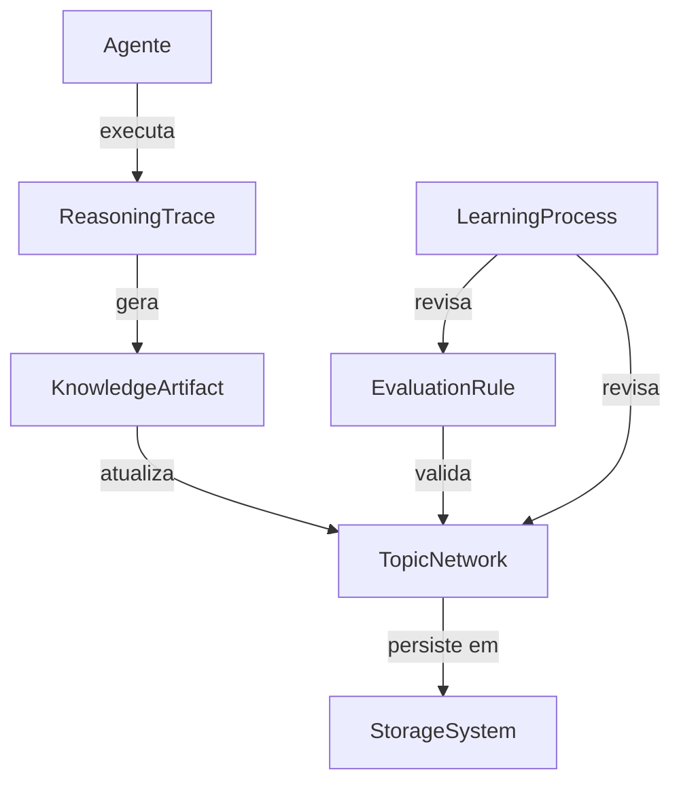
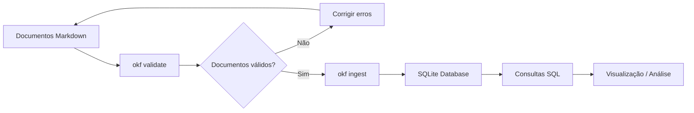

# 1. Sobre este documento

## 1.1. resumo

[[260617_conceitos_info_se_sdlc#2. modelos Mu|source: modelos Mu]]

| Form or Template                     | Description                                                                                                                                                                                                                                                                 |
| ------------------------------------ | --------------------------------------------------------------------------------------------------------------------------------------------------------------------------------------------------------------------------------------------------------------------------- |
| ==Functional Requirements Document== | Defines the functional requirements for the project including the different levels of business and end user requirements, and the functional areas of the business processes.                                                                                               |
| ==Functional Use Cases==             | casos de uso como filtro do mapa de funções                                                                                                                                                                                                                                 |
| ==SoftwareArchitecture Plan==        | This document provides a comprehensive architectural overview ofthe system, using a number ofdifferent architectural views to depict differentaspectsofthesystem.Itisintendedtocaptureandconvey the significant architectural decisions which have been made on the system. |

SRD (Software Requirements Document, ou Documento de Requisitos do Produto), documento nº 2 da familia de documentos de projeto [PRD, SRD, session_code_blocks, code_scripts, plan, plan_control].
O SRD define as especificações detalhadas para o desenvolvimento do projeto, sob a ótica funcional, suas responsabilidades, lógicas e modelos de funções e de dados. As especificações do SRD terão os nomes de todos os [code_scripts, classes, metodos] com descrições em linguagem natural das responsabilidades e logicas, ficando a cargo do documento session_code_blocks (blocos de codigo em documento markdown) especificar explicitamente os algoritmos de cada [classe, metodo] em snippets de codigo.

RESUMO FUNCIONAL 

seções 

## 1.2. instruções

### 1.2.1. instruções gerais
Como este documento é utilizado:
- 3 formas de atualização: 
	1. **manualmente** pelo usuario
	2. em **sessões interativas** com agente de IA
	3. **automaticamente** por code scripts, portanto é importante que o template seja respeitado, principalmente a estrutura de seções (headings) e seus titulos.
- extração de conteúdo da AST (Abstract Syntax Tree) das seções [arquitetura de funções,arquitetura de dados] por parsing code scripts para tabelas de dados para controle de conformidade, qualidade e implementação dos códigos.

Considerar como conteúdos **não editáveis**:
- textos das seções com titulo "instruções"
- titulos das seções existentes no inicio de uma "sessão interativa"
- estrutura (seções, subseções, titulos) das seções [arquitetura de funções,arquitetura de dados]

Considerar como conteúdos **editáveis**:
- titulos de seções novas, criadas durante uma "sessão interativa", seguir os name templates definidos nas instruçoes de cada seção
- textos solicitados pelo usuario durante uma "sessão interativa" 

spec document name templates, sempre usar a versao mais recente
- PRD: `{ref_date}_(name)_prd_{version}.md`, onde
  - ref_date: data de referencia no formato YYMMDD
  - name: nome do projeto ou da sessão
  - version: sequencial no formato NN
- SRD: `{ref_date}_(name)_srd_{version}.md`, onde
  - ref_date: data de referencia no formato YYMMDD
  - name: nome do projeto ou da sessão
  - version: sequencial no formato NN
- plano: `{ref_date}_(name)_session_plan_{version}.md`, onde
  - ref_date: data de referencia no formato YYMMDD
  - name: nome do projeto ou da sessão
  - version: sequencial no formato NN
- controle: `{ref_date}_(name)_control_{version}.md`, onde
  - ref_date: data de referencia no formato YYMMDD
  - name: nome do projeto ou da sessão
  - version: sequencial no formato NN

Estilos de **formatação** dos headings das seções
- sempre usar: numeração sequencial, template `{N.N.N.N.N.N.}`, exemplo `###### 1.1.1.1.1.1. titulo`
- nunca usar: [h1 para titulo do documento, thematicBreak, code blocks]

### 1.2.2. sobre a seção "contexto do projeto"
informações gerais e referencias do projeto

name templates, sempre usar a versao mais recente
- PRD: `{ref_date}_(name)_prd_{version}.md`, onde
  - ref_date: data de referencia no formato YYMMDD
  - name: nome do projeto ou da sessão
  - version: sequencial no formato NN
- SRD: `{ref_date}_(name)_srd_{version}.md`, onde
  - ref_date: data de referencia no formato YYMMDD
  - name: nome do projeto ou da sessão
  - version: sequencial no formato NN
- plano: `{ref_date}_(name)_session_plan_{version}.md`, onde
  - ref_date: data de referencia no formato YYMMDD
  - name: nome do projeto ou da sessão
  - version: sequencial no formato NN
- controle: `{ref_date}_(name)_control_{version}.md`, onde
  - ref_date: data de referencia no formato YYMMDD
  - name: nome do projeto ou da sessão
  - version: sequencial no formato NN

### 1.2.3. sobre a seção "arquitetura do projeto"
**Conceitos base**:
- Arquitetura em layers [frontend, backend, dados]
- Arquitetura SOLID:  
	- SRP - Single Responsbility Principle (Responsabilidade Única)
		- Uma classe deve ter um, e somente um, motivo para mudar. Ela deve ser especializada em um único assunto e possuir apenas uma única responsabilidade dentro do seu software.
	- OCP - Open Closed Principle (Aberto Fechado)
		- Suas camadas de domínio e casos de uso devem ser abertas para extensão, mas fechadas para modificação. Você adiciona novas regras ou integrações criando novos componentes, sem alterar o código central que já funciona
	- LSP - Liskov Substitution Principle (Substituição de Liskov)
		- Classes derivadas devem poder ser substitutas de suas classes base
	- ISP - Interface Segregation Principle (Segregação de Interfaces)
		- Interfaces específicas são melhores do que uma interface única e genérica. As camadas da Clean Architecture comunicam-se através de contratos enxutos, forçando o baixo acoplamento.
	- DIP - Dependence Inversion Principle (Inversão de Dependências)
		- Módulos de alto nível (regras de negócio) não devem depender de módulos de baixo nível (banco de dados, frameworks); ambos devem depender de abstrações. As dependências sempre apontam para dentro, em direção ao domínio.

Sobre os **caminhos relativos** de [pastas, scripts]:
- usar `target_folder` como base_path

Sobre o **template** da seção
- uma seção h2 para cada layer [frontend, backend, dados], template `layer {layer_name}` 
- em cada seção h2 uma subseção h3 para cada pasta principal (filha direta de target_folder), template `pasta {caminho_relativo_da_pasta}`
- em cada subseção "pasta" uma tabela dos arquivos da pasta e subpastas, template:
| pasta         | arquivo     | descricao                    |
| ------------- | ----------- | ---------------------------- |
| {folder_path} | {file_name} | {descricao breve do arquivo} |

Estilos de **formatação** da seção
- sempre usar: [texto simples, tabelas]
- nunca usar: [thematicBreak, listas não ordenadas, listas ordenadas, code blocks, backtick blocks]

### 1.2.4. sobre a seção "arquitetura de funções"
Funções de negocio do projeto, transversais aos layers, suficientemente detalhadas para atingir os objetivos do projeto.

Sobre o **template** da seção
- 4 seções h2: [resumo, pipeline, function type automatic, function type agent]
  - resumo: tipos e grupos de função de negocio
  - pipeline: lista não ordenada dos pipelines do projeto, template `[function_type] {function_name}`
    - function_name: relacionado aos tipos de [input, processamento, output] da função de negocio, exemplos:
      - parse_md: parsing de documentos markdown
      - parse_code: parsing de code scripts
      - lint_code: lint tools
- opcional (ver regra baixo): para as seções [function type automatic, function type agent] uma subseção h3 para cada grupo de função do pipeline, template `function group {function_group_name}`
- regra para identificação de grupos de funções de negocio: a partir de 3 funções com tipos de [input, processamento, output] similares criar grupo
- para cada seção h2 (ou h3=grupo) uma tabela das funções existentes ou priorizadas, template:
| funcao          | arquivos principais                                    | descricao                                  |
| --------------- | ------------------------------------------------------ | ------------------------------------------ |
| {fucntion_name} | {lista dos code scripts mais relevantes}               | {{responsabilidades principais da função}} |
| {fucntion_name} | {lista das instruções [agent, skills] mais relevantes} | {{responsabilidades principais da função}} |

Estilos de **formatação** da seção
- sempre usar: [texto simples, listas não ordenadas, tabelas]
- nunca usar: [thematicBreak, listas ordenadas, code blocks, backtick blocks]

### 1.2.5. sobre a seção "arquitetura de dados"
Detalhamento da arquitetura de dados definida no PRD para layers [frontend, backend], sob a ótica estrutural, nomeando e especificando brevemente cada [repositorio de dados fonte, tipo de armazenamento, modelo de dados usado nos code scripts] hierarquicamente nas seções do documento.

Tipos de dados:
- dados de negocio: dados principais, ligados aos objetivos do projeto
- dados de controle 
	- auth: endereços, tokens e senhas de autenticação de acesso para API e serviços
	- config: configurações estáticas de operação do sistema (projeto)
	- actions: configurações dinâmicas do pipeline do sistema (projeto), definem os tipos de ações que podem ser selecionados no disparo ou durante a operação do sistema
	- state: configurações de estado do sistema ou da interface do usuario

Distinção de conteúdo para seção "descrições funcionais" em relação aos dados do projeto:
- seção "arquitetura de dados": apenas os modelos [tabelas, campos, tipos, constraints], com formatação preferencial em tabelas
- seção "descrições funcionais": os scripts [ps1, python, dart, sql] de transformação de dados

Sobre o template da seção:
- em cada uma das subseções [dados fonte, demais dados*, modelos] criar subseção para cada [fonte, pasta, modelo] previsto no escopo do projeto
- uma subseção para cada code script, name template `script {caminho_relativo_do_script}`
- uma subseção para cada classe de cada subseção code script, name template: `classe {class_name} [{responsabilidade_1}, {responsabilidade_2}, ...]`, onde 
  - `{responsabilidade}` = papel do script no pipeline: [coordenação, extração, transformação, exportação]

Estilos de **formatação** da seção
- sempre usar: [texto simples, listas não ordenadas, tabelas]
- nunca usar: [thematicBreak, listas ordenadas, code blocks, backtick blocks]

### 1.2.6. sobre a seção "descrições funcionais"
Continuação e detalhamento das seções [arquitetura do projeto, arquitetura de dados], separadamente das seções iniciais para cobrir a necessidade de avanços parciais do detalhamento para implantação. Então nem todos os arquivos da arquitetura do projeto estarão detalhados, mas apenas os [já implantados, priorizados para implantação]. É importante seguir o template, pois essa seção também será extraida por parse da AST markdown.

Distinção de conteúdo da seção "arquitetura de dados" em relação aos dados do projeto:
- seção "arquitetura de dados": apenas os modelos [tabelas, campos, tipos, constraints], com formatação em tabelas
- seção "descrições funcionais": os scripts [ps1, python, dart, sql] de transformação de dados, com formatação em tabelas

Sobre os **caminhos relativos** de [pastas, scripts]:
- usar `target_folder` como base_path

Sobre o **template** da seção
- uma subseção h2 para cada [pasta, subpasta] do projeto, template `pasta {caminho_relativo_da_pasta}`
- em cada seção h2 uma subseção h3 para cada arquivo existente ou priorizado para detalhamento, template `arquivo {file_name}`
- em cada seção h3 uma subseção h4 para cada classe existente ou priorizada para detalhamento, template `classe {class_name}`
- em cada subseção "classe" uma tabela dos metodos existentes ou priorizados, template:
| metodo        | assinatura           | descricao                                     |
| ------------- | -------------------- | --------------------------------------------- |
| {method_name} | {method_declaration} | {{input, transformações, output, restrições}} |


Estilos de **formatação** da seção
- sempre usar: [texto simples, tabelas]
- usar moderadamente: [listas não ordenadas, listas ordenadas, backtick blocks]
- nunca usar: [thematicBreak, code blocks]

- legenda: status implementação  
  - 🟢 finalizado  
  - 🔵 funcionando, falta organizar e testar consistencia  
  - 🟤 implementação script iniciada  
  - 🟡 code blocks definidos e revisados  
  - 🟠 descrição funcional definida e revisada  
  - ⚪️ descrição funcional não iniciada ou parcial  


# 2. FBS - Functional Breakdown Structure 
## 2.1. resumo da arquitetura funcional

Devido ao tipo de sistema 

- Tipos de funcao:
	- automatic: criacao de markdown, extracao de AST markdown
	- session: edicao de markdown e code scripts em sessoes interativas
	- agent: edicao e revisao de markdown e code scripts com base em instrucoes padronizadas

## 2.2. blocos funcionais
- bloco KMS - Knowledge Management System 
- bloco repositórios [documentos, dados, codigos]
- bloco aplicações comuns
	- shell
	- documentos markdown [normalização]
	- conversão [parse]
	- extração [parse]
- bloco aplicações especializadas 
	- MBCG - Model Based Code Generation 
	- CMS - Content Management System 
	- CRM - Customer Relationship Management 
	- Planner 

## 2.3. arquitetura funcional vs física 

Os blocos funcionais serão identificados pelo id template "FB-010101"
# 3. Functional Requirements 

## 3.1. bloco KMS - Knowledge Management System (painel, section `sessions`)
### 3.1.1. resumo funções sistemicas
- contexto: permanente (AGENTS.md), condicionado por [projeto, plano, sessão, tarefa]
- tipos de entrega por [plano, sessão]
	- pesquisa: ampla em busca de conhecimento, restrita por objetivo
	- sintese sobre informações da base: formato livre, formato modelo [template, mindmap, knowledge graph]
	- analise: comparativa, com base em objetivo
	- edição: documentos, dados, modelos, codigos
	- validação com base em [conceitos, regras, modelos]
- funções agenticas
	- **interage**: recebe, retorna resultado, retorna solicitando validação
	- **entende**: contexto, objetivo, escopo, requisitos, regras, tarefa
	- **define**: conceitos, regras, tarefa, parametros
	- **propõe**: conceitos, regras, tarefa, parametros
	- **recupera, busca**: consulta, seleciona [conceitos, regras, tarefa, parametros, defeitos], carrega
	- **verifica, valida**: conceitos, regras, tarefa, parametros, defeitos
	- **edita**: documentos, dados
	- **executa**: ferramentas
	- **orquestra** (coordena a execução das demais funções para realizar uma tarefa, decide o que deve ser feito, em que ordem e com quais resultados intermediários)
		- interpretar a tarefa já entendida;
		- determinar quais funções precisam ser acionadas;
		- estabelecer a sequência de execução;
		- controlar iterações e ciclos;
		- decidir quando uma etapa está concluída;
		- encaminhar resultados entre funções;
		- tratar falhas ou necessidade de nova execução. 
- funções KGM - Knowledge Graph Management
	- crud KG [ontologias, regras, modelos] 

### 3.1.2. função agentica `recupera, busca`

Sim. **Você precisará criar ferramentas para o agente**, mas elas podem ser bastante simples. O ponto importante é que o agente não acessa diretamente o KG ou o filesystem; ele **decide quando usar uma ferramenta**, fornece os parâmetros da consulta e recebe um resultado estruturado.

Operacionalmente, eu imaginaria três níveis:

1. **Consultar o KG**  
    Uma ferramenta recebe algo como `entity=F03` e `relation=children` e retorna apenas as relações relevantes:  
    `F03 → F03.01, F03.02 → R17, R21`.
2. **Localizar conteúdo**  
    A partir dos identificadores encontrados no KG, outra ferramenta localiza os documentos associados. Ela poderia retornar metadados e referências, sem carregar imediatamente o conteúdo inteiro.
3. **Recuperar trechos**  
    **Sim, e eu recomendo fortemente isso.** A ferramenta poderia receber algo como `document=F03.01.md + section=definition` ou uma consulta semântica/por termos e retornar apenas os trechos correspondentes. Assim, o agente só coloca no contexto aquilo que precisa para a etapa atual.
    

A arquitetura poderia ser:

```text
Agente
  │
  ├── query_knowledge_graph()
  │       ↓
  │   entidades + relações
  │
  ├── find_documents()
  │       ↓
  │   documentos/seções relevantes
  │
  └── retrieve_content()
          ↓
      trechos específicos
```

E há uma consequência importante para o seu KMS: **não trate "recuperar documento" e "ler documento" como a mesma operação**. O agente deveria poder navegar progressivamente:

**KG → documento → seção → trecho → contexto necessário**

Isso resolve justamente o problema que você identificou: documentos Markdown podem continuar sendo relativamente completos e normativos, enquanto o **contexto efetivamente entregue ao LLM permanece pequeno e orientado à tarefa**.

Eu começaria, portanto, definindo pelo menos estas três capacidades de ferramenta:

- `query_knowledge_graph`
- `find_knowledge_artifacts`
- `retrieve_content`
    

Depois podemos definir **qual deve ser o contrato de cada ferramenta** e, principalmente, quais informações o KG precisa fornecer para que o agente consiga fazer essa navegação sem depender de conhecimento prévio da estrutura dos documentos.

### 3.1.3. função agentica `edita` [documentos, dados]
- target file type [md, yaml, json-ld (KG), sqlite] 
- automáticos = parse???
- skills, regras [okf++, schemas]

### 3.1.4. função agentica `verifica, valida`
- verifica o que 
	- schema, formatação 
	- coerência semântica 
	- completude no contexto [taxonomia, ontologia] 
	- consistência rastreabilidade [modelos, requisitos] 
	- cobertura de [escopo, requisitos] 
	- conformidade com modelos [arquitetura, design patterns]
	- lacunas para objetivo de [tarefa, sessão, plano, projeto]
- valida sob regras de 
	- schema validation (pydantic like), aplicável para okf++??

### 3.1.5. pipelines
A arquitetura pode ser:

**Interage → Entende → Orquestra → [Define/Propõe | Recupera/Busca | Edita | Executa]**

Mas não necessariamente como um pipeline linear. A característica importante seria permitir ciclos, por exemplo:

**Entende → Recupera → Define → Recupera → Analisa → Valida → Edita**

- reasoning
	- Retrieval 
	- User request
	- Determine task
	- Read root index
	- Select concept type
	- Read metadata/description
	- Read relevant sections
	- Follow relevant relationships
	- Read related concepts
	- Build context
	- Answer / modify model / generate
- normalização de documentos = valida + edita 


### 3.1.6. Diagrama conceitual simplificado

#### 3.1.6.1. Knowledge Graph build

##### 3.1.6.1.1. Implementação prática em Python

Usando a biblioteca `okf-ingest`, você pode fazer isso de forma elegante. O ecossistema OKF já tem ferramentas para parsear e validar bundles, e você pode estendê-las .

Aqui está um esboço de como faria:

1.  **Parsear o bundle com `okf-ingest`**:
```python
    import okf
    from pathlib import Path

    # Lê o bundle sem carregar no DuckDB (parse/validação/grafo puro) 
    bundle_path = Path("./meu-bundle")
    concepts = okf.read_bundle(bundle_path)  # Retorna lista de conceitos com frontmatter e body
```
    
2.  **Extrair os headings de cada conceito**:
    Use uma biblioteca de parsing de Markdown (ex: `markdown-it-py` ou `mistune`) para extrair todos os headings do body de cada conceito.
3.  **Inserir headings como nós na TopicNetwork**:
    Para cada heading encontrado, você cria um nó do tipo `Topic` ou `Section`, com atributos como `level` (H1, H2, H3...) e `parent_heading` (para a hierarquia).
4.  **Criar relações com o conceito original**:
    Conecte o nó do conceito (ex: `Agent`, `StorageSystem`) ao nó do heading via uma relação como `has_section`.

##### 3.1.6.1.2. Exemplo de como ficaria no seu SQLite:

Conceito original (ex: `type: Agent` com body com headings):

| id  | type  | name | properties             |
| --- | ----- | ---- | ---------------------- |
| 1   | Agent | João | `{"role": "Analista"}` |

Headings extraídos como novos nós na `TopicNetwork`:

| id  | type    | name        | properties                     |
| --- | ------- | ----------- | ------------------------------ |
| 2   | Section | Habilidades | `{"level": 2, "parent": null}` |
| 3   | Section | Projetos    | `{"level": 2, "parent": null}` |

Relações na tabela `edges`:

| source_id | target_id | relation_type | properties |
| --------- | --------- | ------------- | ---------- |
| 1         | 2         | has_section   | `{}`       |
| 1         | 3         | has_section   | `{}`       |

##### 3.1.6.1.3. OKF-injest




## 3.2. bloco repositorios
[[260916-modelos_semanticos|modelo_repositorios]]
### 3.2.1. repositorios de documentos
#### 3.2.1.1. `docs^agents`
#### 3.2.1.2. `docs^gsd-planning`
#### 3.2.1.3. `docs^kb`
Arquitetura dos repositorios conforme google OKF. Cada pasta na raiz representa um tipo de dominio

- documento [[260916-modelos_semanticos#4.2.1. modelo especifico para INDEX.md na pasta raiz `docs kb`|INDEX.md]] 
- documento [[260916-modelos_semanticos#4.3.1. modelo especifico para README.md na pasta raiz `docs kb`|README.md]] 
- pasta `conceitos`
- pasta `conceitos aplicados`
	- ontologias 
	- aplicação, operação, processamento (lifecycle processes), regras, modelos 
	- MBSE
		- Skills
		- Regras
		- Políticas
		- Workflows
		- Templates
		- Convenções de Modelagem
		- Convenções de Geração
		- Regras de Validação
- pasta `regras sobre kb`
	- regras sobre kb concepts 
- pasta `regras sobre software`
- pasta `regras sobre agents`
	- regras sobre agent pipelines 
		- Agents (proficiência) - saber [porque, quando, como] fazer [pesquisa, entendimento, análise, okf-mindmap, edição,  revisão]
		- skills, regras, modelos, prompts 
- pasta `regras sobre system models`
	- MBCG
		- spec current
		- spec next 
			- Requisitos
			- Arquitetura
			- UML
			- Componentes
			- Interfaces
			- Algoritmos
			- Motor de Geração
			- Motor de Conhecimento
			- Harness de Agentes

#### 3.2.1.4. `docs^sessions`
#### 3.2.1.5. `docs^spec-system_name`
### 3.2.2. repositorios de dados
### 3.2.3. repositorios de codigos

## 3.3. bloco aplicações comuns 
### 3.3.1. shell
	- funções existentes (manter)
	- {function_type: automatic; function_group: bootstrap}: reload_env
	- sync (nova feature, fora do escopo deste projeto)

### 3.3.2. painel controle, section repositories 
- mapa de repositorios [paths, files, metadata] 
- versao desktop 
	- funções FreeFileSync
	- funções BulkRenameUtility
	- funções ExifTools 
	- versionamento (git???)
	- tunneling 
	- extras
		- crud repositorios [onedrive, icloud, gdrive, canva, meta, youtube, capcut]
		- import/export excel
		- KMS: revisa metadados com base em ontologia

### 3.3.3. painel controle, section parse 
- section parse ⟶ `markdown`
	- {function_type: automatic; function_group: edit_md}: update_md [AGENTS, PRD, SRD]
	- {function_type: automatic; function_group: parse}: parse_md [SRD]
	- {function_type: automatic; function_group: cross_reference}: cross_reference_spec
- section parse ⟶ `code`
	- {function_type: automatic; function_group: parse}: parse_code [code-review-graph, tree-sitter-variables]
	- {function_type: automatic; function_group: lint}: lint_code
	- {function_type: automatic; function_group: cross_reference}: cross_reference_code
- logs (neste projeto será apenas movida, mas não melhorada)

#### 3.3.3.1. parse [OWL, XMI, OKF]
Todos os [grafos, XMI] em ==json-ld==???

Pipeline principal
```
OWL 
↓
modelo ontologico 
↓
mapping model    [XMI, OKF]        
↓                   ↓
Semantic model    ⟵
↓
[OKF, KG]
```

##### 3.3.3.1.1. arquiteturas possiveis

| modelo   | comentarios                                |
| -------- | ------------------------------------------ |
| OWL Full | Linguagem mais expressiva                  |
| OWL DL   | Balanço entre expressividade e performance |
| OWL Lite | Mais simples, subconjunto do OWL DL        |
| RDFS     | Schema básico (classes, propriedades)      |
| RDF      | Formato de dados (triplas)                 |

knowledge bundle em camadas

| camada                             | comentarios                                                                            |
| ---------------------------------- | -------------------------------------------------------------------------------------- |
| Documentos Markdown (OKF)          |                                                                                        |
| Processamento (Python)             |                                                                                        |
| CAMADA ONTOLÓGICA (OWL)            | Define as regras e inferências do seu domínio. Ex: "Todo HumanAgent é um Agent"        |
| CAMADA DE VOCABULÁRIO (SKOS)       | Organiza conceitos em hierarquias e redes. Ex: "Database" skos:broader "StorageSystem" |
| CAMADA DE SCHEMA (RDFS)            | Define tipos e propriedades obrigatórias. Ex: Agent tem name (string) e type (enum)    |
| CAMADA DE DADOS (RDF)              | Instâncias concretas do seu knowledge graph. Ex: :Joao rdf:type :HumanAgent            |
| SQLite (com tabelas nodes e edges) |                                                                                        |

### 3.3.4. funções `utils`
- salva [md, json, sqlite] 
- exporta, importa 
- carrega [md, json]???
- UI file tree grid + metadata 
- autenticação API [onedrive, icloud, gdrive, meta, canva]

### 3.3.5. pipelines 
- parse + sync [json ⟷ sqlite ⟷ csv ⟷ xlsx]
#### 3.3.5.1. pipeline validação 

```
OKF
 │
 ▼
Extração
 │
 ▼
Candidato semântico
 │
 ▼
Existe mapping?
 │
 ├── SIM ───────────────┐
 │                       │
 │                       ▼
 │                Semantic Model
 │                       │
 │                       ▼
 │                   Validação
 │
 └── NÃO
       │
       ▼
 Proposta de mapping
       │
       ▼
 Validação
       │
   ┌───┴────┐
   │        │
 rejeitar  aprovar
              │
              ▼
       Mapping Model
              │
              ▼
       Semantic Model
              │
              ▼
           Validação
```

 

## 3.4. bloco aplicações especializadas 
### 3.4.1. MBCG - Model Based Code Generation
- seleção de documentos 
	- janela windows multi arquivos 
	- painel de arquivos selecionados 
- gestao de documentos 
	- schemas dinâmicos 
		- documentos selecionados md ⟶ json schema 
	- versionamento sob demanda 
		- yyyy 
	- merge 
		- status
		- blocks 
	- mindmap multi docs 
		- hierarquia: headings, listas 
- {function_type: **automatic**; function_group: session_loop}
	- sql views
		- logic_map_functions
		- logic_map_functions_data
		- control_map_code
		- control_map_data
- {function_type: **agent**; function_group: session_loop}
	- spec [create, edit, review] 
	- code [create, edit, review, edit-comments, lint] 
	
#### 3.4.1.1. Model-Based Code Generator — Knowledge Base

Investigar e definir a arquitetura de um sistema de **Model-Based Code Generation (MBCG)** no qual:

- o usuário especifica sistemas por meio de requisitos, arquitetura, modelos e outras especificações;
- agentes de IA participam da especificação, análise, modelagem, validação e geração de código;
- o conhecimento precisa ser consultável tanto por humanos quanto por agentes;
- modelos formais, especialmente UML, devem coexistir com conhecimento descritivo;
- o conhecimento deve ser versionável, rastreável e, idealmente, independente de fornecedor;
- o sistema gerador também é um sistema que será especificado e desenvolvido pelo próprio process

#### 3.4.1.2. Ownership entre Markdown e UML

Não existe uma norma única que determine exatamente qual informação deve ser armazenada em Markdown versus UML.

A decisão deve ser uma **architectural convention** do MBCG.

Convenção proposta:

| Informação | Fonte primária |
|---|---|
| Requisito textual | OKF/MD |
| Rationale | OKF/MD |
| Critério de aceitação | OKF/MD |
| ADR | OKF/MD |
| Regra de negócio textual | OKF/MD |
| Skill/regra do agente | Intelligence KB |
| Classe | UML |
| Interface | UML |
| Atributo | UML |
| Operação | UML |
| Associação | UML |
| Generalização | UML |
| Multiplicidade | UML |
| Composição/agregação | UML |
| Diagrama | UML |
| Estrutura formal | UML |
| Traceability | modelo de relações, com representação derivada em OKF |
| Código | source code |

Regra fundamental:

> **Uma informação deve ter uma fonte de verdade claramente definida.**

Evitar, por exemplo, que atributos de uma classe sejam independentemente mantidos em Markdown e UML.

---

#### 3.4.1.3. XMI e UML

Importante distinguir:

```text
UML != XMI
```

UML é o metamodelo/modeling language.

XMI é um padrão OMG para intercâmbio/serialização de modelos.

Conceitualmente:

```text
UML
 |
 v
UML metamodel
 |
 v
XMI serialization
```

A OMG disponibiliza os artefatos UML e XMI correspondentes.

##### 3.4.1.3.1. Ferramenta Python relevante: PyEcore

Uma biblioteca particularmente relevante é **PyEcore**:

https://pyecore.readthedocs.io/en/latest/

Ela implementa conceitos de Ecore/EMF em Python e oferece suporte a:

- metamodelos;
- modelos;
- navegação reflexiva;
- serialização;
- desserialização;
- XMI.

Isso é mais adequado ao problema do que simplesmente fazer parsing XML com `ElementTree`.

---

##### 3.4.1.3.2. Atenção ao XMI do Gaphor

Não assumir:

```text
PyEcore lê XMI
+
Gaphor exporta XMI
=
PyEcore lê perfeitamente o XMI do Gaphor
```

É necessário validar:

```text
Gaphor
 |
 +-- UML version
 +-- XMI version
 +-- namespaces
 +-- metamodel
 +-- tool-specific extensions
 |
 v
PyEcore
```

Um POC deve ser feito antes de definir o pipeline definitivo.

---

#### 3.4.1.4. Knowledge API

A interface principal do agente deve ser semântica, não baseada em arquivos físicos.

Exemplos:

```text
get_concept(id)
get_metadata(id)
get_section(id, section)
find(type, tags, query)

get_class(id)
get_class_attributes(id)
get_class_relationships(id)

get_related(id, relation)
get_dependencies(id)
get_dependents(id)

trace(id)
get_requirements(id)
get_implementations(id)

get_skill(id)
get_generation_rule(id)
get_template(id)
```

Isso permite ao agente pedir apenas o que precisa.

---

#### 3.4.1.5. Knowledge Compiler

Um componente conceitual importante é o **Knowledge Compiler**:

```text
                  Sources
                    |
        +-----------+-----------+
        |           |           |
       XMI         OKF        source code
        |           |
        +-----------+-----------+
                    |
                    v
             Knowledge Compiler
                    |
        +-----------+-----------+-----------+
        |           |           |           |
        v           v           v           v
    Canonical     Graph       Search      Validation
      Model       Index       Index
        |           |           |
        +-----------+-----------+
                    |
                    v
              Knowledge API
                    |
                    v
                  Agent
```

O objetivo é transformar artefatos de engenharia em representações consultáveis por agentes.

---

#### 3.4.1.6. Relações / Traceability

Adotar, quando apropriado, uma convenção inspirada em UML/SysML.

Exemplos:

```text
satisfies
realizes
implements
depends-on
refines
derived-from
generated-from
verified-by
uses-pattern
```

Exemplo:

```text
REQ-001
   |
   | satisfies
   v
CLASS-001
   |
   | implements
   v
IF-001
   |
   | generated-to
   v
src/user_service.dart
```

Atenção:

> Relações devem ter uma fonte de verdade. Não manter duas relações independentes e potencialmente conflitantes em UML e Markdown.

---


### 3.4.2. DAM - Digital Asset Management 

- funções de visão computacional (aumentadas por IA)
	- reconhecimento de objetos ⟶ [file name, tags] 
	- desagregação de imagens 
	- agregação de imagens 
### 3.4.3. CMS - Content Management System
- 🔷 adm postagens: [build, schedule, publish]
- 🔷 adm assets: [site, docs, midia] 
	- 🔷 adm content: [site, docs, midia] 
	- adm contatos 
		- ❎ full view 
		- 🌈 leads edit 
		- 🔷 master edit 
	- adm de dados 
- 🔷 adm comércio: [research, qualificação, cadastro] 
	- produtos
- adm mensagens 
	- ❎ summary view 
	- 🔷 msg (diretas, respostas) build 
- ❎ performance view 
- legenda 
	- UI
		- 🔷 crm_cdd: win → web → mobile
		- 🌈 google 
		- ❎ excel 

#### 3.4.3.1. 🟠 adm postagens: [build, schedule, publish] 

- build 
	- models 
		- markdown, json 
		- FB, IG, TT [story, reel, feed] 
		- YT 
	- prompts 
- schedule 
	- basic 
		- folders [FB stories, FB reels, FB feed, IG stories, IG reels, IG feed]
		- files: timestamp-titulo.md 
		- post model builder v1 
	- planner 
		- asset tree 
		- post schedule  
			- schedule pattern, intervalo 
			- metadata: tema, canal, funil  
			- post model builder v2 
		- calendar view  
	- tracker 
- publish 
	- ✅ post model 
	- blog, TT, YT
	- ✅ FB, IG 
- post service post OLD
	- `[02 ConfigService]` env, auth, config 
	- post builder 
		- assets --> post config 
		- post config --> post content 
		- post content --> payload 
	- post service post OLD 
		- `[01]` main 
		- `[02 ConfigService]` env, auth, config 
		- `[03]` get model 
		- `[04 PostModelService]` process data to model 
		- `[05 PublishService]` publish prepare 
		- `[09 TunnelService]` _startLocalServerAndTunnel 
		- `[06 ApiClient]` publish request 
		- `[07 ValidationService]` confirm, validate, error treatment 
		- `[08 ResponseHelper]` process response
		- `[10]` interno 
	- draft  
		- main
			- runJsonModelTest
				- loadEnv
				- loadConfig
				- getPageAccessToken
				- loadJsonModel
				- getInstagramUserId
				- processIgPostModel
					- _fillPostContentIgFields
					- _startLocalServerAndTunnel
		      - post_builder.resolveIgPostType
					- processIgPost
				- processPostModel
					- updatePostModelWithFilledFields
					- processPost
						- apiPost  [interno]
				- updatePostModelWithResult
				- validateIgPost
				- validatePost
				- updatePostModelWithError
		- internos 
			- igPublish [interno]
				- igApiPost
			- _processThreeStep
		  	- _logPayload
		  	- _uploadFileToUrl
		  	- _apiPostQuery
			- _buildIgPermalink
			- _buildPermalink
			- _fillPostContentTextFields
			- _generateNotes
			- _getBodyFromSource
			- _getTitleFromSource
			- _igUploadToRuplad
			- _processIgContainer
			- _processIgResumable
			- _processResumable
			- _processTwoStep
			- _trunc
			- _validateSchedule
		- post_builder
		  - _buildFinishParams
		  - _resolveText
		  - _toUnix
		  - FeedPostType
		  - IgImagePostType
		  - IgReelsPostType
		  - IgStoryPostType
		  - ImageContent
		  - PostContent
		  - PostType
		  - ReelsPostType
		  - resolveContent
		  - resolvePostType
		  - StoryPostType
		  - TextContent
		  - VideoContent

#### 3.4.3.2. ⚪️ adm assets 

##### 3.4.3.2.1. adm content: [site, docs, midia] 
- mapeamento background
	- `scripts\contents_service.dart`  --> assets_service
- asset tree 
	- list view, draggable 
	- card view 
	- metadata edit 
		- tipo [texto, imagem, video]
			- readiness [raw, draft, ready, published]
				- tema.(win prop "titulo"): [[260507 funnel web#2.2. temas|lista]] 
					- canal (win prop "marcas/tags"): [blog, fb_feed, fb_reel, fb_stories, ig_feed, ig_reel, ig_stories, youtube] 
						- funil (win prop "marcas/tags"): [prospecção , atração , oferta, compra] 
- sync  

##### 3.4.3.2.2. adm contatos 

##### 3.4.3.2.3. adm dados

#### 3.4.3.3. ⚪️ performance view 

- postagens 
- conversão 
- vendas 

#### 3.4.3.4. ⚪️ adm comercio [research, qualificação, cadastro]  
#### 3.4.3.5. ⚪️ adm mensagens 


### 3.4.4. CRM - Customer Relationship Management
### 3.4.5. Planner
# 4. Functional Use Cases
## 4.1. ontologias
### 4.1.1. ontologia da inteligência 
- inteligência, cognição  
	- proficiência. saber [porque, quando, como] fazer [pesquisa, entendimento, análise, okf-mindmap, edição,  revisão]
	- conhecimento. seleção de informações com propósito 
	- dominio, disciplina GERAL
		- ontologia 
		- informações, assuntos, topic network 
			- conceitos, definições, exemplos 
			- aplicação, operação, processamento (lifecycle processes)
				- regras 
				- modelos 
				- prompts 
			- sistemas 
				- MBCG
					- spec current
					- spec next 
				- next target
					- spec next 
		- dados 
	- dominio, disciplina MBSE
		- ontologia 
		- informações, assuntos, topic network 
			- conceitos, definições, exemplos 
			    - Skills
			    - Regras
			    - Políticas
			    - Workflows
			    - Templates
			    - Convenções de Modelagem
			    - Convenções de Geração
			    - Regras de Validação
			- aplicação, operação, processamento (lifecycle processes)
				- regras 
				- modelos 
				- prompts 
			- sistemas 
				- MBCG
					- spec current
					- spec next 
					    - Requisitos
					    - Arquitetura
					    - UML
					    - Componentes
					    - Interfaces
					    - Algoritmos
					    - Motor de Geração
					    - Motor de Conhecimento
					    - Harness de Agentes
				- next target
					- spec next 
					    - Requisitos de Negócio
					    - Requisitos Funcionais
					    - Arquitetura
					    - UML
					    - Decisões
					    - Restrições
					    - Rastreabilidade
					    - Especificações de Geração
		- dados 
- persistência 
- prontidão 
- qualidade, atualização, conformidade, versionamento 

### 4.1.2. ontologia das Normas OMG relevantes

Para traceability e requisitos, **SysML** merece ser estudado além de UML.

SysML possui relações como:

- `deriveReqt`;
- `satisfy`;
- `verify`;
- `refine`;
- `trace`;
- `allocate`.

Isso fornece uma taxonomia conceitualmente útil para rastreabilidade.

UML possui mecanismos mais genéricos de `Trace`/`Abstraction`.

Possível combinação:

```text
UML
 |
 +-- estrutura de software

SysML concepts
 |
 +-- requirements
 +-- traceability
```

Não é necessário adotar SysML inteiro; a terminologia pode ser usada como referência para uma convenção própria.

---


## 4.2. descrições funcionais

### 4.2.1. lógicas, responsabilidades e requisitos por classe/metodo
{conteudo conforme instruções}
- tipo [coordenação de processo, execução de processo, processamento de dados]
- descrições interfuncionais (coordenação, invocação)
- descrições intrafuncionais (execução, implementação)
- responsabilidades comuns 
	- etapas em serie, onde cada etapa
	- busca os dados na fonte (input)
	- executa as tranformações necessarias
	- constroi o mapa de dados para a proxima etapa (output)
- processamento de dados (data block, input, transformação, output)
    - BuildAssets 
      - input: diretório de assets no disco 
      - transformações: scan pastas `{platform}.{content_type}`, parse timestamp + frontmatter + body, classificar por tipo (textOnly/textWithMedia/mediaOnly) 
      - output: `List<AssetsContent>` (AssetsContent = agrupamento por pasta + List.AssetsEntry) 
      - data blocks processados: 
        - post type: platform, content_type inferidos da pasta; media_type inferido da extensão 
        - texto: frontmatter.title + .md body 
        - media: image_path / video_path resolvidos via media_file do frontmatter 
        - schedule: timestamp extraído do nome do arquivo 
    - BuildPostConfig 
      - input: `List<AssetsContent>`
      - transformações: mapear AssetsContent.Content → Map post_config (fromAssetsContent), resolver campos de texto (titleFrom + bodyFrom + defaultTextForType), formatar schedule
      - output: `List<Map post_config>` no schema definido
      - data blocks processados:
        - post type: platform, content_type, media_type (copia direta)
        - texto: text_values.title + text_values.body (de AssetsContent ou fallback defaultTextForType)
        - media: image_path, video_path (resolvidos do AssetsContent)
        - schedule: published (bool), scheduled_publish_time (ISO8601 ou null)
    - BuildPostContent 
      - input: `Map post_config` (um post)
      - transformações: copiar fields fixos (platform, content_type, media_type, published, scheduled_publish_time, retry_config), copiar paths (image_path, video_path), resolver texto no field correto (postType.textField = message / caption / description)
      - output: `Map post_content`
      - data blocks processados:
        - post type: platform, content_type, media_type (copia direta)
        - texto: title (de text_values.title) + body no textField correto (de text_values.body)
        - media: image_path, video_path (copia direta)
        - schedule: published, scheduled_publish_time (copia direta)
    - BuildPayload 
      - input: `Map post_content`
      - transformações: construir objeto PostContent Dart (TextContent / ImageContent / VideoContent) com base em media_type + campos preenchidos, validar existência dos paths
      - output: `PostContent`
      - data blocks processados:
        - post type: endpoint, uploadFlow (via PostType)
        - texto: extrair do textField correto (caption / description / message)
        - media: validar image_path / video_path no disco 
        - schedule: passed through via PostType.decorate 

### 4.2.2. painel controle 01

- pipeline [type, function group]
	- [automatic], criação de markdown, extração de AST markdown
	- [session], edição [markdown, code scripts] em sessões interativas
  - [agent] edição e revisão [markdown, code scripts] com base em instruções padronizadas


# 5. Software Architecture Plan
arquitetura do projeto
## 5.1. Conceito geral de arquitetura MBCG 

A arquitetura investigada separa:

1. **Knowledge Base** — conhecimento persistente;
2. **Formal Models** — modelos estruturados/formais, principalmente UML;
3. **Graph** — representação derivada das relações;
4. **Knowledge/Retrieval Layer** — mecanismos para localizar e recuperar conhecimento;
5. **Agents** — consumidores que raciocinam sobre o conhecimento;
6. **Generator** — transforma modelos/especificações em código
### 5.1.1. camada kb

#### 5.1.1.1. Arquitetura OKF Knowledge Bundle

- arquitetura ontologica
	- Camada de **Metadados** (Foundation Layer)
		- `Resource` — entidade base que pode ser descrita, referenciada e persistida
		  - `Agent` — entidade que executa ações, toma decisões ou produz conhecimento
		    - `HumanAgent` — pessoa física
		    - `SystemAgent` — sistema automatizado (API, script, LLM)
		  - `Activity` — ação ou processo que ocorre no tempo
		    - `Inquiry` — atividade de investigação ou pesquisa
		    - `LearningProcess` — atividade que revisa o próprio modelo
		  - `KnowledgeArtifact` — produto tangível de uma atividade cognitiva
		    - `Report` — relatório estruturado
		    - `ProposedRelation` — nova aresta sugerida para a rede
		    - `ProposedNode` — novo nó sugerido para a rede
	- Camada de **Domínio Genérico** (Domain Layer)
		- `StorageSystem` — sistema de persistência de dados
		  - `Database` — banco de dados estruturado
		    - `RelationalDatabase` — SQL-based
		    - `NoSQLDatabase` — document store, graph, etc.
		  - `DocumentStore` — repositório de documentos não estruturados
		  - `Repository` — sistema de controle de versão ou artefatos
		  - `FileSystem` — sistema de arquivos convencional
		- `TopicNetwork` — grafo de conceitos inter-relacionados
		  - `Node` — conceito ou entidade no grafo
		    - `CoreConcept` — conceito fundamental do domínio
		    - `Instance` — ocorrência concreta de um conceito
		    - `RelationType` — tipo de relação entre conceitos (ex: "é parte de", "causa")
		  - `Edge` — relação entre dois nós
		    - `HierarchicalEdge` — relação de hierarquia (pai-filho)
		    - `AssociativeEdge` — relação não-hierárquica (associação, correlação)
		    - `CausalEdge` — relação de causa e efeito
		  - `Subgraph` — subconjunto da rede para um domínio ou propósito específico
	- Camada **Processual** (Process Layer)
		- `ReasoningTrace` — sequência de operações que gerou novos nós ou arestas
		  - `QueryTrace` — trace originado de uma consulta a um StorageSystem
		  - `InferenceTrace` — trace originado de inferência lógica ou dedução
		  - `SynthesisTrace` — trace originado de combinação de fontes múltiplas
		  - `ValidationTrace` — trace originado de verificação de consistência
		  - Atributos da trilha:
		    - `timestamp` — quando ocorreu
		    - `triggeredBy` — referência ao Agent que iniciou
		    - `inputNodes` — nós de partida
		    - `outputNodes` — nós gerados
		    - `steps` — lista de operações intermediárias
		    - `confidenceScore` — métrica de confiança no resultado
		- `KnowledgeArtifact` (já listado em metadados) — é o produto da ReasoningTrace
	- Camada **Avaliativa** (Evaluation Layer)
		- `EvaluationRule` — critério para validar, questionar ou criticar conhecimento
		  - `ValidationRule` — regra formal e objetiva
		    - `StructuralRule` — ex: "todo nó deve ter ao menos uma aresta"
		    - `TypeRule` — ex: "uma Edge só pode conectar Nodes de tipos compatíveis"
		    - `ConsistencyRule` — ex: "não pode haver ciclos em hierarquias"
		  - `HeuristicRule` — regra subjetiva ou baseada em boas práticas
		    - `SimplicityRule` — "prefira conceitos mais gerais a específicos"
		    - `RelevanceRule` — "priorize nós com maior frequência de uso"
		    - `AuthorityRule` — "prefira fontes com maior reputação"
		  - `MetaRule` — regra que avalia outras regras
		    - `RuleConflictRule` — "se duas regras conflitam, a de maior prioridade vence"
		- `Critique` — avaliação concreta aplicada a um elemento da rede
		  - `PositiveCritique` — validação ou confirmação
		  - `NegativeCritique` — apontamento de problema ou inconsistência
		  - `SuggestionCritique` — proposta de melhoria
		  - Atributos:
		    - `target` — nó, aresta ou subgrafo avaliado
		    - `ruleApplied` — referência à EvaluationRule usada
		    - `justification` — explicação textual
		    - `severity` — nível de criticidade (baixo/médio/alto)
	- Camada **Metacognitiva** (Metacognitive Layer)
		- `LearningProcess` — mecanismo que revisa ou melhora o próprio modelo
		  - `FeedbackLearning` — aprendizado baseado em avaliações humanas ou automáticas
		    - `HumanFeedbackLoop` — ajuste com base em revisão manual
		    - `AutomatedFeedbackLoop` — ajuste com base em métricas (ex: precisão, cobertura)
		  - `PatternDiscovery` — aprendizado que identifica novos padrões na rede
		    - `Clustering` — agrupa nós semelhantes
		    - `AnomalyDetection` — identifica nós ou arestas atípicas
		  - `OntologyEvolution` — aprendizado que altera a própria estrutura ontológica
		    - `TypeCreation` — sugere novos tipos de nós ou arestas
		    - `TypeMerge` — unifica tipos redundantes
		    - `RuleRefinement` — ajusta regras de validação com base em evidências
		  - Atributos do LearningProcess:
		    - `trigger` — o que iniciou o processo (ex: acúmulo de críticas, periodicidade)
		    - `scope` — quais partes do modelo são afetadas
		    - `resultingChanges` — mudanças efetivamente aplicadas
	- Camada de **Relações** (Relations Layer) — como tudo se conecta
		- `StorageSystem`  –– stores ––  `TopicNetwork`
		- `Agent`  –– executes ––  `Activity`
		- `Activity`  –– includes ––  `ReasoningTrace`
		- `ReasoningTrace`  –– generates ––  `KnowledgeArtifact`
		- `KnowledgeArtifact`  –– updates ––  `TopicNetwork` (novos nós/arestas)
		- `TopicNetwork`  –– triggers ––  `EvaluationRule` (quando consultada para validação)
		- `EvaluationRule`  –– produces ––  `Critique`
		- `Critique`  –– validates ––  `Node` | `Edge` | `Subgraph`
		- `Critique`  –– feeds into ––  `LearningProcess`
		- `LearningProcess`  –– revises ––  `EvaluationRule`
		- `LearningProcess`  –– restructures ––  `TopicNetwork`
		- `LearningProcess`  –– redefines ––  `StorageSystem` (ex: mudança de esquema)
- arquitetura de implementação
	- Camada de Implementação Técnica (como os dados são armazenados)
		- tecnologia [Neo4j (property graph), RDF/SPARQL (triplestore), SQL com tabelas]
	- Camada de Validação (regras formais do schema)
		- Tipagem, Um nó `Node` deve ter um campo `name` (string)
		- Cardinalidade, Um `ReasoningTrace` deve ter pelo menos 1 `inputNode`
		- Obrigatoriedade, `timestamp` é obrigatório em `ReasoningTrace`
		- Domínio de valores, `severity` só pode ser "baixo", "médio" ou "alto"
	-  Camada de Consulta (como você vai perguntar ao grafo)
		- Defina as **perguntas frequentes** que seu Knowledge Graph vai responder. Isso ajuda a modelar índices e relações.


### 5.1.2. camada Knowledge Engine 
### 5.1.3. camada search, Graph, retrieval 
### 5.1.4. camada agent 
### 5.1.5. camada code generator 
### 5.1.6. Princípios arquiteturais consolidados
#### 5.1.6.1. P1 — Source of truth

Cada informação deve ter uma única fonte de verdade.

#### 5.1.6.2. P2 — OKF como formato

OKF deve ser tratado como formato interoperável de conhecimento, não como plataforma obrigatória.

#### 5.1.6.3. P3 — Markdown como conhecimento discursivo

Markdown é apropriado para requisitos, rationale, decisões, regras e documentação.

#### 5.1.6.4. P4 — UML como modelo formal

UML/XMI é apropriado para estrutura formal do sistema.

#### 5.1.6.5. P5 — Graph como índice

O grafo deve ser derivado dos modelos/links sempre que possível.

#### 5.1.6.6. P6 — Agent API semântica

Agentes devem consumir operações semânticas, e não depender diretamente da estrutura física dos arquivos.

#### 5.1.6.7. P7 — Progressive disclosure

O agente deve começar com índices/metadados e aprofundar somente quando necessário.

#### 5.1.6.8. P8 — Canonical Model

XMI não deve ser necessariamente a representação interna principal. Um modelo canônico intermediário permite múltiplas projeções.

#### 5.1.6.9. P9 — Interoperabilidade

Gaphor é uma ferramenta, não deve ser o centro conceitual do MBCG.

#### 5.1.6.10. P10 — Traceability explícita

Relações entre requisitos, modelos, código, decisões, padrões e testes devem ser representáveis e consultáveis.


## 5.2. OLD camada frontend

### 5.2.1. src/view_shell/

## 5.3. OLD camada backend

### 5.3.1. src/controllers/

### 5.3.2. src/services/

#### 5.3.2.1. src/services/~~painel_settings~~painel_init.py

#### 5.3.2.2. src/services/parse

#### 5.3.2.3. src/services/logs

#### 5.3.2.4. src/services/dart_tools

### 5.3.3. src/utils_io/

### 5.3.4. src/sql_sqlite/

#### 5.3.4.1. src/sql_sqlite/sql_parse_md

#### 5.3.4.2. src/sql_sqlite/sql_tkinter

#### 5.3.4.3. src/sql_sqlite/sql_parse_script

### 5.3.5. src/sql_supabase/

### 5.3.6. src/models/

#### 5.3.6.1. src/models/schemas

### 5.3.7. src/~~config~~ repositories/

#### 5.3.7.1. src/config/schemas

#### 5.3.7.2. src/~~utils_auth~~/auth_data*.json

### 5.3.8. src/temp

## 5.4. OLD camada dados
### 5.4.1. dbMu/

- files
  - parse_dart.db
  - parse_md.db

### 5.4.2. doc_painel/

### 5.4.3. arquitetura de dados
#### 5.4.3.1. dados de negocio
##### 5.4.3.1.1. dados fonte, armazenamento fisico

{conteudo obrigatorio, conforme o escopo do projeto}

  

###### 5.4.3.1.1.1. fonte de dados de negocio `data_source_path`

**Data source name template**: para o caso de documentos com name template

  

{tabela, se aplicavel}

| campo        | tipo    | descrição                              |

| ------------ | ------- | -------------------------------------- |

| id           | INTEGER | PK autoincrement                       |

| project_name | TEXT    | descrição do que esse campo representa |

  
  

{exemplo json schema, se aplicavel}

```json

{

  "type": "root",

  "children": [

    {"type": "heading", "fields": {"depth": "int", "start_line": "int", "end_line": "int"},

     "children": [{"type": "text", "fields": {"start_line": "int", "end_line": "int"}}]},

    {"type": "paragraph", "children": [

      {"type": "text"}, {"type": "strong"}, {"type": "em"},

      {"type": "inlineCode"}, {"type": "link", "fields": {"url": "str", "title": "str"}

    }]},

    {"type": "code", "fields": {"lang": "str", "value": "str", "start_line": "int", "end_line": "int"}},

    {"type": "list", "fields": {"ordered": "bool"},

     "children": [{"type": "listItem", "children": [{"type": "paragraph"}]}]},

    {"type": "blockquote", "children": [{"type": "paragraph"}]},

    {"type": "thematicBreak"},

    {"type": "table", "children": [

      {"type": "tableRow", "children": [{"type": "tableCell", "children": [{"type": "text"}]}]}

    ]}

  ]

}

```

  
  

##### 5.4.3.1.2. demais dados, armazenamento fisico

  

###### 5.4.3.1.2.1. documentos de dados

{conteudo opcional, conforme o escopo do projeto}

geralmente documentos json

  

###### 5.4.3.1.2.2. banco de dados `database_name`

{conteudo opcional, conforme o escopo do projeto}

  

####### 2.5.1.2.2.1. tabela `table_name`

{conteudo opcional, conforme o escopo do projeto}

  

| campo        | tipo    | descrição                              |

| ------------ | ------- | -------------------------------------- |

| id           | INTEGER | PK autoincrement                       |

| project_name | TEXT    | descrição do que esse campo representa |

  

####### 2.5.1.2.2.2. view `view_name`

{conteudo opcional, conforme o escopo do projeto}

  

| campo saida | tipo | descrição                                             |

| ----------- | ---- | ----------------------------------------------------- |

| field_1     | TEXT | breve descrição da transformação em linguagem natural |

  

##### 5.4.3.1.3. demais dados, armazenamento temporario no run time

{conteudo opcional, conforme o escopo do projeto}

  

##### 5.4.3.1.4. dados de negocio, modelos para code scripts

SRP, responsabilidades de classes, métodos

classes/methods data flow

###### 5.4.3.1.4.1. schemas de extração/importação

**Responsabilidade**: Documentar os schemas declarativos usados pelo sistema (ast_model, json_schema_*).

  

**Instrução de preenchimento**: Explicar o que cada schema faz e qual sua relação com os demais. Incluir code blocks com a definição dos schemas (Python dicts ou JSON). Incluir tabela de template de arquivos gerados (se aplicável).

  

###### 5.4.3.1.4.2. schemas internos para transformações intermediarias

  

###### 5.4.3.1.4.3. schemas de exportação

  

#### 5.4.3.2. dados de controle
##### 5.4.3.2.1. dados de controle, armazenamento fisico

{conteudo obrigatorio, conforme o escopo do projeto}
tipos de dados: [auth, config, actions, state]

###### 5.4.3.2.1.1. fonte de dados de controle `data_source_path`

**Data source name template**: para o caso de documentos com name template

{tabela, se aplicavel}

| campo         | tipo     | descrição                               |
| ------------- | -------- | --------------------------------------- |
| id            | INTEGER  | PK autoincrement                        |
| project_name  | TEXT     | descrição do que esse campo representa  |


{exemplo json schema, se aplicavel}

```json

{

  "type": "root",

  "children": [

    {"type": "heading", "fields": {"depth": "int", "start_line": "int", "end_line": "int"},

     "children": [{"type": "text", "fields": {"start_line": "int", "end_line": "int"}}]},

    {"type": "paragraph", "children": [

      {"type": "text"}, {"type": "strong"}, {"type": "em"},

      {"type": "inlineCode"}, {"type": "link", "fields": {"url": "str", "title": "str"}

    }]},

    {"type": "code", "fields": {"lang": "str", "value": "str", "start_line": "int", "end_line": "int"}},

    {"type": "list", "fields": {"ordered": "bool"},

     "children": [{"type": "listItem", "children": [{"type": "paragraph"}]}]},

    {"type": "blockquote", "children": [{"type": "paragraph"}]},

    {"type": "thematicBreak"},

    {"type": "table", "children": [

      {"type": "tableRow", "children": [{"type": "tableCell", "children": [{"type": "text"}]}]}

    ]}

  ]

}

```

  

##### 5.4.3.2.2. dados de controle, armazenamento temporario no run time

{conteudo opcional, conforme o escopo do projeto}

  

##### 5.4.3.2.3. dados de controle, modelos para code scripts
###### 5.4.3.2.3.1. schemas de extração/importação

  

###### 5.4.3.2.3.2. schemas internos para transformações intermediarias

  

###### 5.4.3.2.3.3. schemas de exportação

# 6. brainstorm

As seguintes questões permanecem deliberadamente abertas para documentos MBSE posteriores:

1. Qual será o metamodelo exato do MBCG?
2. Quais elementos UML serão obrigatórios?
3. Quais conceitos SysML, se houver, deverão ser adotados?
4. Quais artefatos serão autoritativos em Markdown e quais serão autoritativos em UML?
5. Qual será a taxonomia exata das relações de rastreabilidade?
6. O que constituirá o modelo canônico?
7. Qual será o conjunto mínimo da Knowledge API necessário aos agentes?
8. Quando deverá ser utilizada navegação por grafo em vez de recuperação textual?
9. Quando deverá ser introduzida recuperação vetorial/semântica?
10. Quais partes do MBCG serão geradas a partir de seus próprios modelos?
11. Quais artefatos serão gerados e quais permanecerão como autoria manual?
12. Como os artefatos gerados serão relacionados de volta aos elementos do modelo?

# 7. controle de implementação 

- status implementação  
	- 🟢 finalizado  
	- 🔵 funcionando, falta organizar e testar consistencia  
	- 🟤 implementação script iniciada  
	- 🟡 code blocks definidos e revisados  
	- 🟠 descrição funcional definida e revisada  
	- ⚪️ descrição funcional não iniciada ou parcial
